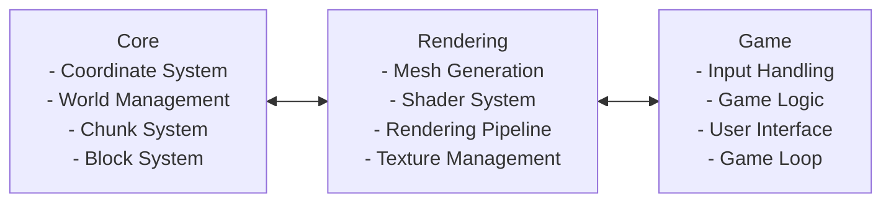

# QuadCraft

A tetrahedral-based voxel game using quadray coordinates, inspired by Minecraft.

## Overview

QuadCraft is an experimental voxel game that uses tetrahedral elements (instead of cubes) and quadray coordinates. This unique approach allows for more natural representation of slopes, curves, and complex structures that are difficult to achieve with traditional cubic voxels.

### Key Features

- **Tetrahedral Voxels**: Blocks are tetrahedra instead of cubes, allowing for more complex and natural shapes
- **Quadray Coordinate System**: Based on tetrahedral geometry rather than cubic geometry
- **Procedural Terrain**: Generated using fractal noise functions adapted for tetrahedral space
- **Interactive Building**: Place and remove tetrahedral blocks
- **Enhanced Terrain Features**: Mountains, caves, ore veins, and water bodies
- **Quadray Visualization**: Toggle overlay to visualize the four-dimensional quadray coordinate system
- **Wireframe Mode**: Enable wireframe rendering to better understand tetrahedral shapes

## Technical Description

QuadCraft demonstrates several advanced technical concepts:

1. **Quadray Coordinates**: A four-value coordinate system based on tetrahedral geometry
2. **Tetrahedral Mesh Generation**: Using modified marching tetrahedrons algorithm
3. **Chunk Management**: Tetrahedral chunks for efficient memory utilization
4. **Ray Casting**: For block selection and placement
5. **Fractal Terrain Generation**: Multi-octave noise for natural-looking landscapes

## Building and Running

### Prerequisites

You'll need the following libraries installed:

- OpenGL
- GLEW
- GLFW3
- CMake (3.10 or higher)
- C++17 compatible compiler

### Build Instructions

#### Linux

```bash
# Install dependencies (Ubuntu/Debian)
sudo apt-get install build-essential cmake libglew-dev libglfw3-dev

# Clone the repository
git clone https://github.com/yourusername/QuadCraft.git
cd QuadCraft

# Build and run using the script
chmod +x build.sh
./build.sh
```

### Troubleshooting

#### GL/GLEW Errors

If you encounter errors related to GL/GLEW headers, ensure that your includes in source files are in the correct order. GLEW headers should be included before other OpenGL-related headers.

#### Missing Libraries

If CMake can't find the required libraries, make sure they are properly installed. You might need to install development versions of the libraries.

## Controls

### Movement Controls (Drone-like)
- **Arrow Keys**: Fly in the corresponding direction (always active)
- **Page Up/Down**: Move vertically up/down (always active)
- **W, A, S, D**: Alternative movement keys (only when mouse is captured)
- **Space**: Alternative up movement (only when mouse is captured)
- **Left Shift**: Alternative down movement (only when mouse is captured)

### Camera Controls
- **Mouse**: Look around (only when mouse is captured)
- **Mouse Wheel**: Zoom in/out

### Block Interaction
- **Left Mouse Button**: Remove block (or capture mouse if not captured)
- **Right Mouse Button**: Place block

### Interface Controls
- **Tab**: Toggle mouse capture mode
- **Escape**: Release mouse if captured, or exit game if mouse is free
- **F1**: Toggle wireframe mode
- **F2**: Toggle quadray coordinate overlay

**Mouse Interaction**:
- Click in the window to capture the mouse and enable full camera control
- Press Escape or Tab to release the mouse and regain normal cursor control
- When the mouse is free, you can still use arrow keys and Page Up/Down for drone-like movement

**Flying Tips**:
- Use arrow keys for precise drone-like movement
- Combine with Page Up/Down for full 3D navigation
- The camera will always point in the direction you're looking

## Architecture

The project is structured as follows:



Folder structure:

```
QuadCraft/
├── src/
│   ├── core/                    # Core engine components
│   │   ├── coordinate/          # Coordinate systems
│   │   ├── world/               # World generation
│   │   ├── physics/             # Physics engine
│   │   └── entity/              # Entity management
│   ├── render/                  # Rendering pipeline
│   │   ├── mesh/                # Mesh generation
│   │   ├── shader/              # Shader programs
│   │   └── texture/             # Texture management
│   ├── ui/                      # User interface
│   └── game/                    # Game-specific logic
├── assets/                      # Game assets
└── docs/                        # Documentation
```

## Implementation Details

### Quadray Coordinate System

The quadray coordinate system uses four basis vectors extending from the center of a tetrahedron to its vertices. This provides a more natural way to represent tetrahedral geometry than traditional Cartesian coordinates.

Conversion formulas between quadray and Cartesian coordinates:

```cpp
// Convert from Cartesian to quadray coordinates
static Quadray fromCartesian(const Vector3& v) {
    const float scale = 1.0f / ROOT2;
    
    float a = scale * (std::max(0.0f, v.x) + std::max(0.0f, v.y) + std::max(0.0f, v.z));
    float b = scale * (std::max(0.0f, -v.x) + std::max(0.0f, -v.y) + std::max(0.0f, v.z));
    float c = scale * (std::max(0.0f, -v.x) + std::max(0.0f, v.y) + std::max(0.0f, -v.z));
    float d = scale * (std::max(0.0f, v.x) + std::max(0.0f, -v.y) + std::max(0.0f, -v.z));
    
    return Quadray(a, b, c, d).normalized();
}

// Convert from quadray to Cartesian coordinates
Vector3 toCartesian() const {
    const float scale = 1.0f / ROOT2;
    float x = scale * (a - b - c + d);
    float y = scale * (a - b + c - d);
    float z = scale * (a + b - c - d);
    return Vector3(x, y, z);
}
```

### Tetrahedral Voxels

Unlike Minecraft's cubic voxels, QuadCraft uses tetrahedral voxels which allow for more accurate representation of arbitrary geometry, better approximation of curved surfaces, and more natural representation of certain crystalline patterns. Each cube is divided into 5 tetrahedra for more precise terrain representation.

### Quadray Coordinate Visualization

The F2 key toggles a visualization overlay that displays the four basis vectors of the quadray coordinate system:
- A axis (red): Direction of (1,0,0,0) in quadray coordinates
- B axis (green): Direction of (0,1,0,0) in quadray coordinates
- C axis (blue): Direction of (0,0,1,0) in quadray coordinates
- D axis (yellow): Direction of (0,0,0,1) in quadray coordinates

This helps in understanding the four-dimensional nature of the quadray coordinate system.

### Terrain Generation

Terrain is generated using a multi-octave fractal noise function that works with tetrahedral geometry, creating landscapes with natural mountains, caves, and water features. The fractal nature provides detail at multiple scales, creating more realistic-looking terrain.

## License

This project is licensed under the MIT License - see the LICENSE file for details.

## Acknowledgments

- Based on research from "Mutable Game Environments Built on a Tetrahedral Mesh"
- Inspired by Minecraft and other voxel-based games
- Quadray coordinate system based on work by R. Buckminster Fuller and Kirby Urner 