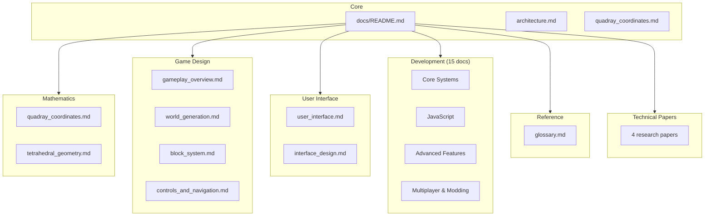

# QuadCraft Documentation

Welcome to the QuadCraft documentation. This comprehensive documentation suite covers all aspects of the QuadCraft project, from mathematical foundations to gameplay mechanics and technical implementation.

## Documentation Contents

### Core Documentation

- [Architecture Overview](architecture.md) - High-level overview of the QuadCraft architecture and design philosophy.

### Mathematics

- [Quadray Coordinates](mathematics/quadray_coordinates.md) - Detailed explanation of the quadray coordinate system used for tetrahedral space representation.
- [Tetrahedral Geometry](mathematics/tetrahedral_geometry.md) - Mathematical principles of tetrahedral geometry and its application in QuadCraft.

### Game Design

- [Gameplay Overview](game_design/gameplay_overview.md) - Core gameplay mechanics, modes, and player experience flow.
- [World Generation](game_design/world_generation.md) - Procedural generation of tetrahedral worlds, biomes, and structures.
- [Block System](game_design/block_system.md) - The tetrahedral block system that forms the foundation of QuadCraft.
- [Controls and Navigation](game_design/controls_and_navigation.md) - Player controls and navigation in tetrahedral space.
- [Advanced Building Techniques](game_design/advanced_building_techniques.md) - Guide to structural principles and creative patterns.

### User Interface

- [User Interface](ui/user_interface.md) - UI design, components, and player interaction systems.

### Development

#### Implemented Systems

| Document | Description | Status |
|---|---|---|
| [**Chunk System**](development/chunk_system.md) | Tetrahedral chunk architecture. | ✅ Implemented |
| [**Coordinate System**](mathematics/quadray_coordinates.md) | 4D Quadray math & implementation. | ✅ Implemented |
| [**Tetrahedral Geometry**](mathematics/tetrahedral_geometry.md) | Geometric properties & barycentrics. | ✅ Implemented |
| [**API Reference**](development/api_reference.md) | Core C++ API documentation. | ✅ Active |
| [**JavaScript Implementation**](development/javascript_implementation.md) | JS-based prototyping logic. | ✅ Active |

#### Design Specifications (Planned/In-Progress)

| Document | Description | Status |
|---|---|---|
| [**Physics System**](development/physics_system.md) | Planned C++ physics architecture. | 🚧 Design Spec |
| [**Entity System**](development/entity_system.md) | Planned ECS architecture. | 🚧 Design Spec |
| [**Multiplayer System**](development/multiplayer_system.md) | Network architecture design. | 🚧 Design Spec |
| [**Modding Guide**](development/modding_guide.md) | Planned modding API structure. | 🚧 Design Spec |

#### Development Guides

| Document | Description |
|---|---|
| [**Setup Guide**](development/setup_guide.md) | Development environment setup. |
| [**Asset Creation**](development/asset_creation_guide.md) | Creating assets for QuadCraft. |
| [**Performance Optimization**](development/javascript_performance_optimization.md) | JS performance techniques. |
| [**Cone Plane Intersection**](development/cone_plane_intersection_rendering.md) | Specific rendering detail. |
| [**Gamepad Integration**](development/gamepad_integration_guide.md) | Input handling guide. |
| [**CCP Ball Grid**](development/ccp_ball_grid_system.md) | Specific grid system detail. |

### Reference

- [Glossary](reference/glossary.md) - Terminology and definitions

### Technical Papers

See [other/](other/) for in-depth technical papers and analysis documents.

## How to Use This Documentation

This documentation is designed to be read in multiple ways depending on your needs:

1. **For Players**: Start with the [Gameplay Overview](game_design/gameplay_overview.md) and [Controls and Navigation](game_design/controls_and_navigation.md) sections to understand the core gameplay mechanics.

2. **For World Builders**: Explore the [Block System](game_design/block_system.md) and [World Generation](game_design/world_generation.md) sections to understand how to create and manipulate the tetrahedral world.

3. **For Developers**: Begin with the [Technical Architecture](development/architecture.md) and dive into the mathematical foundations in the [Mathematics](#mathematics) section.

4. **For UI/UX Designers**: Focus on the [User Interface](ui/user_interface.md) documentation to understand the design principles and implementation.

## Conventions Used in Documentation

Throughout this documentation, we use the following conventions:

- **Mermaid Diagrams**: Visual representations of systems, processes, and relationships.
- **Code Snippets**: Examples of implementation in C++ where appropriate.
- **Cross-References**: Links to related documentation sections for easy navigation.

## Contributing to Documentation

The QuadCraft documentation is an evolving resource. To contribute:

1. Fork the repository
2. Make your changes or additions
3. Submit a pull request with a clear description of your modifications

When contributing, please maintain the existing style and format of the documentation.

## License

This documentation is provided under the same license as the QuadCraft project. See the project repository for license details.
