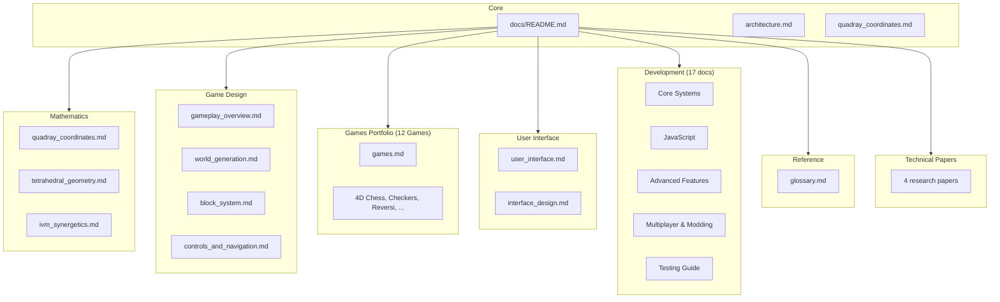

# QuadCraft Documentation

Welcome to the QuadCraft documentation. This comprehensive documentation suite covers all aspects of the QuadCraft project, from mathematical foundations to gameplay mechanics, the 12-game portfolio, and technical implementation.

## Documentation Contents

### Core Documentation

- [Architecture Overview](architecture.md) - High-level overview of the QuadCraft architecture and design philosophy.
- [Quadray Coordinates](quadray_coordinates.md) - Implementation of the quadray coordinate system in QuadCraft.

### Mathematics

- [Quadray Coordinates](mathematics/quadray_coordinates.md) - Detailed explanation of the quadray coordinate system used for tetrahedral space representation.
- [Tetrahedral Geometry](mathematics/tetrahedral_geometry.md) - Mathematical principles of tetrahedral geometry and its application in QuadCraft.
- [IVM & Synergetics](mathematics/ivm_synergetics.md) - Isotropic Vector Matrix, Synergetics volume ratios, and the concentric hierarchy.

### Game Design

- [Gameplay Overview](game_design/gameplay_overview.md) - Core gameplay mechanics, modes, and player experience flow.
- [World Generation](game_design/world_generation.md) - Procedural generation of tetrahedral worlds, biomes, and structures.
- [Block System](game_design/block_system.md) - The tetrahedral block system that forms the foundation of QuadCraft.
- [Controls and Navigation](game_design/controls_and_navigation.md) - Player controls and navigation in tetrahedral space.
- [Advanced Building Techniques](game_design/advanced_building_techniques.md) - Guide to structural principles and creative patterns.

### Games Portfolio

- [Games Overview](games.md) - All 12 standalone 4D browser games built on the Quadray coordinate system.

> [!TIP]
> See [games/README.md](../games/README.md) and [GAMES_INDEX.md](../games/GAMES_INDEX.md) for launch scripts, per-game details, and the standalone architecture.

| Game | Description | Tests |
|------|-------------|-------|
| ♟️ [4D Chess](../games/4d_chess/) | Full chess with 6 piece types in 4D Quadray space | 83 |
| 🏁 [4D Checkers](../games/4d_checkers/) | Diagonal capture + King promotion in 4D | 11 |
| ⚫ [4D Reversi](../games/4d_reversi/) | Disc flipping across 80 directions in 4D | 11 |
| 🧬 [4D Life](../games/4d_life/) | Conway's Game of Life with 4D wrapping neighbors | 8 |
| 🚀 [4D Asteroids](../games/4d_asteroids/) | Continuous motion, wrap-around, asteroid splitting | 8 |
| 🐜 [4D SimAnt](../games/4d_simant/) | Pheromone trails, foraging AI, colony simulation | 9 |
| 🎲 [4D Backgammon](../games/4d_backgammon/) | 24-point track in 4D spiral, dice + bearing-off | 8 |
| ⛏️ [4D Minecraft](../games/4d_minecraft/) | Terrain gen, trees, block place/remove, inventory | 11 |
| 🏝️ [4D Catan](../games/4d_catan/) | 19 hex tiles, resource production, settlements | 10 |
| 🏰 [4D Tower Defense](../games/4d_tower_defense/) | Path waves, auto-targeting towers, gold economy | 9 |
| 👹 [4D Doom](../games/4d_doom/) | Hitscan FPS, enemy AI pursuit, wall collision | 7 |
| 🀄 [4D Mahjong](../games/4d_mahjong/) | 144-tile 4-layer matching with hint system | 7 |

### User Interface

- [User Interface](ui/user_interface.md) - UI design, components, and player interaction systems.
- [Interface Design](ui/interface_design.md) - Detailed interface design specifications and styling guidelines.

### Development

#### Implemented Systems

| Document | Description | Status |
|---|---|---|
| [**Chunk System**](development/chunk_system.md) | Tetrahedral chunk architecture. | ✅ Implemented |
| [**Coordinate System**](mathematics/quadray_coordinates.md) | 4D Quadray math & implementation. | ✅ Implemented |
| [**Tetrahedral Geometry**](mathematics/tetrahedral_geometry.md) | Geometric properties & barycentrics. | ✅ Implemented |
| [**API Reference**](development/api_reference.md) | Core C++ API documentation. | ✅ Active |
| [**JavaScript Implementation**](development/javascript_implementation.md) | JS-based prototyping logic. | ✅ Active |

#### Design Specifications (Planned/In-Progress)

| Document | Description | Status |
|---|---|---|
| [**Physics System**](development/physics_system.md) | Planned C++ physics architecture. | 🚧 Design Spec |
| [**Entity System**](development/entity_system.md) | Planned ECS architecture. | 🚧 Design Spec |
| [**Multiplayer System**](development/multiplayer_system.md) | Network architecture design. | 🚧 Design Spec |
| [**Modding Guide**](development/modding_guide.md) | Planned modding API structure. | 🚧 Design Spec |

#### Development Guides

| Document | Description |
|---|---|
| [**Setup Guide**](development/setup_guide.md) | Development environment setup. |
| [**Asset Creation**](development/asset_creation_guide.md) | Creating assets for QuadCraft. |
| [**Performance Optimization**](development/javascript_performance_optimization.md) | JS performance techniques. |
| [**Cone Plane Intersection**](development/cone_plane_intersection_rendering.md) | Specific rendering detail. |
| [**Gamepad Integration**](development/gamepad_integration_guide.md) | Input handling guide. |
| [**CCP Ball Grid**](development/ccp_ball_grid_system.md) | Close-Centered Packing grid system. |
| [**Paintbrush System**](development/paintbrush_system.md) | Pattern painting tools. |
| [**Quaternion Camera**](development/quaternion_camera_system.md) | Quaternion-based camera controls. |
| [**Realtime Code Evaluation**](development/realtime_code_evaluation.md) | Dynamic code execution system. |
| [**Testing Guide**](development/testing_guide.md) | Test infrastructure across C++ and JS games. |

### Reference

- [Glossary](reference/glossary.md) - Terminology and definitions.

### Technical Papers

See [other/](other/) for in-depth technical papers and analysis documents:

- [QuadCraft Technical Framework](other/QuadCraft_%20Technical%20Framework%20for%20a%20Tetrahedral-B.md) - Formal system architecture paper.
- [Quadray Coordinates Analysis](other/Quadray%20Coordinates_%20A%20Comprehensive%20Analysis%20of%20T.md) - Comprehensive coordinate analysis.
- [Geometric Formalization](other/Quadray%20Coordinates_%20Technical%20and%20Geometric%20Forma.md) - Rigorous geometric treatment.
- [Dimensional Conversion Supplement](other/Technical%20Supplement_%20Dimensional%20Conversion%20Betwe.md) - Conversion algorithms between coordinate systems.

## How to Use This Documentation

This documentation is designed to be read in multiple ways depending on your needs:

1. **For Players**: Start with the [Gameplay Overview](game_design/gameplay_overview.md) and [Controls and Navigation](game_design/controls_and_navigation.md) sections to understand the core gameplay mechanics.

2. **For Game Enthusiasts**: Try the [Games Portfolio](#games-portfolio) — all 12 games run directly in the browser with zero build step. See [Quick Start](../games/README.md#quick-start) for launch instructions.

3. **For World Builders**: Explore the [Block System](game_design/block_system.md) and [World Generation](game_design/world_generation.md) sections to understand how to create and manipulate the tetrahedral world.

4. **For Developers**: Begin with the [Architecture Overview](architecture.md) (or the detailed [Technical Architecture](development/architecture.md)) and dive into the mathematical foundations in the [Mathematics](#mathematics) section.

5. **For UI/UX Designers**: Focus on the [User Interface](ui/user_interface.md) and [Interface Design](ui/interface_design.md) documentation.

6. **For Researchers**: See the [Technical Papers](#technical-papers) and [IVM & Synergetics](mathematics/ivm_synergetics.md) for the mathematical and theoretical foundations.

## Conventions Used in Documentation

Throughout this documentation, we use the following conventions:

- **Mermaid Diagrams**: Visual representations of systems, processes, and relationships.
- **Code Snippets**: Examples of implementation in C++ and JavaScript where appropriate.
- **Cross-References**: Links to related documentation sections for easy navigation.
- **Status Badges**: ✅ Implemented, 🚧 Design Spec, to distinguish working code from planned features.

## Contributing to Documentation

The QuadCraft documentation is an evolving resource. To contribute:

1. Fork the repository
2. Make your changes or additions
3. Submit a pull request with a clear description of your modifications

When contributing, please maintain the existing style and format of the documentation.

## License

This project is licensed under the Apache 2.0 License. See the [LICENSE](../LICENSE) file for details.
