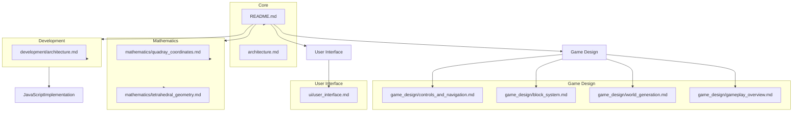

# QuadCraft Documentation

Welcome to the QuadCraft documentation. This comprehensive documentation suite covers all aspects of the QuadCraft project, from mathematical foundations to gameplay mechanics and technical implementation.

## Documentation Contents

### Core Documentation

- [Architecture Overview](architecture.md) - High-level overview of the QuadCraft architecture and design philosophy.

### Mathematics

- [Quadray Coordinates](mathematics/quadray_coordinates.md) - Detailed explanation of the quadray coordinate system used for tetrahedral space representation.
- [Tetrahedral Geometry](mathematics/tetrahedral_geometry.md) - Mathematical principles of tetrahedral geometry and its application in QuadCraft.

### Game Design

- [Gameplay Overview](game_design/gameplay_overview.md) - Core gameplay mechanics, modes, and player experience flow.
- [World Generation](game_design/world_generation.md) - Procedural generation of tetrahedral worlds, biomes, and structures.
- [Block System](game_design/block_system.md) - The tetrahedral block system that forms the foundation of QuadCraft.
- [Controls and Navigation](game_design/controls_and_navigation.md) - Player controls and navigation in tetrahedral space.

### User Interface

- [User Interface](ui/user_interface.md) - UI design, components, and player interaction systems.

### Development

- [Technical Architecture](development/architecture.md) - Detailed technical architecture, systems, and implementation details.
- **JavaScript Implementation Guide** (`docs/development/javascript_implementation_guide.md`) - Complete guide to the browser-based JavaScript implementation (`QuadrayGrid4.html`).
- **Cone-Plane Intersection Rendering** (`docs/development/cone_plane_intersection_rendering.md`) - Advanced mathematical rendering technique for accurate sphere visualization.
- **CCP Ball Grid System** (`docs/development/ccp_ball_grid_system.md`) - Close-Centered Packing optimization for efficient ball management.
- **Gamepad Integration Guide** (`docs/development/gamepad_integration_guide.md`) - Comprehensive controller support with advanced features.
- **Paintbrush System** (`docs/development/paintbrush_system.md`) - Customizable pattern painting system with real-time code evaluation.
- **JavaScript Performance Optimization** (`docs/development/javascript_performance_optimization.md`) - Browser-specific optimization techniques.
- **Real-time Code Evaluation** (`docs/development/realtime_code_evaluation.md`) - Dynamic JavaScript execution system.
- **Quaternion Camera System** (`docs/development/quaternion_camera_system.md`) - Advanced 3D camera with smooth rotation and movement.

## How to Use This Documentation

This documentation is designed to be read in multiple ways depending on your needs:

1. **For Players**: Start with the [Gameplay Overview](game_design/gameplay_overview.md) and [Controls and Navigation](game_design/controls_and_navigation.md) sections to understand the core gameplay mechanics.

2. **For World Builders**: Explore the [Block System](game_design/block_system.md) and [World Generation](game_design/world_generation.md) sections to understand how to create and manipulate the tetrahedral world.

3. **For Developers**: Begin with the [Technical Architecture](development/architecture.md) and dive into the mathematical foundations in the [Mathematics](#mathematics) section.

4. **For UI/UX Designers**: Focus on the [User Interface](ui/user_interface.md) documentation to understand the design principles and implementation.

## Conventions Used in Documentation

Throughout this documentation, we use the following conventions:

- **Mermaid Diagrams**: Visual representations of systems, processes, and relationships.
- **Code Snippets**: Examples of implementation in C++ where appropriate.
- **Cross-References**: Links to related documentation sections for easy navigation.

## Contributing to Documentation

The QuadCraft documentation is an evolving resource. To contribute:

1. Fork the repository
2. Make your changes or additions
3. Submit a pull request with a clear description of your modifications

When contributing, please maintain the existing style and format of the documentation.

## Future Documentation

The following documentation sections are planned for future development:

- Modding Guide
- Performance Optimization
- Multiplayer Systems
- Asset Creation Guide
- Advanced Building Techniques
- **JavaScript Implementation Guide** (for QuadrayGrid4.html and similar implementations)
- **Cone-Plane Intersection Rendering** (documenting the advanced rendering techniques)
- **Gamepad Integration Guide** (documenting controller support and quaternion camera)
- **CCP Ball Grid System** (documenting the Close-Centered Packing optimization)

## License

This documentation is provided under the same license as the QuadCraft project. See the project repository for license details. 