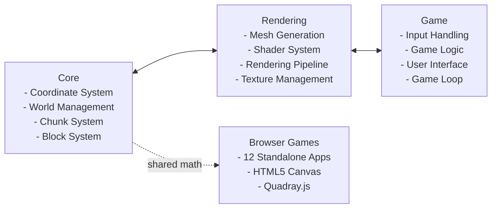

# QuadCraft Architecture

## Overview

QuadCraft is structured as a modular, component-based game engine focused on tetrahedral voxel rendering and manipulation. The architecture is designed to separate core systems from rendering and game-specific logic, providing a clean and extensible codebase.

> [!NOTE]
> For the **detailed technical architecture** with class diagrams, sequence diagrams, and full system specifications, see [development/architecture.md](development/architecture.md) (846 lines).

## System Architecture Diagram

## Core Components

The core components handle the fundamental data structures and algorithms that drive the tetrahedral voxel system:

### Coordinate System

- **Vector3**: Traditional 3D vector for Cartesian coordinates
- **Quadray**: Four-dimensional coordinate system for tetrahedral space
- **Conversion utilities**: Functions to convert between coordinate systems
- **IVM constants**: Synergetics volume ratios and the S3 constant (√(9/8))

### World Management

- **World**: Manages the entire game world, including chunks and block access
- **TetraChunk**: Manages a section of the world with tetrahedral elements
- **TerrainGenerator**: Procedurally generates terrain using noise functions

### Block System

- **Block**: Defines block types and their properties
- **BlockRegistry**: Manages all available block types
- **TetrahedralElement**: Represents a single tetrahedral voxel with position and type

## Rendering Components

The rendering components handle the visual representation of the tetrahedral world:

### Mesh Generation

- **Mesh**: Represents a renderable 3D mesh with vertices and indices
- **ChunkMesher**: Converts tetrahedral elements into renderable meshes
- **Marching Tetrahedrons**: Algorithm for generating smooth surfaces from tetrahedral data

### Shader System

- **Shader**: Manages OpenGL shader programs
- **Shader pipeline**: Handles lighting, texturing, and special effects

## Game Components

The game components handle user interaction and game logic:

### Input Handling

- **Input**: Processes keyboard and mouse input
- **Camera**: Manages the player's view of the world
- **Ray Casting**: Determines which block the player is looking at

### Game Logic

- **Game**: Manages the overall game state and main loop
- **Update cycle**: Updates the world, handles input, and triggers rendering

## Browser Games Layer

The 12 standalone browser games share the Quadray coordinate math but are otherwise independent:

- Each game is a **self-contained HTML5 application** in `games/<name>/`
- Each carries its own `quadray.js` with identical coordinate math
- Games use HTML5 Canvas for rendering (no WebGL dependency)
- See [games.md](games.md) for the full portfolio

## Data Flow

### Block Placement/Removal Flow

1. Player input is captured in the `Input` class
2. A ray is cast from the camera in the direction the player is looking
3. The first non-air block hit by the ray is identified
4. The block is removed (left click) or a new block is placed adjacent to it (right click)
5. The affected chunk is marked as "dirty"
6. In the next update cycle, the dirty chunk's mesh is regenerated
7. The updated mesh is rendered in the next frame

### Terrain Generation Flow

1. When a new chunk is requested, the `World` creates a `TetraChunk` instance
2. The `TerrainGenerator` is called to fill the chunk with tetrahedral elements
3. Noise functions are used to determine the terrain height and features
4. Tetrahedral elements are created based on the noise values
5. The chunk is marked as generated
6. The chunk is also marked as dirty to trigger mesh generation
7. The `ChunkMesher` creates a renderable mesh from the tetrahedral elements
8. The mesh is stored and rendered by the rendering system

## Memory Management

- **Chunk Loading/Unloading**: Chunks are loaded around the player and unloaded when too far away
- **Mesh Caching**: Generated meshes are cached to avoid unnecessary regeneration
- **Sparse Storage**: Only non-air elements are stored to save memory

## Performance Optimizations

- **Dirty Flag System**: Only regenerate meshes for chunks that have changed
- **Chunk Border Handling**: Special handling for elements at chunk boundaries
- **View Frustum Culling**: Only render chunks that are visible to the camera
- **Level of Detail**: Reduce mesh complexity for distant chunks

## Extensibility

The architecture is designed to be extensible in several ways:

- **Block Types**: New block types can be added to the `BlockRegistry`
- **Terrain Features**: The `TerrainGenerator` can be extended with new terrain features
- **Rendering Effects**: The shader system can be enhanced with new visual effects
- **Game Mechanics**: The modular design allows new game mechanics to be added without major refactoring
- **New Games**: The standalone game architecture allows adding new 4D games without touching the core engine
