# QuadCraft Technical Architecture

This document describes the technical architecture of QuadCraft, detailing the system components, their interactions, and design patterns used throughout the codebase.

## System Overview

QuadCraft is built using a modular architecture that separates core game functionality from rendering and input handling. This approach provides flexibility for future development and ensures clear separation of concerns.

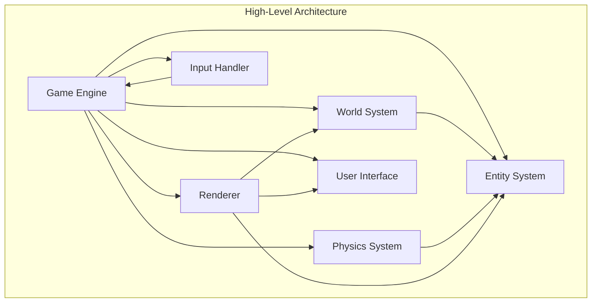

## Directory Structure

The codebase is organized into the following directory structure:

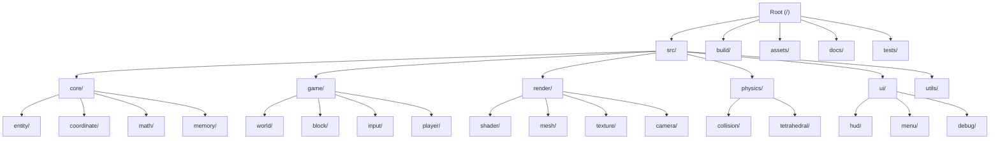

## Core Systems

### Coordinate System

QuadCraft uses two coordinate systems: traditional Cartesian coordinates for rendering and physics, and Quadray coordinates for the tetrahedral world representation.

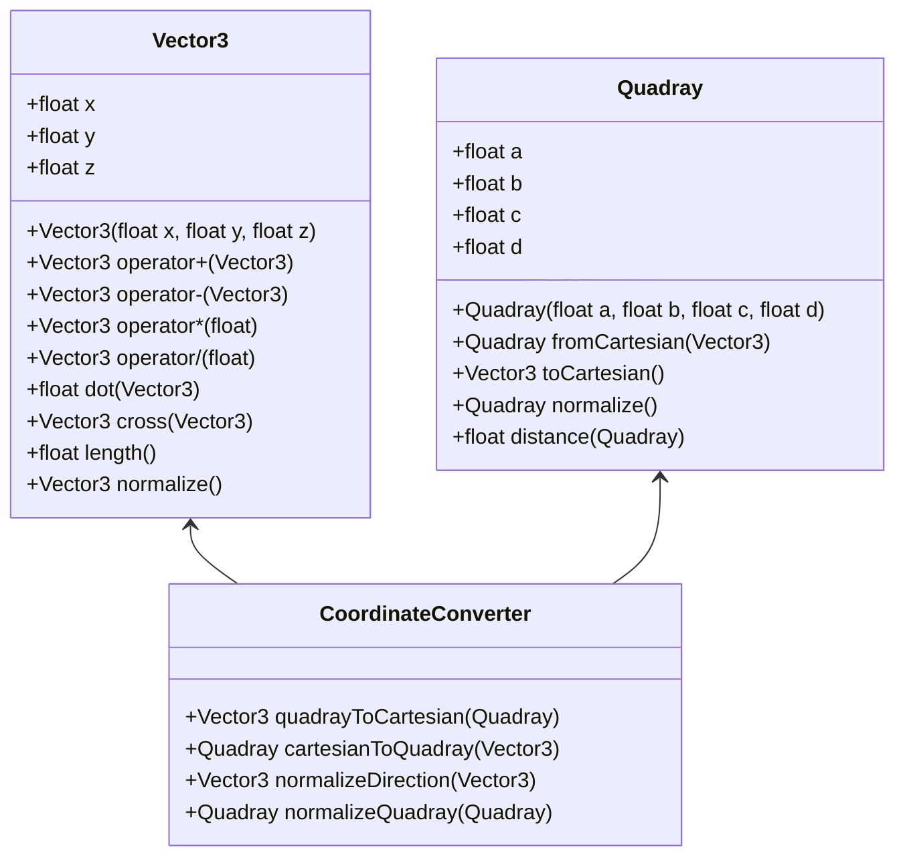

### Entity System

The entity system manages all dynamic objects in the game world.

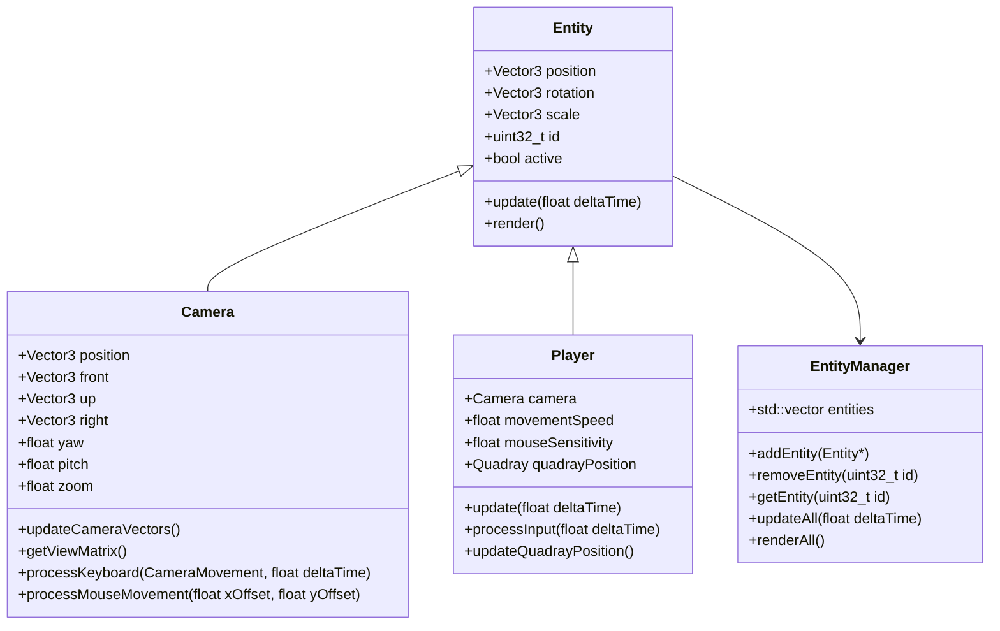

### Rendering System

The rendering system handles all graphical output.

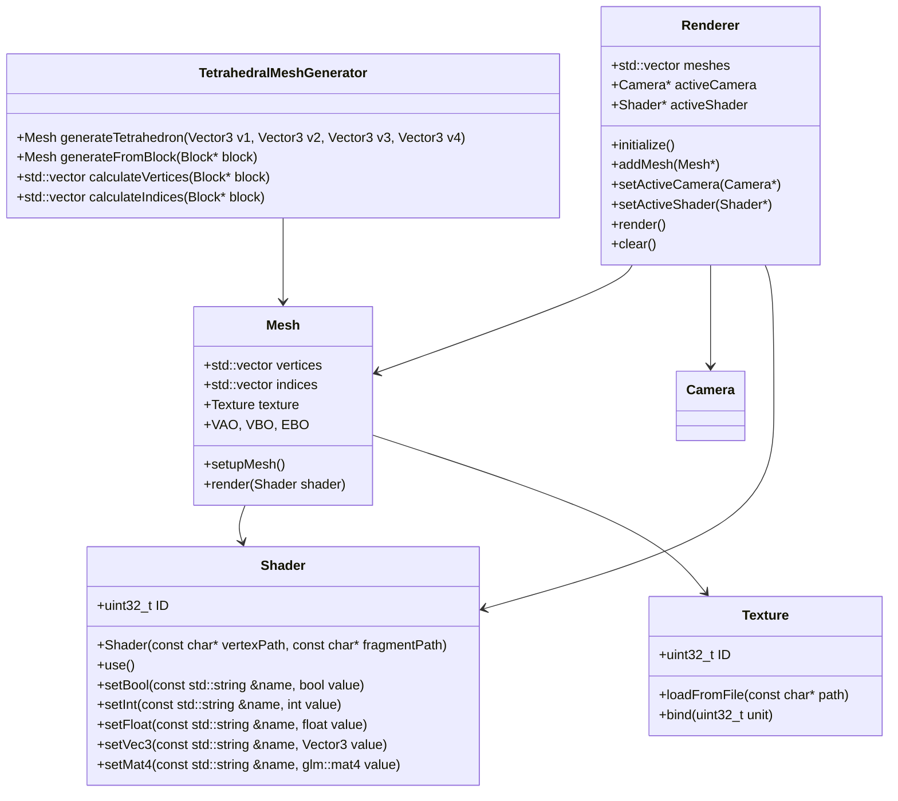

### World System

The world system manages the tetrahedral blocks and world generation.

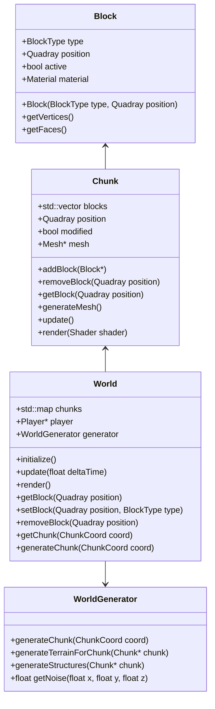

### Physics System

The physics system handles collision detection and response in tetrahedral space.

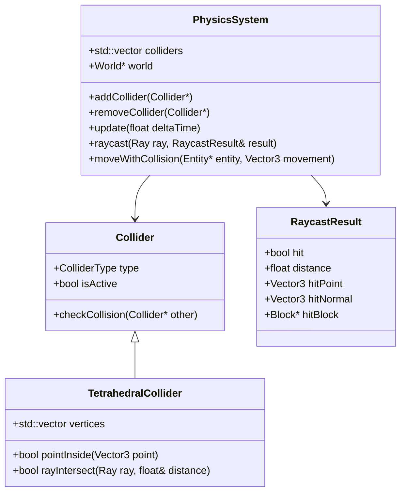

### Input System

The input system handles user interaction with the game.

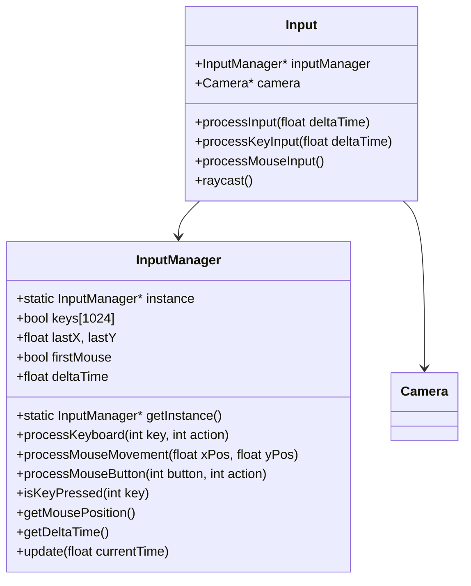

### UI System

The UI system manages all user interface elements.

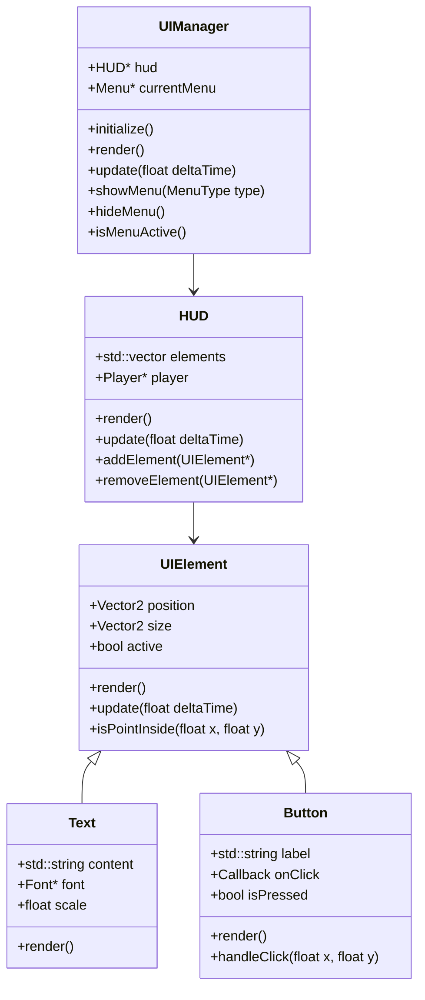

## Data Flow

The following diagram illustrates the main data flow in the QuadCraft engine:

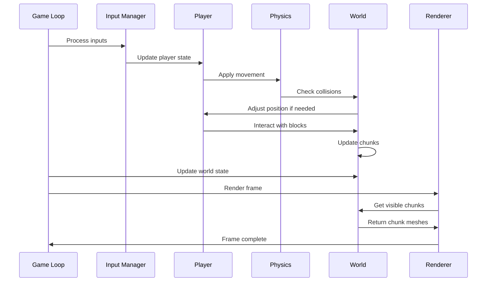

## Initialization Sequence

The application initialization sequence follows this order:

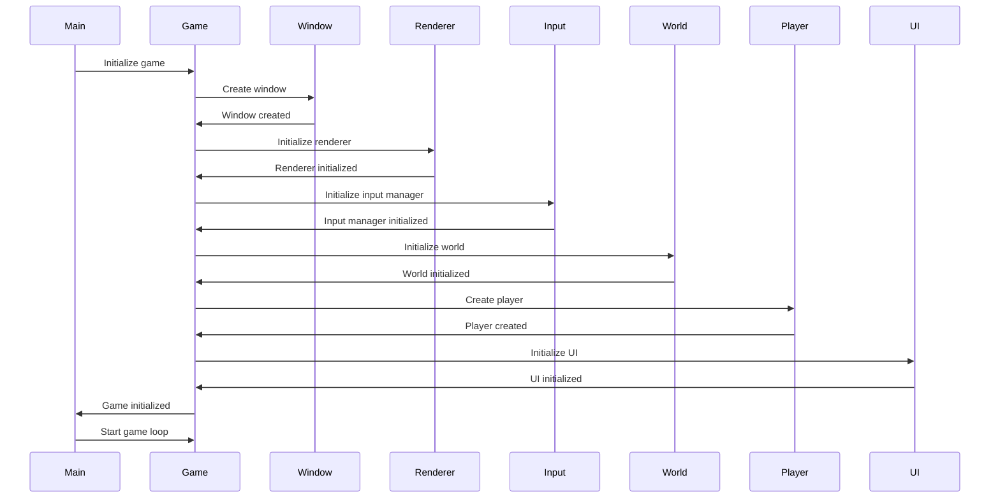

## Rendering Pipeline

The rendering pipeline processes tetrahedral elements for display:

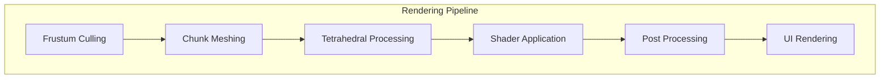

## Entity Component System

QuadCraft uses an Entity Component System for managing game objects:

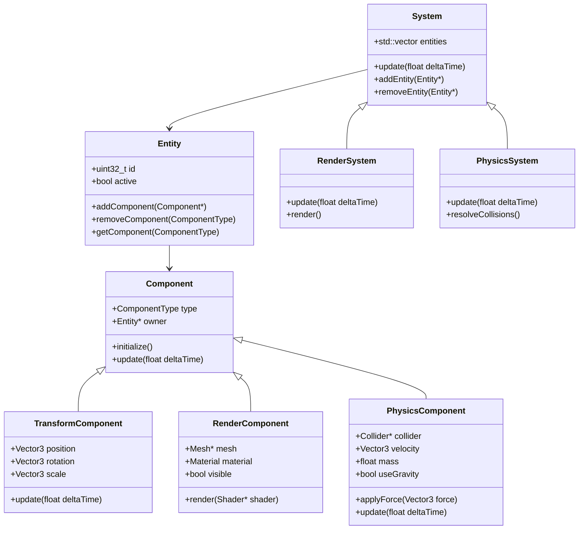

## Optimization Techniques

QuadCraft implements several optimization techniques:

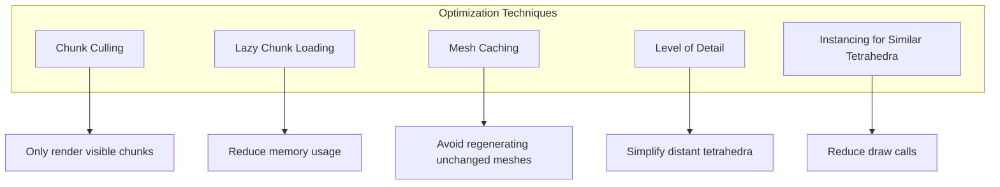

## Memory Management

QuadCraft uses these memory management strategies:

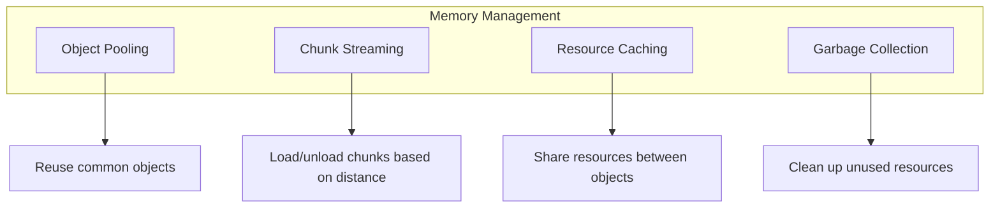

## Concurrency Model

QuadCraft uses a multi-threaded approach for performance:

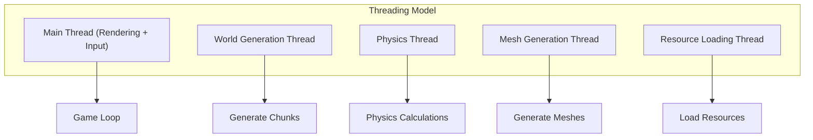

## Serialization System

The game uses a serialization system for saving and loading:

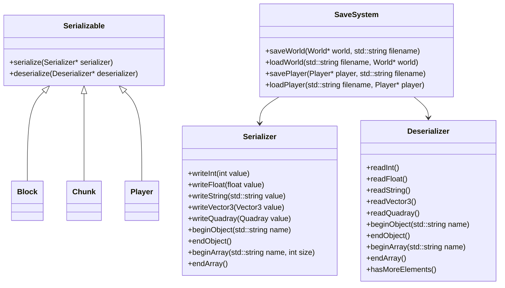

## Configuration System

QuadCraft uses a robust configuration system:

```mermaid
classDiagram
    class Config {
        +static Config* instance
        +std::map<std::string, ConfigValue> values
        +static Config* getInstance()
        +load(std::string filename)
        +save(std::string filename)
        +getInt(std::string key, int defaultValue)
        +getFloat(std::string key, float defaultValue)
        +getString(std::string key, std::string defaultValue)
        +getBool(std::string key, bool defaultValue)
        +set(std::string key, ConfigValue value)
    }
    
    class ConfigValue {
        +ValueType type
        +union { int intValue; float floatValue; bool boolValue; }
        +std::string stringValue
        +ConfigValue(int value)
        +ConfigValue(float value)
        +ConfigValue(bool value)
        +ConfigValue(std::string value)
    }
    
    Config -- ConfigValue
```

## Event System

QuadCraft uses an event-driven architecture:

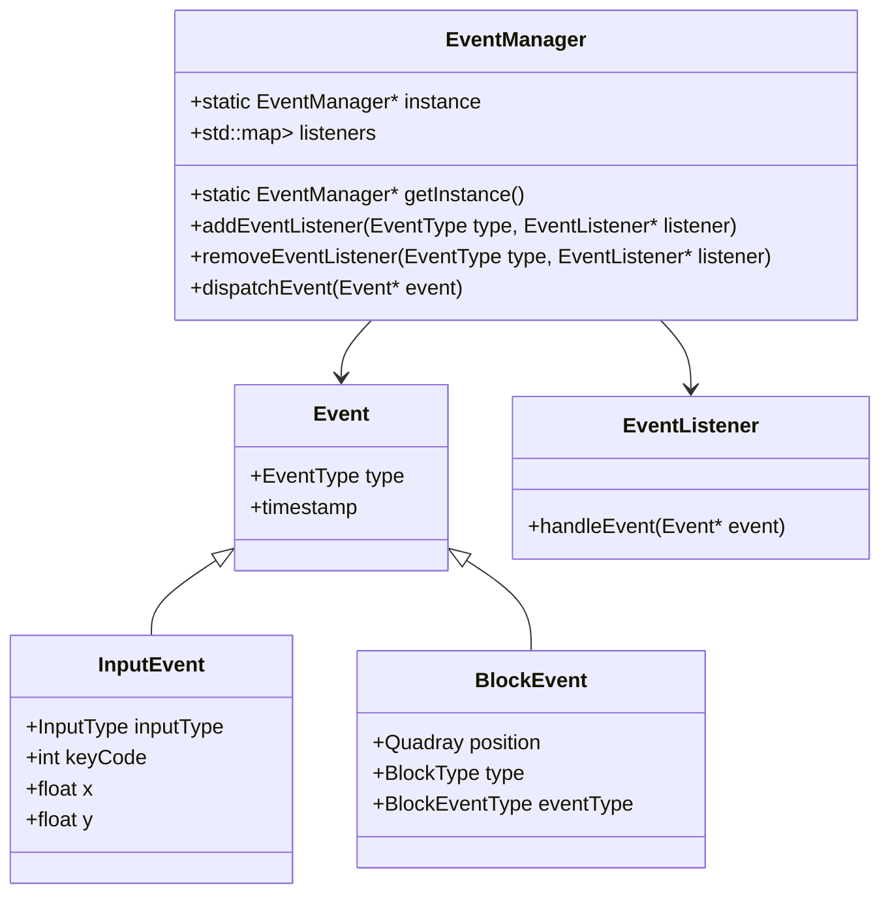

## Asset Management

The asset management system handles game resources:

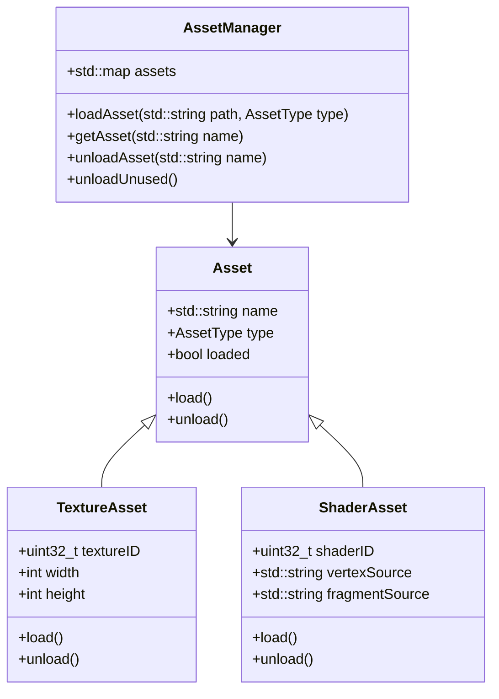

## Debugging Tools

QuadCraft includes several debugging tools:

```mermaid
graph TD
    subgraph "Debugging Tools"
        Logger["Logger System"]
        DebugRenderer["Debug Renderer"]
        Profiler["Performance Profiler"]
        Console["In-Game Console"]
    end
    
    Logger --> LogLevels["Multiple Log Levels"]
    DebugRenderer --> Wireframe["Wireframe Mode"]
    DebugRenderer --> Overlays["Debug Overlays"]
    Profiler --> Timers["Performance Timers"]
    Console --> Commands["Execute Commands"]
```

## Build System

QuadCraft uses CMake as its build system:

```mermaid
graph TD
    subgraph "Build System"
        CMake["CMake"]
        Dependencies["External Dependencies"]
        BuildTypes["Build Types"]
        Testing["Testing"]
    end
    
    CMake --> CrossPlatform["Cross-Platform Support"]
    Dependencies --> ThirdParty["Third-Party Libraries"]
    BuildTypes --> Debug["Debug Build"]
    BuildTypes --> Release["Release Build"]
    Testing --> UnitTests["Unit Tests"]
```

## Conclusion

QuadCraft's architecture is designed to support the unique requirements of tetrahedral geometry while maintaining performance and flexibility. The separation of concerns between different systems allows for easier maintenance and future expansion of the codebase. 