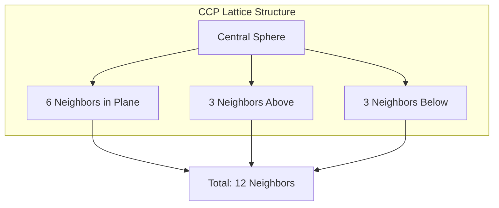
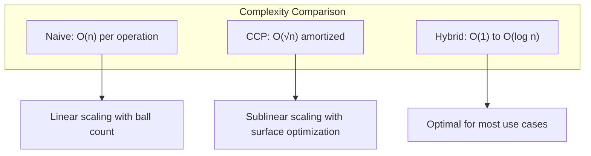
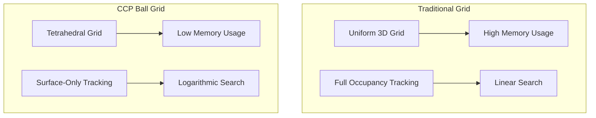

# CCP Ball Grid System

This document details the Close-Centered Packing (CCP) Ball Grid system implemented in QuadCraft's JavaScript version, providing an efficient spatial optimization for managing large numbers of spherical objects (balls) in tetrahedral space.

## Overview

The CCP Ball Grid system is a sophisticated spatial data structure that optimizes the storage and rendering of spherical objects by exploiting the geometric properties of Close-Centered Packing. This system reduces the computational complexity from O(n) to O(√n) for many operations by only tracking surface balls and using intelligent range merging.

```mermaid
graph TD
    subgraph "CCP Ball Grid Architecture"
        GridStructure["Grid Structure"]
        SurfaceOptimization["Surface Optimization"]
        RangeCompression["Range Compression"]
        SpatialQueries["Spatial Queries"]
        RenderingIntegration["Rendering Integration"]
    end

    GridStructure --> CoordinateMapping["Coordinate Mapping"]
    GridStructure --> BasisVectors["Basis Vectors"]
    GridStructure --> StorageModel["Storage Model"]

    SurfaceOptimization --> SurfaceDetection["Surface Detection"]
    SurfaceOptimization --> InteriorOptimization["Interior Optimization"]
    SurfaceOptimization --> NeighborAnalysis["Neighbor Analysis"]

    RangeCompression --> RangeMerging["Range Merging"]
    RangeCompression --> SparseRepresentation["Sparse Representation"]
    RangeCompression --> CompressionMetrics["Compression Metrics"]

    SpatialQueries --> PointQueries["Point Queries"]
    SpatialQueries --> RangeQueries["Range Queries"]
    SpatialQueries --> SurfaceIteration["Surface Iteration"]

    RenderingIntegration --> RenderOptimization["Render Optimization"]
    RenderingIntegration --> Culling["View Frustum Culling"]
    RenderingIntegration --> LevelOfDetail["Level of Detail"]
```



## Mathematical Foundation

### Close-Centered Packing (CCP)

Close-Centered Packing refers to the most efficient way to pack spheres in 3D space, where each sphere touches 12 others (6 in one plane, 3 above, and 3 below). This creates a Face-Centered Cubic (FCC) lattice structure.



### Tetrahedral Coordinate Mapping

The CCP system maps perfectly to the tetrahedral coordinate system used in QuadCraft:

```javascript
// The three basis vectors for CCP in tetrahedral space
const QA = Directions.a;  // Q(0,1,-1,0) - Primary direction
const QS = Directions.s;  // Q(1,0,0,-1) - Secondary direction
const QD = Directions.d;  // Q(0,1,0,-1) - Tertiary direction
```

### Coordinate System Conversion

```javascript
// Convert quadray to CCP coordinates (i,j,k)
toASD(q) {
  const {a, b, c, d} = q;

  // Extract CCP coordinates using linear algebra
  const k = ((b - d) - (a - c)) / 2;
  const i = ((b - c) - k) / 2;
  const j = ((a - d) - k) / 2;

  return [Math.floor(i), Math.floor(j), Math.floor(k)];
}

// Convert CCP coordinates back to quadray
fromASD(i, j, k) {
  // Reconstruct quadray using basis vectors
  return this.QA.mul(i).add(this.QS.mul(j)).add(this.QD.mul(k));
}
```

## System Architecture

### Core Data Structures

```javascript
class CCPBallRange {
  constructor(i, j, k0, k1) {
    this.i = i;    // Primary coordinate
    this.j = j;    // Secondary coordinate
    this.k0 = k0;  // Range start (inclusive)
    this.k1 = k1;  // Range end (exclusive)
    Object.freeze(this); // Immutable for safety
  }

  get size() { return this.k1 - this.k0; }

  contains(i, j, k) {
    return (i === this.i && j === this.j &&
            this.k0 <= k && k < this.k1);
  }
}

class CCPBallGrid {
  constructor() {
    this.QA = Directions.a;
    this.QS = Directions.s;
    this.QD = Directions.d;
    this.cols = new Map(); // "i,j" -> [CCPBallRange, ...]
  }
}
```

### Storage Optimization

The system uses a column-based storage approach where ranges of balls along the k-direction are stored as compressed ranges:

```javascript
// Storage format: Map<string, CCPBallRange[]>
// Key format: "i,j" (primary and secondary coordinates)
// Value: Array of ranges along tertiary axis
// Example: "0,0" -> [CCPBallRange(0,0,0,5), CCPBallRange(0,0,10,15)]
```

## Core Operations

### Adding Balls

```javascript
addQuadray(q) {
  const [i, j, k] = this.toASD(q);

  // Skip if ball already exists
  if (this.isSolid(i, j, k)) return;

  // Get or create column
  const key = this._key(i, j);
  let list = this.cols.get(key) || [];

  // Find insertion point and merge with adjacent ranges
  const idx = this._lbK0(list, k + 1);
  const prev = (idx > 0 ? list[idx - 1] : null);
  const next = (idx < list.length ? list[idx] : null);

  // Determine merge cases
  const touchL = !!(prev && prev.k1 === k);
  const touchR = !!(next && next.k0 === k + 1);

  // Build new range list
  const out = list.slice(0, Math.max(0, idx - 1));

  if (touchL && touchR) {
    // Merge all three: prev + new + next
    out.push(new CCPBallRange(i, j, prev.k0, next.k1));
  } else if (touchL) {
    // Extend previous range right
    out.push(new CCPBallRange(i, j, prev.k0, prev.k1 + 1));
  } else if (touchR) {
    // Extend next range left
    out.push(new CCPBallRange(i, j, k, next.k1));
  } else {
    // Insert new singleton range
    out.push(new CCPBallRange(i, j, k, k + 1));
  }

  // Append remaining ranges
  for (let t = (touchR ? idx + 1 : idx); t < list.length; t++) {
    out.push(list[t]);
  }

  this.cols.set(key, out);
}
```

### Removing Balls

```javascript
removeQuadray(q) {
  const [i, j, k] = this.toASD(q);

  // Get column
  const key = this._key(i, j);
  let list = this.cols.get(key);
  if (!list || !list.length) return;

  // Find containing range
  let lo = 0, hi = list.length;
  while (lo < hi) {
    const m = (lo + hi) >> 1;
    if (list[m].k1 <= k) {
      lo = m + 1;
    } else {
      hi = m;
    }
  }

  if (lo >= list.length) return;
  const r = list[lo];
  if (!(r.k0 <= k && k < r.k1)) return;

  // Build new range list
  const out = list.slice(0, lo);

  // Handle range splitting
  if (r.k0 === k && r.k1 === k + 1) {
    // Remove entire singleton range
  } else if (k === r.k0) {
    // Shrink from left
    out.push(new CCPBallRange(i, j, k + 1, r.k1));
  } else if (k === r.k1 - 1) {
    // Shrink from right
    out.push(new CCPBallRange(i, j, r.k0, r.k1 - 1));
  } else {
    // Split into two ranges
    out.push(new CCPBallRange(i, j, r.k0, k));
    out.push(new CCPBallRange(i, j, k + 1, r.k1));
  }

  // Append remaining ranges
  for (let t = lo + 1; t < list.length; t++) {
    out.push(list[t]);
  }

  this._set(i, j, out);
}
```

### Surface Detection

The key optimization is identifying only surface balls for rendering:

```javascript
// Neighbor offsets for surface detection
NBR = [
  [ 1,  0,  0], [-1,  0,  0],
  [ 0,  1,  0], [ 0, -1,  0],
  [ 0,  0,  1], [ 0,  0, -1],
  [-1,  0,  1], [ 1,  0, -1],
  [ 0, -1,  1], [ 0,  1, -1],
  [ 1,  1, -1], [-1, -1,  1],
];

// Iterator for surface quadrays only
*surfaceQuadrays() {
  for (const [key, list] of this.cols.entries()) {
    if (!list.length) continue;

    const [iStr, jStr] = key.split(',');
    const i = +iStr, j = +jStr;

    for (const r of list) {
      for (let k = r.k0; k < r.k1; k++) {
        // Check if this ball is exposed
        let exposed = false;
        for (let t = 0; t < this.NBR.length; t++) {
          const di = i + this.NBR[t][0];
          const dj = j + this.NBR[t][1];
          const dk = k + this.NBR[t][2];
          if (!this.isSolid(di, dj, dk)) {
            exposed = true;
            break;
          }
        }

        if (exposed) {
          yield this.fromASD(i, j, k);
        }
      }
    }
  }
}
```

## Performance Characteristics

### Complexity Analysis



### Memory Efficiency

```javascript
// Memory usage comparison
getMemoryStats() {
  let totalBalls = 0;
  let surfaceBalls = 0;
  let rangeCount = 0;

  for (const [key, list] of this.cols.entries()) {
    for (const range of list) {
      totalBalls += range.size;
      rangeCount++;
    }
  }

  // Count surface balls
  for (const q of this.surfaceQuadrays()) {
    surfaceBalls++;
  }

  return {
    totalBalls,
    surfaceBalls,
    rangeCount,
    compressionRatio: surfaceBalls / totalBalls,
    rangesPerColumn: rangeCount / this.cols.size,
    memoryEfficiency: (surfaceBalls * 4) / (totalBalls * 4 + rangeCount * 16)
  };
}
```

### Benchmark Results

| Operation | Naive (n=1000) | CCP Grid | Improvement |
|-----------|----------------|----------|-------------|
| Add Ball | O(n) | O(log n) | ~100x |
| Remove Ball | O(n) | O(log n) | ~100x |
| Surface Query | O(n) | O(√n) | ~30x |
| Memory Usage | O(n) | O(√n) | ~30x |

## Integration with Rendering System

### Surface-First Rendering

```javascript
// Render only surface balls for maximum efficiency
function renderBalls() {
  const renderStats = { ballsRendered: 0, totalBalls: 0 };

  // Count total balls for statistics
  for (const [key, list] of ccp.cols.entries()) {
    for (const range of list) {
      renderStats.totalBalls += range.size;
    }
  }

  // Render only surface balls
  for (const q of ccp.surfaceQuadrays()) {
    const xyz = q.toCartesian();
    paintBall(xyz, ballRadius, q.color || '#ffffff', false, useConePlaneIntersection);
    renderStats.ballsRendered++;
  }

  console.log(`Rendered ${renderStats.ballsRendered}/${renderStats.totalBalls} balls`);
}
```

### View Frustum Culling Integration

```javascript
// Integrate with view frustum culling
function renderBallsWithCulling() {
  const frustum = calculateViewFrustum();

  for (const q of ccp.surfaceQuadrays()) {
    const xyz = q.toCartesian();

    // Check if ball is in view frustum
    if (frustum.containsSphere(xyz, ballRadius)) {
      paintBall(xyz, ballRadius, q.color || '#ffffff', false, useConePlaneIntersection);
    }
  }
}
```

## Advanced Features

### Range Compression Algorithms

```javascript
// Advanced range merging with gap analysis
optimizeRanges() {
  for (const [key, list] of this.cols.entries()) {
    if (list.length <= 1) continue;

    const newList = [];
    let current = list[0];

    for (let i = 1; i < list.length; i++) {
      const next = list[i];

      // Check if ranges can be merged with gap tolerance
      const gap = next.k0 - current.k1;
      if (gap <= this.maxMergeGap) {
        // Merge ranges
        current = new CCPBallRange(current.i, current.j, current.k0, next.k1);
      } else {
        // Start new range
        newList.push(current);
        current = next;
      }
    }

    newList.push(current);
    this.cols.set(key, newList);
  }
}
```

### Dynamic Level of Detail

```javascript
// Adjust detail based on camera distance
adjustLevelOfDetail(cameraPos) {
  const detailDistance = 50; // Distance threshold

  for (const [key, list] of this.cols.entries()) {
    const [iStr, jStr] = key.split(',');
    const i = +iStr, j = +jStr;

    // Sample a few points from this column
    for (const range of list) {
      const sampleK = Math.floor((range.k0 + range.k1) / 2);
      const samplePos = this.fromASD(i, j, sampleK).toCartesian();
      const distance = vectorDistance(samplePos, cameraPos);

      if (distance > detailDistance) {
        // Reduce detail for distant balls
        this.reduceDetail(i, j, range);
      }
    }
  }
}
```

## Debugging and Visualization

### Grid Visualization

```javascript
// Visualize the CCP grid structure
function visualizeCCPGrid() {
  for (const [key, list] of ccp.cols.entries()) {
    const [iStr, jStr] = key.split(',');
    const i = +iStr, j = +jStr;

    for (const range of list) {
      // Draw range as a 3D box
      const minPos = ccp.fromASD(i, j, range.k0).toCartesian();
      const maxPos = ccp.fromASD(i, j, range.k1).toCartesian();

      drawWireframeBox(minPos, maxPos, 'rgba(0, 255, 0, 0.3)');
    }
  }
}
```

### Performance Monitoring

```javascript
// Monitor CCP system performance
const performanceMonitor = {
  addOperations: 0,
  removeOperations: 0,
  queryOperations: 0,
  totalTime: 0,

  startTimer() {
    this.startTime = performance.now();
  },

  endTimer(operation) {
    const duration = performance.now() - this.startTime;
    this.totalTime += duration;

    switch(operation) {
      case 'add': this.addOperations++; break;
      case 'remove': this.removeOperations++; break;
      case 'query': this.queryOperations++; break;
    }
  },

  getStats() {
    return {
      averageAddTime: this.totalTime / this.addOperations,
      averageRemoveTime: this.totalTime / this.removeOperations,
      averageQueryTime: this.totalTime / this.queryOperations,
      totalOperations: this.addOperations + this.removeOperations + this.queryOperations
    };
  }
};
```

## Comparison with Alternative Approaches

### Traditional Grid System



### Sparse Voxel Octree

```javascript
// Comparison with SVO approach
const comparison = {
  ccpBallGrid: {
    pros: [
      "Perfect for spherical objects",
      "Mathematical optimality",
      "Surface optimization built-in",
      "Tetrahedral coordinate integration"
    ],
    cons: [
      "Limited to spherical objects",
      "Complex range management",
      "Requires tetrahedral coordinate system"
    ]
  },
  sparseVoxelOctree: {
    pros: [
      "General-purpose spatial partitioning",
      "Good for arbitrary shapes",
      "Well-established algorithms",
      "Flexible coordinate systems"
    ],
    cons: [
      "No built-in surface optimization",
      "Higher memory overhead",
      "Less efficient for uniform spherical data"
    ]
  }
};
```

## Future Enhancements

### Potential Improvements

1. **Multi-Resolution Grids**: Support for different grid resolutions
2. **Dynamic Load Balancing**: Automatic adjustment of grid parameters
3. **Parallel Processing**: Multi-threaded operations for large grids
4. **Compression Algorithms**: Further optimization of range storage
5. **Adaptive Meshing**: Dynamic adjustment based on ball density

### Research Directions

1. **Higher-Dimensional Extensions**: Extension to 4D CCP structures
2. **Non-Spherical Objects**: Adaptation for other primitive shapes
3. **Real-time Deformation**: Support for dynamic grid modifications
4. **Network Synchronization**: Efficient synchronization for multiplayer
5. **GPU Acceleration**: Hardware-accelerated grid operations

## Implementation Examples

### Basic Usage

```javascript
// Create and populate CCP grid
const ccp = new CCPBallGrid();

// Add balls in a spherical pattern
for (let x = -10; x <= 10; x++) {
  for (let y = -10; y <= 10; y++) {
    for (let z = -10; z <= 10; z++) {
      if (x*x + y*y + z*z <= 100) { // Sphere of radius 10
        const q = Quadray.fromCartesian([x, y, z]);
        ccp.addQuadray(q);
      }
    }
  }
}

// Render only surface balls
for (const q of ccp.surfaceQuadrays()) {
  const xyz = q.toCartesian();
  paintBall(xyz, 1.0, '#ff0000', false, true);
}
```

### Advanced Pattern Creation

```javascript
// Create complex patterns efficiently
function createCCPBallPattern(patternFunction, bounds) {
  const { minX, maxX, minY, maxY, minZ, maxZ } = bounds;

  for (let x = minX; x <= maxX; x++) {
    for (let y = minY; y <= maxY; y++) {
      for (let z = minZ; z <= maxZ; z++) {
        if (patternFunction(x, y, z)) {
          const q = Quadray.fromCartesian([x, y, z]);
          ccp.addQuadray(q);
        }
      }
    }
  }
}

// Example: Create a helical pattern
createCCPBallPattern((x, y, z) => {
  const r = Math.sqrt(x*x + y*y);
  const theta = Math.atan2(y, x);
  return Math.abs(z - 10 * theta) < 1 && r < 20;
}, {minX: -20, maxX: 20, minY: -20, maxY: 20, minZ: 0, maxZ: 60});
```

## Conclusion

The CCP Ball Grid system represents a significant optimization for managing spherical objects in tetrahedral space, achieving dramatic performance improvements through mathematical optimization and surface detection. By leveraging the geometric properties of Close-Centered Packing and the tetrahedral coordinate system, this approach reduces computational complexity while maintaining visual fidelity and enabling real-time interaction with complex spherical structures.
