# QuadCraft Tetrahedral Chunk System

This document details the chunk system in QuadCraft, explaining how the tetrahedral world is divided into manageable chunks and how these chunks are processed, stored, and rendered.

## Chunk System Overview

The QuadCraft chunk system divides the tetrahedral world into manageable units for efficient memory usage, processing, and rendering.

```mermaid
graph TD
    subgraph "Chunk System Architecture"
        ChunkManager["Chunk Manager"]
        Chunks["Tetrahedral Chunks"]
        ChunkCoordinates["Chunk Coordinates"]
        ChunkProcessing["Chunk Processing"]
        ChunkMeshing["Chunk Meshing"]
    end
    
    ChunkManager --> ChunkLoading["Chunk Loading"]
    ChunkManager --> ChunkUnloading["Chunk Unloading"]
    ChunkManager --> ChunkGeneration["Chunk Generation"]
    ChunkManager --> ChunkSerialization["Chunk Serialization"]
    
    Chunks --> BlockStorage["Block Storage"]
    Chunks --> MetadataStorage["Metadata Storage"]
    Chunks --> EntityReferences["Entity References"]
    
    ChunkCoordinates --> IndexingSystem["Indexing System"]
    ChunkCoordinates --> CoordinateConversion["Coordinate Conversion"]
    
    ChunkProcessing --> UpdateQueue["Update Queue"]
    ChunkProcessing --> ProcessingPriorities["Processing Priorities"]
    
    ChunkMeshing --> MeshGeneration["Mesh Generation"]
    ChunkMeshing --> MeshOptimization["Mesh Optimization"]
    ChunkMeshing --> RenderBatching["Render Batching"]
```

## Tetrahedral Chunk Design

Unlike traditional voxel games that use cubic chunks, QuadCraft uses tetrahedral chunks to efficiently represent its non-Euclidean world.

### Chunk Structure

Each chunk in QuadCraft has the following key characteristics:

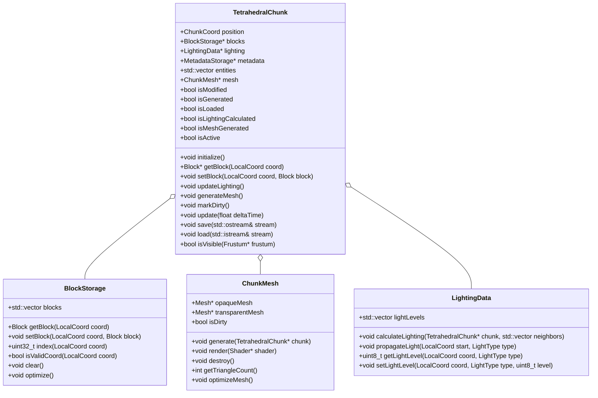

### Tetrahedral Chunk Geometry

Each chunk contains a structured arrangement of tetrahedral cells:

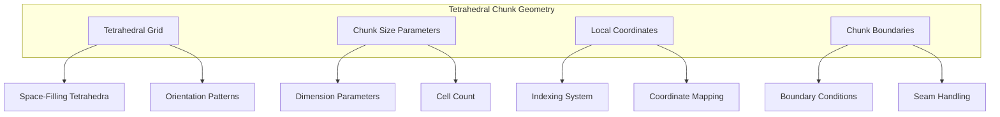

The tetrahedral chunk uses a specific geometric arrangement:
- **Chunk Size**: Each chunk contains a configurable number of tetrahedral cells (default: 16x16x16 in Cartesian space)
- **Cell Arrangement**: Tetrahedra are arranged in a space-filling pattern
- **Boundary Definition**: Chunk boundaries are defined along planes that align with tetrahedral faces
- **Orientation Consistency**: Tetrahedral orientations follow consistent patterns for predictable navigation

## Chunk Coordinates

The chunk system uses multiple coordinate systems for different purposes:

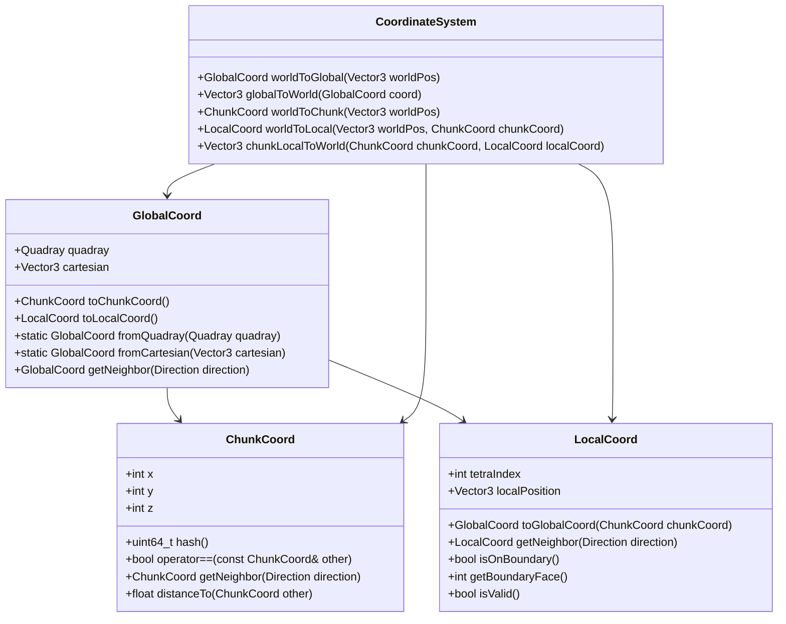

The coordinate systems serve different purposes:
- **ChunkCoord**: Identifies specific chunks in the world grid
- **GlobalCoord**: Represents a global position in both Quadray and Cartesian coordinates
- **LocalCoord**: Identifies a specific tetrahedral cell and position within a chunk
- **CoordinateSystem**: Provides utility functions for converting between coordinate systems

### Coordinate Mapping

Converting between different coordinate systems is a core function:

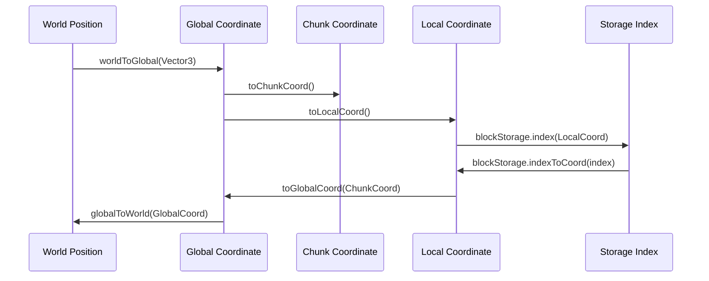

This conversion system enables:
- **Efficient Lookup**: Quick translation from world position to specific block
- **Seamless Boundaries**: Smooth handling of positions crossing chunk boundaries
- **Tetrahedral Alignment**: Proper alignment with the tetrahedral grid
- **Bidirectional Mapping**: Conversion in both directions for complete functionality

## Chunk Manager

The ChunkManager handles all aspects of chunk loading, unloading, and processing:

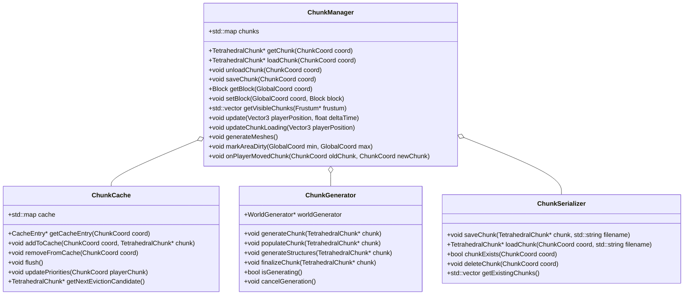

The ChunkManager responsibilities include:
- **Chunk Lifecycle**: Managing the loading, unloading, and activation of chunks
- **Player-Centric Loading**: Loading chunks around the player's position
- **Persistent Storage**: Saving and loading chunks from disk
- **Block Access**: Providing a world-coordinate interface for block manipulation
- **Visibility Determination**: Identifying which chunks should be rendered
- **Mesh Generation**: Coordinating the generation and updating of chunk meshes

### Chunk Loading Strategy

The chunk loading process follows a specific strategy:

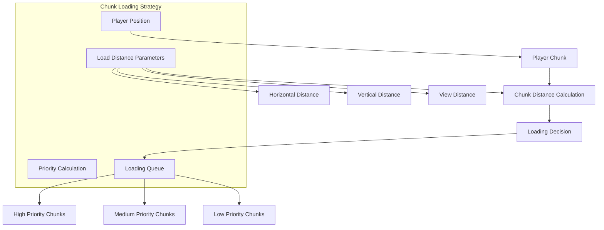

Key loading strategy elements:
- **Spherical Loading**: Chunks are loaded in spherical layers around the player
- **Distance-Based Priority**: Closer chunks have higher loading priority
- **View Direction Bias**: Chunks in the player's view direction have increased priority
- **Incremental Loading**: Chunks are loaded over multiple frames to avoid stuttering
- **Memory Bounds**: A maximum number of loaded chunks prevents excessive memory usage

## Block Storage

The chunk system includes specialized storage for tetrahedral blocks:

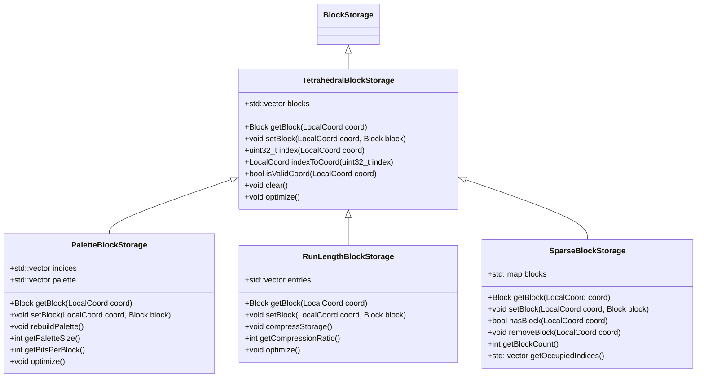

The storage systems are optimized for different scenarios:
- **Basic Storage**: Standard array of block data for general use
- **Palette Storage**: Optimized for chunks with few unique block types
- **Run-Length Encoding**: Efficient for chunks with large areas of the same block type
- **Sparse Storage**: Optimized for mostly empty chunks
- **Adaptive Storage**: Selection of optimal storage type based on chunk contents

## Chunk Meshing

The process of converting chunk data into renderable meshes is crucial for performance:

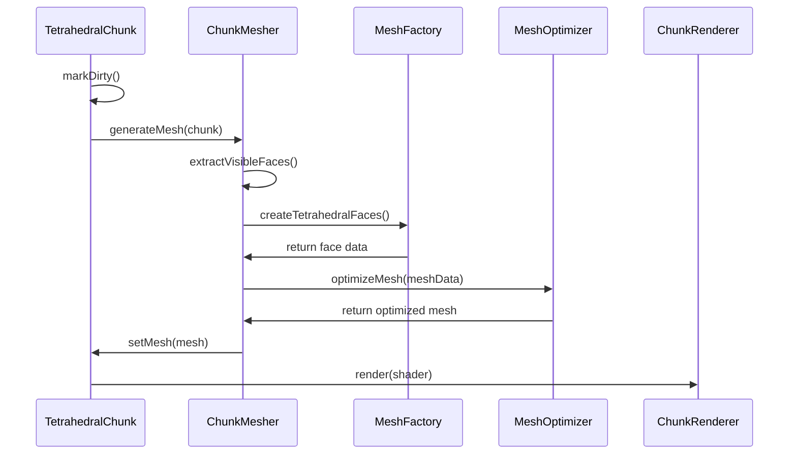

The meshing process includes:
- **Face Extraction**: Identifying visible tetrahedral faces
- **Geometry Generation**: Creating triangulated geometry for the faces
- **Material Sorting**: Separating opaque and transparent geometry
- **Mesh Optimization**: Reducing triangle count and vertex duplication
- **Buffer Creation**: Generating GPU-friendly vertex and index buffers
- **Render Preparation**: Organizing meshes for efficient rendering

### Tetrahedral Face Visibility

Determining which faces are visible is a key optimization:

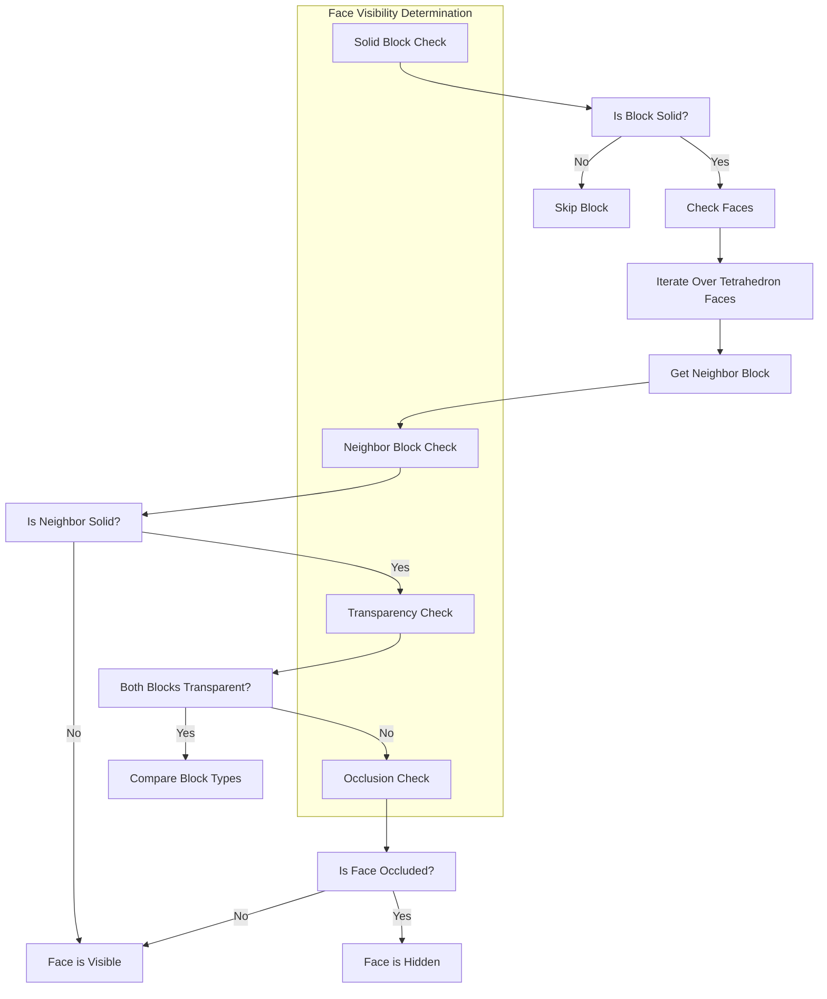

Advanced visibility techniques include:
- **Greedy Meshing**: Combining adjacent faces with the same properties
- **Ambient Occlusion**: Adding shading to corners for visual depth
- **LOD Generation**: Creating multiple detail levels for distant chunks
- **Partial Updates**: Updating only modified sections of a chunk
- **Tetrahedral-Specific Optimizations**: Special handling for tetrahedral geometry

## Chunk Processing Pipeline

The chunk processing follows a multi-stage pipeline:

```mermaid
graph TD
    subgraph "Chunk Processing Pipeline"
        Loading["Loading Stage"]
        Generation["Generation Stage"]
        Population["Population Stage"]
        Lighting["Lighting Stage"]
        Meshing["Meshing Stage"]
        Optimization["Optimization Stage"]
        Serialization["Serialization Stage"]
    end
    
    Loading --> DiskLoad["Load from Disk"]
    Loading --> CreateNew["Create New Chunk"]
    
    Generation --> TerrainGeneration["Terrain Generation"]
    Generation --> BiomeAssignment["Biome Assignment"]
    
    Population --> StructureGeneration["Structure Generation"]
    Population --> EntityPlacement["Entity Placement"]
    Population --> DetailPass["Detail Pass"]
    
    Lighting --> SunlightPropagation["Sunlight Propagation"]
    Lighting --> BlocklightPropagation["Blocklight Propagation"]
    
    Meshing --> FaceExtraction["Face Extraction"]
    Meshing --> GeometryGeneration["Geometry Generation"]
    
    Optimization --> VertexOptimization["Vertex Optimization"]
    Optimization --> IndexOptimization["Index Optimization"]
    
    Serialization --> BlockSerialization["Block Serialization"]
    Serialization --> MetadataSerialization["Metadata Serialization"]
```

The processing pipeline ensures efficient chunk preparation:
- **Multi-Threading**: Processing chunks on background threads
- **Priority System**: Prioritizing chunks that are most important to the player
- **Batching**: Processing multiple chunks in batches for efficiency
- **Cancellation**: Cancelling low-priority processing when new areas become important
- **Progress Tracking**: Tracking and reporting processing progress for user feedback

## Tetrahedral Chunk Challenges

Working with tetrahedral chunks presents unique challenges:

```mermaid
graph TD
    subgraph "Tetrahedral Chunk Challenges"
        GeometryComplexity["Geometry Complexity"]
        BoundaryHandling["Boundary Handling"]
        StorageEfficiency["Storage Efficiency"]
        MeshingComplexity["Meshing Complexity"]
        NavigationComplexity["Navigation Complexity"]
    end
    
    GeometryComplexity --> NonEuclideanGeometry["Non-Euclidean Geometry"]
    GeometryComplexity --> ComplexTriangulation["Complex Triangulation"]
    
    BoundaryHandling --> EdgeCases["Edge Cases"]
    BoundaryHandling --> SeamRendering["Seam Rendering"]
    
    StorageEfficiency --> SparseData["Sparse Data"]
    StorageEfficiency --> CompressionTechniques["Compression Techniques"]
    
    MeshingComplexity --> GreedyMeshingAdaptation["Greedy Meshing Adaptation"]
    MeshingComplexity --> TetrahedralFaceHandling["Tetrahedral Face Handling"]
    
    NavigationComplexity --> PathfindingAcrossChunks["Pathfinding Across Chunks"]
    NavigationComplexity --> ConsistentOrientation["Consistent Orientation"]
```

Solutions to these challenges include:
- **Specialized Algorithms**: Custom algorithms adapted for tetrahedral geometry
- **Boundary Metadata**: Extra metadata to handle chunk boundaries properly
- **Optimized Storage**: Storage schemes tailored to tetrahedral data
- **Adaptive Meshing**: Meshing techniques that adapt to tetrahedral faces
- **Coordinate Translation**: Robust systems for translating between coordinate systems

## Memory Management

Efficient memory management is crucial for the chunk system:

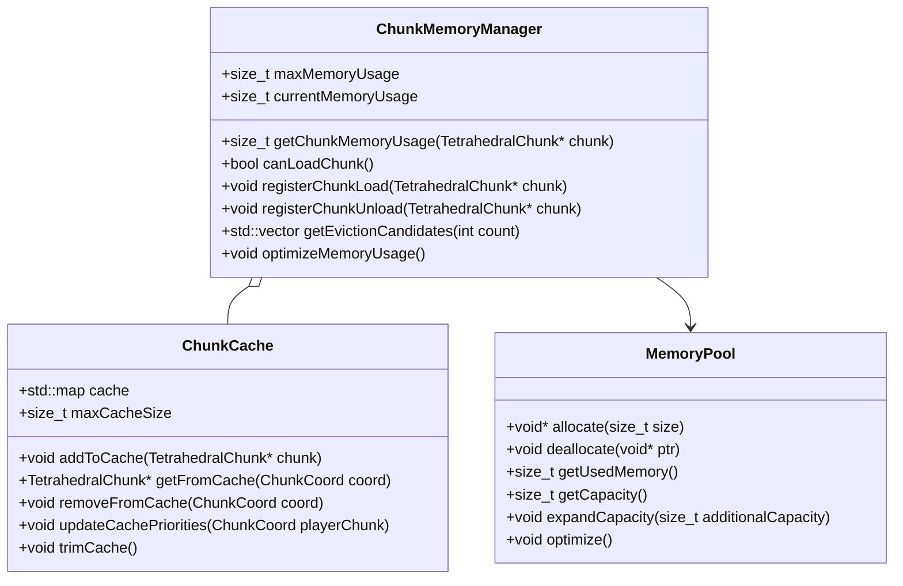

Memory management strategies include:
- **Memory Budgeting**: Setting limits on chunk-related memory usage
- **Chunk Eviction**: Unloading less important chunks when memory limits are approached
- **Memory Pooling**: Using pooled allocations for chunk data to reduce fragmentation
- **Deferred Loading**: Loading chunks only when necessary
- **Compression**: Compressing inactive chunks in memory
- **Shared Resource Usage**: Sharing common resources across chunks

## Chunk Serialization

Saving and loading chunks is essential for persistent worlds:

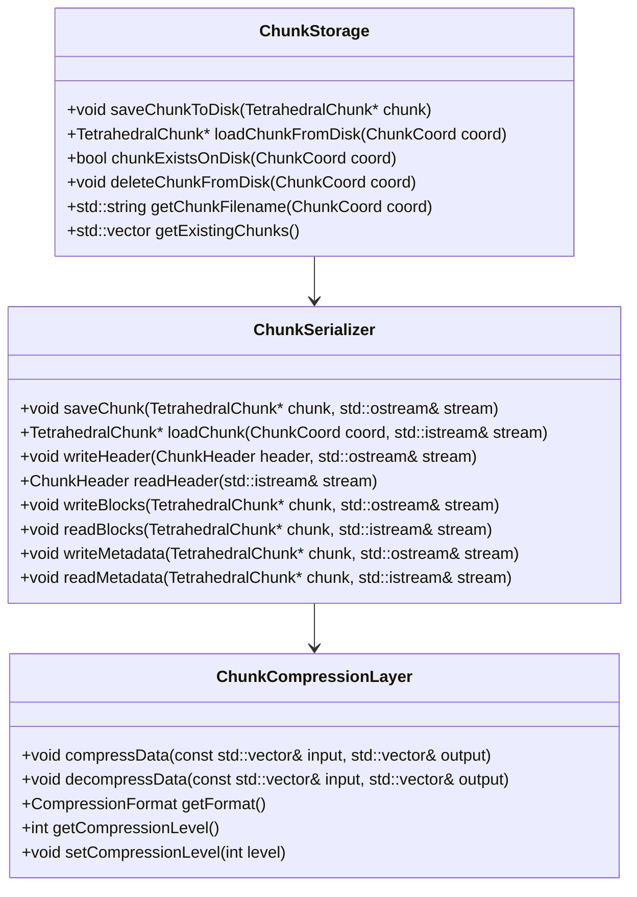

The serialization system includes:
- **Format Versioning**: Support for evolving chunk formats
- **Data Compression**: Efficient compression for stored chunks
- **Streaming Support**: Incremental reading and writing of chunk data
- **Error Handling**: Robust error handling and recovery
- **Backwards Compatibility**: Supporting loading of older chunk formats
- **Region Files**: Grouping chunks into region files for efficiency

## Multi-Threading Model

The chunk system leverages multi-threading for performance:

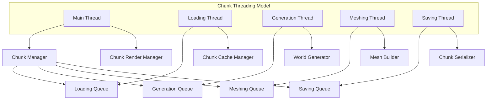

The threading model provides:
- **Parallel Processing**: Processing multiple chunks simultaneously
- **Task Prioritization**: Focusing processing power on important chunks
- **Work Stealing**: Balancing load across available threads
- **Thread Safety**: Ensuring thread-safe access to shared resources
- **Cancellation Support**: Ability to cancel ongoing tasks when priorities change
- **Progress Tracking**: Monitoring and reporting progress of background operations

## Chunk Events

The chunk system uses events to coordinate with other systems:

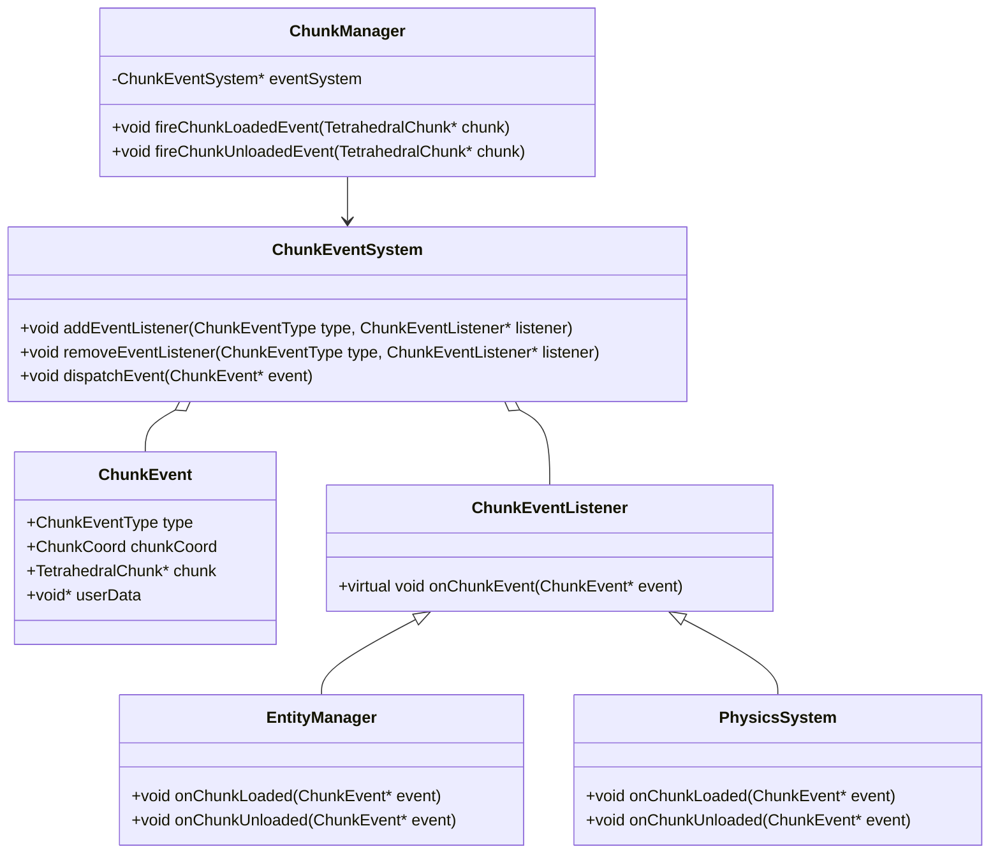

Chunk events include:
- **Chunk Loaded**: Fired when a chunk is fully loaded and ready for use
- **Chunk Unloaded**: Fired when a chunk is about to be unloaded
- **Chunk Changed**: Fired when a chunk's content is significantly changed
- **Chunk Mesh Generated**: Fired when a chunk's mesh is generated or updated
- **Block Changed**: Fired when a block within a chunk is changed
- **Chunk Generation Progress**: Fired to report generation progress

## Level of Detail System

For distant chunks, a Level of Detail (LOD) system improves performance:

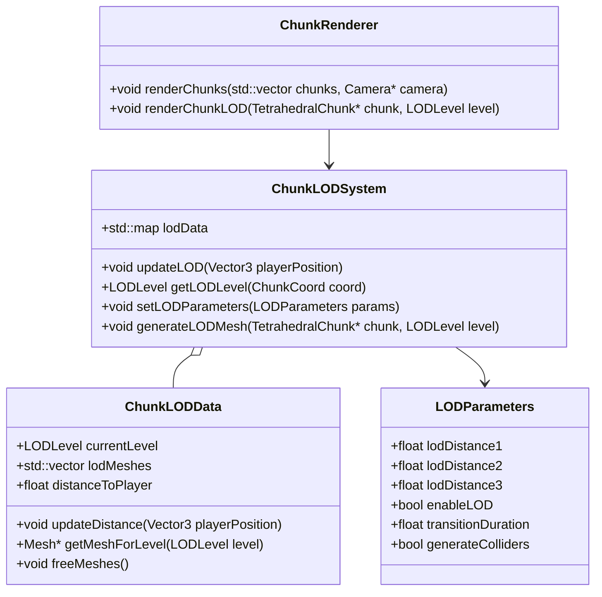

The LOD system provides:
- **Distance-Based Detail**: Reducing detail for distant chunks
- **Smooth Transitions**: Smooth transitions between LOD levels
- **Memory Efficiency**: Using less memory for distant chunks
- **Simplified Collision**: Simplified collision for distant chunks
- **Adaptive Detail**: Adjusting detail based on performance and view direction
- **Tetrahedral Preservation**: Maintaining tetrahedral appearance even at low detail

## Chunk Lighting

The lighting system is an important part of the chunk system:

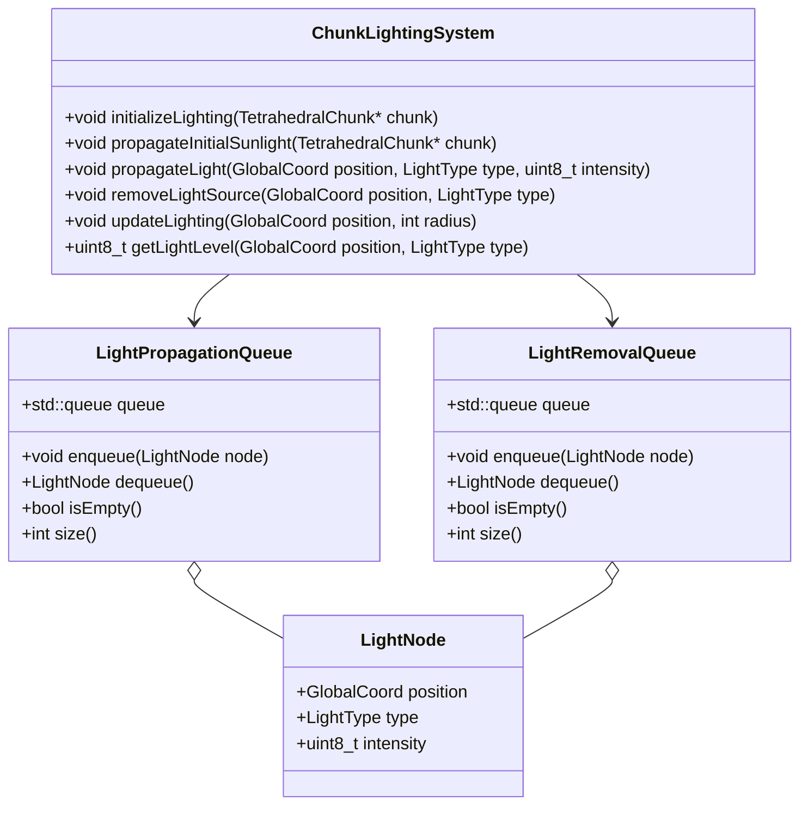

The lighting system includes:
- **Sunlight Propagation**: Downward propagation of sunlight
- **Blocklight Propagation**: Outward propagation from light-emitting blocks
- **Light Removal**: Removing light when blocks change
- **Incremental Updates**: Updating only affected areas when changes occur
- **Cross-Chunk Propagation**: Light propagation across chunk boundaries
- **Tetrahedral-Specific Adaptations**: Special handling for tetrahedral faces

## Performance Optimizations

The chunk system includes numerous performance optimizations:

```mermaid
graph TD
    subgraph "Chunk Optimizations"
        Culling["Culling Techniques"]
        Batching["Batching Strategies"]
        Caching["Caching Mechanisms"]
        LazyLoading["Lazy Loading"]
        DataStructures["Optimized Data Structures"]
    end
    
    Culling --> FrustumCulling["Frustum Culling"]
    Culling --> OcclusionCulling["Occlusion Culling"]
    Culling --> DetailCulling["Detail Culling"]
    
    Batching --> DrawCallBatching["Draw Call Batching"]
    Batching --> GeometryBatching["Geometry Batching"]
    Batching --> InstancingSupport["Instancing Support"]
    
    Caching --> BlockTypeCaching["Block Type Caching"]
    Caching --> MeshCaching["Mesh Caching"]
    Caching --> LightingCaching["Lighting Caching"]
    
    LazyLoading --> DeferredGeneration["Deferred Generation"]
    LazyLoading --> PrioritizedLoading["Prioritized Loading"]
    LazyLoading --> ProgressiveDetail["Progressive Detail"]
    
    DataStructures --> SpatialHashing["Spatial Hashing"]
    DataStructures --> QuadTrees["Quad Trees"]
    DataStructures --> ChunkOctrees["Chunk Octrees"]
```

Key optimizations include:
- **Culling Strategies**: Only processing visible chunks
- **Chunk Prioritization**: Focusing resources on important chunks
- **Memory Management**: Efficient handling of chunk memory
- **Render Batching**: Reducing draw calls through batching
- **Incremental Mesh Updates**: Updating only changed parts of meshes
- **Tetrahedral-Specific Optimizations**: Special optimizations for tetrahedral data

## Example: Chunk Creation and Access

Here's an example of how chunk creation and block access works in code:

```cpp
// Creating and initializing a new chunk
TetrahedralChunk* createChunk(ChunkCoord coord) {
    TetrahedralChunk* chunk = new TetrahedralChunk(coord);
    chunk->initialize();
    
    // Generate terrain for the chunk
    worldGenerator.generateTerrain(chunk);
    
    // Add structures and features
    worldGenerator.populateChunk(chunk);
    
    // Initialize lighting
    lightingSystem.initializeLighting(chunk);
    
    // Generate mesh
    chunk->generateMesh();
    
    return chunk;
}

// Setting a block in the world
void setBlockAt(Vector3 worldPosition, Block block) {
    // Convert world position to global coordinate
    GlobalCoord globalCoord = coordinateSystem.worldToGlobal(worldPosition);
    
    // Get the chunk coordinate
    ChunkCoord chunkCoord = globalCoord.toChunkCoord();
    
    // Get the local coordinate within the chunk
    LocalCoord localCoord = globalCoord.toLocalCoord();
    
    // Get or load the chunk
    TetrahedralChunk* chunk = chunkManager.getChunk(chunkCoord);
    if (!chunk) {
        chunk = chunkManager.loadChunk(chunkCoord);
    }
    
    // Set the block
    chunk->setBlock(localCoord, block);
    
    // Mark the chunk as modified
    chunk->markDirty();
    
    // Update lighting
    lightingSystem.updateLighting(globalCoord, 15);
    
    // Update neighboring chunks if the block is on a boundary
    if (localCoord.isOnBoundary()) {
        int face = localCoord.getBoundaryFace();
        ChunkCoord neighborCoord = chunkCoord.getNeighbor(face);
        TetrahedralChunk* neighbor = chunkManager.getChunk(neighborCoord);
        if (neighbor) {
            neighbor->markDirty();
        }
    }
}

// Getting a block from the world
Block getBlockAt(Vector3 worldPosition) {
    // Convert world position to global coordinate
    GlobalCoord globalCoord = coordinateSystem.worldToGlobal(worldPosition);
    
    // Get the chunk coordinate
    ChunkCoord chunkCoord = globalCoord.toChunkCoord();
    
    // Get the local coordinate within the chunk
    LocalCoord localCoord = globalCoord.toLocalCoord();
    
    // Get the chunk (return air if chunk not loaded)
    TetrahedralChunk* chunk = chunkManager.getChunk(chunkCoord);
    if (!chunk) {
        return Block::AIR;
    }
    
    // Return the block
    return chunk->getBlock(localCoord);
}
```

## Conclusion

The QuadCraft tetrahedral chunk system provides an efficient framework for managing the tetrahedral world. By adapting traditional voxel chunk techniques to tetrahedral space, the system maintains performance while supporting the unique geometric properties of QuadCraft's non-Euclidean world. Through careful design of coordinate systems, storage solutions, and processing pipelines, the chunk system enables smooth exploration and interaction with complex tetrahedral environments. 