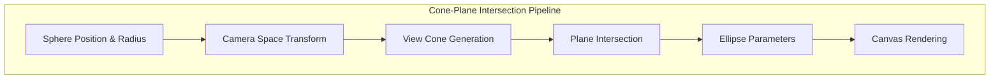
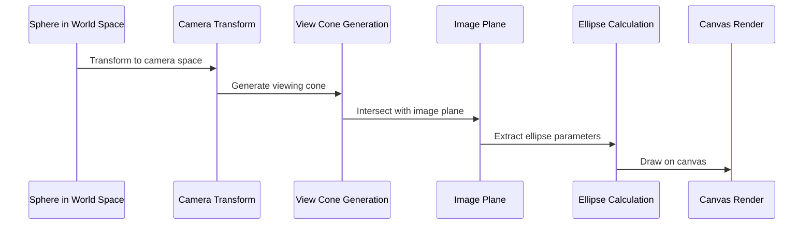
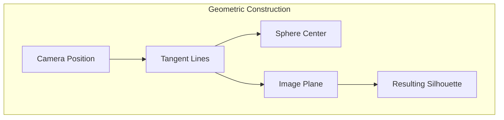

# Cone-Plane Intersection Rendering System

This document details the Cone-Plane Intersection rendering technique implemented in QuadCraft's JavaScript version, providing mathematically accurate rendering of spherical objects (balls) in 3D space using 2D canvas rendering.

## Overview

The Cone-Plane Intersection system is an advanced rendering technique that calculates the exact silhouette of a sphere as viewed from the camera, then renders this silhouette as an ellipse on the 2D canvas. This approach provides more accurate visual representation of balls compared to simple circular projection.



## Mathematical Foundation

### Problem Statement

Traditional approaches to rendering spheres in 3D using 2D canvas often result in visually incorrect representations, especially when the camera is at certain angles or distances. The cone-plane intersection method solves this by:

1. **Accurate Silhouette Calculation**: Computing the exact outline of the sphere as seen from the camera
2. **Perspective-Correct Rendering**: Maintaining proper perspective distortion
3. **Mathematical Precision**: Using geometric mathematics rather than approximations

### Core Algorithm

The algorithm transforms the problem into camera space and computes the intersection of a viewing cone with a plane at the image location.



## Implementation Details

### Camera Space Transformation

The first step transforms the sphere's position and radius into camera coordinate space:

```javascript
// Transform sphere center to camera space
const dx = spherePos[0] - camPos[0];
const dy = spherePos[1] - camPos[1];
const dz = spherePos[2] - camPos[2];

// Get camera basis vectors
let f = calculateForwardVector(camQ);  // Forward vector
let u = calculateUpVector(camQ);       // Up vector
let r = cross(f, u); r = normalize(r); // Right vector
u = normalize(cross(r, f));

// Transform to camera space
const cx = dx*r[0] + dy*r[1] + dz*r[2];
const cy = dx*u[0] + dy*u[1] + dz*u[2];
const cz = dx*f[0] + dy*f[1] + dz*f[2];
```

### Viewing Cone Generation

The viewing cone represents the region of space visible to the camera through the sphere:

```javascript
// Calculate tangent angle
const L = Math.hypot(cx, cy, cz);  // Distance to sphere center
const s = radius / L;              // Normalized radius
const cos2 = Math.max(0, 1 - s*s); // Cosine squared of tangent angle
const cosTheta = Math.sqrt(cos2);  // Cosine of tangent angle

// Generate cone directions
const ux = cx/L, uy = cy/L, uz = cz/L;  // Normalized direction to center
```

### Plane Intersection Mathematics

The core mathematics involves intersecting the viewing cone with the image plane:

```javascript
// Image plane is at z = d (where d = cubeSize)
const d = cubeSize;

// Conic section parameters on the plane
const A = ux*ux - cos2;
const B = 2*ux*uy;
const C = uy*uy - cos2;
const D = 2*d*ux*uz;
const E = 2*d*uy*uz;
const F = d*d*(uz*uz - cos2);
```

### Ellipse Parameter Extraction

From the conic section parameters, we extract the ellipse center and axes:

```javascript
// Solve for ellipse center
const det = 4*A*C - B*B;
const x0 = (B*E - 2*C*D) / det;
const y0 = (B*D - 2*A*E) / det;

// Calculate ellipse axes using eigenvalue decomposition
const trace = A + C;
const diff = A - C;
const disc = Math.hypot(diff, B);
let lam1 = (trace + disc)/2;
let lam2 = (trace - disc)/2;
```

### Eigenvalue and Eigenvector Calculation

The ellipse orientation is determined by the eigenvector corresponding to the larger eigenvalue:

```javascript
// Calculate rotation angle
const phi = 0.5 * Math.atan2(B, (A - C));

// Calculate semi-axis lengths
const t1 = Math.sqrt(k/lam1);  // Length along first axis
const t2 = Math.sqrt(k/lam2);  // Length along second axis

// Generate rotation matrix components
const cs = Math.cos(phi), sn = Math.sin(phi);
const aX = cs * t1;
const aY = -sn * t1;
const bX = -sn * t2;
const bY = -cs * t2;
```

## Rendering Pipeline

### Canvas Rendering

The calculated ellipse parameters are used to render on the HTML5 canvas:

```javascript
function paintOval2d(centerX, centerY, aX, aY, bX, bY, color, isFillElseOutline) {
  ctx.save();
  ctx.translate(centerX, centerY);

  // Set up transformation matrix
  ctx.transform(aX, aY, bX, bY, 0, 0);

  // Draw the ellipse
  ctx.beginPath();
  ctx.arc(0, 0, 1, 0, Math.PI*2);

  // Apply styling
  if(isFillElseOutline){
    ctx.fillStyle = color;
    ctx.fill();
  }else{
    const det = aX*bY - aY*bX;
    const s = Math.sqrt(Math.max(1e-9, Math.abs(det)));
    ctx.lineWidth = 2 / s;
    ctx.strokeStyle = color;
    ctx.stroke();
  }

  ctx.restore();
}
```

### Visual Quality Improvements

The cone-plane intersection method provides several visual improvements:

1. **Accurate Shape**: Ellipses match the true projected shape of spheres
2. **Perspective Correctness**: Proper foreshortening at different camera angles
3. **Distance Accuracy**: Size and shape correctly represent distance from camera
4. **Orientation Independence**: Works correctly regardless of sphere orientation

## Edge Cases and Robustness

### Degenerate Cases

The implementation handles several edge cases:

```javascript
// Camera inside sphere case
if (radius >= L*0.999999){
  // Return large circle to fill the screen
  return [projectedX, projectedY, 1e6, 0, 0, 1e6];
}

// Perfect circle case (sphere aligned with view axis)
if (Math.abs(ux) < 1e-6 && Math.abs(uy) < 1e-6){
  // Handle as special case
  return handleAxialAlignment();
}

// Near-singular matrices
if (Math.abs(det) < 1e-9){
  det = (det >= 0 ? 1 : -1) * 1e-9;
}
```

### Numerical Stability

Several techniques ensure numerical stability:

1. **Epsilon Values**: Small offsets prevent division by zero
2. **Clamping**: Values are clamped to valid ranges
3. **Normalization**: Vectors are re-normalized as needed
4. **Singularity Handling**: Special cases for degenerate geometries

## Performance Optimizations

### Caching and Reuse

```javascript
// Cache camera basis vectors
let cachedCameraBasis = null;
let lastCameraQuaternion = null;

function getCameraBasis(q) {
  if (cachedCameraBasis && quaternionEqual(q, lastCameraQuaternion)) {
    return cachedCameraBasis;
  }

  // Calculate new basis
  const f = calculateForwardVector(q);
  const u = calculateUpVector(q);
  const r = normalize(cross(f, u));
  const correctedU = normalize(cross(r, f));

  cachedCameraBasis = {f, u: correctedU, r};
  lastCameraQuaternion = [...q];
  return cachedCameraBasis;
}
```

### Early Exit Conditions

```javascript
// Early exit for objects behind camera
if (cz <= 0) return null;

// Early exit for distant objects
if (cz < drawDistanceMin || drawDistanceMax < cz) return null;

// Early exit for zero-distance objects
if (cz === 0) return null;
```

### SIMD Optimization Potential

For future WebAssembly implementation:

```cpp
// SIMD-optimized version for WebAssembly
v128_t spherePos = wasm_v128_load(spherePosPtr);
v128_t camPos = wasm_v128_load(camPosPtr);
v128_t diff = wasm_f32x4_sub(spherePos, camPos);
// ... vectorized calculations
```

## Integration with QuadCraft Systems

### Ball Rendering Integration

The cone-plane intersection system integrates with the main rendering loop:

```javascript
function paintBall(xyz, radius, color, isFillElseOutline, useConePlane) {
  if(!isQuatCam()) return; // Requires quaternion camera

  // Depth testing and culling
  const cz = dotProdOfXYZAlongCamForward(xyz);
  if(cz < drawDistanceMin || drawDistanceMax < cz || cz === 0) return;

  if(useConePlane){
    const affine = conePlaneIntersection(xyz, radius);
    if(affine){
      const [centerX, centerY, aX, aY, bX, bY] = affine;
      paintOval2d(centerX, centerY, aX, aY, bX, bY, color, isFillElseOutline);
    }else{
      // Fallback to circle rendering
      const ctr = project(xyz);
      const pr = radius * cubeSize / cz;
      paintCircle2d(ctr[0], ctr[1], pr, color, isFillElseOutline);
    }
  }else{
    // Standard circle rendering
    const ctr = project(xyz);
    const pr = radius * cubeSize / cz;
    paintCircle2d(ctr[0], ctr[1], pr, color, isFillElseOutline);
  }
}
```

### CCP Ball Grid Integration

The rendering system works with the CCP Ball Grid optimization:

```javascript
// Render balls from CCP grid
for (const q of ccp.surfaceQuadrays()) {
  const xyz = q.toCartesian();
  const radius = ballRadius;
  const color = q.color || '#ffffff';

  paintBall(xyz, radius, color, false, useConePlaneIntersection);
}
```

## Advanced Features

### Variable Quality Rendering

The system supports different quality levels:

```javascript
const RENDER_QUALITY = {
  LOW: 0,     // Simple circles only
  MEDIUM: 1,  // Basic cone-plane intersection
  HIGH: 2,    // Full cone-plane with optimizations
  ULTRA: 3    // Maximum quality with advanced features
};

function setRenderQuality(quality) {
  switch(quality) {
    case RENDER_QUALITY.LOW:
      useConePlaneIntersection = false;
      break;
    case RENDER_QUALITY.MEDIUM:
      useConePlaneIntersection = true;
      enableOptimizations = false;
      break;
    case RENDER_QUALITY.HIGH:
      useConePlaneIntersection = true;
      enableOptimizations = true;
      break;
    case RENDER_QUALITY.ULTRA:
      useConePlaneIntersection = true;
      enableOptimizations = true;
      enableAdvancedFeatures = true;
      break;
  }
}
```

### Anti-Aliasing and Smoothing

```javascript
function applyAntiAliasing(ctx, ellipseParams) {
  // Set canvas image smoothing
  ctx.imageSmoothingEnabled = true;
  ctx.imageSmoothingQuality = 'high';

  // Use sub-pixel rendering for smoother ellipses
  const [centerX, centerY, aX, aY, bX, bY] = ellipseParams;

  // Render at higher resolution then downscale
  const scaleFactor = 2;
  ctx.save();
  ctx.scale(1/scaleFactor, 1/scaleFactor);
  ctx.translate(centerX * scaleFactor, centerY * scaleFactor);

  // Render scaled ellipse
  paintOval2d(0, 0, aX * scaleFactor, aY * scaleFactor,
              bX * scaleFactor, bY * scaleFactor, color, isFill);

  ctx.restore();
}
```

## Debugging and Visualization

### Debug Visualization

```javascript
function visualizeConePlaneIntersection(xyz, radius, steps = 32) {
  // Visualize the viewing cone
  const coneLines = generateConeOutline(xyz, radius, steps);

  ctx.strokeStyle = 'rgba(255, 255, 0, 0.5)';
  ctx.lineWidth = 1;
  ctx.beginPath();

  for(const line of coneLines) {
    const start = project(line.start);
    const end = project(line.end);
    ctx.moveTo(start[0], start[1]);
    ctx.lineTo(end[0], end[1]);
  }

  ctx.stroke();

  // Visualize the intersection ellipse
  const affine = conePlaneIntersection(xyz, radius);
  if(affine) {
    const [centerX, centerY, aX, aY, bX, bY] = affine;
    paintOval2d(centerX, centerY, aX, aY, bX, bY, 'rgba(255, 0, 0, 0.3)', false);
  }
}
```

### Performance Monitoring

```javascript
let renderStats = {
  ballsRendered: 0,
  conePlaneCalculations: 0,
  averageCalculationTime: 0,
  fallbackToCircle: 0
};

function updateRenderStats(usedConePlane, calculationTime) {
  renderStats.ballsRendered++;

  if(usedConePlane) {
    renderStats.conePlaneCalculations++;
    renderStats.averageCalculationTime =
      (renderStats.averageCalculationTime + calculationTime) / 2;
  } else {
    renderStats.fallbackToCircle++;
  }
}
```

## Mathematical References

### Key Equations

1. **Sphere-Cone Intersection**: The viewing cone tangent condition
   ```
   sinθ = radius / distance
   cosθ = √(1 - sin²θ)
   ```

2. **Conic Section**: The general conic equation
   ```
   Ax² + Bxy + Cy² + Dx + Ey + F = 0
   ```

3. **Ellipse Parameters**: Center and semi-axes from conic coefficients
   ```
   x₀ = (BE - 2CD)/(4AC - B²)
   y₀ = (BD - 2AE)/(4AC - B²)
   ```

### Geometric Interpretation

The cone-plane intersection represents the set of all lines from the camera that are tangent to the sphere. The intersection of these lines with the image plane forms the silhouette ellipse.



## Future Enhancements

### Potential Improvements

1. **WebGL Implementation**: Port to WebGL for hardware acceleration
2. **Level of Detail**: Different quality levels based on distance
3. **Animation Support**: Smooth transitions between different views
4. **Multi-Object Rendering**: Efficient batching of multiple spheres
5. **Advanced Materials**: Reflection, refraction, and lighting effects

### Research Directions

1. **Higher-Order Surfaces**: Extension to other quadric surfaces
2. **Soft Shadows**: Using cone-plane for realistic shadow rendering
3. **Reflections**: Accurate reflection rendering using the technique
4. **Performance Optimization**: Further mathematical optimizations

## Conclusion

The Cone-Plane Intersection rendering system represents a significant advancement in 3D rendering using 2D canvas, providing mathematically accurate sphere rendering that rivals traditional 3D graphics approaches. Its implementation in QuadCraft demonstrates the power of combining advanced geometry with practical rendering techniques to create compelling 3D visualizations in web browsers.
