# QuadCraft Entity System

> [!IMPORTANT]
> **Design Specification Status**: This document outlines the *architectural design* and *planned implementation* of the C++ Entity System. As of the current version, the core C++ entity classes (`src/core/entity/Entity.h`, `Component.h`, etc.) are in active development. The only existing entity-related class is `Camera.h`. This guide serves as the canonical reference for the specific component-based architecture to be implemented.

This document details the entity system in QuadCraft, covering the technical architecture, component design, and implementation of entities in tetrahedral space.

## Entity System Overview

The QuadCraft entity system uses a component-based architecture to manage all dynamic objects in the game world, from the player to items, mobs, projectiles, and special effects.


```mermaid
graph TD
    subgraph "Entity System Architecture"
        EntityManager["Entity Manager"]
        Entities["Entities"]
        Components["Components"]
        Systems["Systems"]
    end
    
    EntityManager --> EntityRegistry["Entity Registry"]
    EntityManager --> ComponentRegistry["Component Registry"]
    EntityManager --> SystemRegistry["System Registry"]
    
    Entities --> Player["Player Entity"]
    Entities --> Mobs["Mob Entities"]
    Entities --> Items["Item Entities"]
    Entities --> Projectiles["Projectile Entities"]
    Entities --> Particles["Particle Entities"]
    
    Components --> Transform["Transform Component"]
    Components --> Physics["Physics Component"]
    Components --> Rendering["Rendering Component"]
    Components --> Behavior["Behavior Component"]
    Components --> Tetrahedral["Tetrahedral Component"]
    
    Systems --> PhysicsSystem["Physics System"]
    Systems --> RenderingSystem["Rendering System"]
    Systems --> AISystem["AI System"]
    Systems --> InteractionSystem["Interaction System"]
    Systems --> TetrahedralSystem["Tetrahedral System"]
```

## Core Entity Architecture

QuadCraft uses a component-based entity system with the following core classes:

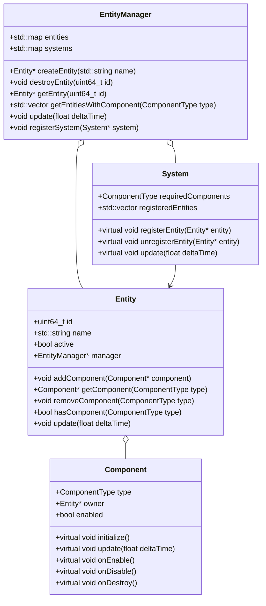
```mermaid
classDiagram
    class Entity {
        +uint64_t id
        +std::string name
        +bool active
        +EntityManager* manager
        +void addComponent(Component* component)
        +Component* getComponent(ComponentType type)
        +void removeComponent(ComponentType type)
        +bool hasComponent(ComponentType type)
        +void update(float deltaTime)
    }
    
    class Component {
        +ComponentType type
        +Entity* owner
        +bool enabled
        +virtual void initialize()
        +virtual void update(float deltaTime)
        +virtual void onEnable()
        +virtual void onDisable()
        +virtual void onDestroy()
    }
    
    class EntityManager {
        +std::map<uint64_t, Entity*> entities
        +std::map<ComponentType, System*> systems
        +Entity* createEntity(std::string name)
        +void destroyEntity(uint64_t id)
        +Entity* getEntity(uint64_t id)
        +std::vector<Entity*> getEntitiesWithComponent(ComponentType type)
        +void update(float deltaTime)
        +void registerSystem(System* system)
    }
    
    class System {
        +ComponentType requiredComponents
        +std::vector<Entity*> registeredEntities
        +virtual void registerEntity(Entity* entity)
        +virtual void unregisterEntity(Entity* entity)
        +virtual void update(float deltaTime)
    }
    
    EntityManager o-- Entity
    Entity o-- Component
    EntityManager o-- System
    System --> Entity
```

The architecture follows these principles:

- **Component-Based Design**: Entities are composed of modular components
- **System Processors**: Systems process entities with specific component sets
- **Data-Oriented Approach**: Focus on data layout and efficient memory access
- **Event-Driven Communication**: Component communication through events
- **Tetrahedral-Specific Optimizations**: Special adaptations for tetrahedral space

## Entity Types

QuadCraft implements various entity types with specific behaviors and components:


```mermaid
graph TD
    subgraph "Entity Types"
        Player["Player Entity"]
        LivingEntities["Living Entities"]
        Items["Item Entities"]
        Projectiles["Projectile Entities"]
        SpecialEntities["Special Entities"]
    end
    
    Player --> PlayerInput["Player Input Handling"]
    Player --> PlayerMovement["Player Movement"]
    Player --> PlayerInteraction["Player Interaction"]
    
    LivingEntities --> Mobs["Mobs"]
    LivingEntities --> Animals["Animals"]
    LivingEntities --> NPCs["NPCs"]
    
    Items --> DroppedItems["Dropped Items"]
    Items --> FloatingItems["Floating Items"]
    Items --> ItemEffects["Item Effects"]
    
    Projectiles --> ArrowProjectiles["Arrows"]
    Projectiles --> ThrownItems["Thrown Items"]
    Projectiles --> SpecialProjectiles["Special Projectiles"]
    
    SpecialEntities --> ParticleEffects["Particle Effects"]
    SpecialEntities --> LightSources["Light Sources"]
    SpecialEntities --> TetrahedralPortals["Tetrahedral Portals"]
```

Each entity type has unique characteristics:

- **Player Entity**: The user-controlled entity with input handling, inventory, and camera
- **Living Entities**: Mobile entities with health, AI, and interaction behaviors
- **Item Entities**: Physical representations of items in the world
- **Projectile Entities**: Moving objects like arrows or thrown items
- **Special Entities**: Non-physical entities like particles or effects

## Core Components

The component system includes several core components shared across multiple entity types:

### Transform Component

Manages the entity's position, rotation, and scale in tetrahedral space:

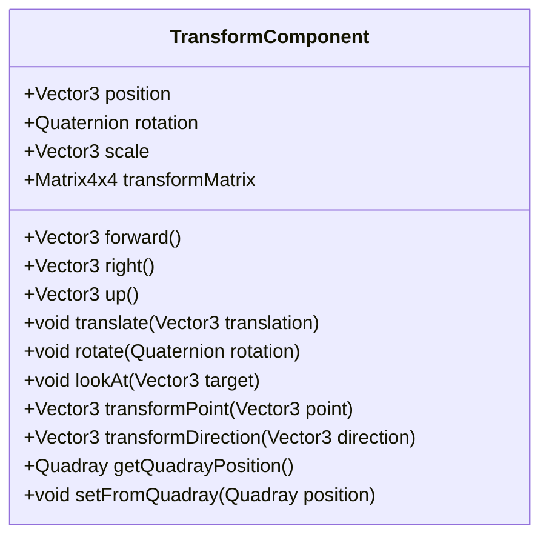
```mermaid
classDiagram
    class TransformComponent {
        +Vector3 position
        +Quaternion rotation
        +Vector3 scale
        +Matrix4x4 transformMatrix
        +Vector3 forward()
        +Vector3 right()
        +Vector3 up()
        +void translate(Vector3 translation)
        +void rotate(Quaternion rotation)
        +void lookAt(Vector3 target)
        +Vector3 transformPoint(Vector3 point)
        +Vector3 transformDirection(Vector3 direction)
        +Quadray getQuadrayPosition()
        +void setFromQuadray(Quadray position)
    }
```

Key features:

- **Dual Coordinate Support**: Stores both Cartesian and Quadray coordinates when needed
- **Transformation Matrix**: Cached transformation matrix for rendering
- **Hierarchical Support**: Optional parent-child relationships between entities
- **Space Conversion**: Conversion between local and world space

### Physics Component

Handles physical behavior like movement, collision, and gravity:

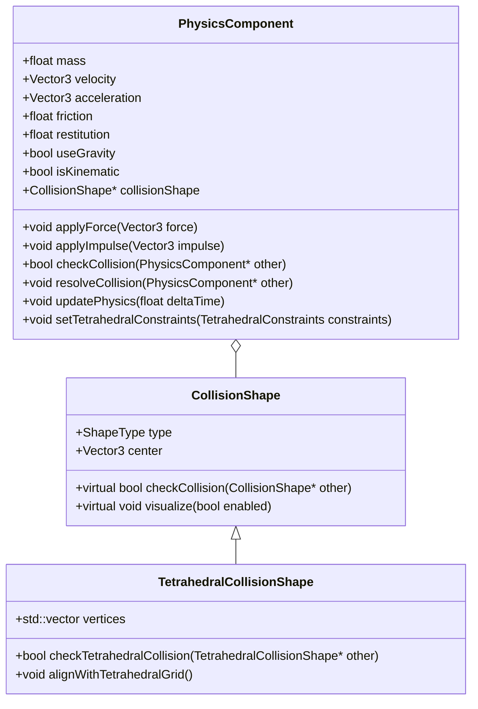
```mermaid
classDiagram
    class PhysicsComponent {
        +float mass
        +Vector3 velocity
        +Vector3 acceleration
        +float friction
        +float restitution
        +bool useGravity
        +bool isKinematic
        +CollisionShape* collisionShape
        +void applyForce(Vector3 force)
        +void applyImpulse(Vector3 impulse)
        +bool checkCollision(PhysicsComponent* other)
        +void resolveCollision(PhysicsComponent* other)
        +void updatePhysics(float deltaTime)
        +void setTetrahedralConstraints(TetrahedralConstraints constraints)
    }
    
    class CollisionShape {
        +ShapeType type
        +Vector3 center
        +virtual bool checkCollision(CollisionShape* other)
        +virtual void visualize(bool enabled)
    }
    
    class TetrahedralCollisionShape {
        +std::vector<Quadray> vertices
        +bool checkTetrahedralCollision(TetrahedralCollisionShape* other)
        +void alignWithTetrahedralGrid()
    }
    
    PhysicsComponent o-- CollisionShape
    CollisionShape <|-- TetrahedralCollisionShape
```

Key features:

- **Force-Based Physics**: Support for forces, impulses, and constraints
- **Collision Detection**: Specialized collision for tetrahedral shapes
- **Material Properties**: Physical properties like friction and restitution
- **Tetrahedral Adaptation**: Physics calculations adapted to tetrahedral space
- **Grid Alignment**: Optional alignment to the tetrahedral grid

### Rendering Component

Handles visual representation of entities:

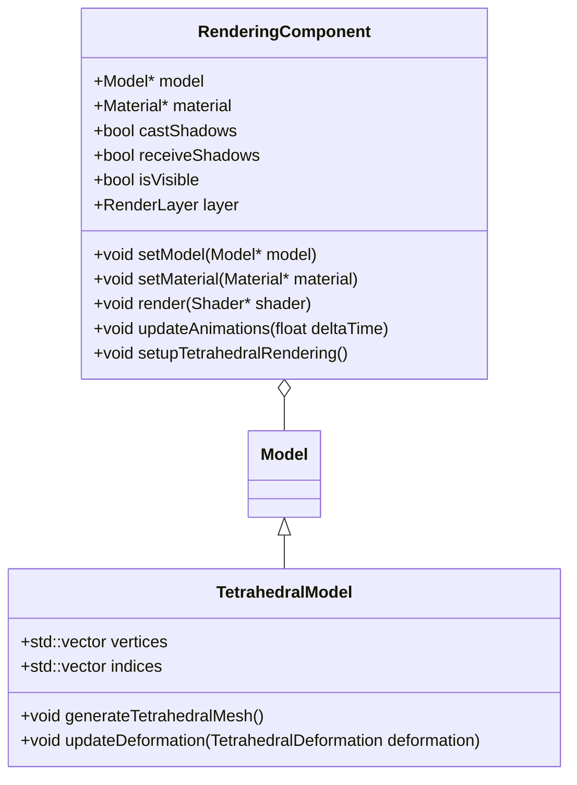
```mermaid
classDiagram
    class RenderingComponent {
        +Model* model
        +Material* material
        +bool castShadows
        +bool receiveShadows
        +bool isVisible
        +RenderLayer layer
        +void setModel(Model* model)
        +void setMaterial(Material* material)
        +void render(Shader* shader)
        +void updateAnimations(float deltaTime)
        +void setupTetrahedralRendering()
    }
    
    class TetrahedralModel {
        +std::vector<TetrahedralVertex> vertices
        +std::vector<uint32_t> indices
        +void generateTetrahedralMesh()
        +void updateDeformation(TetrahedralDeformation deformation)
    }
    
    RenderingComponent o-- Model
    Model <|-- TetrahedralModel
```

Key features:

- **Model Management**: Association with 3D models
- **Material System**: Support for different textures and shaders
- **Animation Support**: Skeletal animations and tweening
- **Tetrahedral Rendering**: Special rendering techniques for tetrahedral entities
- **Custom Shaders**: Support for entity-specific shader effects

### Health Component

Manages entity health, damage, and related effects:

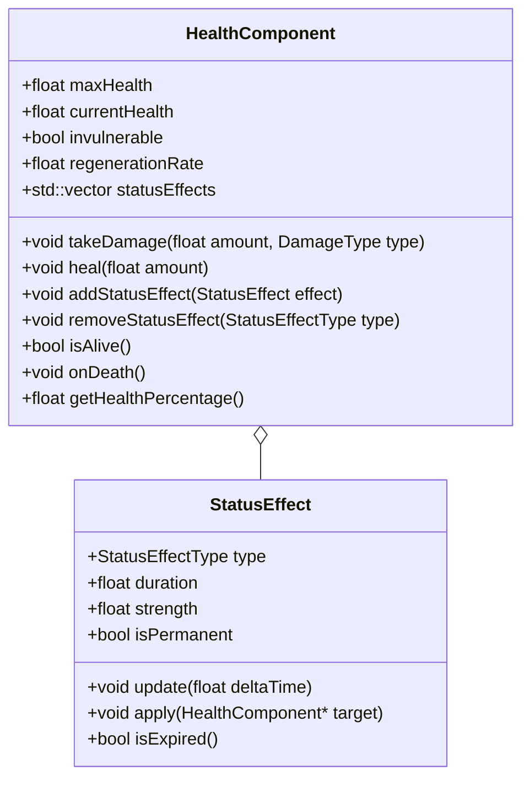
```mermaid
classDiagram
    class HealthComponent {
        +float maxHealth
        +float currentHealth
        +bool invulnerable
        +float regenerationRate
        +std::vector<StatusEffect> statusEffects
        +void takeDamage(float amount, DamageType type)
        +void heal(float amount)
        +void addStatusEffect(StatusEffect effect)
        +void removeStatusEffect(StatusEffectType type)
        +bool isAlive()
        +void onDeath()
        +float getHealthPercentage()
    }
    
    class StatusEffect {
        +StatusEffectType type
        +float duration
        +float strength
        +bool isPermanent
        +void update(float deltaTime)
        +void apply(HealthComponent* target)
        +bool isExpired()
    }
    
    HealthComponent o-- StatusEffect
```

Key features:

- **Health Management**: Tracking and modifying health values
- **Damage System**: Processing incoming damage with type considerations
- **Status Effects**: Temporary effects like poison, regeneration, etc.
- **Death Handling**: Events and functionality for entity death
- **Persistence**: Saving and loading health state

### AI Component

Controls non-player entity behavior:

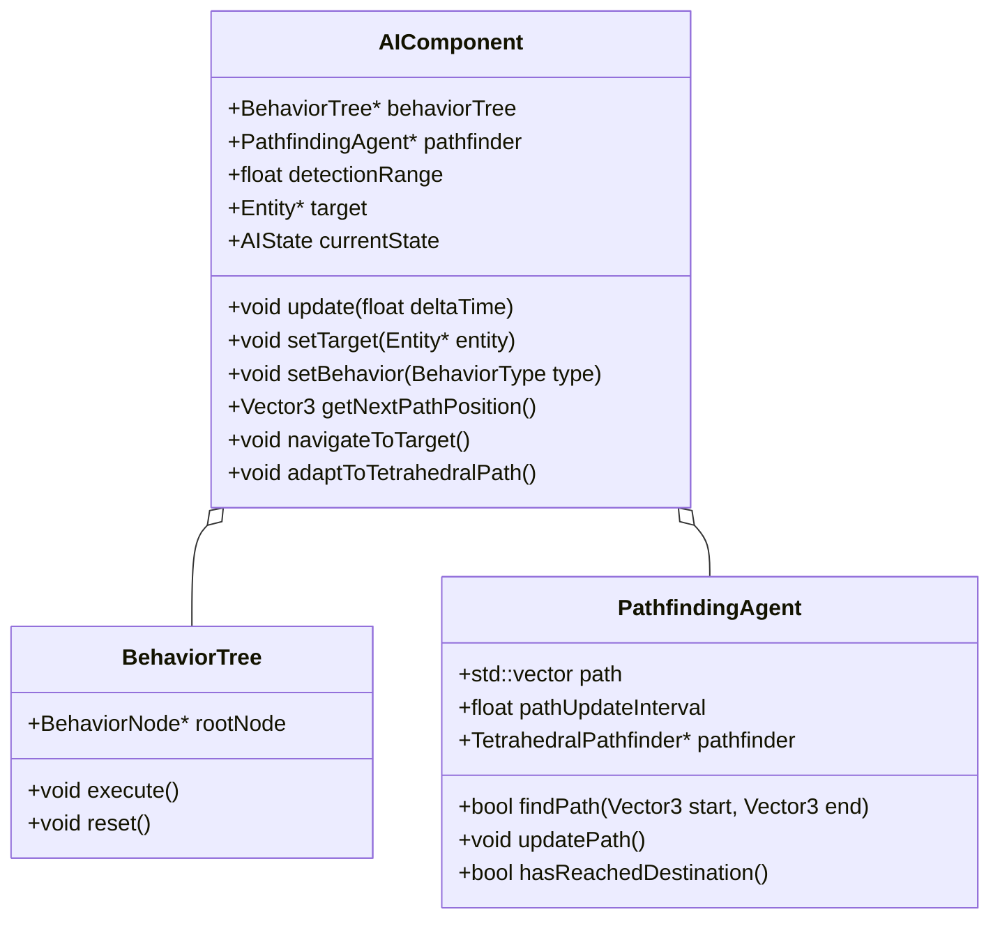
```mermaid
classDiagram
    class AIComponent {
        +BehaviorTree* behaviorTree
        +PathfindingAgent* pathfinder
        +float detectionRange
        +Entity* target
        +AIState currentState
        +void update(float deltaTime)
        +void setTarget(Entity* entity)
        +void setBehavior(BehaviorType type)
        +Vector3 getNextPathPosition()
        +void navigateToTarget()
        +void adaptToTetrahedralPath()
    }
    
    class BehaviorTree {
        +BehaviorNode* rootNode
        +void execute()
        +void reset()
    }
    
    class PathfindingAgent {
        +std::vector<Vector3> path
        +float pathUpdateInterval
        +TetrahedralPathfinder* pathfinder
        +bool findPath(Vector3 start, Vector3 end)
        +void updatePath()
        +bool hasReachedDestination()
    }
    
    AIComponent o-- BehaviorTree
    AIComponent o-- PathfindingAgent
```

Key features:

- **Behavior Trees**: Modular, extensible AI behavior definition
- **Pathfinding**: Navigation through tetrahedral space
- **State Management**: Tracking and transitioning between AI states
- **Perception System**: Detecting players, other entities, and world changes
- **Tetrahedral Adaptation**: AI behaviors adapted for tetrahedral geometry

### Inventory Component

Manages entity inventories:

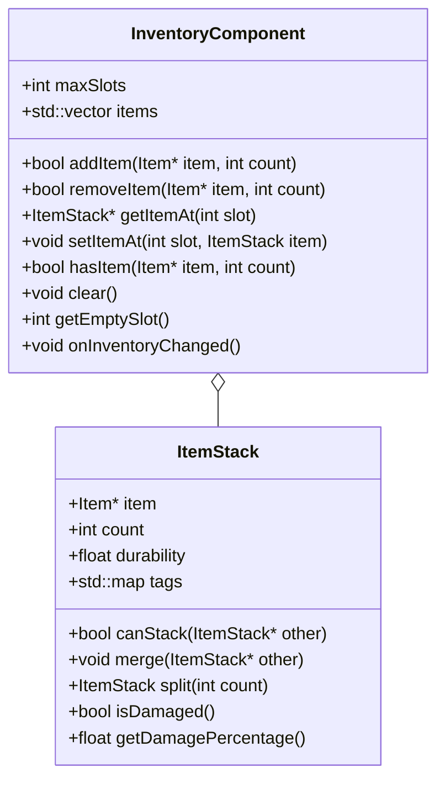
```mermaid
classDiagram
    class InventoryComponent {
        +int maxSlots
        +std::vector<ItemStack> items
        +bool addItem(Item* item, int count)
        +bool removeItem(Item* item, int count)
        +ItemStack* getItemAt(int slot)
        +void setItemAt(int slot, ItemStack item)
        +bool hasItem(Item* item, int count)
        +void clear()
        +int getEmptySlot()
        +void onInventoryChanged()
    }
    
    class ItemStack {
        +Item* item
        +int count
        +float durability
        +std::map<std::string, std::string> tags
        +bool canStack(ItemStack* other)
        +void merge(ItemStack* other)
        +ItemStack split(int count)
        +bool isDamaged()
        +float getDamagePercentage()
    }
    
    InventoryComponent o-- ItemStack
```

Key features:

- **Item Management**: Adding, removing, and querying items
- **Stack Handling**: Combining and splitting stacks of items
- **Item Properties**: Tracking durability and custom properties
- **Serialization**: Saving and loading inventory state
- **Events**: Notifications for inventory changes

## Tetrahedral-Specific Components

QuadCraft introduces special components to handle tetrahedral space:

### Tetrahedral Transform Component

Specializes the transform component for tetrahedral space:

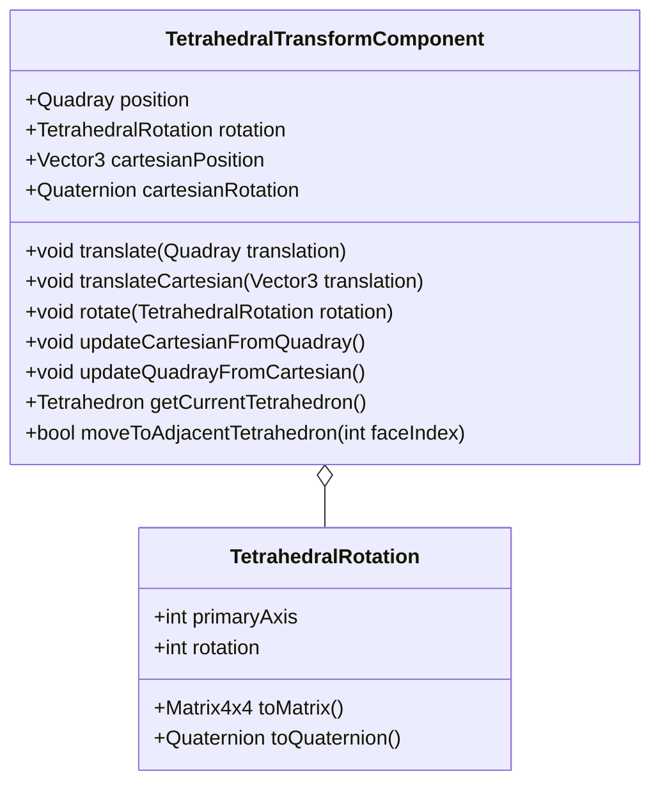
```mermaid
classDiagram
    class TetrahedralTransformComponent {
        +Quadray position
        +TetrahedralRotation rotation
        +Vector3 cartesianPosition
        +Quaternion cartesianRotation
        +void translate(Quadray translation)
        +void translateCartesian(Vector3 translation)
        +void rotate(TetrahedralRotation rotation)
        +void updateCartesianFromQuadray()
        +void updateQuadrayFromCartesian()
        +Tetrahedron getCurrentTetrahedron()
        +bool moveToAdjacentTetrahedron(int faceIndex)
    }
    
    class TetrahedralRotation {
        +int primaryAxis
        +int rotation
        +Matrix4x4 toMatrix()
        +Quaternion toQuaternion()
    }
    
    TetrahedralTransformComponent o-- TetrahedralRotation
```

Key features:

- **Dual Representation**: Maintains both Quadray and Cartesian coordinates
- **Tetrahedral Rotation**: Specialized rotation representation for tetrahedral space
- **Coordinate Conversion**: Automatic conversion between coordinate systems
- **Tetrahedral Tracking**: Awareness of which tetrahedron the entity occupies
- **Adjacent Navigation**: Support for moving between adjacent tetrahedra

### Tetrahedral Physics Component

Extends physics to work properly in tetrahedral space:

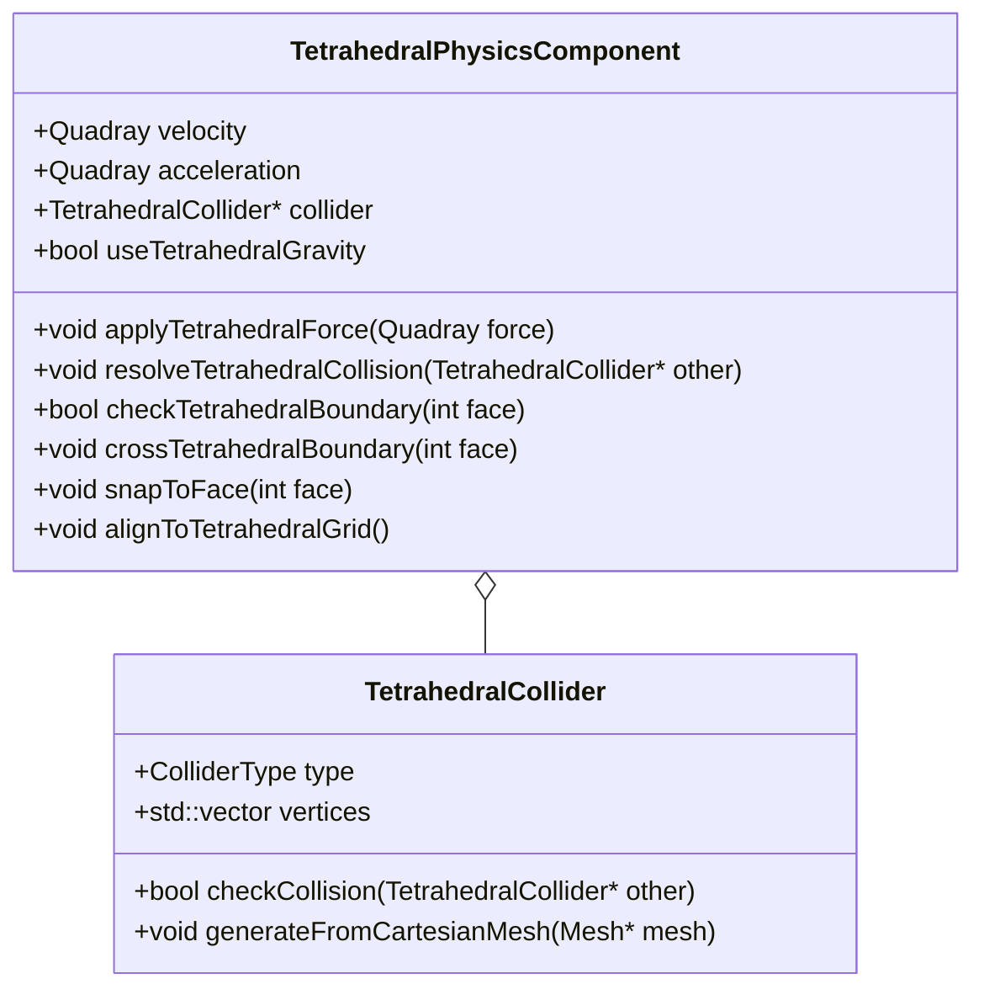
```mermaid
classDiagram
    class TetrahedralPhysicsComponent {
        +Quadray velocity
        +Quadray acceleration
        +TetrahedralCollider* collider
        +bool useTetrahedralGravity
        +void applyTetrahedralForce(Quadray force)
        +void resolveTetrahedralCollision(TetrahedralCollider* other)
        +bool checkTetrahedralBoundary(int face)
        +void crossTetrahedralBoundary(int face)
        +void snapToFace(int face)
        +void alignToTetrahedralGrid()
    }
    
    class TetrahedralCollider {
        +ColliderType type
        +std::vector<Quadray> vertices
        +bool checkCollision(TetrahedralCollider* other)
        +void generateFromCartesianMesh(Mesh* mesh)
    }
    
    TetrahedralPhysicsComponent o-- TetrahedralCollider
```

Key features:

- **Quadray Physics**: Physics calculations using Quadray coordinates
- **Tetrahedral Colliders**: Collision shapes defined in tetrahedral space
- **Boundary Handling**: Special handling for crossing tetrahedron boundaries
- **Grid Alignment**: Alignment to the tetrahedral grid for precise building
- **Specialized Movement**: Movement constraints suitable for tetrahedral space

### TetrahedralPathfinding Component

Enables AI navigation through tetrahedral space:

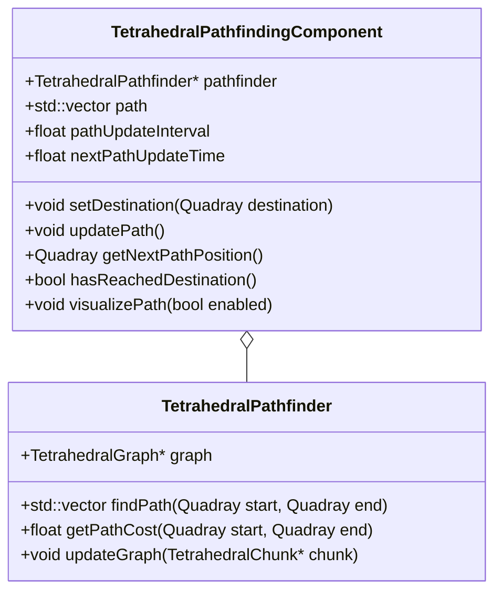
```mermaid
classDiagram
    class TetrahedralPathfindingComponent {
        +TetrahedralPathfinder* pathfinder
        +std::vector<Quadray> path
        +float pathUpdateInterval
        +float nextPathUpdateTime
        +void setDestination(Quadray destination)
        +void updatePath()
        +Quadray getNextPathPosition()
        +bool hasReachedDestination()
        +void visualizePath(bool enabled)
    }
    
    class TetrahedralPathfinder {
        +TetrahedralGraph* graph
        +std::vector<Quadray> findPath(Quadray start, Quadray end)
        +float getPathCost(Quadray start, Quadray end)
        +void updateGraph(TetrahedralChunk* chunk)
    }
    
    TetrahedralPathfindingComponent o-- TetrahedralPathfinder
```

Key features:

- **Tetrahedral Pathfinding**: Finding paths through tetrahedral space
- **Dynamic Graph Updates**: Updating the navigation graph as the world changes
- **Path Optimization**: Smoothing and optimizing paths for natural movement
- **Tetrahedral Constraints**: Respecting the constraints of tetrahedral geometry
- **Visualization**: Debug visualization of paths for development

## Entity Systems

The entity framework is powered by several systems that process entities with specific component sets:

### Physics System

Handles movement, collision detection, and physics simulation:

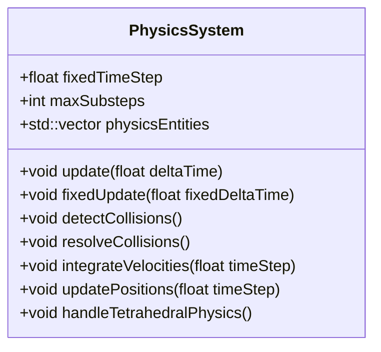
```mermaid
classDiagram
    class PhysicsSystem {
        +float fixedTimeStep
        +int maxSubsteps
        +std::vector<Entity*> physicsEntities
        +void update(float deltaTime)
        +void fixedUpdate(float fixedDeltaTime)
        +void detectCollisions()
        +void resolveCollisions()
        +void integrateVelocities(float timeStep)
        +void updatePositions(float timeStep)
        +void handleTetrahedralPhysics()
    }
```

Key features:

- **Fixed Timestep**: Physics simulation with fixed time steps for stability
- **Collision Detection**: Broad and narrow phase collision detection
- **Constraint Solving**: Resolving physical constraints
- **Continuous Collision**: Continuous collision detection for fast-moving objects
- **Tetrahedral Adaptations**: Special handling for tetrahedral geometry

### Rendering System

Manages the visual representation of entities:

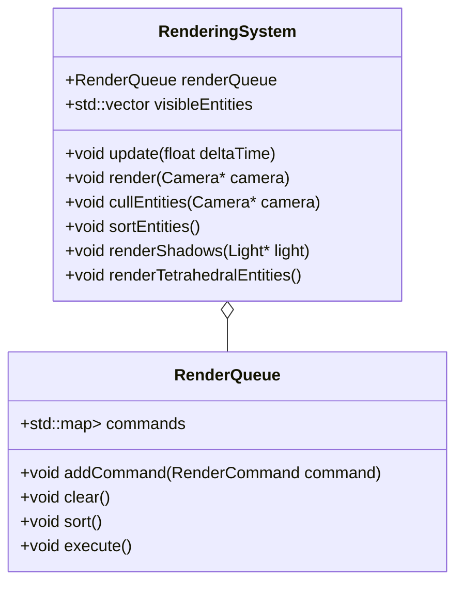
```mermaid
classDiagram
    class RenderingSystem {
        +RenderQueue renderQueue
        +std::vector<Entity*> visibleEntities
        +void update(float deltaTime)
        +void render(Camera* camera)
        +void cullEntities(Camera* camera)
        +void sortEntities()
        +void renderShadows(Light* light)
        +void renderTetrahedralEntities()
    }
    
    class RenderQueue {
        +std::map<RenderLayer, std::vector<RenderCommand>> commands
        +void addCommand(RenderCommand command)
        +void clear()
        +void sort()
        +void execute()
    }
    
    RenderingSystem o-- RenderQueue
```

Key features:

- **Frustum Culling**: Culling entities outside the camera frustum
- **Render Queue**: Sorting and batching render commands for efficiency
- **Shadow Mapping**: Generating shadows for entities
- **Transparency Handling**: Proper rendering of transparent entities
- **Tetrahedral Rendering**: Special rendering techniques for tetrahedral entities

### AI System

Processes AI components, allowing entities to make decisions and act:

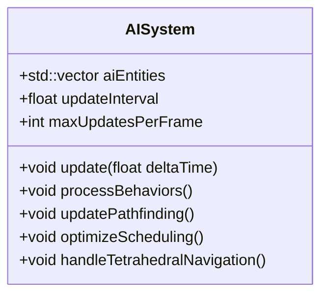
```mermaid
classDiagram
    class AISystem {
        +std::vector<Entity*> aiEntities
        +float updateInterval
        +int maxUpdatesPerFrame
        +void update(float deltaTime)
        +void processBehaviors()
        +void updatePathfinding()
        +void optimizeScheduling()
        +void handleTetrahedralNavigation()
    }
```

Key features:

- **Behavior Processing**: Executing entity behavior trees
- **Pathfinding**: Finding and following paths through the world
- **Group Behavior**: Coordinating behavior between multiple entities
- **Performance Optimization**: Staggering AI updates for performance
- **Tetrahedral Adaptation**: Special handling for tetrahedral navigation

### Interaction System

Manages interactions between entities and with the world:

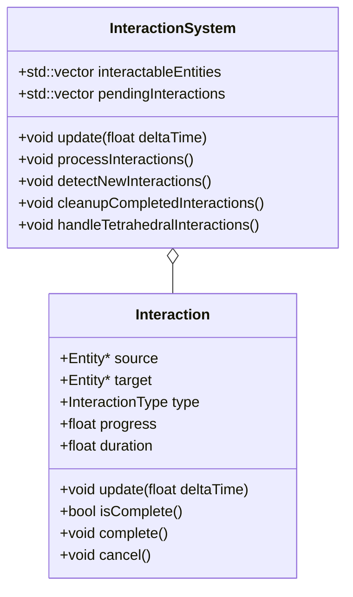
```mermaid
classDiagram
    class InteractionSystem {
        +std::vector<Entity*> interactableEntities
        +std::vector<Interaction*> pendingInteractions
        +void update(float deltaTime)
        +void processInteractions()
        +void detectNewInteractions()
        +void cleanupCompletedInteractions()
        +void handleTetrahedralInteractions()
    }
    
    class Interaction {
        +Entity* source
        +Entity* target
        +InteractionType type
        +float progress
        +float duration
        +void update(float deltaTime)
        +bool isComplete()
        +void complete()
        +void cancel()
    }
    
    InteractionSystem o-- Interaction
```

Key features:

- **Interaction Detection**: Detecting when entities can interact
- **Interaction Processing**: Handling ongoing interactions
- **Event Dispatching**: Notifying entities of interaction events
- **Contextual Actions**: Supporting different interaction types
- **Tetrahedral Context**: Special interactions based on tetrahedral positioning

## Entity Lifecycle

Entities in QuadCraft follow a defined lifecycle, managed by the EntityManager:

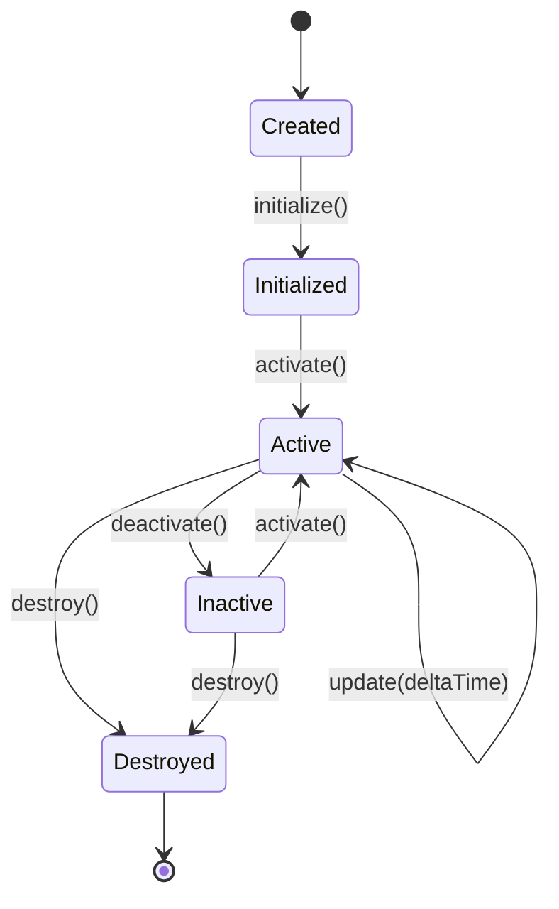
```mermaid
stateDiagram-v2
    [*] --> Created
    Created --> Initialized: initialize()
    Initialized --> Active: activate()
    Active --> Inactive: deactivate()
    Inactive --> Active: activate()
    Active --> Destroyed: destroy()
    Inactive --> Destroyed: destroy()
    Destroyed --> [*]
    
    Active --> Active: update(deltaTime)
```

The entity lifecycle includes:

1. **Creation**: Entity is created and registered with the EntityManager
2. **Initialization**: Components are added and initialized
3. **Activation**: Entity becomes active in the world
4. **Updates**: Entity and its components are updated each frame
5. **Deactivation**: Entity becomes inactive but remains in memory
6. **Destruction**: Entity and its components are destroyed and removed

## Serialization and Persistence

Entities and their components can be serialized for saving and loading:

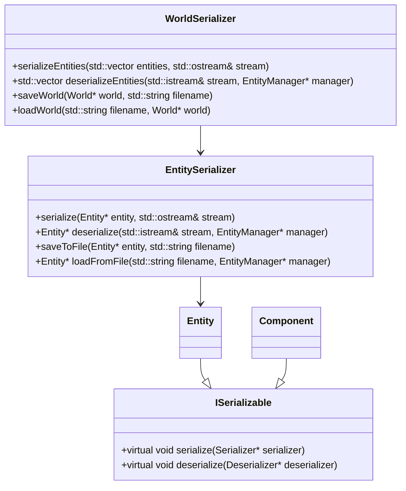
```mermaid
classDiagram
    class ISerializable {
        +virtual void serialize(Serializer* serializer)
        +virtual void deserialize(Deserializer* deserializer)
    }
    
    class EntitySerializer {
        +serialize(Entity* entity, std::ostream& stream)
        +Entity* deserialize(std::istream& stream, EntityManager* manager)
        +saveToFile(Entity* entity, std::string filename)
        +Entity* loadFromFile(std::string filename, EntityManager* manager)
    }
    
    class WorldSerializer {
        +serializeEntities(std::vector<Entity*> entities, std::ostream& stream)
        +std::vector<Entity*> deserializeEntities(std::istream& stream, EntityManager* manager)
        +saveWorld(World* world, std::string filename)
        +loadWorld(std::string filename, World* world)
    }
    
    Entity --|> ISerializable
    Component --|> ISerializable
    EntitySerializer --> Entity
    WorldSerializer --> EntitySerializer
```

The serialization system supports:

- **Entity Serialization**: Converting entities to a storable format
- **Component Serialization**: Saving and loading component state
- **World Saving**: Saving all entities in a world or chunk
- **Efficient Formats**: Binary and JSON serialization options
- **References**: Maintaining references between entities after loading

## Event System

Entities communicate through an event system:

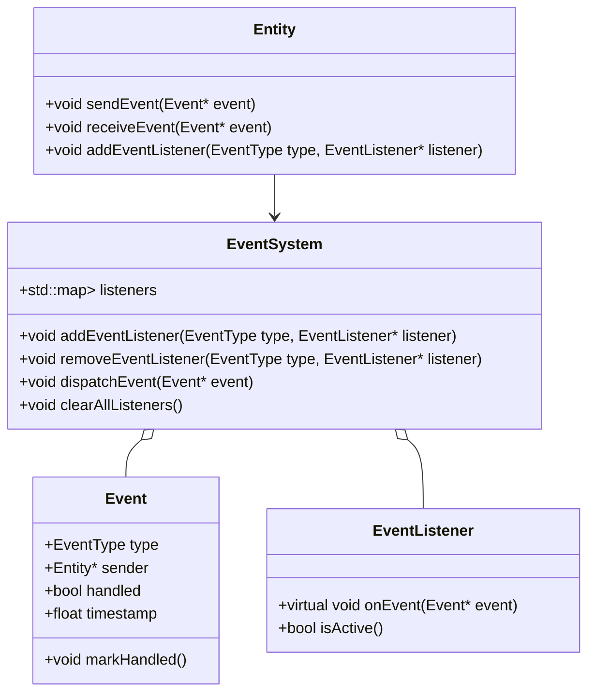
```mermaid
classDiagram
    class EventSystem {
        +std::map<EventType, std::vector<EventListener*>> listeners
        +void addEventListener(EventType type, EventListener* listener)
        +void removeEventListener(EventType type, EventListener* listener)
        +void dispatchEvent(Event* event)
        +void clearAllListeners()
    }
    
    class Event {
        +EventType type
        +Entity* sender
        +bool handled
        +float timestamp
        +void markHandled()
    }
    
    class EventListener {
        +virtual void onEvent(Event* event)
        +bool isActive()
    }
    
    class Entity {
        +void sendEvent(Event* event)
        +void receiveEvent(Event* event)
        +void addEventListener(EventType type, EventListener* listener)
    }
    
    EventSystem o-- Event
    EventSystem o-- EventListener
    Entity --> EventSystem
```

The event system enables:

- **Component Communication**: Components communicating without direct references
- **Entity Interaction**: Entities interacting through standard events
- **System Notifications**: Systems being notified of entity state changes
- **Game Events**: Broadcasting game-level events to interested entities
- **Event Bubbling**: Events propagating through entity hierarchies

## Entity Templates and Prefabs

QuadCraft supports entity templates for easy instantiation:

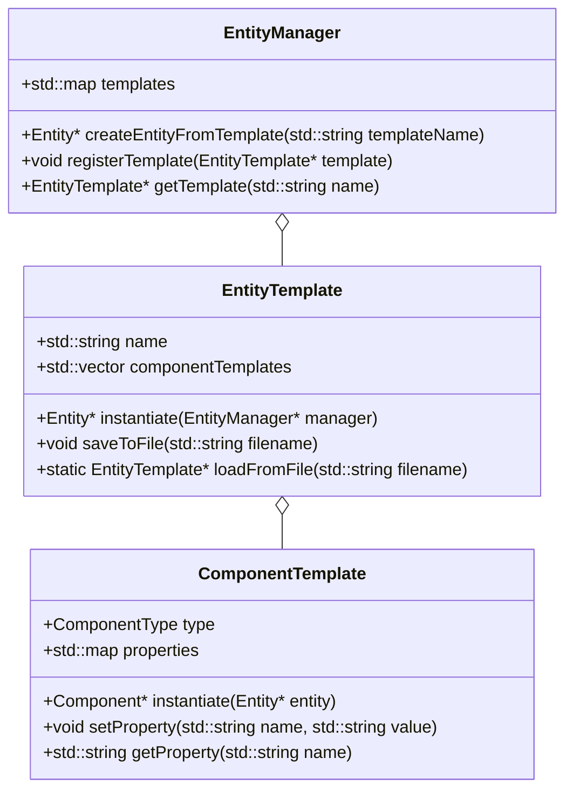
```mermaid
classDiagram
    class EntityTemplate {
        +std::string name
        +std::vector<ComponentTemplate*> componentTemplates
        +Entity* instantiate(EntityManager* manager)
        +void saveToFile(std::string filename)
        +static EntityTemplate* loadFromFile(std::string filename)
    }
    
    class ComponentTemplate {
        +ComponentType type
        +std::map<std::string, std::string> properties
        +Component* instantiate(Entity* entity)
        +void setProperty(std::string name, std::string value)
        +std::string getProperty(std::string name)
    }
    
    class EntityManager {
        +std::map<std::string, EntityTemplate*> templates
        +Entity* createEntityFromTemplate(std::string templateName)
        +void registerTemplate(EntityTemplate* template)
        +EntityTemplate* getTemplate(std::string name)
    }
    
    EntityTemplate o-- ComponentTemplate
    EntityManager o-- EntityTemplate
```

The template system provides:

- **Prefab Definition**: Defining reusable entity configurations
- **Property Overrides**: Overriding specific properties during instantiation
- **Template Library**: Managing a library of entity templates
- **Runtime Modification**: Creating and modifying templates at runtime
- **Serialization**: Saving and loading templates from files

## Tetrahedral Entity Challenges

Implementing entities in tetrahedral space presents unique challenges:

```mermaid
graph TD
    subgraph "Tetrahedral Entity Challenges"
        Movement["Movement Logic"]
        Collision["Collision Detection"]
        Rendering["Rendering"]
        Pathfinding["Pathfinding"]
        Boundaries["Boundary Crossing"]
    end
    
    Movement --> NonOrthogonal["Non-Orthogonal Movement"]
    Movement --> RotationRepresentation["Rotation Representation"]
    
    Collision --> TetrahedralShapes["Tetrahedral Shape Collision"]
    Collision --> EfficiencyAlgorithms["Efficient Algorithms"]
    
    Rendering --> SpecializedMeshes["Specialized Meshes"]
    Rendering --> AnimationSystem["Animation in Tetrahedral Space"]
    
    Pathfinding --> NavigationGraph["Navigation Graph"]
    Pathfinding --> MovementHeuristics["Movement Heuristics"]
    
    Boundaries --> SeamlessCrossing["Seamless Crossing"]
    Boundaries --> ChunkTransitions["Chunk Transitions"]
```

The system addresses these challenges through:

- **Dual Coordinate Representation**: Using both Cartesian and Quadray coordinates
- **Specialized Collision**: Tetrahedral collision detection algorithms
- **Adaptive Rendering**: Rendering techniques adapted for tetrahedral entities
- **Tetrahedral Pathfinding**: Pathfinding algorithms for tetrahedral space
- **Boundary Handling**: Smooth handling of tetrahedron boundary crossing

## Performance Optimizations

The entity system includes several optimizations for performance:

```mermaid
graph TD
    subgraph "Performance Optimizations"
        SpatialPartitioning["Spatial Partitioning"]
        EntityPooling["Entity Pooling"]
        ComponentOptimization["Component Optimization"]
        UpdateScheduling["Update Scheduling"]
        LODSystem["LOD System"]
    end
    
    SpatialPartitioning --> TetrahedralGrid["Tetrahedral Grid"]
    SpatialPartitioning --> BroadPhase["Broad Phase Collision"]
    
    EntityPooling --> Reuse["Entity Reuse"]
    EntityPooling --> MemoryManagement["Memory Management"]
    
    ComponentOptimization --> MemoryLayout["Memory Layout"]
    ComponentOptimization --> CacheCoherence["Cache Coherence"]
    
    UpdateScheduling --> PrioritySystem["Priority System"]
    UpdateScheduling --> Throttling["Update Throttling"]
    
    LODSystem --> DistanceBased["Distance-Based LOD"]
    LODSystem --> ImportanceBased["Importance-Based LOD"]
```

Key optimization techniques:

- **Spatial Partitioning**: Dividing space for efficient entity queries
- **Object Pooling**: Reusing entity instances to reduce allocation overhead
- **Data-Oriented Design**: Optimizing memory layout for better cache usage
- **Update Scheduling**: Staggering entity updates for better performance
- **Level of Detail**: Simplifying distant entities to improve performance

## Entity Scripting API

QuadCraft provides a scripting API for custom entity behavior:

```mermaid
classDiagram
    class ScriptComponent {
        +std::string scriptPath
        +ScriptInstance* scriptInstance
        +void initialize()
        +void update(float deltaTime)
        +void onEvent(Event* event)
        +void reload()
    }
    
    class ScriptInstance {
        +Entity* entity
        +ScriptRuntime* runtime
        +void initialize()
        +void update(float deltaTime)
        +void callFunction(std::string name)
        +void setParameter(std::string name, ScriptValue value)
        +ScriptValue getParameter(std::string name)
    }
    
    class ScriptRuntime {
        +std::map<std::string, ScriptFunction> functions
        +std::map<std::string, ScriptValue> globals
        +void executeFunction(std::string name)
        +void registerFunction(std::string name, ScriptFunction function)
        +void registerType(std::string name, ScriptType type)
    }
    
    ScriptComponent o-- ScriptInstance
    ScriptInstance --> ScriptRuntime
```

The scripting system allows for:

- **Custom Behaviors**: Defining entity behaviors in scripts
- **Event Handling**: Responding to game events in scripts
- **Component Access**: Accessing and modifying components from scripts
- **Hot Reloading**: Reloading scripts without restarting the game
- **Debug Interface**: Debugging script execution

## Entity Examples

Examples of typical entity definitions in QuadCraft:

### Player Entity

```cpp
// Creating a player entity
Entity* player = entityManager.createEntity("Player");

// Adding core components
player->addComponent(new TransformComponent());
player->addComponent(new TetrahedralTransformComponent());
player->addComponent(new PhysicsComponent());
player->addComponent(new RenderingComponent());
player->addComponent(new HealthComponent());
player->addComponent(new InventoryComponent());
player->addComponent(new PlayerInputComponent());
player->addComponent(new CameraComponent());

// Configure components
auto transform = player->getComponent<TransformComponent>();
transform->position = Vector3(0, 10, 0);

auto physics = player->getComponent<PhysicsComponent>();
physics->mass = 70.0f;
physics->useGravity = true;

auto health = player->getComponent<HealthComponent>();
health->maxHealth = 100.0f;
health->currentHealth = 100.0f;

auto inventory = player->getComponent<InventoryComponent>();
inventory->maxSlots = 36;

// Activate the entity
player->activate();
```

### Mob Entity

```cpp
// Creating a mob from a template
Entity* zombie = entityManager.createEntityFromTemplate("Zombie");

// Customize the instance
auto transform = zombie->getComponent<TransformComponent>();
transform->position = Vector3(10, 0, 10);

auto ai = zombie->getComponent<AIComponent>();
ai->detectionRange = 15.0f;

// Add a custom script component
auto script = new ScriptComponent();
script->scriptPath = "scripts/custom_zombie_behavior.lua";
zombie->addComponent(script);

// Activate the entity
zombie->activate();
```

### Item Entity

```cpp
// Create a dropped item entity
Entity* droppedItem = entityManager.createEntity("DroppedItem");

// Add required components
droppedItem->addComponent(new TransformComponent());
droppedItem->addComponent(new PhysicsComponent());
droppedItem->addComponent(new RenderingComponent());
droppedItem->addComponent(new ItemComponent());

// Configure the item
auto transform = droppedItem->getComponent<TransformComponent>();
transform->position = Vector3(5, 1, 5);
transform->scale = Vector3(0.5f, 0.5f, 0.5f);

auto physics = droppedItem->getComponent<PhysicsComponent>();
physics->mass = 1.0f;
physics->useGravity = true;

auto item = droppedItem->getComponent<ItemComponent>();
item->itemType = ItemType::RESOURCE;
item->itemId = "wood_block";
item->count = 1;

// Apply a small random impulse
Vector3 randomDirection = Vector3(
    (rand() % 200 - 100) / 100.0f,
    0.5f,
    (rand() % 200 - 100) / 100.0f
).normalized();
physics->applyImpulse(randomDirection * 2.0f);

// Activate the entity
droppedItem->activate();
```

## Conclusion

The QuadCraft entity system provides a flexible, component-based architecture for managing all dynamic objects in the game world. By adapting to the unique challenges of tetrahedral space, the entity system enables complex, interactive behaviors while maintaining performance and extensibility. The combination of a robust core architecture with tetrahedral-specific extensions allows for the creation of uniquely immersive gameplay experiences that showcase the mathematical elegance of the tetrahedral world.
