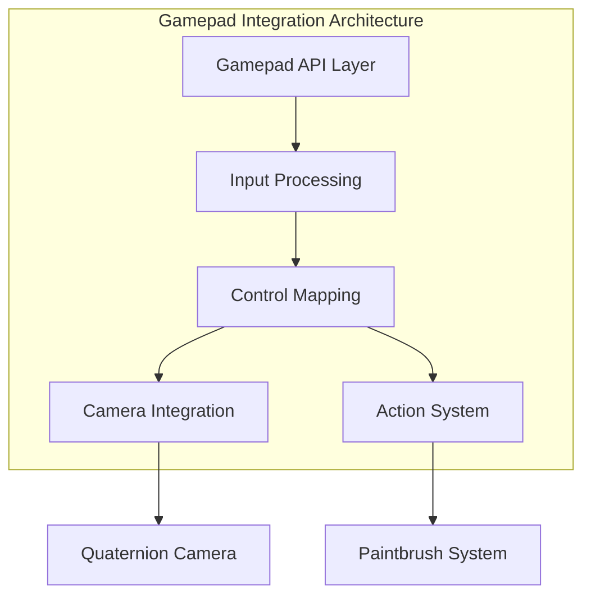

# Gamepad Integration Guide

This document provides comprehensive details about the gamepad/controller integration in QuadCraft's JavaScript implementation, covering API usage, event handling, input processing, and advanced features for modern game controllers.

## Overview

The QuadCraft JavaScript implementation includes sophisticated gamepad support that goes beyond basic button mapping. It features advanced analog controls, haptic feedback, adaptive dead zones, and seamless integration with the quaternion camera system.



## Gamepad API Integration

### Browser Gamepad API

The implementation uses the modern Gamepad API (`navigator.getGamepads()`) to access connected controllers:

```javascript
// Get all connected gamepads
function getConnectedGamepads() {
    const gamepads = navigator.getGamepads();
    return Array.from(gamepads).filter(gp => gp !== null);
}

// Check for gamepad support
function isGamepadSupported() {
    return 'getGamepads' in navigator;
}

// Handle gamepad connection events
window.addEventListener('gamepadconnected', (e) => {
    console.log('Gamepad connected:', e.gamepad);
    onGamepadConnected(e.gamepad);
});

window.addEventListener('gamepaddisconnected', (e) => {
    console.log('Gamepad disconnected:', e.gamepad);
    onGamepadDisconnected(e.gamepad);
});
```

### Gamepad State Management

```javascript
class GamepadState {
    constructor(gamepad) {
        this.gamepad = gamepad;
        this.previousButtons = [];
        this.previousAxes = [];
        this.deadZone = 0.06;
        this.updatePreviousState();
    }

    updatePreviousState() {
        this.previousButtons = this.gamepad.buttons.map(b => b.value);
        this.previousAxes = [...this.gamepad.axes];
    }

    // Get button state with dead zone handling
    getButton(index) {
        const button = this.gamepad.buttons[index];
        return button ? button.value : 0;
    }

    // Get axis value with dead zone applied
    getAxis(index) {
        const value = this.gamepad.axes[index] || 0;
        const absValue = Math.abs(value);
        if (absValue < this.deadZone) {
            return 0;
        }
        // Scale the value to remove dead zone
        const sign = Math.sign(value);
        const scaled = (absValue - this.deadZone) / (1 - this.deadZone);
        return sign * scaled;
    }

    // Check if button was just pressed
    isButtonPressed(index) {
        const current = this.getButton(index);
        const previous = this.previousButtons[index] || 0;
        return current > 0.5 && previous <= 0.5;
    }

    // Check if button was just released
    isButtonReleased(index) {
        const current = this.getButton(index);
        const previous = this.previousButtons[index] || 0;
        return current <= 0.5 && previous > 0.5;
    }
}
```

## Input Processing Pipeline

### Main Gamepad Update Loop

```javascript
function updateFromGamepad(dt) {
    const gamepads = getConnectedGamepads();
    if (gamepads.length === 0) return;

    // Use the first connected gamepad
    const gamepad = gamepads[0];
    const state = new GamepadState(gamepad);

    // Process analog sticks with dead zone
    const leftX = state.getAxis(0);  // Left stick X
    const leftY = state.getAxis(1);  // Left stick Y
    const rightX = state.getAxis(2); // Right stick X
    const rightY = state.getAxis(3); // Right stick Y

    // Process triggers
    const leftTrigger = state.getButton(6);   // Left trigger
    const rightTrigger = state.getButton(7);  // Right trigger

    // Process movement
    processMovement(leftX, leftY, leftTrigger, rightTrigger, dt);

    // Process camera rotation
    processCameraRotation(rightX, rightY, dt);

    // Process actions
    processActions(state, dt);

    // Update state for next frame
    state.updatePreviousState();
}
```

### Movement Processing

```javascript
function processMovement(leftX, leftY, leftTrigger, rightTrigger, dt) {
    // Calculate movement direction
    const moveX = leftX;
    const moveY = 0; // Reserved for future use
    const moveZ = -leftY; // Invert Y axis for natural movement

    // Calculate forward/backward from triggers
    const forward = rightTrigger - leftTrigger;

    // Apply movement with speed and delta time
    const moveSpeed = getMovementSpeed();
    moveCamera(forward * moveSpeed * dt,
               moveX * moveSpeed * dt,
               moveZ * moveSpeed * dt);
}
```

### Camera Rotation Processing

```javascript
function processCameraRotation(rightX, rightY, dt) {
    // Apply rotation with sensitivity and delta time
    const sensitivity = getCameraSensitivity();
    const deltaYaw = rightX * sensitivity * dt;
    const deltaPitch = rightY * sensitivity * dt;

    // Apply to quaternion camera
    rotateCamera(deltaYaw, deltaPitch);
}
```

### Action Processing

```javascript
function processActions(state, dt) {
    // Face buttons
    if (state.isButtonPressed(0)) handleActionA();
    if (state.isButtonPressed(1)) handleActionB();
    if (state.isButtonPressed(2)) handleActionX();
    if (state.isButtonPressed(3)) handleActionY();

    // Shoulder buttons
    if (state.isButtonPressed(4)) handleLeftBumper();
    if (state.isButtonPressed(5)) handleRightBumper();

    // Menu buttons
    if (state.isButtonPressed(8)) handleSelect();
    if (state.isButtonPressed(9)) handleStart();

    // D-pad (mapped as buttons 12-15)
    const dpadUp = state.getButton(12);
    const dpadDown = state.getButton(13);
    const dpadLeft = state.getButton(14);
    const dpadRight = state.getButton(15);

    if (dpadUp > 0.5) handleDPadUp();
    if (dpadDown > 0.5) handleDPadDown();
    if (dpadLeft > 0.5) handleDPadLeft();
    if (dpadRight > 0.5) handleDPadRight();
}
```

## Advanced Control Mapping

### Customizable Button Mapping

```javascript
class ControlMapper {
    constructor() {
        this.mapping = this.getDefaultMapping();
        this.userMapping = this.loadUserMapping();
    }

    getDefaultMapping() {
        return {
            // Movement
            'moveForward': { type: 'axis', index: 1, invert: true },
            'moveRight': { type: 'axis', index: 0 },
            'moveUp': { type: 'button', index: 7 },     // Right trigger
            'moveDown': { type: 'button', index: 6 },   // Left trigger

            // Camera
            'cameraYaw': { type: 'axis', index: 2 },
            'cameraPitch': { type: 'axis', index: 3, invert: true },

            // Actions
            'primaryAction': { type: 'button', index: 5 },   // Right bumper
            'secondaryAction': { type: 'button', index: 4 }, // Left bumper
            'jump': { type: 'button', index: 0 },            // A button
            'crouch': { type: 'button', index: 1 },          // B button
            'interact': { type: 'button', index: 2 },        // X button
            'inventory': { type: 'button', index: 3 },       // Y button

            // Menu
            'pause': { type: 'button', index: 9 },           // Start
            'select': { type: 'button', index: 8 },          // Select
        };
    }

    getInputValue(gamepad, controlName) {
        const mapping = this.mapping[controlName];
        if (!mapping) return 0;

        const state = new GamepadState(gamepad);

        if (mapping.type === 'axis') {
            let value = state.getAxis(mapping.index);
            if (mapping.invert) value = -value;
            return value;
        } else if (mapping.type === 'button') {
            return state.getButton(mapping.index);
        }

        return 0;
    }

    saveUserMapping() {
        localStorage.setItem('quadcraft_gamepad_mapping', JSON.stringify(this.userMapping));
    }

    loadUserMapping() {
        const saved = localStorage.getItem('quadcraft_gamepad_mapping');
        return saved ? JSON.parse(saved) : {};
    }
}
```

### Context-Sensitive Controls

```javascript
class ContextualControls {
    constructor() {
        this.currentContext = 'default';
        this.contextMappings = this.getContextMappings();
    }

    getContextMappings() {
        return {
            'default': {
                'primaryAction': 'placeBlock',
                'secondaryAction': 'removeBlock'
            },
            'flying': {
                'primaryAction': 'boost',
                'secondaryAction': 'brake'
            },
            'inventory': {
                'primaryAction': 'selectItem',
                'secondaryAction': 'dropItem'
            },
            'menu': {
                'primaryAction': 'confirm',
                'secondaryAction': 'cancel'
            }
        };
    }

    setContext(context) {
        this.currentContext = context;
        this.updateControlHints();
    }

    getActionForControl(controlName) {
        const contextMapping = this.contextMappings[this.currentContext];
        return contextMapping ? contextMapping[controlName] : controlName;
    }

    updateControlHints() {
        // Update UI to show current control mappings
        const hints = document.getElementById('controlHints');
        if (hints) {
            hints.innerHTML = this.generateControlHints();
        }
    }

    generateControlHints() {
        const context = this.contextMappings[this.currentContext];
        let html = '<div class="control-hints">';

        for (const [control, action] of Object.entries(context)) {
            html += `<div class="hint"><span class="control">${control}</span>: <span class="action">${action}</span></div>`;
        }

        html += '</div>';
        return html;
    }
}
```

## Haptic Feedback Integration

### Vibration API Usage

```javascript
class HapticFeedback {
    constructor() {
        this.supported = 'vibrate' in navigator;
        this.intensity = 0.5;
    }

    // Simple vibration
    vibrate(duration = 100, intensity = this.intensity) {
        if (!this.supported) return;

        if ('vibrate' in navigator) {
            navigator.vibrate(duration * intensity);
        }
    }

    // Pattern vibration
    vibratePattern(pattern, intensity = this.intensity) {
        if (!this.supported) return;

        const scaledPattern = pattern.map(duration => duration * intensity);

        if ('vibrate' in navigator) {
            navigator.vibrate(scaledPattern);
        }
    }

    // Contextual feedback
    feedbackForAction(actionType) {
        const patterns = {
            'blockPlaced': [50],
            'blockRemoved': [30, 20, 30],
            'itemCollected': [20, 20, 20],
            'damageReceived': [100, 50, 100, 50, 100],
            'levelUp': [50, 50, 50, 50, 50],
            'error': [200],
            'success': [50, 50]
        };

        const pattern = patterns[actionType];
        if (pattern) {
            this.vibratePattern(pattern);
        }
    }
}

// Integration with game actions
function handleBlockPlacement() {
    // Place the block
    placeBlockAtTarget();

    // Provide haptic feedback
    hapticFeedback.feedbackForAction('blockPlaced');
}

function handleDamageReceived(damage) {
    // Apply damage
    applyDamage(damage);

    // Provide haptic feedback based on damage severity
    const pattern = damage > 50 ? 'damageReceived' : [100];
    hapticFeedback.feedbackForAction(pattern);
}
```

### Advanced Haptic Effects

```javascript
class AdvancedHaptics {
    constructor() {
        this.gamepadHapticsSupported = false;
        this.checkGamepadHapticsSupport();
    }

    checkGamepadHapticsSupport() {
        const gamepads = getConnectedGamepads();
        for (const gamepad of gamepads) {
            if (gamepad.hapticActuators && gamepad.hapticActuators.length > 0) {
                this.gamepadHapticsSupported = true;
                break;
            }
        }
    }

    // Gamepad-specific haptic effects
    async triggerGamepadHaptic(gamepadIndex, effect) {
        if (!this.gamepadHapticsSupported) return;

        const gamepads = navigator.getGamepads();
        const gamepad = gamepads[gamepadIndex];
        if (!gamepad || !gamepad.hapticActuators) return;

        const actuator = gamepad.hapticActuators[0];

        switch (effect.type) {
            case 'dual-rumble':
                await actuator.playEffect('dual-rumble', {
                    startDelay: effect.startDelay || 0,
                    duration: effect.duration || 100,
                    weakMagnitude: effect.weakMagnitude || 0,
                    strongMagnitude: effect.strongMagnitude || 0
                });
                break;

            case 'trigger-rumble':
                // For controllers with trigger haptics
                if (gamepad.hapticActuators.length > 1) {
                    const triggerActuator = gamepad.hapticActuators[1];
                    await triggerActuator.playEffect('dual-rumble', {
                        startDelay: 0,
                        duration: effect.duration || 100,
                        weakMagnitude: effect.magnitude || 0,
                        strongMagnitude: effect.magnitude || 0
                    });
                }
                break;
        }
    }

    // Complex haptic sequences
    async playHapticSequence(sequence) {
        for (const effect of sequence) {
            if (effect.gamepad !== undefined) {
                await this.triggerGamepadHaptic(effect.gamepad, effect);
            } else {
                // Fallback to phone vibration
                hapticFeedback.vibratePattern(effect.pattern || [effect.duration]);
            }

            // Wait for effect to complete
            await new Promise(resolve => setTimeout(resolve, effect.duration + (effect.startDelay || 0)));
        }
    }
}
```

## Adaptive Dead Zones and Sensitivity

### Dynamic Dead Zone Adjustment

```javascript
class AdaptiveDeadZone {
    constructor() {
        this.baseDeadZone = 0.06;
        this.currentDeadZone = this.baseDeadZone;
        this.recentInputs = [];
        this.maxHistory = 10;
        this.driftCompensation = 0.01;
    }

    update(deadZone) {
        // Add to history
        this.recentInputs.push(deadZone);
        if (this.recentInputs.length > this.maxHistory) {
            this.recentInputs.shift();
        }

        // Calculate adaptive dead zone
        const average = this.recentInputs.reduce((a, b) => a + b, 0) / this.recentInputs.length;
        const variance = this.recentInputs.reduce((a, b) => a + Math.pow(b - average, 2), 0) / this.recentInputs.length;

        // Adjust based on variance (more variance = smaller dead zone)
        const adjustment = -Math.sqrt(variance) * 0.02;
        this.currentDeadZone = Math.max(0.01, Math.min(0.15, this.baseDeadZone + adjustment));

        // Compensate for controller drift
        this.currentDeadZone = Math.max(this.currentDeadZone, this.driftCompensation);

        return this.currentDeadZone;
    }

    getCurrentDeadZone() {
        return this.currentDeadZone;
    }

    reset() {
        this.currentDeadZone = this.baseDeadZone;
        this.recentInputs = [];
    }
}
```

### Controller-Specific Calibration

```javascript
class ControllerCalibrator {
    constructor() {
        this.calibrationData = this.loadCalibrationData();
        this.currentProfile = null;
    }

    calibrateController(gamepad) {
        console.log('Starting calibration for:', gamepad.id);

        // Step 1: Center detection
        this.calibrateCenter(gamepad);

        // Step 2: Range detection
        this.calibrateRanges(gamepad);

        // Step 3: Dead zone detection
        this.calibrateDeadZones(gamepad);

        // Step 4: Button response testing
        this.calibrateButtons(gamepad);

        // Step 5: Save calibration
        this.saveCalibration(gamepad.id);
    }

    calibrateCenter(gamepad) {
        // Have user leave controller untouched
        console.log('Leave controller centered...');
        setTimeout(() => {
            const centerAxes = [...gamepad.axes];
            this.calibrationData.center = centerAxes;
            console.log('Center calibrated:', centerAxes);
        }, 2000);
    }

    calibrateRanges(gamepad) {
        console.log('Move all axes to extremes...');
        let maxValues = gamepad.axes.map(() => 0);
        let minValues = gamepad.axes.map(() => 0);

        const checkRange = () => {
            gamepad.axes.forEach((axis, index) => {
                maxValues[index] = Math.max(maxValues[index], axis);
                minValues[index] = Math.min(minValues[index], axis);
            });
        };

        // Monitor for 5 seconds
        const interval = setInterval(checkRange, 100);
        setTimeout(() => {
            clearInterval(interval);
            this.calibrationData.ranges = { maxValues, minValues };
            console.log('Ranges calibrated:', this.calibrationData.ranges);
        }, 5000);
    }

    calibrateDeadZones(gamepad) {
        console.log('Wiggle axes slightly to detect dead zones...');
        // Similar process to range calibration but for smaller movements
    }

    getCalibrationProfile(gamepadId) {
        return this.calibrationData[gamepadId] || this.getDefaultProfile();
    }

    getDefaultProfile() {
        return {
            center: [0, 0, 0, 0],
            ranges: { maxValues: [1, 1, 1, 1], minValues: [-1, -1, -1, -1] },
            deadZones: [0.06, 0.06, 0.06, 0.06],
            buttonThresholds: gamepad.buttons.map(() => 0.5)
        };
    }

    saveCalibration(gamepadId) {
        this.calibrationData[gamepadId] = this.currentCalibration;
        localStorage.setItem('quadcraft_controller_calibration', JSON.stringify(this.calibrationData));
    }

    loadCalibrationData() {
        const saved = localStorage.getItem('quadcraft_controller_calibration');
        return saved ? JSON.parse(saved) : {};
    }
}
```

## Integration with QuadCraft Systems

### Quaternion Camera Integration

```javascript
// Enhanced camera rotation with gamepad
function processGamepadCameraRotation(gamepad, dt) {
    const state = new GamepadState(gamepad);

    // Get right stick input
    const yawInput = state.getAxis(2);    // Right stick X
    const pitchInput = state.getAxis(3);  // Right stick Y

    // Apply sensitivity and smoothing
    const sensitivity = getCameraSensitivity();
    const smoothing = 0.8;

    // Apply exponential smoothing for stability
    this.smoothedYaw = this.smoothedYaw * smoothing + yawInput * (1 - smoothing);
    this.smoothedPitch = this.smoothedPitch * smoothing + pitchInput * (1 - smoothing);

    // Apply rotation to quaternion camera
    const yawDelta = this.smoothedYaw * sensitivity * dt;
    const pitchDelta = this.smoothedPitch * sensitivity * dt;

    rotateCamera(yawDelta, pitchDelta);
}
```

### Paintbrush System Integration

```javascript
// Gamepad control for paintbrush system
function handleGamepadPaintbrushControl(state, dt) {
    // Left/Right bumpers for paint/unpaint
    if (state.getButton(4) > 0.5) { // Left bumper
        paint(targetQ(), selectedPaintbrush(), false); // Unpaint
    }
    if (state.getButton(5) > 0.5) { // Right bumper
        paint(targetQ(), selectedPaintbrush(), true);  // Paint
    }

    // D-pad for paintbrush selection
    if (state.isButtonPressed(12)) { // D-pad up
        selectNextPaintbrush();
    }
    if (state.isButtonPressed(13)) { // D-pad down
        selectPreviousPaintbrush();
    }

    // Left trigger for fine control
    const fineControl = state.getButton(6);
    if (fineControl > 0.5) {
        enableFineControlMode();
    } else {
        disableFineControlMode();
    }
}
```

## Multi-Device Input Support

### Simultaneous Device Usage

```javascript
class MultiDeviceInputManager {
    constructor() {
        this.activeDevices = new Map();
        this.primaryDevice = null;
        this.conflictResolver = new ConflictResolver();
    }

    registerDevice(deviceType, device) {
        this.activeDevices.set(deviceType, device);

        if (!this.primaryDevice) {
            this.primaryDevice = deviceType;
        }

        this.updateDevicePriorities();
    }

    unregisterDevice(deviceType) {
        this.activeDevices.delete(deviceType);

        if (this.primaryDevice === deviceType) {
            this.selectNewPrimaryDevice();
        }
    }

    getCombinedInput() {
        const combined = {
            movement: { x: 0, y: 0, z: 0 },
            camera: { yaw: 0, pitch: 0 },
            actions: new Set()
        };

        // Combine inputs from all devices
        for (const [deviceType, device] of this.activeDevices) {
            const input = device.getInput();

            // Apply device priority weighting
            const weight = this.getDeviceWeight(deviceType);

            combined.movement.x += input.movement.x * weight;
            combined.movement.y += input.movement.y * weight;
            combined.movement.z += input.movement.z * weight;

            combined.camera.yaw += input.camera.yaw * weight;
            combined.camera.pitch += input.camera.pitch * weight;

            // Combine actions (logical OR)
            input.actions.forEach(action => combined.actions.add(action));
        }

        // Resolve conflicts
        this.conflictResolver.resolveConflicts(combined);

        return combined;
    }

    getDeviceWeight(deviceType) {
        const weights = {
            'gamepad': 1.0,
            'keyboard': 0.8,
            'mouse': 0.6,
            'touch': 0.4
        };
        return weights[deviceType] || 0.5;
    }

    updateDevicePriorities() {
        // Gamepad takes priority if available
        if (this.activeDevices.has('gamepad')) {
            this.primaryDevice = 'gamepad';
        }
    }

    selectNewPrimaryDevice() {
        const priorityOrder = ['gamepad', 'keyboard', 'mouse', 'touch'];
        for (const deviceType of priorityOrder) {
            if (this.activeDevices.has(deviceType)) {
                this.primaryDevice = deviceType;
                break;
            }
        }
    }
}
```

### Conflict Resolution

```javascript
class ConflictResolver {
    constructor() {
        this.conflictRules = this.getDefaultRules();
    }

    getDefaultRules() {
        return {
            // Movement conflicts
            'movement': 'additive',  // Combine all movement inputs

            // Camera conflicts
            'camera': 'prioritize_primary',  // Use primary device for camera

            // Action conflicts
            'jump': 'logical_or',    // Any device can trigger jump
            'crouch': 'logical_or',  // Any device can trigger crouch
            'primary_action': 'prioritize_gamepad', // Gamepad has priority
            'secondary_action': 'prioritize_mouse'  // Mouse has priority
        };
    }

    resolveConflicts(combinedInput) {
        // Apply conflict resolution rules
        for (const [inputType, rule] of Object.entries(this.conflictRules)) {
            switch (rule) {
                case 'additive':
                    // Already handled in combination phase
                    break;
                case 'prioritize_primary':
                    // Scale down non-primary contributions
                    this.prioritizePrimary(combinedInput, inputType);
                    break;
                case 'logical_or':
                    // Already handled as Set
                    break;
                case 'prioritize_gamepad':
                    this.prioritizeDevice(combinedInput, inputType, 'gamepad');
                    break;
                case 'prioritize_mouse':
                    this.prioritizeDevice(combinedInput, inputType, 'mouse');
                    break;
            }
        }
    }

    prioritizePrimary(combinedInput, inputType) {
        // Implementation depends on MultiDeviceInputManager
    }

    prioritizeDevice(combinedInput, inputType, deviceType) {
        // Implementation depends on device management
    }
}
```

## Performance Optimization

### Input Processing Optimization

```javascript
class OptimizedInputProcessor {
    constructor() {
        this.frameCount = 0;
        this.inputCache = new Map();
        this.processingBudget = 2; // ms per frame
    }

    processGamepadInput(gamepad) {
        const startTime = performance.now();

        // Check cache first
        const cacheKey = this.generateCacheKey(gamepad);
        if (this.inputCache.has(cacheKey) && this.frameCount < 10) {
            this.frameCount++;
            return this.inputCache.get(cacheKey);
        }

        // Process input
        const state = new GamepadState(gamepad);
        const processedInput = this.processInputState(state);

        // Cache result
        this.inputCache.set(cacheKey, processedInput);
        this.frameCount = 0;

        // Clear old cache entries periodically
        if (this.inputCache.size > 100) {
            this.pruneCache();
        }

        const endTime = performance.now();
        const processingTime = endTime - startTime;

        // If processing took too long, simplify for next frame
        if (processingTime > this.processingBudget) {
            this.simplifyProcessing = true;
        }

        return processedInput;
    }

    generateCacheKey(gamepad) {
        // Create a cache key from button and axis states
        const buttons = gamepad.buttons.map(b => Math.round(b.value * 10)).join(',');
        const axes = gamepad.axes.map(a => Math.round(a * 100)).join(',');
        return `${buttons}|${axes}`;
    }

    pruneCache() {
        // Remove oldest cache entries
        const entries = Array.from(this.inputCache.entries());
        entries.sort((a, b) => a[1].timestamp - b[1].timestamp);
        const toRemove = entries.slice(0, Math.floor(entries.length / 2));
        toRemove.forEach(([key]) => this.inputCache.delete(key));
    }
}
```

## Debugging and Development Tools

### Gamepad Debug Visualization

```javascript
function createGamepadDebugOverlay() {
    const overlay = document.createElement('div');
    overlay.id = 'gamepad-debug';
    overlay.style.cssText = `
        position: fixed;
        top: 10px;
        right: 10px;
        background: rgba(0, 0, 0, 0.8);
        color: white;
        padding: 10px;
        font-family: monospace;
        font-size: 12px;
        z-index: 9999;
        max-width: 300px;
    `;

    document.body.appendChild(overlay);
    return overlay;
}

function updateGamepadDebugOverlay(overlay, gamepad) {
    if (!gamepad) {
        overlay.innerHTML = 'No gamepad connected';
        return;
    }

    let html = `<div>Gamepad: ${gamepad.id}</div>`;

    // Show axes
    html += '<div>Axes:</div>';
    gamepad.axes.forEach((axis, index) => {
        const value = Math.round(axis * 100) / 100;
        const barWidth = Math.abs(value) * 50;
        const barColor = value > 0 ? '#4CAF50' : '#f44336';
        html += `
            <div style="display: flex; align-items: center; margin: 2px 0;">
                <span style="width: 20px;">${index}:</span>
                <div style="width: 50px; height: 10px; background: #333; margin: 0 5px;">
                    <div style="width: ${barWidth}px; height: 10px; background: ${barColor};"></div>
                </div>
                <span>${value}</span>
            </div>
        `;
    });

    // Show buttons
    html += '<div>Buttons:</div>';
    gamepad.buttons.forEach((button, index) => {
        const value = Math.round(button.value * 100);
        const isPressed = button.pressed;
        const bgColor = isPressed ? '#4CAF50' : '#333';
        html += `
            <div style="display: inline-block; width: 30px; height: 20px; background: ${bgColor};
                        border: 1px solid #666; margin: 2px; text-align: center; line-height: 20px;">
                ${index}
            </div>
        `;
    });

    overlay.innerHTML = html;
}
```

### Input Recording and Playback

```javascript
class InputRecorder {
    constructor() {
        this.isRecording = false;
        this.isPlaying = false;
        this.recordedInputs = [];
        this.playbackIndex = 0;
    }

    startRecording() {
        this.isRecording = true;
        this.recordedInputs = [];
        console.log('Started input recording');
    }

    stopRecording() {
        this.isRecording = false;
        console.log(`Stopped recording. Captured ${this.recordedInputs.length} frames.`);
    }

    recordFrame(gamepadState) {
        if (!this.isRecording) return;

        const frame = {
            timestamp: performance.now(),
            buttons: gamepadState.gamepad.buttons.map(b => ({
                pressed: b.pressed,
                value: b.value
            })),
            axes: [...gamepadState.gamepad.axes]
        };

        this.recordedInputs.push(frame);
    }

    startPlayback() {
        if (this.recordedInputs.length === 0) {
            console.log('No recorded input to play back');
            return;
        }

        this.isPlaying = true;
        this.playbackIndex = 0;
        this.playbackStartTime = performance.now();
        console.log('Started input playback');
    }

    stopPlayback() {
        this.isPlaying = false;
        console.log('Stopped input playback');
    }

    getPlaybackInput() {
        if (!this.isPlaying || this.recordedInputs.length === 0) return null;

        const currentTime = performance.now() - this.playbackStartTime;
        let targetIndex = 0;

        // Find the appropriate frame for current time
        for (let i = 0; i < this.recordedInputs.length; i++) {
            if (this.recordedInputs[i].timestamp >= currentTime) {
                targetIndex = i;
                break;
            }
        }

        return this.recordedInputs[targetIndex];
    }

    exportRecording() {
        const data = {
            format: 'QuadCraft Gamepad Recording v1.0',
            timestamp: new Date().toISOString(),
            frames: this.recordedInputs
        };

        return JSON.stringify(data, null, 2);
    }

    importRecording(jsonData) {
        try {
            const data = JSON.parse(jsonData);
            if (data.format !== 'QuadCraft Gamepad Recording v1.0') {
                throw new Error('Invalid recording format');
            }
            this.recordedInputs = data.frames;
            console.log(`Imported recording with ${this.recordedInputs.length} frames`);
        } catch (error) {
            console.error('Failed to import recording:', error);
        }
    }
}
```

## Future Enhancements

### Planned Features

1. **Motion Controls**: Integration with device orientation sensors
2. **Voice Controls**: Speech recognition for commands
3. **Gesture Recognition**: Camera-based gesture input
4. **AR/VR Integration**: WebXR gamepad support
5. **Cloud Gaming**: Remote gamepad streaming
6. **Advanced Haptics**: Custom haptic effect authoring
7. **Input Analytics**: Player input pattern analysis
8. **Accessibility**: Enhanced accessibility features

### Research Directions

1. **Predictive Input**: Anticipating player actions based on input patterns
2. **Adaptive Controls**: Controls that adapt to player skill level and play style
3. **Cross-Platform Input**: Unified input handling across different platforms
4. **Neural Input**: Brain-computer interface integration
5. **Haptic Feedback Design**: Advanced haptic feedback pattern design

## Conclusion

The gamepad integration in QuadCraft represents a comprehensive approach to modern controller support, going beyond simple button mapping to provide sophisticated input processing, haptic feedback, adaptive controls, and seamless multi-device support. The system is designed to handle the complexities of modern gaming while maintaining accessibility and providing rich feedback to players.
