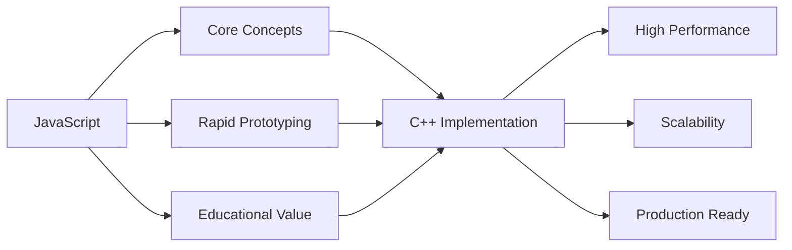

# QuadCraft JavaScript Implementation Guide

This document details the JavaScript implementation of QuadCraft, focusing on the `QuadrayGrid4.html` file and related browser-based implementations. This guide covers the practical aspects of implementing QuadCraft's tetrahedral voxel system in JavaScript, including the coordinate system, rendering techniques, and gameplay mechanics.

## Overview

The JavaScript implementation (`QuadrayGrid4.html`) serves as a complete, standalone demonstration of QuadCraft's core systems running entirely in the browser. Unlike the C++ implementation described elsewhere in this documentation, the JavaScript version prioritizes accessibility and immediate experimentation over performance optimization.

```mermaid
graph TD
    subgraph "JavaScript Implementation"
        CoreSystems["Core Systems"]
        Rendering["Rendering Engine"]
        InputHandling["Input Handling"]
        GameLogic["Game Logic"]
        Storage["Data Storage"]
    end

    CoreSystems --> QuadraySystem["Quadray Coordinate System"]
    CoreSystems --> CCPGrid["CCP Ball Grid System"]
    CoreSystems --> TetrahedralShapes["Tetrahedral Shape Generation"]

    Rendering --> Canvas2D["HTML5 Canvas Rendering"]
    Rendering --> ConePlaneIntersection["Cone-Plane Intersection"]
    Rendering --> RealTimeDrawing["Real-time Drawing Loop"]

    InputHandling --> MouseControls["Mouse Controls"]
    InputHandling --> KeyboardControls["Keyboard Controls"]
    InputHandling --> GamepadSupport["Gamepad Support"]

    GameLogic --> ShapePlacement["Shape Placement Logic"]
    GameLogic --> GridNavigation["Grid Navigation"]
    GameLogic --> CameraControls["Camera Controls"]

    Storage --> LocalStorage["Browser Local Storage"]
    Storage --> JSONSerialization["JSON Serialization"]
```



## Core Architecture

### File Structure

The JavaScript implementation is contained in `QuadrayGrid4.html`, which includes:

- **HTML Structure**: Canvas element, UI controls, and layout
- **CSS Styling**: Basic styling for the interface and canvas
- **JavaScript Implementation**: Complete game logic, rendering, and interaction systems

### Global Variables and State Management

The implementation uses several global variables to manage state:

```javascript
// Coordinate system constants
const ROOT2 = Math.SQRT2;
const SCALE = 2/ROOT2;
const S3 = Math.sqrt(9 / 8);

// Game state
var selq;                    // Selected quadray position
var Buttons = {};            // Keyboard button states
var grid = {oct: new Set(), tetZ: new Set(), tetC: new Set()}; // Game world
var QGridDots = {};          // Grid visualization dots
var QDots = {};              // User-placed dots
var QBalls = {};             // Ball objects
var ccp = new CCPBallGrid(); // CCP optimization system
```

## Quadray Coordinate System Implementation

### Core Classes

#### Quadray Class

The `Quadray` class implements the four-dimensional coordinate system:

```javascript
class Quadray {
    constructor(a = 0, b = 0, c = 0, d = 0){
        this.a = a;
        this.b = b;
        this.c = c;
        this.d = d;
        this.color = randColor();
    }

    toCartesian() {
        const [X, Y, Z] = this.toRawCartesian();
        return [X/ROOT2, Y/ROOT2, Z/ROOT2];
    }

    toRawCartesian(){
        return [this.rawX(), this.rawY(), this.rawZ()];
    }

    rawX(){ return this.a - this.b - this.c + this.d; }
    rawY(){ return this.a - this.b + this.c - this.d; }
    rawZ(){ return this.a + this.b - this.c - this.d; }
}
```

#### Key Methods

- **Normalization**: `normalized()` ensures at least one coordinate is zero
- **Arithmetic Operations**: `add()`, `mul()` with automatic normalization
- **Coordinate Conversion**: `toCartesian()`, `fromCartesian()`
- **Distance Calculation**: `distance()`, `dist3d()`

### Coordinate System Constants

```javascript
const ROOT2 = Math.SQRT2;                    // √2 ≈ 1.414
const SCALE = 2/ROOT2;                      // ≈ 1.414
const S3 = Math.sqrt(9 / 8);               // ≈ 1.061
```

## Rendering System

### Canvas-Based Rendering

The implementation uses HTML5 Canvas 2D API for all rendering:

```javascript
const canvas = document.getElementById("canvas");
const ctx = canvas.getContext("2d");
canvas.width = window.innerWidth;
canvas.height = window.innerHeight;
```

### Camera Systems

#### Quaternion Camera

The JavaScript implementation includes an advanced quaternion-based camera system:

```javascript
// Camera state
let camPos = [0,0,-5];     // Camera position
let camQ = [0,0,0,1];      // Camera quaternion

// Camera control functions
function moveCamera(forwardBackward, upDown, leftRight)
function rotateCamera(rx, ry)
function calculateForwardVector(q)
function calculateUpVector(q)
```

#### Traditional Camera (Legacy)

For backwards compatibility, a traditional camera system is also available:

```javascript
// Legacy camera variables
let offsetX = canvas.width / 2;
let offsetY = canvas.height / 2;
let zoom = 1.0;
let angleX = 0, angleY = 0;
let cubeSize = 700;
```

### Cone-Plane Intersection Rendering

A sophisticated rendering technique for drawing balls with proper perspective:

```javascript
var conePlaneIntersection = (xyz, radius)=>{
  // Transform sphere center to camera space
  const dx = xyz[0]-camPos[0], dy = xyz[1]-camPos[1], dz = xyz[2]-camPos[2];
  let f = calculateForwardVector(camQ);
  let u = calculateUpVector(camQ);
  let r = cross(f, u); r = normalize(r);
  u = normalize(cross(r, f));

  // Camera-space coordinates
  const cx = dx*r[0] + dy*r[1] + dz*r[2];
  const cy = dx*u[0] + dy*u[1] + dz*u[2];
  const cz = dx*f[0] + dy*f[1] + dz*f[2];

  // Early exit conditions
  if (cz <= 0 || cz < drawDistanceMin || drawDistanceMax < cz) return null;

  // Generate ellipse parameters for screen rendering
  // ... (complex mathematical calculations)
  return [centerX, centerY, aX, aY, bX, bY];
};
```

## Game Systems

### Tetrahedral Shape Generation

#### Octahedron Generation

```javascript
var oct6CornersAtQuadray = q=>{
    let A = CoreDirections[0].Neg();
    let B = CoreDirections[1];
    return [
        q,                                    // 0 bottom apex
        q.add(A).add(B),                      // 1 opposite apex
        q.add(CoreDirections[1]),            // 2
        q.add(A),                             // 3
        q.add(A).add(CoreDirections[3]),      // 4
        q.add(CoreDirections[3].Neg()).add(CoreDirections[1]) // 5
    ];
};
```

#### Tetrahedron Generation

```javascript
var TriZ4CornersAtQuadray = ray=>([
    ray,                                    // main corner
    ray.add(Directions.e),                  // tetrahedron Z corners
    ray.add(Directions.q),                  // secondary corner
    ray.add(Directions.q).add(Directions.f)
]);

var tetTrisAtFourCorners = corners=>([
    T(corners[1], corners[2], corners[3]),  // Four triangles forming tetrahedron
    T(corners[0], corners[2], corners[3]),
    T(corners[0], corners[1], corners[3]),
    T(corners[0], corners[1], corners[2])
]);
```

### CCP Ball Grid Optimization

The implementation includes a sophisticated optimization for managing large numbers of balls:

```javascript
class CCPBallGrid {
  constructor(){
    this.QA = Directions.a;    // Primary axis
    this.QS = Directions.s;    // Secondary axis
    this.QD = Directions.d;    // Tertiary axis
    this.cols = new Map();     // Column storage
  }

  // Convert quadray to CCP coordinates (i,j,k)
  toASD(q){
    const {a,b,c,d} = q;
    const k = ((b - d) - (a - c)) / 2;
    const i = ((b - c) - k) / 2;
    const j = ((a - d) - k) / 2;
    return [i|0, j|0, k|0];
  }

  // Add ball to grid
  addQuadray(q){
    const [i,j,k] = this.toASD(q);
    // Implementation handles merging adjacent ranges
  }

  // Surface iteration for rendering
  *surfaceQuadrays(){
    // Yields only surface balls (those with empty neighbors)
  }
}
```

## Input Handling

### Gamepad Support

The implementation includes comprehensive gamepad support:

```javascript
function updateFromGamepad(dt){
    let gps = navigator.getGamepads();
    if(!gps) return;
    let gp = gps[0];
    if(!gp) return;

    // Analog stick input
    let lx = gp.axes[0], ly = gp.axes[1];
    let rx = gp.axes[2], ry = gp.axes[3];

    // Dead zone processing
    let lLen = Math.hypot(lx,ly);
    if(lLen > dead){
        let leftover = lLen - dead;
        lx *= leftover/lLen;
        ly *= leftover/lLen;
    }

    // Camera rotation
    ry *= -1;
    rx *= turnSpd;
    ry *= turnSpd;
    rotateCamera(rx*dt, ry*dt);

    // Movement
    let fwdVal = gp.buttons[7]?.value - gp.buttons[6]?.value;
    let upDown = -ly;
    let leftRight = lx;
    moveCamera(fwdVal*moveSpd*dt, upDown*moveSpd*dt, leftRight*moveSpd*dt);

    // Action buttons
    let buttonLb = gp.buttons[4].value;
    let buttonRb = gp.buttons[5].value;
    if(buttonLb ^ buttonRb){
        paint(targetQ(), selectedPaintbrush(), buttonRb);
    }
}
```

### Mouse and Keyboard Integration

```javascript
// Mouse event handling
canvas.addEventListener("mousedown", function(e){
    if (e.button === 2) rotateDrag = true;
    else if (e.button === 0) drag = true;
    lastX = e.clientX;
    lastY = e.clientY;
});

canvas.addEventListener("mousemove", function(e){
    // Handle dragging and rotation
    let mouseMovedXPixels = e.clientX - lastX;
    let mouseMovedYPixels = e.clientY - lastY;

    if(isQuatCam()){
        if(drag && rotateDrag){
            moveCamera(-3*mouseMovedYPixels*mul, 0, 0);
        }else if(drag){
            moveCamera(0, -mouseMovedYPixels*mul, mouseMovedXPixels*mul);
        }else if (rotateDrag){
            rotateCamera(mouseMovedXPixels*.005, mouseMovedYPixels*.005);
        }
    }
});
```

## Game Loop and Performance

### Main Game Loop

```javascript
function draw(){
    let dt = 1/60; // Fixed time step

    // Update systems
    updateFromGamepad(dt);
    updateFromHoldingKeyboardButtons(dt);
    getCameraXYZ();

    // Clear and prepare canvas
    ctx.clearRect(0, 0, canvas.width, canvas.height);

    // Update game state
    updateIfGridChanged();

    // Render all drawable objects
    for(const d of drawables){
        d.draw();
    }

    // Render paint cursor
    let targ = targetQ();
    // ... render cursor

    requestAnimationFrame(draw);
}
requestAnimationFrame(draw);
```

### Performance Optimizations

- **Object Pooling**: Reuse objects to reduce garbage collection
- **Spatial Partitioning**: CCP grid reduces rendering complexity
- **Culling**: Only render visible objects
- **Batching**: Group similar rendering operations
- **Fixed Time Step**: Consistent update timing

## Data Storage and Persistence

### Local Storage System

```javascript
var quicksave = function(name){
    let json = StateJson();
    localStorage.setItem('quadcraft.quicksave.'+name, json);
};

var quickload = function(name){
    let json = localStorage.getItem('quadcraft.quicksave.'+name);
    if(json){
        LoadJson(json);
    }
};
```

### JSON Serialization

```javascript
var StateJson = ()=>JSON.stringify(StateMap());

var StateMap = ()=>({
    type: 'quadcraft_quadraygrid2_state',
    selq: [selq.a, selq.b, selq.c, selq.d],
    camera: {offsetX, offsetY, zoom, angleX, angleY},
    camPos: [...camPos],
    camQ: [...camQ],
    textBoxToEval: dom('textBoxToEval').value,
    grid: gridToMap(grid),
});
```

## UI Components

### Paintbrush System

```javascript
var paintbrushes = {
    oneBall: {
        balls: [Q(0,0,0,0)]
    },
    distance1: {
        balls: [
            Q(0,0,0,0), Directions.a, Directions.q,
            Directions.s, Directions.w,
            Directions.d, Directions.e,
            Directions.f, Directions.r,
            Directions.g, Directions.t,
            Directions.h, Directions.y
        ]
    }
};
```

### Interactive Controls

```javascript
// Dynamic paintbrush selection
<select id="paintbrushSelect" onchange="selPaintbrushName=this.value">
  <!-- Options filled by JavaScript -->
</select>

// Code evaluation textarea
<textarea id=textBoxToEval rows=10 cols=40>
// JavaScript code for custom paintbrushes
</textarea>
```

## Advanced Features

### Real-time Code Evaluation

```javascript
// Allow users to execute JavaScript code
function evalCode(){
    let jsCode = dom('textBoxToEval').value;
    console.log('Evaluating: '+jsCode);
    let ret = eval(jsCode);
    console.log('Returned: '+ret);
}
```

### Debug Visualization

```javascript
// Wireframe mode toggle
var wireframeMode = false;
function toggleWireframe(){
    wireframeMode = !wireframeMode;
    // Adjust rendering pipeline
}

// Grid overlay
var displayQgridDots = true;
function toggleGrid(){
    displayQgridDots = !displayQgridDots;
}
```

## Integration with Broader QuadCraft System

The JavaScript implementation serves as:

1. **Reference Implementation**: Demonstrates core concepts accessibly
2. **Development Tool**: Allows rapid prototyping and testing
3. **Educational Platform**: Teaches tetrahedral geometry concepts
4. **Feature Demonstration**: Showcases advanced features like CCP optimization

### Relationship to C++ Implementation



## Best Practices for JavaScript Implementation

### Code Organization

- **Modular Functions**: Break complex operations into smaller functions
- **Global State Management**: Use clear naming conventions for global variables
- **Event Handling**: Consistent event handling patterns
- **Error Handling**: Graceful degradation when features aren't available

### Performance Considerations

- **Memory Management**: Avoid memory leaks in long-running sessions
- **Canvas Optimization**: Minimize canvas operations
- **Math Optimization**: Cache frequently used calculations
- **Event Optimization**: Debounce rapid events

### Browser Compatibility

- **Feature Detection**: Check for required APIs before using them
- **Fallbacks**: Provide alternatives when advanced features aren't available
- **Progressive Enhancement**: Core functionality works without advanced features

## Future Development

### Planned Enhancements

- **WebGL Rendering**: Replace Canvas 2D with WebGL for better performance
- **Worker Threads**: Move heavy calculations to background threads
- **Network Support**: Multiplayer functionality via WebRTC
- **Mobile Optimization**: Touch controls and mobile-specific optimizations
- **Modding API**: JavaScript-based modding system

### Integration with Web Technologies

- **WebAssembly**: Integration with C++ code via WebAssembly
- **Service Workers**: Background processing and caching
- **Progressive Web App**: Installable web application
- **WebGPU**: Next-generation graphics API when available

This JavaScript implementation represents a crucial bridge between the mathematical concepts of QuadCraft and practical, interactive demonstrations. It allows users to immediately experience and experiment with tetrahedral geometry, coordinate systems, and voxel manipulation in a way that's accessible and educational.
