# JavaScript Performance Optimization Guide

This document provides comprehensive guidance for optimizing QuadCraft's JavaScript implementation for maximum performance in web browsers, covering rendering optimization, memory management, computational efficiency, and browser-specific techniques.

## Overview

The QuadCraft JavaScript implementation (`QuadrayGrid4.html`) presents unique performance challenges due to its complex mathematical operations, real-time rendering, and large-scale data management. This guide covers optimization strategies specifically tailored for browser-based execution.

```mermaid
graph TD
    subgraph "Performance Optimization Layers"
        RenderingOptimization["Rendering Optimization"]
        MemoryManagement["Memory Management"]
        ComputationalEfficiency["Computational Efficiency"]
        BrowserSpecific["Browser-Specific Optimizations"]
        SystemIntegration["System Integration"]
    end

    RenderingOptimization --> FrameRate["60 FPS Target"]
    RenderingOptimization --> ConePlane["Cone-Plane Rendering"]
    RenderingOptimization --> CCPGrid["CCP Ball Grid"]

    MemoryManagement --> GarbageCollection["GC Management"]
    MemoryManagement --> ObjectPooling["Object Pooling"]
    MemoryManagement --> DataStructures["Efficient Data Structures"]

    ComputationalEfficiency --> AlgorithmOptimization["Algorithm Optimization"]
    ComputationalEfficiency --> SIMD["SIMD Acceleration"]
    ComputationalEfficiency --> WebAssembly["WebAssembly Integration"]

    BrowserSpecific --> ChromeOptimization["Chrome Optimizations"]
    BrowserSpecific --> FirefoxOptimization["Firefox Optimizations"]
    BrowserSpecific --> SafariOptimization["Safari Optimizations"]

    SystemIntegration --> GameLoop["Optimized Game Loop"]
    SystemIntegration --> InputProcessing["Input Processing"]
    SystemIntegration --> NetworkOptimization["Network Optimization"]
```



## Rendering Performance Optimization

### Frame Rate Management

```javascript
class FrameRateManager {
    constructor(targetFPS = 60) {
        this.targetFPS = targetFPS;
        this.targetFrameTime = 1000 / targetFPS;
        this.frameCount = 0;
        this.lastFrameTime = 0;
        this.fpsHistory = [];
        this.adaptiveQuality = true;
    }

    beginFrame() {
        this.frameStartTime = performance.now();
        return this.frameStartTime;
    }

    endFrame() {
        const frameEndTime = performance.now();
        const frameTime = frameEndTime - this.frameStartTime;
        this.frameCount++;

        // Update FPS history
        this.fpsHistory.push(1000 / frameTime);
        if (this.fpsHistory.length > 60) {
            this.fpsHistory.shift();
        }

        // Calculate average FPS
        const avgFPS = this.fpsHistory.reduce((a, b) => a + b, 0) / this.fpsHistory.length;

        // Adaptive quality adjustment
        if (this.adaptiveQuality) {
            this.adjustQuality(frameTime, avgFPS);
        }

        return { frameTime, avgFPS };
    }

    adjustQuality(frameTime, avgFPS) {
        if (frameTime > this.targetFrameTime * 1.5) {
            // Frame took too long, reduce quality
            reduceRenderQuality();
        } else if (frameTime < this.targetFrameTime * 0.8 && avgFPS > this.targetFPS) {
            // Running too fast, increase quality
            increaseRenderQuality();
        }
    }
}
```

### Cone-Plane Rendering Optimization

```javascript
// Optimized cone-plane intersection with caching
class OptimizedConePlaneRenderer {
    constructor() {
        this.cache = new Map();
        this.maxCacheSize = 1000;
        this.cacheHits = 0;
        this.cacheMisses = 0;
    }

    renderSphere(xyz, radius, camera) {
        const cacheKey = this.generateCacheKey(xyz, radius, camera);

        if (this.cache.has(cacheKey)) {
            this.cacheHits++;
            return this.cache.get(cacheKey);
        }

        this.cacheMisses++;

        // Perform cone-plane intersection calculation
        const result = this.calculateConePlaneIntersection(xyz, radius, camera);

        // Cache result
        if (this.cache.size < this.maxCacheSize) {
            this.cache.set(cacheKey, result);
        } else {
            // Remove oldest entry (simple FIFO eviction)
            const firstKey = this.cache.keys().next().value;
            this.cache.delete(firstKey);
            this.cache.set(cacheKey, result);
        }

        return result;
    }

    generateCacheKey(xyz, radius, camera) {
        // Create cache key with reasonable precision
        const posKey = xyz.map(v => Math.round(v * 100) / 100).join(',');
        const camKey = [
            Math.round(camera.position[0] * 10) / 10,
            Math.round(camera.position[1] * 10) / 10,
            Math.round(camera.position[2] * 10) / 10,
            Math.round(camera.quaternion[0] * 100) / 100,
            Math.round(camera.quaternion[1] * 100) / 100,
            Math.round(camera.quaternion[2] * 100) / 100,
            Math.round(camera.quaternion[3] * 100) / 100
        ].join(',');
        return `${posKey}_${radius}_${camKey}`;
    }

    calculateConePlaneIntersection(xyz, radius, camera) {
        // Core mathematical calculation
        // This would contain the optimized version of the cone-plane intersection
        return conePlaneIntersection(xyz, radius);
    }

    getCacheStats() {
        return {
            size: this.cache.size,
            hits: this.cacheHits,
            misses: this.cacheMisses,
            hitRate: this.cacheHits / (this.cacheHits + this.cacheMisses)
        };
    }
}
```

## Memory Management

### Garbage Collection Optimization

```javascript
class GCMonitor {
    constructor() {
        this.gcEvents = [];
        this.lastGCTime = 0;
        this.gcPressure = 0;
    }

    monitorGC() {
        // Use Performance API to monitor GC events
        if ('memory' in performance) {
            const memInfo = performance.memory;
            const currentTime = performance.now();

            // Detect potential GC events
            if (memInfo.usedJSHeapSize < this.lastUsedHeap) {
                // Heap size decreased, likely GC event
                this.gcEvents.push({
                    time: currentTime,
                    duration: currentTime - this.lastGCTime,
                    heapBefore: this.lastUsedHeap,
                    heapAfter: memInfo.usedJSHeapSize
                });
                this.lastGCTime = currentTime;
            }

            this.lastUsedHeap = memInfo.usedJSHeapSize;
            this.calculateGCPressure();
        }
    }

    calculateGCPressure() {
        const recentGCs = this.gcEvents.filter(event =>
            event.time > performance.now() - 1000); // Last second

        this.gcPressure = recentGCs.length;

        if (this.gcPressure > 10) {
            // High GC pressure, trigger memory optimization
            triggerMemoryOptimization();
        }
    }

    getGCStats() {
        return {
            totalGCEvents: this.gcEvents.length,
            recentGCPressure: this.gcPressure,
            averageGCDuration: this.gcEvents.length > 0 ?
                this.gcEvents.reduce((sum, event) => sum + event.duration, 0) / this.gcEvents.length : 0
        };
    }
}
```

### Object Pooling System

```javascript
class ObjectPool {
    constructor(createObject, resetObject, initialSize = 100) {
        this.createObject = createObject;
        this.resetObject = resetObject;
        this.pool = [];
        this.inUse = new Set();

        // Pre-allocate objects
        for (let i = 0; i < initialSize; i++) {
            this.pool.push(this.createObject());
        }
    }

    acquire() {
        let obj;

        if (this.pool.length > 0) {
            obj = this.pool.pop();
        } else {
            obj = this.createObject();
        }

        this.inUse.add(obj);
        return obj;
    }

    release(obj) {
        if (this.inUse.has(obj)) {
            this.resetObject(obj);
            this.inUse.delete(obj);
            this.pool.push(obj);
        }
    }

    getStats() {
        return {
            available: this.pool.length,
            inUse: this.inUse.size,
            total: this.pool.length + this.inUse.size
        };
    }
}

// Quadray object pooling
const quadrayPool = new ObjectPool(
    () => new Quadray(0, 0, 0, 0),
    (q) => { q.a = q.b = q.c = q.d = 0; },
    1000
);

// Vector pooling
const vectorPool = new ObjectPool(
    () => [0, 0, 0],
    (v) => { v[0] = v[1] = v[2] = 0; },
    500
);
```

## Computational Efficiency

### SIMD Acceleration

```javascript
class SIMDMath {
    constructor() {
        this.hasSIMD = typeof SIMD !== 'undefined';
        this.fallbackMode = !this.hasSIMD;
    }

    // SIMD-accelerated vector operations
    addVectors(a, b) {
        if (this.hasSIMD) {
            const va = SIMD.Float32x4.load(a, 0);
            const vb = SIMD.Float32x4.load(b, 0);
            const result = SIMD.Float32x4.add(va, vb);
            const output = [0, 0, 0, 0];
            SIMD.Float32x4.store(output, 0, result);
            return output.slice(0, 3);
        } else {
            return [
                a[0] + b[0],
                a[1] + b[1],
                a[2] + b[2]
            ];
        }
    }

    dotProduct(a, b) {
        if (this.hasSIMD) {
            const va = SIMD.Float32x4.load(a, 0);
            const vb = SIMD.Float32x4.load(b, 0);
            const mul = SIMD.Float32x4.mul(va, vb);
            return SIMD.Float32x4.extractLane(mul, 0) +
                   SIMD.Float32x4.extractLane(mul, 1) +
                   SIMD.Float32x4.extractLane(mul, 2);
        } else {
            return a[0] * b[0] + a[1] * b[1] + a[2] * b[2];
        }
    }

    normalizeVector(v) {
        const length = Math.sqrt(this.dotProduct(v, v));
        if (length === 0) return [0, 0, 0];

        if (this.hasSIMD) {
            const va = SIMD.Float32x4.load(v, 0);
            const lenVec = SIMD.Float32x4.splat(length);
            const normalized = SIMD.Float32x4.div(va, lenVec);
            const output = [0, 0, 0, 0];
            SIMD.Float32x4.store(output, 0, normalized);
            return output.slice(0, 3);
        } else {
            return [
                v[0] / length,
                v[1] / length,
                v[2] / length
            ];
        }
    }
}
```

### WebAssembly Integration

```javascript
// WebAssembly module for heavy computations
class WasmMath {
    constructor() {
        this.module = null;
        this.memory = null;
        this.exports = null;
        this.initialized = false;
    }

    async initialize() {
        try {
            const response = await fetch('quadcraft_math.wasm');
            const buffer = await response.arrayBuffer();
            const result = await WebAssembly.instantiate(buffer, {
                env: {
                    memory: new WebAssembly.Memory({ initial: 256, maximum: 1024 })
                }
            });

            this.module = result.instance;
            this.exports = this.module.exports;
            this.memory = this.exports.memory;
            this.initialized = true;
        } catch (error) {
            console.warn('WebAssembly initialization failed:', error);
            this.initialized = false;
        }
    }

    // WebAssembly-accelerated matrix multiplication
    multiplyMatrices(a, b, result) {
        if (!this.initialized) {
            return this.fallbackMultiply(a, b, result);
        }

        // Copy matrices to WASM memory
        const aPtr = this.allocateFloat32Array(a);
        const bPtr = this.allocateFloat32Array(b);
        const resultPtr = this.allocateFloat32Array(result);

        // Call WASM function
        this.exports.multiplyMatrices(aPtr, bPtr, resultPtr, 4);

        // Copy result back
        this.copyFromWasmMemory(resultPtr, result, 16);
    }

    allocateFloat32Array(data) {
        const bytes = data.length * 4;
        const ptr = this.exports.allocate(bytes);
        const view = new Float32Array(this.memory.buffer, ptr, data.length);
        view.set(data);
        return ptr;
    }

    copyFromWasmMemory(ptr, target, length) {
        const view = new Float32Array(this.memory.buffer, ptr, length);
        for (let i = 0; i < length; i++) {
            target[i] = view[i];
        }
    }

    fallbackMultiply(a, b, result) {
        // Standard JavaScript matrix multiplication
        for (let i = 0; i < 4; i++) {
            for (let j = 0; j < 4; j++) {
                result[i * 4 + j] = 0;
                for (let k = 0; k < 4; k++) {
                    result[i * 4 + j] += a[i * 4 + k] * b[k * 4 + j];
                }
            }
        }
    }
}
```

## Browser-Specific Optimizations

### Chrome Optimizations

```javascript
class ChromeOptimizer {
    constructor() {
        this.isChrome = navigator.userAgent.includes('Chrome');
        this.chromeVersion = this.getChromeVersion();
    }

    getChromeVersion() {
        const match = navigator.userAgent.match(/Chrome\/(\d+)/);
        return match ? parseInt(match[1]) : 0;
    }

    applyOptimizations() {
        if (!this.isChrome) return;

        // Chrome-specific optimizations
        this.optimizeV8();
        this.optimizeRendering();
        this.optimizeMemory();
    }

    optimizeV8() {
        // V8-specific optimizations
        if (this.chromeVersion >= 85) {
            // Enable V8 optimizations
            // Use specific patterns that V8 optimizes well
            this.useOptimizedDataStructures();
        }
    }

    optimizeRendering() {
        // Chrome rendering optimizations
        const canvas = document.querySelector('canvas');
        if (canvas) {
            // Use Chrome's hardware acceleration
            canvas.style.transform = 'translateZ(0)';

            // Optimize canvas context
            const ctx = canvas.getContext('2d');
            ctx.imageSmoothingEnabled = false; // Disable for pixel art
        }
    }

    optimizeMemory() {
        // Chrome memory management
        if ('gc' in window) {
            // Manual garbage collection hints
            this.setupGCObserver();
        }
    }

    useOptimizedDataStructures() {
        // Use patterns that V8 optimizes well
        // Prefer contiguous arrays over objects with many properties
        // Use typed arrays where possible
        // Avoid polymorphic operations
    }

    setupGCObserver() {
        // Monitor memory pressure
        if ('memory' in performance) {
            setInterval(() => {
                const memInfo = performance.memory;
                if (memInfo.usedJSHeapSize > memInfo.totalJSHeapSize * 0.8) {
                    // High memory usage, suggest GC
                    if ('gc' in window) {
                        window.gc();
                    }
                }
            }, 1000);
        }
    }
}
```

### Firefox Optimizations

```javascript
class FirefoxOptimizer {
    constructor() {
        this.isFirefox = navigator.userAgent.includes('Firefox');
        this.firefoxVersion = this.getFirefoxVersion();
    }

    getFirefoxVersion() {
        const match = navigator.userAgent.match(/Firefox\/(\d+)/);
        return match ? parseInt(match[1]) : 0;
    }

    applyOptimizations() {
        if (!this.isFirefox) return;

        this.optimizeSpiderMonkey();
        this.optimizeWebGL();
        this.optimizeAsync();
    }

    optimizeSpiderMonkey() {
        // Firefox SpiderMonkey-specific optimizations
        if (this.firefoxVersion >= 80) {
            // Use IonMonkey-optimized patterns
            this.useIonMonkeyOptimizations();
        }
    }

    optimizeWebGL() {
        // Firefox WebGL optimizations
        const canvas = document.querySelector('canvas');
        if (canvas) {
            const gl = canvas.getContext('webgl');
            if (gl) {
                // Firefox-specific WebGL settings
                gl.getExtension('WEBGL_debug_renderer_info');
                gl.getExtension('WEBGL_debug_shaders');
            }
        }
    }

    optimizeAsync() {
        // Firefox async optimization
        // Use Firefox's improved Promise implementation
        this.useOptimizedPromises();
    }

    useIonMonkeyOptimizations() {
        // Patterns that IonMonkey optimizes well
        // Use typed arrays extensively
        // Prefer for-of loops over for-in loops
        // Use Array methods like map, filter, reduce
    }

    useOptimizedPromises() {
        // Firefox has excellent Promise performance
        // Use async/await patterns
        // Leverage Promise.allSettled, Promise.any when available
    }
}
```

## System Integration

### Optimized Game Loop

```javascript
class OptimizedGameLoop {
    constructor() {
        this.isRunning = false;
        this.lastFrameTime = 0;
        this.frameRateManager = new FrameRateManager();
        this.performanceMonitor = new PerformanceMonitor();
    }

    start() {
        this.isRunning = true;
        this.lastFrameTime = performance.now();
        this.loop();
    }

    stop() {
        this.isRunning = false;
    }

    loop() {
        if (!this.isRunning) return;

        const currentTime = performance.now();
        const deltaTime = currentTime - this.lastFrameTime;
        this.lastFrameTime = currentTime;

        // Begin performance monitoring
        this.frameRateManager.beginFrame();

        // Process input
        this.processInput(deltaTime);

        // Update game state
        this.update(deltaTime);

        // Render frame
        this.render();

        // End performance monitoring
        const frameStats = this.frameRateManager.endFrame();

        // Schedule next frame
        if (frameStats.frameTime < this.frameRateManager.targetFrameTime) {
            // Running ahead, use requestAnimationFrame for vsync
            requestAnimationFrame(() => this.loop());
        } else {
            // Running behind, use setTimeout to maintain target frame rate
            const delay = Math.max(0, this.frameRateManager.targetFrameTime - frameStats.frameTime);
            setTimeout(() => this.loop(), delay);
        }
    }

    processInput(deltaTime) {
        // Optimized input processing
        // Batch input events
        // Use object pooling for input events
    }

    update(deltaTime) {
        // Fixed timestep updates
        const fixedTimeStep = 16.67; // 60 FPS
        const maxSteps = 5;

        let steps = 0;
        while (deltaTime >= fixedTimeStep && steps < maxSteps) {
            this.fixedUpdate(fixedTimeStep);
            deltaTime -= fixedTimeStep;
            steps++;
        }

        // Variable timestep update for remaining time
        if (deltaTime > 0) {
            this.variableUpdate(deltaTime);
        }
    }

    fixedUpdate(deltaTime) {
        // Physics updates
        // AI updates
        // Fixed-time operations
    }

    variableUpdate(deltaTime) {
        // Camera updates
        // Animation updates
        // Variable-time operations
    }

    render() {
        // Clear screen
        // Render 3D scene
        // Render UI
        // Apply post-processing
    }
}
```

### Performance Monitoring

```javascript
class PerformanceMonitor {
    constructor() {
        this.metrics = {
            fps: 0,
            frameTime: 0,
            memoryUsage: 0,
            drawCalls: 0,
            triangles: 0,
            textureMemory: 0
        };
        this.history = [];
        this.maxHistory = 300; // 5 seconds at 60 FPS
    }

    updateMetrics() {
        // Update performance metrics
        this.metrics.fps = this.calculateFPS();
        this.metrics.frameTime = this.calculateFrameTime();
        this.metrics.memoryUsage = this.getMemoryUsage();
        this.metrics.drawCalls = this.getDrawCalls();
        this.metrics.triangles = this.getTriangleCount();
        this.metrics.textureMemory = this.getTextureMemory();

        // Store in history
        this.history.push({...this.metrics});
        if (this.history.length > this.maxHistory) {
            this.history.shift();
        }
    }

    calculateFPS() {
        const recentFrames = this.history.slice(-60);
        if (recentFrames.length === 0) return 0;

        const totalTime = recentFrames.reduce((sum, frame) => sum + frame.frameTime, 0);
        return 1000 / (totalTime / recentFrames.length);
    }

    getMemoryUsage() {
        if ('memory' in performance) {
            return performance.memory.usedJSHeapSize;
        }
        return 0;
    }

    getStats() {
        return {
            current: this.metrics,
            average: this.getAverageMetrics(),
            peak: this.getPeakMetrics(),
            history: this.history
        };
    }

    getAverageMetrics() {
        const recent = this.history.slice(-60);
        if (recent.length === 0) return this.metrics;

        const averages = {};
        Object.keys(this.metrics).forEach(key => {
            averages[key] = recent.reduce((sum, frame) => sum + frame[key], 0) / recent.length;
        });
        return averages;
    }

    getPeakMetrics() {
        if (this.history.length === 0) return this.metrics;

        const peaks = {};
        Object.keys(this.metrics).forEach(key => {
            peaks[key] = Math.max(...this.history.map(frame => frame[key]));
        });
        return peaks;
    }
}
```

## Conclusion

The JavaScript performance optimization strategies outlined in this guide provide a comprehensive approach to maximizing the performance of QuadCraft's browser-based implementation. By combining rendering optimizations, memory management techniques, computational efficiency improvements, and browser-specific optimizations, the system can achieve smooth 60 FPS performance even with complex mathematical operations and large-scale data management.

The key to success lies in the intelligent combination of these optimization strategies, adaptive quality management, and continuous performance monitoring to ensure the best possible user experience across different browsers and hardware configurations.
