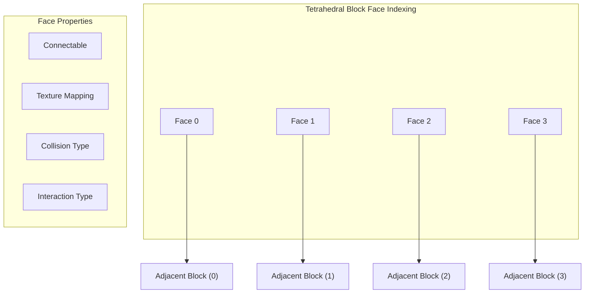

# QuadCraft Modding Guide

This document provides a comprehensive guide for developers who want to create mods for QuadCraft. It explains how to extend or modify the game's functionality while working with its unique tetrahedral geometry.

## Introduction to QuadCraft Modding

QuadCraft's modding system allows developers to extend nearly all aspects of the game, from adding new tetrahedral block types to creating entirely new gameplay mechanics and dimensions.

```mermaid
graph TD
    subgraph "Mod Categories"
        Content["Content Mods"]
        Mechanics["Mechanics Mods"]
        Rendering["Rendering Mods"]
        Integration["Integration Mods"]
    end
    
    Content --> TetrahedralBlocks["Tetrahedral Blocks"]
    Content --> TetrahedralItems["Items"]
    Content --> TetrahedralEntities["Entities"]
    Content --> BiomeStructures["Biomes & Structures"]
    
    Mechanics --> MovementMechanics["Movement Mechanics"]
    Mechanics --> CraftingMechanics["Crafting Systems"]
    Mechanics --> PhysicsMechanics["Physics Modifications"]
    Mechanics --> TetrahedralGameplay["Gameplay Features"]
    
    Rendering --> ShaderMods["Custom Shaders"]
    Rendering --> MeshingMods["Tetrahedral Meshing"]
    Rendering --> ParticleEffects["Particle Effects"]
    Rendering --> UIExtensions["UI Extensions"]
    
    Integration --> WorldGeneration["World Gen Hooks"]
    Integration --> NetworkExtensions["Networking Extensions"]
    Integration --> APIExtensions["API Extensions"]
    Integration --> ExternalSystems["External System Integration"]
```



## Setting Up for Modding

### Prerequisites

Before you begin creating mods for QuadCraft, you'll need:

1. A development environment with C++ toolchain (see the [setup guide](/docs/development/setup_guide.md))
2. QuadCraft Mod Development Kit (MDK)
3. Familiarity with tetrahedral geometry and QuadCraft's coordinate systems

### Installing the Mod Development Kit

```bash
# Clone the QuadCraft repository if you haven't already
git clone https://github.com/QuadCraft/QuadCraft.git

# Navigate to the repository
cd QuadCraft

# Install the MDK
./tools/install_mdk.sh
```

### Project Structure

A basic QuadCraft mod follows this structure:

```
mod_name/
├── src/
│   ├── main.cpp                    # Mod entry point
│   ├── blocks/                     # Custom tetrahedral blocks
│   ├── entities/                   # Custom entities
│   ├── systems/                    # Custom game systems
│   └── ui/                         # Custom UI elements
├── resources/
│   ├── textures/                   # Textures for blocks, items, entities
│   ├── models/                     # 3D models (tetrahedral-aware)
│   ├── shaders/                    # Custom shaders
│   └── sounds/                     # Custom sound effects
├── CMakeLists.txt                  # Build configuration
└── mod.json                        # Mod metadata and dependencies
```

## Mod Entry Point

Every QuadCraft mod needs an entry point that implements the `IQuadCraftMod` interface:

```cpp
// main.cpp
#include <quadcraft/api/IQuadCraftMod.h>
#include <quadcraft/api/ModRegistry.h>

class ExampleMod : public quadcraft::IQuadCraftMod {
public:
    void onInitialize(quadcraft::ModRegistry* registry) override {
        // Register mod components here
        registry->registerName("example_mod");
        registry->registerVersion("1.0.0");
        
        // Register blocks, items, entities, etc.
        registerBlocks(registry);
        registerItems(registry);
        registerEntities(registry);
    }
    
    void onShutdown() override {
        // Cleanup resources
    }
    
private:
    void registerBlocks(quadcraft::ModRegistry* registry) {
        // Register custom tetrahedral blocks
    }
    
    void registerItems(quadcraft::ModRegistry* registry) {
        // Register custom items
    }
    
    void registerEntities(quadcraft::ModRegistry* registry) {
        // Register custom entities
    }
};

// Export the mod entry point
EXPORT_QUADCRAFT_MOD(ExampleMod)
```

## Working with Tetrahedral Blocks

Tetrahedral blocks are the fundamental building elements in QuadCraft. Creating custom blocks requires understanding the tetrahedral geometry system.

### Creating a Custom Block

```cpp
#include <quadcraft/api/blocks/TetrahedralBlock.h>
#include <quadcraft/api/blocks/BlockProperties.h>

class CustomTetrahedralBlock : public quadcraft::TetrahedralBlock {
public:
    CustomTetrahedralBlock() : TetrahedralBlock("example_mod:custom_block") {
        // Set block properties
        setProperties(BlockProperties()
            .strength(3.0f, 5.0f)          // Breaking resistance and hardness
            .lightEmission(7)              // Light level (0-15)
            .friction(0.6f)                // Surface friction
            .restitution(0.3f)             // Bounciness
            .soundType(SoundType::STONE)   // Sound set
            .tetrahedralOrientation(TetrahedralOrientation::STANDARD) // Orientation
        );
        
        // Set up custom tetrahedron-specific behavior
        for (int i = 0; i < 4; i++) {
            setFaceProperty(i, FaceProperty::CONNECTABLE, true);
        }
    }
    
    // Custom block behavior
    void onBlockPlaced(World* world, GlobalCoord coord, Player* player) override {
        // Custom placement behavior
    }
    
    void onBlockBroken(World* world, GlobalCoord coord, Player* player) override {
        // Custom breaking behavior
    }
    
    // Tetrahedral face interaction
    bool onFaceInteraction(World* world, GlobalCoord coord, int faceIndex, 
                          Player* player, Hand hand) override {
        // Custom face-specific interaction
        return true;
    }
    
    // Define custom tetrahedral collision shape
    TetrahedralCollider createCollider(GlobalCoord coord) override {
        // Default tetrahedral collision or custom shape
        return TetrahedralCollider::createStandard(coord);
    }
};

void registerBlocks(quadcraft::ModRegistry* registry) {
    registry->registerBlock<CustomTetrahedralBlock>();
}
```

### Tetrahedral Block Faces and Orientation

Understanding face connectivity in tetrahedral blocks is crucial for creating blocks that integrate well with the existing world:



When working with tetrahedral blocks, you can define properties for each face:

```cpp
// Setting face-specific properties
void configureFaces() {
    // Face 0 - fully connectable with standard texture
    setFaceProperty(0, FaceProperty::CONNECTABLE, true);
    setFaceTexture(0, "example_mod:textures/block/custom_block_face0");
    
    // Face 1 - special connecting face with different texture
    setFaceProperty(1, FaceProperty::CONNECTABLE, true);
    setFaceProperty(1, FaceProperty::SPECIAL_CONNECTION, true);
    setFaceTexture(1, "example_mod:textures/block/custom_block_face1");
    
    // Face 2 - non-connectable face (e.g., for a decorative block)
    setFaceProperty(2, FaceProperty::CONNECTABLE, false);
    setFaceTexture(2, "example_mod:textures/block/custom_block_face2");
    
    // Face 3 - interactive face
    setFaceProperty(3, FaceProperty::CONNECTABLE, true);
    setFaceProperty(3, FaceProperty::INTERACTIVE, true);
    setFaceTexture(3, "example_mod:textures/block/custom_block_face3");
}
```

## Creating Custom Entities

QuadCraft uses a component-based entity system. Custom entities can be created by combining components:

```cpp
#include <quadcraft/api/entity/Entity.h>
#include <quadcraft/api/entity/EntityRegistry.h>
#include <quadcraft/api/entity/components/TetrahedralTransformComponent.h>
#include <quadcraft/api/entity/components/PhysicsComponent.h>
#include <quadcraft/api/entity/components/RenderingComponent.h>

class CustomEntity : public quadcraft::Entity {
public:
    void initialize() override {
        // Add required components
        addComponent<TetrahedralTransformComponent>();
        addComponent<PhysicsComponent>();
        addComponent<RenderingComponent>();
        
        // Configure components
        auto transform = getComponent<TetrahedralTransformComponent>();
        transform->setScale(Vector3(1.0f, 1.0f, 1.0f));
        
        auto physics = getComponent<PhysicsComponent>();
        physics->setMass(10.0f);
        physics->setGravityFactor(1.0f);
        
        auto rendering = getComponent<RenderingComponent>();
        rendering->setModel("example_mod:models/custom_entity");
        rendering->setTexture("example_mod:textures/entity/custom_entity");
        
        // Add custom component
        addComponent<CustomEntityComponent>();
    }
};

// Custom component for entity-specific behavior
class CustomEntityComponent : public quadcraft::Component {
public:
    void initialize() override {
        // Initialize component
    }
    
    void update(float deltaTime) override {
        // Update logic
        auto transform = getEntity()->getComponent<TetrahedralTransformComponent>();
        
        // Example: Move in a circular pattern in tetrahedral space
        float time = getCurrentTime();
        
        // Convert to quadray coordinates for tetrahedrally-accurate movement
        Quadray newPos = Quadray(
            sin(time) * 2.0f + 1.0f,  // a
            cos(time) * 2.0f + 1.0f,  // b
            1.0f,                     // c
            1.0f                      // d
        );
        
        transform->setPositionQuadray(newPos);
    }
};

void registerEntities(quadcraft::ModRegistry* registry) {
    registry->registerEntity<CustomEntity>("example_mod:custom_entity");
    registry->registerComponent<CustomEntityComponent>();
}
```

## Tetrahedral Coordinate Systems

Understanding the tetrahedral coordinate systems is crucial for mod development in QuadCraft:

### Quadray Coordinates

```cpp
// Helper function to convert between coordinate systems
Vector3 quadrayToCartesian(const Quadray& quadray) {
    // Convert 4D quadray coordinates to 3D Cartesian
    float sum = quadray.a + quadray.b + quadray.c + quadray.d;
    
    return Vector3(
        (quadray.b + quadray.c) / sum - 0.5f,
        (quadray.c + quadray.d) / sum - 0.5f,
        (quadray.d + quadray.a) / sum - 0.5f
    );
}

Quadray cartesianToQuadray(const Vector3& cartesian) {
    // Convert 3D Cartesian to 4D quadray coordinates
    float a = 1.0f + cartesian.x - cartesian.z;
    float b = 1.0f + cartesian.y - cartesian.x;
    float c = 1.0f + cartesian.z - cartesian.y;
    float d = 1.0f - cartesian.x - cartesian.y - cartesian.z;
    
    // Normalize
    float sum = a + b + c + d;
    return Quadray(a/sum, b/sum, c/sum, d/sum);
}
```

### Working with Tetrahedral Space

When developing mods, you'll often need to work with different coordinate systems:

```cpp
// Example: Placing blocks in a tetrahedral pattern
void createTetrahedralStructure(World* world, GlobalCoord centerCoord) {
    // Get the tetrahedral coordinate for the center
    Quadray center = centerCoord.toQuadray();
    
    // Define tetrahedron vertices in Quadray space
    std::vector<Quadray> vertices = {
        Quadray(center.a + 1.0f, center.b, center.c, center.d),        // Vertex 0
        Quadray(center.a, center.b + 1.0f, center.c, center.d),        // Vertex 1
        Quadray(center.a, center.b, center.c + 1.0f, center.d),        // Vertex 2
        Quadray(center.a, center.b, center.c, center.d + 1.0f)         // Vertex 3
    };
    
    // Place blocks at each vertex and along edges
    for (const auto& vertex : vertices) {
        GlobalCoord pos = GlobalCoord::fromQuadray(vertex);
        world->setBlock(pos, myCustomBlock);
    }
    
    // Create edges by interpolating between vertices
    const int EDGE_SEGMENTS = 5;
    for (int i = 0; i < 4; i++) {
        for (int j = i + 1; j < 4; j++) {
            for (int k = 1; k < EDGE_SEGMENTS; k++) {
                float t = k / static_cast<float>(EDGE_SEGMENTS);
                Quadray interpolated = quadrayLerp(vertices[i], vertices[j], t);
                GlobalCoord pos = GlobalCoord::fromQuadray(interpolated);
                world->setBlock(pos, myEdgeBlock);
            }
        }
    }
}
```

## Custom World Generation

Extending QuadCraft's world generation allows you to create unique tetrahedral landscapes and structures:

```cpp
#include <quadcraft/api/world/TetrahedralWorldGenerator.h>
#include <quadcraft/api/world/BiomeGenerator.h>
#include <quadcraft/api/world/StructureGenerator.h>

class CustomBiomeGenerator : public quadcraft::BiomeGenerator {
public:
    void generateBiome(TetrahedralChunk* chunk, TetrahedralHeightmap* heightmap) override {
        // Generate terrain in the tetrahedral chunk
        for (int x = 0; x < CHUNK_SIZE; x++) {
            for (int y = 0; y < CHUNK_SIZE; y++) {
                for (int z = 0; z < CHUNK_SIZE; z++) {
                    // Convert to local tetrahedral coordinates
                    LocalCoord localCoord(x, y, z);
                    
                    // Get noise value for terrain
                    float noiseValue = getTetrahedralNoise(chunk->getPosition(), localCoord);
                    
                    // Determine block type based on noise
                    Block block = determineBlockType(noiseValue, localCoord.y);
                    
                    // Set block in tetrahedral space
                    chunk->setBlock(localCoord, block);
                }
            }
        }
    }
    
private:
    float getTetrahedralNoise(ChunkCoord chunkPos, LocalCoord localCoord) {
        // Convert to global position
        GlobalCoord globalCoord = localCoord.toGlobalCoord(chunkPos);
        
        // Use quadray coordinates for coherent noise in tetrahedral space
        Quadray quadray = globalCoord.toQuadray();
        
        // Generate 4D noise using quadray coordinates (more tetrahedral-aligned)
        return noiseGenerator.getNoise4D(quadray.a, quadray.b, quadray.c, quadray.d);
    }
    
    Block determineBlockType(float noiseValue, int height) {
        // Custom logic to determine block type
        if (noiseValue > 0.7f) {
            return BlockRegistry::get("example_mod:custom_stone");
        } else if (noiseValue > 0.4f) {
            return BlockRegistry::get("minecraft:stone");
        } else if (height < WATER_LEVEL) {
            return BlockRegistry::get("minecraft:water");
        } else {
            return BlockRegistry::get("minecraft:air");
        }
    }
};

class CustomStructureGenerator : public quadcraft::StructureGenerator {
public:
    void generateStructures(TetrahedralChunk* chunk) override {
        // Check if structure should generate in this chunk
        if (shouldGenerateStructure(chunk->getPosition())) {
            // Generate custom tetrahedral structure
            generateTetrahedralTower(chunk);
        }
    }
    
private:
    bool shouldGenerateStructure(ChunkCoord pos) {
        // Custom logic to determine structure placement
        uint32_t chunkSeed = getChunkSeed(pos);
        return (chunkSeed % 100) < 5; // 5% chance
    }
    
    void generateTetrahedralTower(TetrahedralChunk* chunk) {
        // Find suitable location within chunk
        LocalCoord baseCoord = findSuitableLocation(chunk);
        if (!baseCoord.isValid()) return;
        
        // Convert to global coordinates
        GlobalCoord globalBase = baseCoord.toGlobalCoord(chunk->getPosition());
        
        // Generate tetrahedral tower
        int height = 5 + (getChunkSeed(chunk->getPosition()) % 5);
        
        // Tower core - use tetrahedral stacking
        for (int y = 0; y < height; y++) {
            // For each level, create a tetrahedron-aligned structure
            generateTetrahedralLevel(chunk, globalBase, y);
        }
    }
    
    void generateTetrahedralLevel(TetrahedralChunk* chunk, GlobalCoord base, int level) {
        // Create a level of the tetrahedral tower
        // Each level rotates slightly to create a spiral effect
        
        // Use quadray coordinates for accurate tetrahedral placement
        Quadray baseQuadray = base.toQuadray();
        baseQuadray.d += level * 0.5f; // Move upward in tetrahedral space
        
        // Rotate around the tetrahedral axis based on level
        float rotation = level * (M_PI / 8.0f); // 22.5 degrees per level
        TetrahedralRotation tetraRot;
        tetraRot.setAxisAngle(TetrahedralAxis::D, rotation);
        
        // Place blocks in the rotated tetrahedral shape
        for (const auto& offset : LEVEL_TEMPLATE) {
            // Apply tetrahedral rotation to offset
            Quadray rotatedOffset = tetraRot.applyToQuadray(offset);
            Quadray finalPos = baseQuadray + rotatedOffset;
            
            // Convert back to global coordinate and set block
            GlobalCoord blockPos = GlobalCoord::fromQuadray(finalPos);
            World* world = chunk->getWorld();
            world->setBlock(blockPos, BlockRegistry::get("example_mod:tower_block"));
        }
    }
};
```

## Custom Tetrahedral Physics

Extending the physics system allows for unique interactions in the tetrahedral world:

```cpp
#include <quadcraft/api/physics/TetrahedralPhysics.h>
#include <quadcraft/api/physics/TetrahedralCollider.h>

// Custom physics material for tetrahedral blocks
class BouncePhysicsMaterial : public quadcraft::PhysicsMaterial {
public:
    BouncePhysicsMaterial() {
        setRestitution(1.5f);      // Super bouncy
        setFriction(0.1f);         // Low friction
        setDensity(0.5f);          // Lightweight
    }
    
    // Custom collision response based on tetrahedral face
    void modifyCollisionResponse(TetrahedralCollisionResponse* response, int faceIndex) override {
        // Boost vertical velocity when colliding with top faces
        if (faceIndex == 0) { // Assuming face 0 is "upward" in our convention
            response->velocityResponse.y *= 2.0f;
        }
    }
};

// Custom tetrahedral collider for entities
class CustomTetrahedralCollider : public quadcraft::TetrahedralCollider {
public:
    CustomTetrahedralCollider() {
        // Define a custom tetrahedral shape
        setVertices({
            Quadray(2.0f, 1.0f, 1.0f, 1.0f),  // Extended on a-axis
            Quadray(1.0f, 2.0f, 1.0f, 1.0f),  // Extended on b-axis
            Quadray(1.0f, 1.0f, 2.0f, 1.0f),  // Extended on c-axis
            Quadray(1.0f, 1.0f, 1.0f, 2.0f)   // Extended on d-axis
        });
    }
    
    // Override collision detection for specialized behavior
    std::vector<TetrahedralContactPoint> checkCollision(
        const TetrahedralCollider* other,
        const Transform& transform,
        const Transform& otherTransform) override {
        
        // Call base implementation for initial contacts
        auto contacts = TetrahedralCollider::checkCollision(
            other, transform, otherTransform);
        
        // Modify contact behavior for our custom collider
        for (auto& contact : contacts) {
            // Adjust contact properties based on which face was hit
            if (contact.faceIndex >= 0) {
                // Example: Reduce friction on certain faces
                if (contact.faceIndex == 2) {
                    contact.friction *= 0.5f;
                }
            }
        }
        
        return contacts;
    }
};
```

## Creating Custom User Interfaces

QuadCraft's UI system can be extended to create custom interfaces that work well with the tetrahedral game world:

```cpp
#include <quadcraft/api/ui/UIComponent.h>
#include <quadcraft/api/ui/UIRegistry.h>

class TetrahedralCoordinateDisplay : public quadcraft::UIComponent {
public:
    void initialize() override {
        // Set up component properties
        setSize(Vector2(200, 100));
        setAnchor(UIAnchor::TOP_RIGHT);
        setOffset(Vector2(-10, 10));
    }
    
    void render(UIRenderer* renderer) override {
        // Get player position
        Player* player = getGame()->getLocalPlayer();
        if (!player) return;
        
        auto transform = player->getComponent<TetrahedralTransformComponent>();
        if (!transform) return;
        
        // Get tetrahedral coordinates
        Quadray quadray = transform->getPositionQuadray();
        
        // Render background
        renderer->drawRect(getAbsoluteRect(), Color(0, 0, 0, 0.5f));
        
        // Render coordinate text
        std::string coordText = 
            "Quadray: [" + 
            std::to_string(std::round(quadray.a * 100) / 100) + ", " +
            std::to_string(std::round(quadray.b * 100) / 100) + ", " +
            std::to_string(std::round(quadray.c * 100) / 100) + ", " +
            std::to_string(std::round(quadray.d * 100) / 100) + "]";
        
        renderer->drawText(coordText, 
                         getAbsolutePosition() + Vector2(10, 10), 
                         Color(1, 1, 1, 1), 
                         16);
        
        // Also show which tetrahedron the player is in
        int tetrahedronId = transform->getTetrahedronId();
        std::string tetraText = "Tetrahedron: " + std::to_string(tetrahedronId);
        
        renderer->drawText(tetraText,
                         getAbsolutePosition() + Vector2(10, 40),
                         Color(1, 1, 1, 1),
                         16);
    }
};

// A UI screen for tetrahedral navigation help
class TetrahedralNavigationScreen : public quadcraft::UIScreen {
public:
    void initialize() override {
        // Create the UI layout
        UIContainer* container = createChild<UIContainer>();
        container->setSize(Vector2(500, 400));
        container->setAnchor(UIAnchor::CENTER);
        container->setBackground(Color(0.1f, 0.1f, 0.2f, 0.9f));
        
        // Title
        UILabel* title = container->createChild<UILabel>();
        title->setText("Tetrahedral Navigation");
        title->setFont("example_mod:fonts/title");
        title->setFontSize(24);
        title->setAnchor(UIAnchor::TOP_CENTER);
        title->setOffset(Vector2(0, 20));
        
        // Create a tetrahedral compass widget
        TetrahedralCompass* compass = container->createChild<TetrahedralCompass>();
        compass->setSize(Vector2(200, 200));
        compass->setAnchor(UIAnchor::CENTER);
        compass->setOffset(Vector2(0, -20));
        
        // Create close button
        UIButton* closeButton = container->createChild<UIButton>();
        closeButton->setText("Close");
        closeButton->setSize(Vector2(100, 30));
        closeButton->setAnchor(UIAnchor::BOTTOM_CENTER);
        closeButton->setOffset(Vector2(0, -20));
        closeButton->setOnClick([this]() {
            close();
        });
    }
};

// Register UI components
void registerUI(quadcraft::ModRegistry* registry) {
    registry->registerUIComponent<TetrahedralCoordinateDisplay>("example_mod:tetrahedral_coordinates");
    registry->registerUIScreen<TetrahedralNavigationScreen>("example_mod:navigation_screen");
    
    // Register keyboard shortcut to open the navigation screen
    registry->registerKeybinding("example_mod.open_navigation", GLFW_KEY_N, [](Player* player) {
        UIManager::getInstance()->openScreen("example_mod:navigation_screen");
    });
}
```

## Networking Extensions for Multiplayer Mods

When creating multiplayer-compatible mods, you need to handle network synchronization:

```cpp
#include <quadcraft/api/network/PacketRegistry.h>
#include <quadcraft/api/network/Packet.h>

// Custom packet for mod-specific data
class CustomModPacket : public quadcraft::Packet {
public:
    CustomModPacket() : Packet("example_mod:custom_packet") {}
    
    // Define your packet data
    uint32_t entityId;
    Vector3 position;
    Quadray tetraPosition;
    uint8_t actionType;
    std::string extraData;
    
    // Serialize the packet to binary
    void write(ByteBuffer& buffer) override {
        buffer.writeUInt32(entityId);
        buffer.writeVector3(position);
        buffer.writeQuadray(tetraPosition);
        buffer.writeUInt8(actionType);
        buffer.writeString(extraData);
    }
    
    // Deserialize the packet from binary
    void read(ByteBuffer& buffer) override {
        entityId = buffer.readUInt32();
        position = buffer.readVector3();
        tetraPosition = buffer.readQuadray();
        actionType = buffer.readUInt8();
        extraData = buffer.readString();
    }
};

// Register the packet and handler
void registerNetworking(quadcraft::ModRegistry* registry) {
    // Register the packet
    registry->registerPacket<CustomModPacket>();
    
    // Register a handler for when the packet is received
    registry->registerPacketHandler<CustomModPacket>([](Player* player, CustomModPacket* packet) {
        // Handle the received packet
        if (packet->actionType == 1) {
            // Example: Spawn a special effect at the specified tetrahedral position
            createTetrahedralEffect(packet->tetraPosition);
        } else if (packet->actionType == 2) {
            // Example: Update entity state
            Entity* entity = EntityRegistry::get(packet->entityId);
            if (entity) {
                auto transform = entity->getComponent<TetrahedralTransformComponent>();
                if (transform) {
                    transform->setPositionQuadray(packet->tetraPosition);
                }
            }
        }
    });
}

// Send a packet from client to server
void sendActionToServer(uint32_t entityId, Quadray position, uint8_t actionType) {
    CustomModPacket packet;
    packet.entityId = entityId;
    packet.position = QuadrayConverter::toCartesian(position);
    packet.tetraPosition = position;
    packet.actionType = actionType;
    packet.extraData = "client_action";
    
    NetworkManager::getInstance()->sendToServer(&packet);
}

// Send a packet from server to clients
void broadcastActionToClients(uint32_t entityId, Quadray position, uint8_t actionType) {
    CustomModPacket packet;
    packet.entityId = entityId;
    packet.position = QuadrayConverter::toCartesian(position);
    packet.tetraPosition = position;
    packet.actionType = actionType;
    packet.extraData = "server_broadcast";
    
    NetworkManager::getInstance()->broadcastToAll(&packet);
}
```

## Interacting with Other Mods

QuadCraft's modding API allows for interoperability between mods:

```cpp
#include <quadcraft/api/ModAPI.h>
#include <quadcraft/api/ModInterop.h>

// Define an API for other mods to use
class ExampleModAPI : public quadcraft::ModAPI {
public:
    ExampleModAPI() : ModAPI("example_mod") {}
    
    // Custom functions that other mods can call
    TetrahedralStructure* createStructure(const std::string& type, GlobalCoord position) {
        // Implementation
        return new TetrahedralStructure(type, position);
    }
    
    Block* getCustomBlock(const std::string& blockId) {
        // Implementation
        return BlockRegistry::get("example_mod:" + blockId);
    }
    
    // Register the API
    void registerAPI(quadcraft::ModRegistry* registry) {
        registry->registerAPI(this);
    }
};

// Using another mod's API
void interactWithOtherMod() {
    // Check if the other mod is loaded
    if (ModManager::isModLoaded("other_mod")) {
        // Get the other mod's API
        auto otherModAPI = ModManager::getAPI("other_mod");
        
        if (otherModAPI) {
            // Call a function from the other mod's API
            otherModAPI->callFunction<void>("createCustomEntity", 
                                          "special_entity", 
                                          playerPosition);
        }
    }
}
```

## Creating a Custom Resource Pack

Resource packs allow modders to change the game's assets without modifying the code:

```
resource_pack_name/
├── pack.json                     # Resource pack metadata
├── assets/
│   ├── example_mod/              # Your mod's namespace
│   │   ├── textures/
│   │   │   ├── blocks/          # Block textures
│   │   │   ├── entities/        # Entity textures
│   │   │   └── ui/              # UI textures
│   │   ├── models/
│   │   │   ├── blocks/          # Block models (tetrahedral)
│   │   │   └── entities/        # Entity models
│   │   ├── shaders/             # Custom shaders
│   │   └── sounds/              # Sound effects
│   └── minecraft/               # Override vanilla assets (optional)
└── README.md                     # Description of your resource pack
```

Example `pack.json`:

```json
{
    "name": "Example Resource Pack",
    "description": "Customizes the appearance of Example Mod",
    "version": "1.0.0",
    "format_version": 1,
    "for_mod": "example_mod",
    "author": "Your Name",
    "website": "https://example.com"
}
```

## Best Practices for QuadCraft Mods

When developing mods for QuadCraft, follow these best practices:

### Tetrahedral Geometry Considerations

1. **Work in Quadray Space**: When possible, perform operations in Quadray coordinates for more accurate tetrahedral calculations.
2. **Respect Tetrahedral Connectivity**: Ensure custom blocks properly connect with existing blocks along tetrahedral faces.
3. **Use TetrahedralTransformComponent**: Always use the tetrahedral transform for entity positioning in the tetrahedral world.

### Performance Optimization

1. **Use Tetrahedral Culling**: Implement proper tetrahedral frustum culling for custom rendering.
2. **Batch Similar Operations**: Group similar operations to reduce overhead.
3. **Leverage Spatial Partitioning**: Use the tetrahedral spatial partitioning system for efficient collision and interaction checks.

### Compatibility

1. **Version your APIs**: Use semantic versioning for mod APIs to maintain compatibility.
2. **Gracefully Handle Missing Dependencies**: Check if required mods are loaded before attempting to interact with them.
3. **Respect Game Events**: Hook into the proper game events rather than overriding core functionality.

### User Experience

1. **Maintain Tetrahedral Aesthetics**: Keep your custom content consistent with the tetrahedral theme of QuadCraft.
2. **Provide Clear Documentation**: Document how your mod works, especially if it introduces complex tetrahedral interactions.
3. **Offer Configuration Options**: Allow users to customize your mod's behavior to fit their preferences.

## Mod Distribution

### Packaging Your Mod

To prepare your mod for distribution:

1. Build your mod using the provided build script:
   ```bash
   ./tools/build_mod.sh example_mod
   ```

2. This will create a `.qcmod` file in the `build/mods` directory.

3. Include a README file with installation instructions and a description of your mod.

### Publishing Your Mod

QuadCraft mods can be published to:

1. **QuadCraft Mod Repository**: The official repository for verified mods
2. **GitHub/GitLab**: Host your mod source and releases on a git platform
3. **QuadCraft Community Forums**: Share your mod with the community

### Mod Metadata

Ensure your `mod.json` file is complete and includes all necessary information:

```json
{
    "id": "example_mod",
    "name": "Example Mod",
    "version": "1.0.0",
    "description": "An example mod showcasing the QuadCraft modding API",
    "authors": ["Your Name"],
    "contact": {
        "homepage": "https://example.com",
        "source": "https://github.com/username/example_mod",
        "issues": "https://github.com/username/example_mod/issues"
    },
    "license": "Apache-2.0",
    "environment": "client,server",
    "entrypoints": {
        "main": "ExampleMod"
    },
    "depends": {
        "quadcraft": ">=1.0.0",
        "optional_mod": ">=2.0.0"
    },
    "conflicts": {
        "incompatible_mod": "*"
    }
}
```

## Conclusion

This guide introduces the fundamentals of creating mods for QuadCraft. By leveraging the unique tetrahedral geometry of the game, you can create innovative gameplay experiences that go beyond traditional voxel games. The modding API provides extensive hooks into the game's systems, allowing for customization of nearly every aspect of QuadCraft.

For more detailed information on specific topics, refer to the following resources:

- [Tetrahedral Geometry Reference](/docs/mathematics/tetrahedral_geometry.md)
- [Quadray Coordinate System](/docs/mathematics/quadray_coordinates.md)
- [Entity Component System](/docs/development/entity_system.md)
- [Chunk System Technical Details](/docs/development/chunk_system.md)
- [Rendering Pipeline Documentation](/docs/development/rendering_system.md)

Remember that the tetrahedral nature of QuadCraft offers unique opportunities for creative mod development that aren't possible in traditional cubic voxel games. Embrace the tetrahedral paradigm and create experiences that showcase the mathematical beauty and gameplay potential of this innovative geometry. 