# QuadCraft Multiplayer System

This document details the multiplayer and networking architecture of QuadCraft, explaining how the game synchronizes players, blocks, and entities across a network while adapting to the unique challenges of a tetrahedral world.

## Networking Overview

QuadCraft's multiplayer system is designed to provide a seamless and responsive experience in a shared tetrahedral world. The architecture balances between authority distribution, bandwidth efficiency, and latency compensation.

```mermaid
graph TD
    subgraph "Multiplayer Architecture"
        ClientServer["Client-Server Model"]
        Authority["Authority Model"]
        Synchronization["Synchronization"]
        Optimization["Network Optimization"]
    end
    
    ClientServer --> Servers["Dedicated Servers"]
    ClientServer --> Clients["Game Clients"]
    ClientServer --> P2P["Peer-to-Peer Support"]
    
    Authority --> ServerAuthority["Server Authority"]
    Authority --> ClientPrediction["Client Prediction"]
    Authority --> HybridAuthority["Hybrid Authority"]
    
    Synchronization --> EntitySync["Entity Synchronization"]
    Synchronization --> ChunkSync["Chunk Synchronization"]
    Synchronization --> EventSync["Event Synchronization"]
    
    Optimization --> Compression["Data Compression"]
    Optimization --> Prioritization["Transmission Prioritization"]
    Optimization --> Batching["Update Batching"]
```

## Network Architecture

QuadCraft primarily employs a client-server architecture with options for peer-to-peer connectivity for smaller worlds:

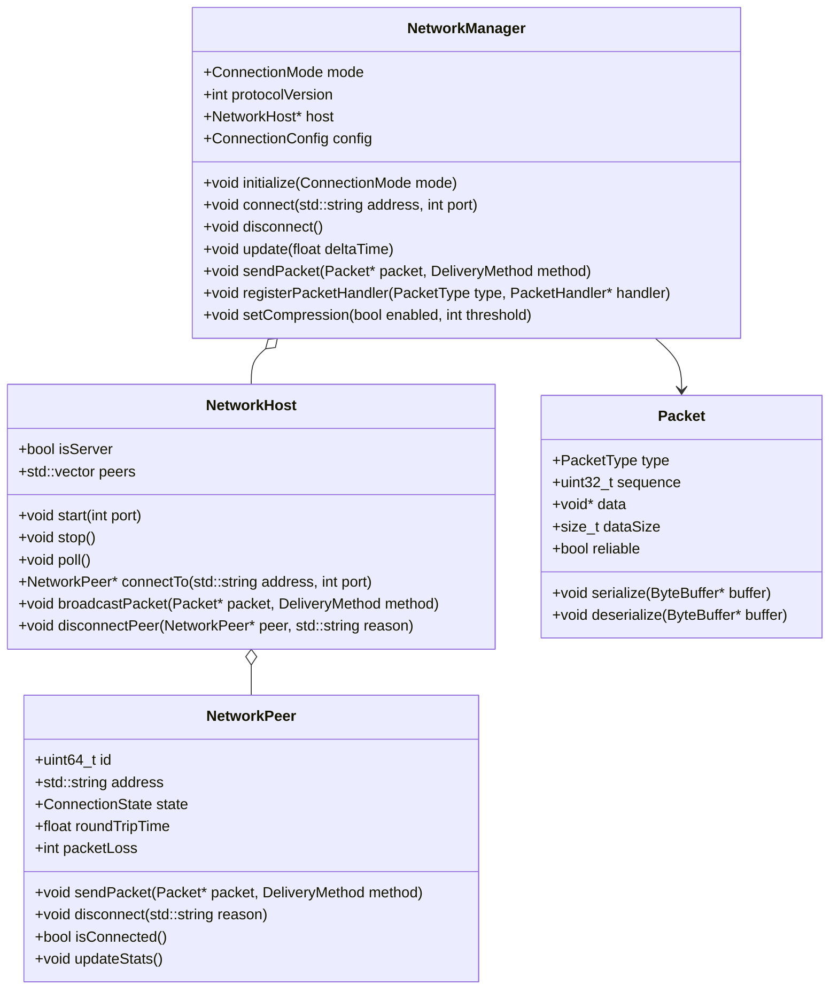

### Connection Phases

The multiplayer connection follows distinct phases to establish and maintain communication:

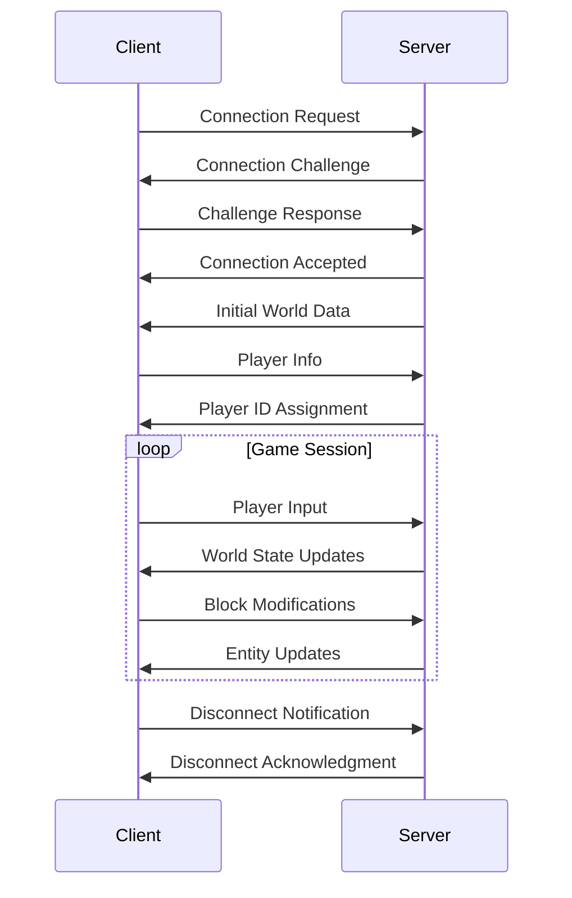

## Tetrahedral Synchronization Challenges

The tetrahedral nature of QuadCraft presents unique networking challenges:

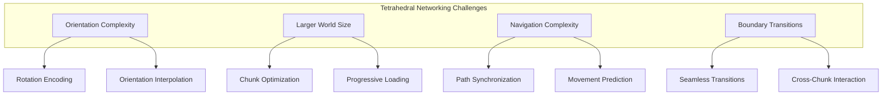

Solutions to these challenges include:

- **Quaternion Compression**: Specialized compression for tetrahedral orientations
- **Tetrahedral-Aware Delta Compression**: Encoding only changes with tetrahedral relevance
- **Orientation-Preserving Interpolation**: Ensuring smooth transitions between networked states
- **Progressive Tetrahedral Chunk Loading**: Prioritizing chunks based on tetrahedral visibility
- **Tetrahedral Path Prediction**: Specialized algorithms for predicting movement in tetrahedral space

## Packet Types and Structure

QuadCraft uses a variety of packet types to handle different aspects of synchronization:

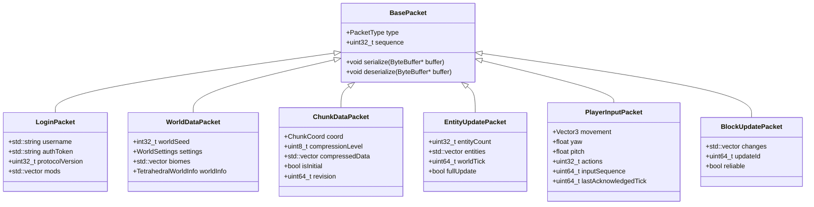

## Authority Model

QuadCraft uses a hybrid authority model to balance responsiveness with consistency:

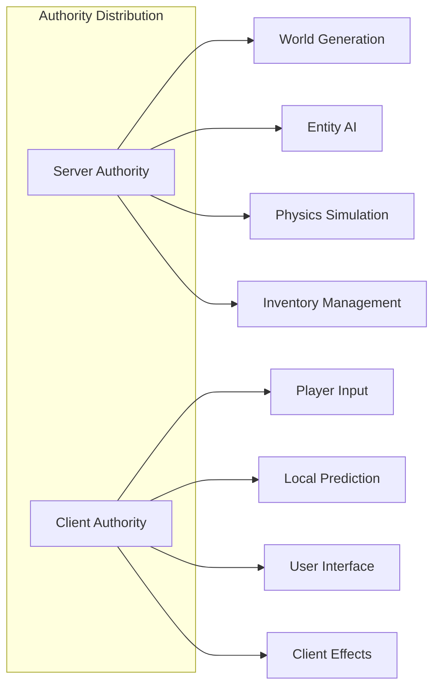

### Client-Side Prediction

To maintain responsiveness despite network latency, QuadCraft implements client-side prediction:

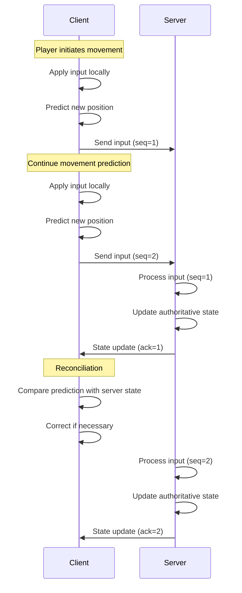

## Entity Synchronization

Entities in QuadCraft are synchronized using a component-based approach:

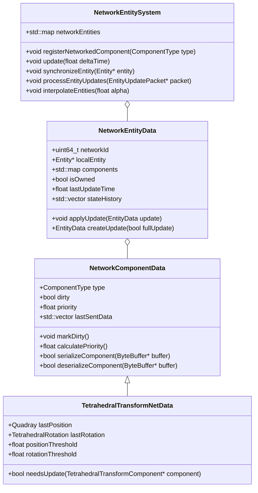

### Entity Interpolation

To ensure smooth movement despite network jitter, entities are interpolated between received states:

```cpp
// Entity interpolation in tetrahedral space
void interpolateEntityPosition(
    Entity* entity,
    const StateSnapshot& from,
    const StateSnapshot& to,
    float alpha) {
    
    // Get the transform component
    TetrahedralTransformComponent* transform = 
        entity->getComponent<TetrahedralTransformComponent>();
    
    // Skip interpolation if component not found
    if (!transform) return;
    
    // Handle special case where entity crosses tetrahedron boundaries
    if (from.tetrahedronId != to.tetrahedronId) {
        // If we're more than halfway through the interpolation,
        // switch to the destination tetrahedron
        if (alpha > 0.5f) {
            transform->setTetrahedron(to.tetrahedronId);
            
            // Adjust alpha for remaining interpolation
            float adjustedAlpha = (alpha - 0.5f) * 2.0f;
            
            // Interpolate within destination tetrahedron
            Quadray interpolatedPos = quadrayLerp(
                to.entryPosition, to.position, adjustedAlpha);
            transform->setPosition(interpolatedPos);
        } else {
            // Stay in original tetrahedron for first half
            transform->setTetrahedron(from.tetrahedronId);
            
            // Adjust alpha for first half interpolation
            float adjustedAlpha = alpha * 2.0f;
            
            // Interpolate toward exit point
            Quadray interpolatedPos = quadrayLerp(
                from.position, from.exitPosition, adjustedAlpha);
            transform->setPosition(interpolatedPos);
        }
    } else {
        // Standard interpolation within same tetrahedron
        Quadray interpolatedPos = quadrayLerp(from.position, to.position, alpha);
        transform->setPosition(interpolatedPos);
    }
    
    // Interpolate rotation (using specialized tetrahedral rotation interpolation)
    TetrahedralRotation interpolatedRot = interpolateTetraRotation(
        from.rotation, to.rotation, alpha);
    transform->setRotation(interpolatedRot);
}
```

## Chunk Synchronization

The chunk synchronization system prioritizes which chunks to send based on player proximity and visibility:

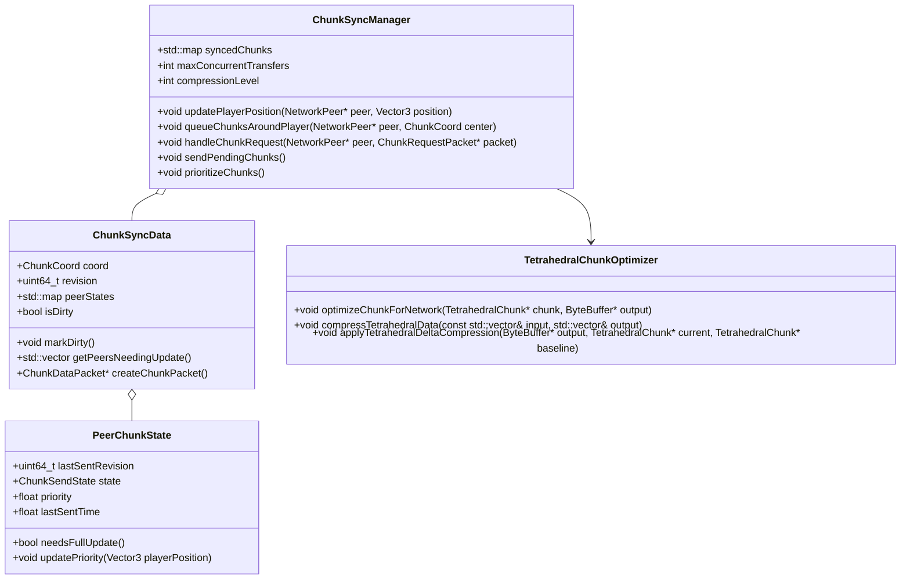

### Progressive Chunk Loading

To optimize bandwidth and prioritize relevant information, chunks are loaded progressively:

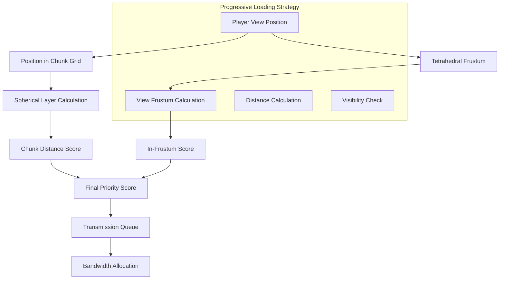

```cpp
// Calculate transmission priority for a chunk
float calculateChunkPriority(
    ChunkCoord chunkCoord,
    Vector3 playerPosition,
    Vector3 playerDirection,
    float playerFOV) {
    
    // Convert player position to chunk space
    ChunkCoord playerChunk = worldToChunkCoord(playerPosition);
    
    // Calculate Manhattan distance in chunk coordinates
    int distX = abs(chunkCoord.x - playerChunk.x);
    int distY = abs(chunkCoord.y - playerChunk.y);
    int distZ = abs(chunkCoord.z - playerChunk.z);
    
    // Calculate direct distance
    float chunkSize = getChunkSize();
    Vector3 chunkCenter = getChunkCenterPosition(chunkCoord);
    float directDistance = distance(playerPosition, chunkCenter);
    
    // Base priority inversely proportional to distance
    float priority = 1000.0f / (1.0f + directDistance);
    
    // Adjust for tetrahedral visibility - chunks in view direction get higher priority
    Vector3 toChunk = normalize(chunkCenter - playerPosition);
    float dotProduct = dot(playerDirection, toChunk);
    
    // Boost priority if chunk is in view direction
    if (dotProduct > cos(playerFOV * 0.5f)) {
        priority *= 2.0f + dotProduct;
    }
    
    // Special case for the chunk the player is in and neighbors
    if (distX <= 1 && distY <= 1 && distZ <= 1) {
        priority *= 10.0f;
    }
    
    // Adjust based on tetrahedral importance
    priority *= getTetrahedralImportanceFactor(chunkCoord, playerPosition);
    
    return priority;
}
```

## Block Updates

Block changes in the tetrahedral world are synchronized efficiently:

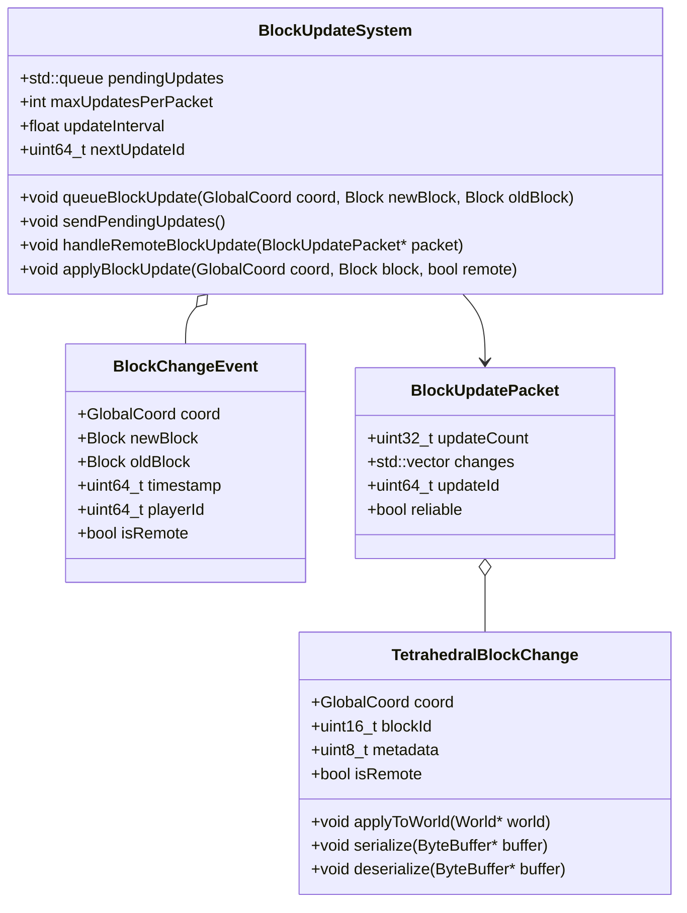

### Block Update Batching

Block updates are batched for network efficiency:

```cpp
// Batch block updates for efficient transmission
BlockUpdatePacket* createBatchedBlockUpdatePacket(
    const std::vector<BlockChangeEvent>& updates,
    uint64_t updateId,
    bool reliable) {
    
    BlockUpdatePacket* packet = new BlockUpdatePacket();
    packet->updateId = updateId;
    packet->reliable = reliable;
    
    // Group changes by chunk for potential optimization
    std::map<ChunkCoord, std::vector<BlockChangeEvent>> changesByChunk;
    
    for (const auto& update : updates) {
        ChunkCoord chunkCoord = update.coord.toChunkCoord();
        changesByChunk[chunkCoord].push_back(update);
    }
    
    // Process each chunk's changes
    for (const auto& [chunkCoord, chunkUpdates] : changesByChunk) {
        // Check if we should use chunk-based compression
        if (chunkUpdates.size() > CHUNK_COMPRESSION_THRESHOLD) {
            // Add as compressed chunk data
            compressChunkBlockUpdates(chunkCoord, chunkUpdates, packet);
        } else {
            // Add as individual updates
            for (const auto& update : chunkUpdates) {
                TetrahedralBlockChange change;
                change.coord = update.coord;
                change.blockId = update.newBlock.id;
                change.metadata = update.newBlock.metadata;
                
                packet->changes.push_back(change);
            }
        }
    }
    
    packet->updateCount = packet->changes.size();
    return packet;
}
```

## Player Synchronization

Player data synchronization is handled with prioritized components:

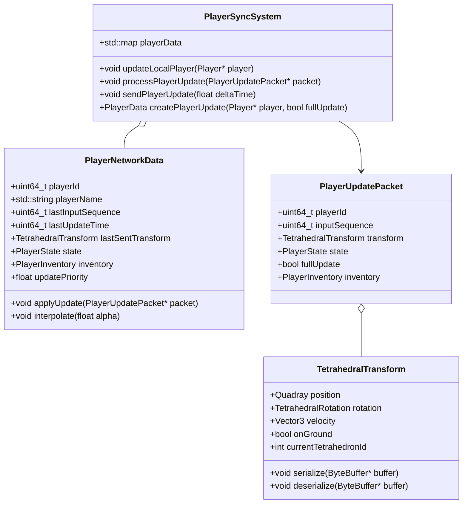

### Tetrahedral Movement Synchronization

Player movement in tetrahedral space presents unique challenges:

```cpp
// Synchronize player movement in tetrahedral space
void synchronizePlayerMovement(
    Player* player,
    const TetrahedralTransform& serverTransform,
    uint64_t serverTick,
    uint64_t acknowledgedInput) {
    
    // Get player controller
    TetrahedralPlayerController* controller = 
        player->getComponent<TetrahedralPlayerController>();
    
    // Get current client-side transform
    TetrahedralTransformComponent* transform = 
        player->getComponent<TetrahedralTransformComponent>();
    
    // Clear outdated predicted moves
    controller->clearAcknowledgedMoves(acknowledgedInput);
    
    // If server and client tetrahedron IDs don't match, force correction
    if (transform->getTetrahedronId() != serverTransform.currentTetrahedronId) {
        // Tetrahedral space mismatch requires immediate correction
        applyServerTransform(player, serverTransform);
        return;
    }
    
    // Calculate position difference in quadray coordinates
    Quadray currentPos = transform->getPosition();
    float positionError = quadrayDistance(currentPos, serverTransform.position);
    
    // Calculate rotation difference
    TetrahedralRotation currentRot = transform->getRotation();
    float rotationError = tetrahedralRotationDistance(
        currentRot, serverTransform.rotation);
    
    // If error exceeds threshold, correct position
    if (positionError > POSITION_ERROR_THRESHOLD ||
        rotationError > ROTATION_ERROR_THRESHOLD) {
        
        // Apply server correction
        applyServerTransform(player, serverTransform);
        
        // Reapply pending inputs to maintain responsiveness
        controller->reapplyPendingMoves();
    }
}
```

## Latency Compensation

QuadCraft employs several techniques to compensate for network latency:

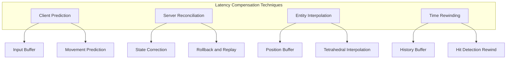

### Server-Side Lag Compensation

For actions like block breaking and combat, server-side lag compensation is implemented:

```cpp
// Server-side lag compensation for player actions
bool performLagCompensatedAction(
    Player* player,
    const ActionData& action,
    float maxCompensationTime) {
    
    // Calculate how far back in time to rewind (based on player's ping)
    float ping = getPlayerPing(player->getId());
    float rewindTime = min(ping * 0.001f, maxCompensationTime);
    
    // Get the world state manager
    WorldStateManager* stateManager = getWorldStateManager();
    
    // Create a rewound world state
    WorldStateSnapshot* rewoundState = 
        stateManager->getStateAtTime(getCurrentTime() - rewindTime);
    
    if (!rewoundState) {
        // Fallback if history not available
        return performAction(player, action);
    }
    
    // Temporarily apply the historical state
    WorldStateGuard guard(stateManager, rewoundState);
    
    // Perform the action in the rewound state
    bool result = performAction(player, action);
    
    // The guard will restore the current state when it goes out of scope
    return result;
}
```

## Network Optimization

Several optimization techniques are employed to minimize bandwidth:

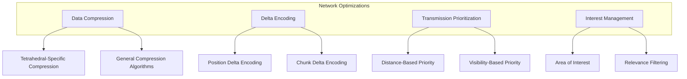

### Tetrahedral Data Compression

Special compression techniques are used for tetrahedral data:

```cpp
// Compress tetrahedral chunk data for network transmission
void compressTetrahedralChunkData(
    TetrahedralChunk* chunk,
    std::vector<uint8_t>& output,
    CompressionLevel level) {
    
    ByteBuffer buffer;
    
    // Write chunk header
    buffer.writeInt32(chunk->getPosition().x);
    buffer.writeInt32(chunk->getPosition().y);
    buffer.writeInt32(chunk->getPosition().z);
    buffer.writeUInt64(chunk->getRevision());
    
    // Determine optimal storage representation for this chunk
    TetrahedralStorageType storageType = determineOptimalStorage(chunk);
    buffer.writeUInt8(static_cast<uint8_t>(storageType));
    
    switch (storageType) {
        case TetrahedralStorageType::FULL:
            serializeFullChunk(chunk, buffer);
            break;
            
        case TetrahedralStorageType::RLE:
            serializeRLEChunk(chunk, buffer);
            break;
            
        case TetrahedralStorageType::PALETTE:
            serializePaletteChunk(chunk, buffer);
            break;
            
        case TetrahedralStorageType::SPARSE:
            serializeSparseChunk(chunk, buffer);
            break;
    }
    
    // Add additional chunk data
    serializeChunkMetadata(chunk, buffer);
    
    // Apply general-purpose compression
    compressBuffer(buffer.getData(), buffer.getSize(), output, level);
}
```

## Security Considerations

The network system includes several security features:

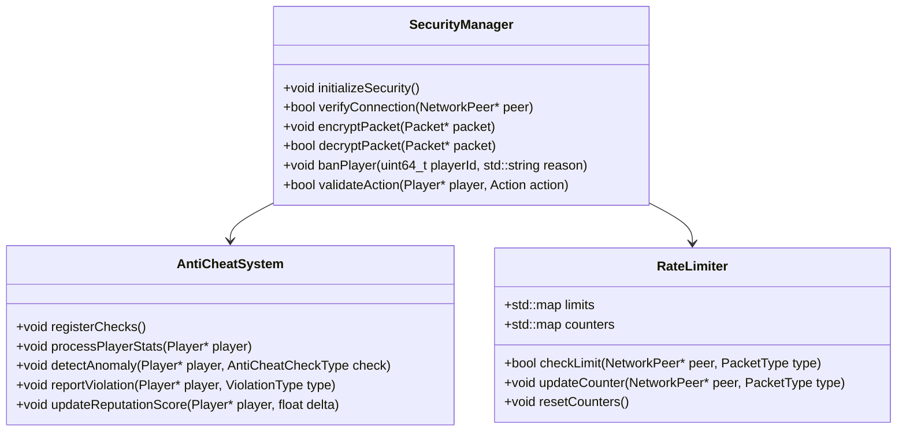

## Server Administration

Tools for managing the multiplayer environment:

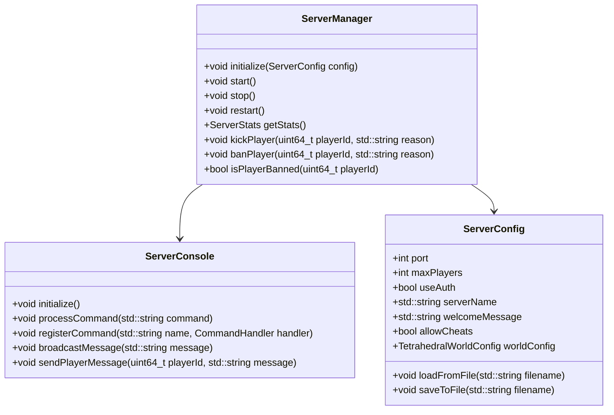

## Peer-to-Peer Mode

For smaller games, QuadCraft supports peer-to-peer connectivity:

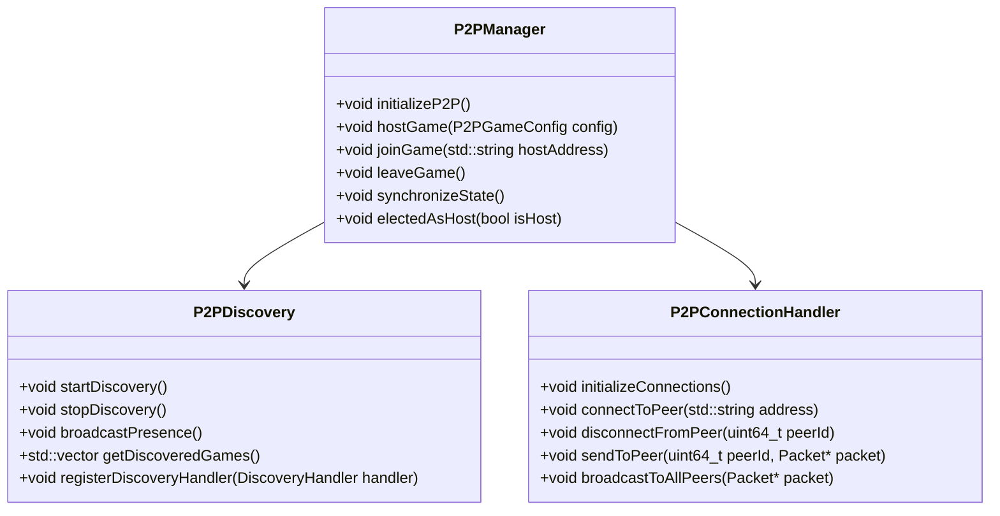

## Example Code: Action Synchronization

Here's an example of how player actions are synchronized across the network:

```cpp
// Client-side action handling
void PlayerActionSystem::performAction(ActionType type, const ActionData& data) {
    // Create action packet
    PlayerActionPacket packet;
    packet.type = type;
    packet.data = data;
    packet.sequence = nextActionSequence++;
    packet.timestamp = getCurrentTime();
    
    // Store action for potential reconciliation
    pendingActions[packet.sequence] = {
        .packet = packet,
        .appliedLocally = false
    };
    
    // Apply immediately on client for responsiveness
    if (canApplyLocally(type)) {
        applyActionLocally(packet);
        pendingActions[packet.sequence].appliedLocally = true;
    }
    
    // Send to server
    networkManager->sendPacket(&packet, DeliveryMethod::RELIABLE_ORDERED);
}

// Server-side action handling
void ServerActionHandler::handlePlayerAction(
    NetworkPeer* peer, PlayerActionPacket* packet) {
    
    // Get player associated with this peer
    Player* player = getPlayerByPeerId(peer->getId());
    if (!player) return;
    
    // Validate action
    if (!isActionValid(player, packet)) {
        // Invalid action - log and potentially take anti-cheat measures
        logInvalidAction(player, packet);
        return;
    }
    
    // Process the action on server
    ActionResult result = processAction(player, packet);
    
    // Send acknowledgment to client
    ActionAckPacket ack;
    ack.sequence = packet->sequence;
    ack.result = result.success;
    ack.resultData = result.data;
    
    networkManager->sendPacket(peer, &ack, DeliveryMethod::RELIABLE_ORDERED);
    
    // Broadcast to other players if needed
    if (shouldBroadcastAction(packet->type)) {
        broadcastActionToRelevantPlayers(player, packet, result);
    }
}

// Client-side acknowledgment handling
void PlayerActionSystem::handleActionAck(ActionAckPacket* packet) {
    // Find the pending action
    auto it = pendingActions.find(packet->sequence);
    if (it == pendingActions.end()) return;
    
    PendingAction& action = it->second;
    
    // Check if server denied the action
    if (!packet->result) {
        // Rollback the locally applied action if needed
        if (action.appliedLocally) {
            rollbackAction(action.packet);
        }
        
        // Apply the server's state
        applyServerActionResult(action.packet, packet->resultData);
    }
    
    // Remove from pending actions
    pendingActions.erase(it);
}
```

## Multiplayer Sessions and Matchmaking

For public servers, QuadCraft includes session management:

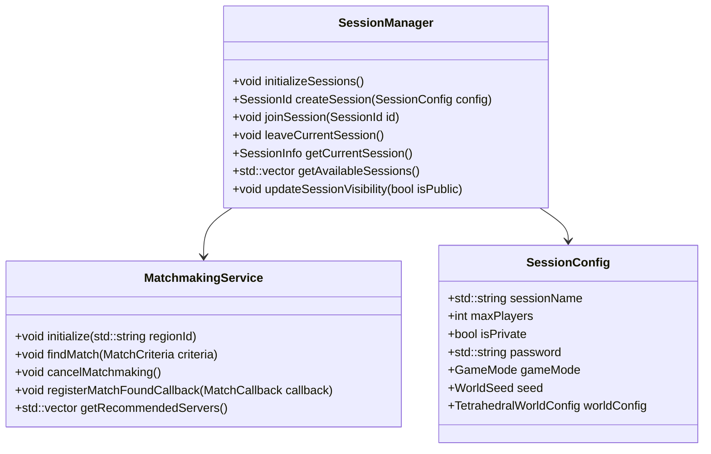

## Conclusion

QuadCraft's multiplayer system addresses the unique challenges of synchronizing a tetrahedral world across the network. Through specialized compression techniques, predictive algorithms, and a hybrid authority model, players can enjoy a responsive experience despite the complex geometry of the game world. The system's modular design allows it to scale from small peer-to-peer games to large dedicated servers, while maintaining security and performance. 