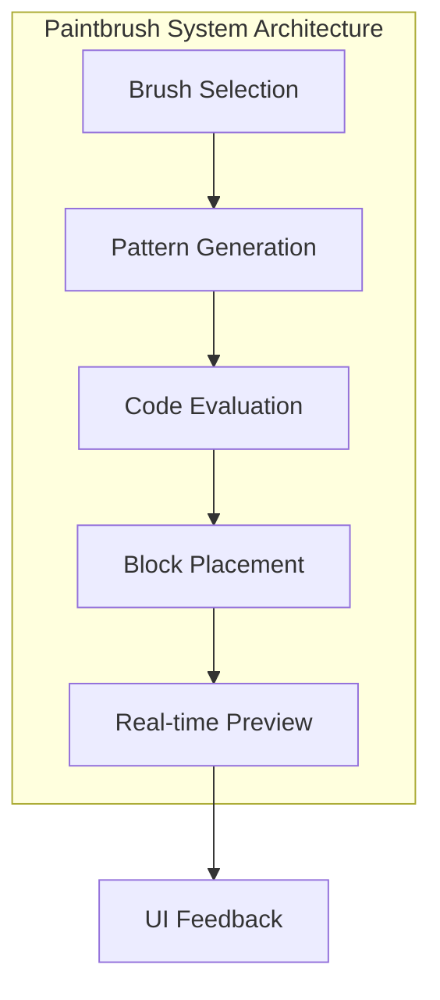

# Paintbrush System

This document details the sophisticated paintbrush system implemented in QuadCraft's JavaScript version, providing a flexible and powerful tool for creating and manipulating tetrahedral structures with customizable patterns and real-time code evaluation.

## Overview

The paintbrush system is a core gameplay mechanic that allows players to paint, erase, and manipulate blocks in the tetrahedral world using various patterns and tools. Unlike simple single-block placement, the paintbrush system supports complex patterns, customizable brushes, and even real-time JavaScript code execution for dynamic patterns.



## Core Paintbrush Types

### Built-in Paintbrush Patterns

```javascript
// Predefined paintbrush patterns
const paintbrushes = {
    // Single ball placement
    oneBall: {
        balls: [Q(0,0,0,0)]
    },

    // Linear patterns
    repeatA2: {
        balls: [Q(0,0,0,0), Directions.a]
    },

    repeatA3: {
        balls: [Q(0,0,0,0), Directions.a, Directions.a.add(Directions.a)]
    },

    // Complex directional pattern
    distance1: {
        balls: [
            Q(0,0,0,0), Directions.a, Directions.q,
            Directions.s, Directions.w,
            Directions.d, Directions.e,
            Directions.f, Directions.r,
            Directions.g, Directions.t,
            Directions.h, Directions.y
        ]
    },

    // Random pattern
    getRandomBallsPaintbrush: {
        getBalls: () => {
            const balls = [];
            for (let i = 0; i < Math.random() * 10 + 5; i++) {
                balls.push(Q(
                    Math.random() * 4 - 2,
                    Math.random() * 4 - 2,
                    Math.random() * 4 - 2,
                    Math.random() * 4 - 2
                ).nearestCCP());
            }
            return balls;
        }
    }
};
```

### Dynamic Paintbrush Selection

```javascript
// Paintbrush selection interface
function createPaintbrushSelector() {
    const select = document.getElementById('paintbrushSelect');

    // Clear existing options
    select.innerHTML = '';

    // Add built-in paintbrushes
    Object.keys(paintbrushes).forEach(name => {
        const option = document.createElement('option');
        option.value = name;
        option.textContent = name;
        select.appendChild(option);
    });

    // Set initial selection
    select.value = 'oneBall';

    // Handle selection changes
    select.addEventListener('change', () => {
        updatePaintbrushPreview();
        updateBrushStats();
    });
}

function getSelectedPaintbrush() {
    const select = document.getElementById('paintbrushSelect');
    return paintbrushes[select.value];
}
```

## Real-time Code Evaluation

### JavaScript Code Execution System

```javascript
// Code evaluation textarea interface
function createCodeEvaluationInterface() {
    const textarea = document.getElementById('textBoxToEval');

    // Set up example code
    textarea.value = `// Example: Fill a 5x5x5 cube
fillGridByFunc(selq, 5, q => {
    let xyz = q.toCartesian();
    let x = xyz[0], y = xyz[1], z = xyz[2];
    return Math.abs(x) <= 2.5 &&
           Math.abs(y) <= 2.5 &&
           Math.abs(z) <= 2.5;
});`;

    // Add execute button
    const button = document.createElement('button');
    button.textContent = 'Execute Code';
    button.onclick = () => executeUserCode(textarea.value);
    textarea.parentNode.appendChild(button);
}

function executeUserCode(code) {
    try {
        console.log('Executing:', code);

        // Create safe execution context
        const safeContext = createSafeExecutionContext();

        // Execute the code
        const result = Function(...Object.keys(safeContext), code)(...Object.values(safeContext));

        console.log('Result:', result);

        // Update UI with success
        showCodeExecutionResult('success', result);

    } catch (error) {
        console.error('Code execution error:', error);
        showCodeExecutionResult('error', error.message);
    }
}
```

### Safe Execution Context

```javascript
function createSafeExecutionContext() {
    return {
        // Core QuadCraft functions
        Q: (a, b, c, d) => new Quadray(a, b, c, d),
        selq: selq,  // Current selection
        Directions: Directions,
        targetQ: targetQ,

        // Grid manipulation functions
        fillGridByFunc: fillGridByFunc,
        AddBall: AddBall,
        RemBall: RemBall,
        ToggleBall: ToggleBall,

        // Math utilities
        Math: Math,
        console: console,

        // Utility functions
        gridDotsNear: gridDotsNear,
        AddColoredDots: AddColoredDots,
        nearestCCPRawXyz: nearestCCPRawXyz
    };
}
```

## Advanced Pattern Generation

### Procedural Pattern Creation

```javascript
// Create patterns using mathematical functions
function createSphericalPattern(center, radius, density = 1) {
    const balls = [];

    for (let x = -radius; x <= radius; x += density) {
        for (let y = -radius; y <= radius; y += density) {
            for (let z = -radius; z <= radius; z += density) {
                if (x*x + y*y + z*z <= radius*radius) {
                    const q = Quadray.fromCartesian([x, y, z]).add(center);
                    balls.push(q.nearestCCP());
                }
            }
        }
    }

    return { balls };
}

// Create helical pattern
function createHelicalPattern(center, height, radius, turns = 1) {
    const balls = [];
    const steps = 50;

    for (let i = 0; i <= steps; i++) {
        const t = (i / steps) * turns * 2 * Math.PI;
        const y = (i / steps) * height - height / 2;

        const x = Math.cos(t) * radius;
        const z = Math.sin(t) * radius;

        const q = Quadray.fromCartesian([x, y, z]).add(center);
        balls.push(q.nearestCCP());
    }

    return { balls };
}
```

### Noise-Based Patterns

```javascript
// Create organic patterns using noise
function createNoisePattern(center, size, threshold = 0.5, scale = 0.1) {
    const balls = [];

    for (let x = -size; x <= size; x++) {
        for (let y = -size; y <= size; y++) {
            for (let z = -size; z <= size; z++) {
                const noise = simplex3(x * scale, y * scale, z * scale);
                if (Math.abs(noise) > threshold) {
                    const q = Quadray.fromCartesian([x, y, z]).add(center);
                    balls.push(q.nearestCCP());
                }
            }
        }
    }

    return { balls };
}
```

## Paintbrush Operations

### Paint Operation

```javascript
function paint(targetQuadray, paintbrush, isPaintElseUnpaint) {
    console.log('Paint at', targetQuadray, 'isPaintElseUnpaint:', isPaintElseUnpaint);
    console.log('Paintbrush keys:', Object.keys(paintbrush));

    // Handle random paintbrush
    if (paintbrush.getBalls) {
        const balls = paintbrush.getBalls();
        return paintWithBalls(targetQuadray, balls, isPaintElseUnpaint);
    }

    // Handle function-based paintbrush
    if (paintbrush.func) {
        paintbrush.func(isPaintElseUnpaint);
        return;
    }

    // Handle ball-based paintbrush
    if (paintbrush.balls) {
        return paintWithBalls(targetQuadray, paintbrush.balls, isPaintElseUnpaint);
    }

    // Handle octahedron paintbrush
    if (paintbrush.octahedrons) {
        for (const octQ of paintbrush.octahedrons) {
            if (isPaintElseUnpaint) {
                addOctAtQuadray(targetQuadray.add(octQ));
            } else {
                console.warn('TODO: Remove octahedron at', targetQuadray);
            }
        }
        return;
    }

    // Handle tetrahedron paintbrushes
    if (paintbrush.tetrahedronZs) {
        for (const tetQ of paintbrush.tetrahedronZs) {
            if (isPaintElseUnpaint) {
                addTetZAtQuadray(targetQuadray.add(tetQ));
            } else {
                console.warn('TODO: Remove tetrahedronZ at', targetQuadray);
            }
        }
        return;
    }

    if (paintbrush.tetrahedronCs) {
        for (const tetQ of paintbrush.tetrahedronCs) {
            if (isPaintElseUnpaint) {
                addTetCAtQuadray(targetQuadray.add(tetQ));
            } else {
                console.warn('TODO: Remove tetrahedronC at', targetQuadray);
            }
        }
        return;
    }
}

function paintWithBalls(targetQuadray, balls, isPaintElseUnpaint) {
    for (const ballQ of balls) {
        const finalQ = targetQuadray.add(ballQ);

        if (isPaintElseUnpaint) {
            AddBall(finalQ);
        } else {
            RemBall(finalQ);
        }
    }
}
```

### Fill Operations

```javascript
// Fill grid using function-based criteria
function fillGridByFunc(centerQ, hops, func) {
    const gridQuadrays = gridDotsNear(centerQ, hops);
    let countOctYes = 0, countOctNo = 0;
    let countTetZYes = 0, countTetZNo = 0;
    let countTetCYes = 0, countTetCNo = 0;

    for (const q of gridQuadrays) {
        // Test octahedron placement
        if (func(q.add(toOctCenter))) {
            addOctAtQuadray(q);
            countOctYes++;
        } else {
            countOctNo++;
        }

        // Test tetrahedron Z placement
        if (func(q.add(toTetZCenter))) {
            addTetZAtQuadray(q);
            countTetZYes++;
        } else {
            countTetZNo++;
        }

        // Test tetrahedron C placement
        if (func(q.add(toTetCCenter))) {
            addTetCAtQuadray(q);
            countTetCYes++;
        } else {
            countTetCNo++;
        }
    }

    return `fillGridByFunc matched ${countOctYes}/${countTetZYes}/${countTetCYes} of ${countOctYes+countOctNo}/${countTetZYes+countTetZNo}/${countTetCYes+countTetCNo} octahedrons/tetrahedronZs/tetrahedronCs`;
}
```

## User Interface Integration

### Paintbrush Selection UI

```javascript
function createPaintbrushUI() {
    // Create paintbrush selector
    const selector = document.createElement('select');
    selector.id = 'paintbrushSelect';
    selector.size = 8;
    selector.style.minWidth = '170px';

    // Populate with paintbrush options
    Object.keys(paintbrushes).forEach(name => {
        const option = document.createElement('option');
        option.value = name;
        option.textContent = name;
        selector.appendChild(option);
    });

    // Add change handler
    selector.onchange = () => {
        updatePaintbrushPreview();
        updateBrushStats();
    };

    return selector;
}
```

### Code Evaluation Interface

```javascript
function createCodeEvaluationUI() {
    const container = document.createElement('div');
    container.id = 'codeEvaluationContainer';

    // Create textarea for code input
    const textarea = document.createElement('textarea');
    textarea.id = 'textBoxToEval';
    textarea.rows = 10;
    textarea.cols = 40;
    textarea.placeholder = '// Enter JavaScript code here\n// Example: AddBall(selq);';

    // Add example code
    textarea.value = `// Example: Add a ball at current position
AddBall(selq);

// Example: Fill a spherical area
fillGridByFunc(selq, 3, q => {
    const dist = q.distance(selq);
    return dist <= 2;
});`;

    // Create execute button
    const executeBtn = document.createElement('button');
    executeBtn.textContent = 'Execute Code';
    executeBtn.onclick = () => executeUserCode(textarea.value);

    // Create clear button
    const clearBtn = document.createElement('button');
    clearBtn.textContent = 'Clear';
    clearBtn.onclick = () => textarea.value = '';

    // Assemble UI
    container.appendChild(textarea);
    container.appendChild(document.createElement('br'));
    container.appendChild(executeBtn);
    container.appendChild(clearBtn);

    return container;
}
```

### Real-time Preview System

```javascript
function createPreviewSystem() {
    let previewBalls = new Set();

    function updatePreview() {
        // Clear previous preview
        previewBalls.forEach(q => RemBall(q));
        previewBalls.clear();

        // Get current paintbrush
        const paintbrush = getSelectedPaintbrush();
        if (!paintbrush || !paintbrush.balls) return;

        // Add preview balls
        const target = targetQ();
        paintbrush.balls.forEach(ballQ => {
            const previewQ = target.add(ballQ);
            AddBall(previewQ);
            previewBalls.add(previewQ);
        });
    }

    function clearPreview() {
        previewBalls.forEach(q => RemBall(q));
        previewBalls.clear();
    }

    return { updatePreview, clearPreview };
}
```

## Performance Optimization

### Brush Caching

```javascript
class BrushCache {
    constructor() {
        this.cache = new Map();
        this.maxCacheSize = 100;
    }

    getCachedBrush(name, parameters) {
        const key = this.generateCacheKey(name, parameters);

        if (this.cache.has(key)) {
            return this.cache.get(key);
        }

        const brush = this.generateBrush(name, parameters);
        this.cache.set(key, brush);

        // Clean up cache if too large
        if (this.cache.size > this.maxCacheSize) {
            this.evictOldest();
        }

        return brush;
    }

    generateCacheKey(name, parameters) {
        return `${name}_${JSON.stringify(parameters)}`;
    }

    generateBrush(name, parameters) {
        // Generate brush based on name and parameters
        switch (name) {
            case 'spherical':
                return createSphericalPattern(parameters.center, parameters.radius);
            case 'helical':
                return createHelicalPattern(parameters.center, parameters.height, parameters.radius);
            case 'noise':
                return createNoisePattern(parameters.center, parameters.size, parameters.threshold);
            default:
                return paintbrushes[name];
        }
    }

    evictOldest() {
        const keys = Array.from(this.cache.keys());
        const toRemove = keys.slice(0, Math.floor(keys.length / 2));
        toRemove.forEach(key => this.cache.delete(key));
    }
}
```

### Batch Operations

```javascript
// Perform batch paint operations for better performance
function batchPaintOperations(operations) {
    const startTime = performance.now();

    operations.forEach(op => {
        const { targetQ, paintbrush, isPaint } = op;

        if (paintbrush.balls) {
            paintbrush.balls.forEach(ballQ => {
                const finalQ = targetQ.add(ballQ);
                if (isPaint) {
                    AddBall(finalQ);
                } else {
                    RemBall(finalQ);
                }
            });
        }
    });

    const endTime = performance.now();
    console.log(`Batch paint completed in ${endTime - startTime}ms for ${operations.length} operations`);
}
```

## Advanced Paintbrush Features

### Custom Pattern Generators

```javascript
// Create custom pattern using mathematical functions
function createCustomPattern(generatorFunction, size) {
    const balls = [];

    for (let x = -size; x <= size; x++) {
        for (let y = -size; y <= size; y++) {
            for (let z = -size; z <= size; z++) {
                if (generatorFunction(x, y, z)) {
                    const q = Quadray.fromCartesian([x, y, z]);
                    balls.push(q.nearestCCP());
                }
            }
        }
    }

    return { balls };
}

// Example custom generators
const generators = {
    // Checkerboard pattern
    checkerboard: (x, y, z) => (Math.floor(x) + Math.floor(y) + Math.floor(z)) % 2 === 0,

    // Spherical shell
    sphericalShell: (x, y, z) => {
        const r = Math.sqrt(x*x + y*y + z*z);
        return Math.abs(r - 5) < 1;
    },

    // Fractal pattern (Mandelbulb-like)
    mandelbulb: (x, y, z) => {
        let zx = x, zy = y, zz = z;
        let iterations = 0;
        const maxIterations = 10;

        while (iterations < maxIterations && zx*zx + zy*zy + zz*zz < 2) {
            const r = Math.sqrt(zx*zx + zy*zy + zz*zz);
            const theta = Math.atan2(Math.sqrt(zx*zx + zy*zy), zz);
            const phi = Math.atan2(zy, zx);

            const newR = r * r * r;
            const newTheta = theta * 2;
            const newPhi = phi * 2;

            zx = newR * Math.sin(newTheta) * Math.cos(newPhi);
            zy = newR * Math.sin(newTheta) * Math.sin(newPhi);
            zz = newR * Math.cos(newTheta);

            iterations++;
        }

        return iterations === maxIterations;
    }
};
```

### Dynamic Paintbrushes

```javascript
// Create paintbrushes that change over time
function createAnimatedPaintbrush(basePattern, animationFunction) {
    return {
        getBalls: (time) => {
            const animatedPattern = animationFunction(basePattern, time);
            return animatedPattern.balls;
        }
    };
}

// Example animation functions
const animations = {
    // Rotating pattern
    rotate: (pattern, time) => {
        const rotationSpeed = 0.1;
        const angle = time * rotationSpeed;

        const rotatedBalls = pattern.balls.map(q => {
            const xyz = q.toCartesian();
            const x = xyz[0] * Math.cos(angle) - xyz[2] * Math.sin(angle);
            const z = xyz[0] * Math.sin(angle) + xyz[2] * Math.cos(angle);
            return Quadray.fromCartesian([x, xyz[1], z]).nearestCCP();
        });

        return { balls: rotatedBalls };
    },

    // Pulsing pattern
    pulse: (pattern, time) => {
        const pulseSpeed = 2;
        const scale = 1 + 0.5 * Math.sin(time * pulseSpeed);

        const pulsedBalls = pattern.balls.map(q => {
            const xyz = q.toCartesian();
            const scaledXyz = [xyz[0] * scale, xyz[1] * scale, xyz[2] * scale];
            return Quadray.fromCartesian(scaledXyz).nearestCCP();
        });

        return { balls: pulsedBalls };
    }
};
```

## Integration with Game Systems

### Gamepad Integration

```javascript
// Gamepad controls for paintbrush system
function handleGamepadPaintbrushControl(state, dt) {
    // Left/Right bumpers for paint/unpaint
    if (state.getButton(4) > 0.5) { // Left bumper
        paint(targetQ(), getSelectedPaintbrush(), false); // Unpaint
    }
    if (state.getButton(5) > 0.5) { // Right bumper
        paint(targetQ(), getSelectedPaintbrush(), true);  // Paint
    }

    // D-pad for paintbrush selection
    if (state.isButtonPressed(12)) { // D-pad up
        selectNextPaintbrush();
    }
    if (state.isButtonPressed(13)) { // D-pad down
        selectPreviousPaintbrush();
    }

    // Left trigger for fine control mode
    const fineControl = state.getButton(6);
    if (fineControl > 0.5) {
        enableFineControlMode();
    } else {
        disableFineControlMode();
    }
}
```

### Undo/Redo System

```javascript
class PaintHistory {
    constructor(maxHistory = 100) {
        this.history = [];
        this.currentIndex = -1;
        this.maxHistory = maxHistory;
    }

    recordOperation(operation) {
        // Remove any operations after current index (for new branch)
        this.history = this.history.slice(0, this.currentIndex + 1);

        // Add new operation
        this.history.push(operation);
        this.currentIndex++;

        // Limit history size
        if (this.history.length > this.maxHistory) {
            this.history.shift();
            this.currentIndex--;
        }
    }

    undo() {
        if (this.currentIndex >= 0) {
            const operation = this.history[this.currentIndex];
            this.undoOperation(operation);
            this.currentIndex--;
        }
    }

    redo() {
        if (this.currentIndex < this.history.length - 1) {
            this.currentIndex++;
            const operation = this.history[this.currentIndex];
            this.redoOperation(operation);
        }
    }

    undoOperation(operation) {
        // Reverse the operation
        operation.balls.forEach(q => {
            if (operation.type === 'paint') {
                RemBall(q);
            } else {
                AddBall(q);
            }
        });
    }

    redoOperation(operation) {
        // Replay the operation
        operation.balls.forEach(q => {
            if (operation.type === 'paint') {
                AddBall(q);
            } else {
                RemBall(q);
            }
        });
    }
}
```

## Future Enhancements

### Planned Features

1. **3D Paintbrush Editor**: Visual editor for creating custom paintbrush patterns
2. **Brush Sharing**: Export/import paintbrushes between users
3. **Layer System**: Multiple layers for complex constructions
4. **Brush Animation**: Time-based animation of paintbrush patterns
5. **Procedural Generation**: AI-generated paintbrush patterns
6. **Multiplayer Brushes**: Collaborative painting with shared brushes
7. **Brush Marketplace**: Community-created brush sharing platform

### Research Directions

1. **Generative Patterns**: Machine learning-based pattern generation
2. **Physical Simulation**: Paintbrushes that simulate real painting tools
3. **Material Properties**: Brushes that respect material properties
4. **Haptic Painting**: Force feedback for different brush types
5. **VR Paintbrushes**: Specialized brushes for VR environments

## Conclusion

The paintbrush system in QuadCraft represents a significant advancement in voxel editing tools, combining intuitive controls with powerful customization options. Through the integration of real-time code evaluation, sophisticated pattern generation, and comprehensive user interface design, the system enables both novice users and advanced creators to express their creativity in the tetrahedral world. The combination of built-in brushes, procedural generation, and JavaScript-based customization makes it a uniquely flexible and powerful tool for tetrahedral construction.
