# QuadCraft Physics System

> [!IMPORTANT]
> **Design Specification Status**: This document outlines the *architectural design* and *planned implementation* of the C++ Physics System. As of the current version, the core C++ physics engine (`src/core/physics`) is in active development. Current collision handling may rely on simplified logic or client-side JavaScript implementations. This guide serves as the canonical reference for the specific algorithms and class structures to be implemented.

This document details the physics system in QuadCraft, focusing on how collision detection and physical interactions are implemented in a tetrahedral world.

## Physics System Overview

QuadCraft's physics system is designed to handle the unique challenges of simulating physics in a tetrahedral environment. Unlike traditional cubic voxel games, collision detection and response require special consideration due to the non-uniform geometry of tetrahedra.

```mermaid
graph TD
    subgraph "Physics System Architecture"
        PhysicsEngine["Physics Engine"]
        CollisionSystem["Collision System"]
        RigidBodySystem["Rigid Body System"]
        ForceSystem["Force System"]
        ConstraintSystem["Constraint System"]
    end
    
    PhysicsEngine --> PhysicsWorld["Physics World"]
    PhysicsEngine --> PhysicsSimulation["Physics Simulation"]
    PhysicsEngine --> TimeStep["Time Step Control"]
    
    CollisionSystem --> TetraCollision["Tetrahedral Collision"]
    CollisionSystem --> BroadPhase["Broad Phase"]
    CollisionSystem --> NarrowPhase["Narrow Phase"]
    
    RigidBodySystem --> EntityBodies["Entity Bodies"]
    RigidBodySystem --> BlockBodies["Block Bodies"]
    
    ForceSystem --> Gravity["Gravity"]
    ForceSystem --> Impulses["Impulses"]
    ForceSystem --> Friction["Friction"]
    
    ConstraintSystem --> Joints["Joints"]
    ConstraintSystem --> Contacts["Contacts"]
```

## Tetrahedral Physics Properties

The tetrahedral world presents unique physical properties that the system must handle:

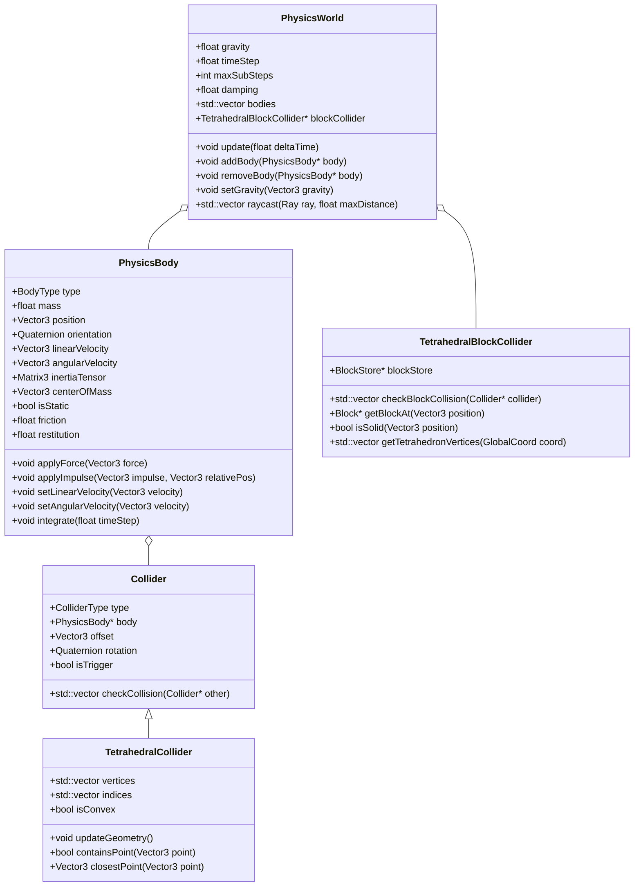

Each tetrahedral block and entity in the physics system has the following key properties:

- **Different Face Orientations**: Tetrahedral blocks have four triangular faces, each with a different orientation.
- **Non-uniform Collisions**: Collision responses must account for the angular nature of tetrahedral geometry.
- **Asymmetric Movement**: Movement through tetrahedral space leads to asymmetric collision patterns.
- **Varied Block Connectivity**: Tetrahedra connect in complex ways, requiring specialized collision handling.

## Collision Detection

The collision detection system is specialized for tetrahedral geometry:

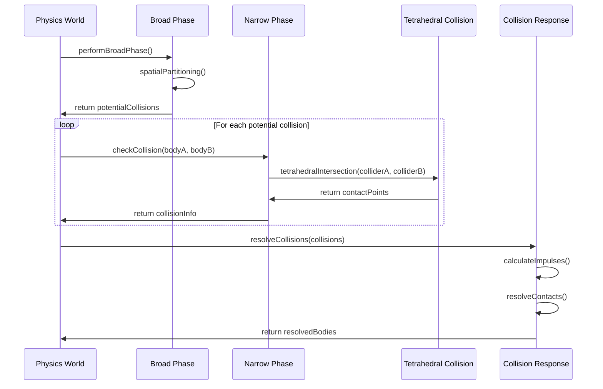

### Broad Phase Collision

The broad phase aims to efficiently eliminate pairs of objects that cannot possibly collide:

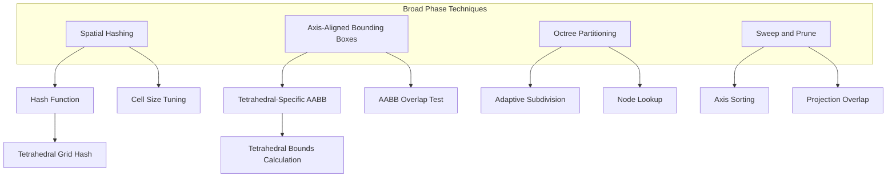

The tetrahedral spatial hashing is optimized for the unique geometry:

```cpp
// Spatial hash function for tetrahedral space
uint64_t spatialHashTetra(const Vector3& position, float cellSize) {
    // Convert to tetrahedral grid coordinates
    int x = static_cast<int>(floor(position.x / cellSize));
    int y = static_cast<int>(floor(position.y / cellSize));
    int z = static_cast<int>(floor(position.z / cellSize));
    
    // Special handling for tetrahedral alignment
    if ((x + y + z) % 2 != 0) {
        // Adjust to ensure proper tetrahedral grid alignment
        z += 1;
    }
    
    // Combine into a single hash
    return ((x * 73856093) ^ (y * 19349663) ^ (z * 83492791)) % HASH_TABLE_SIZE;
}
```

### Narrow Phase Collision

The narrow phase performs detailed collision detection between tetrahedral shapes:

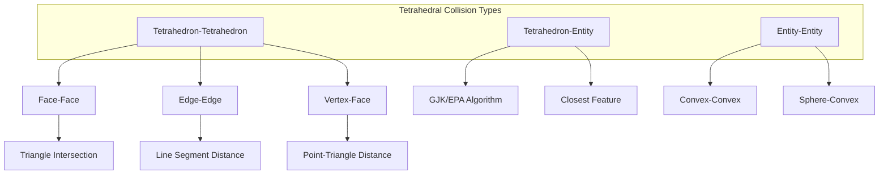

Tetrahedral collision resolution requires specialized algorithms:

```cpp
// Check collision between two tetrahedral blocks
std::vector<ContactPoint> checkTetraToTetraCollision(
    const Tetrahedron& tetraA, 
    const Tetrahedron& tetraB) {
    
    std::vector<ContactPoint> contacts;
    
    // Check each vertex of A against all faces of B
    for (int i = 0; i < 4; i++) {
        Vector3 vertex = tetraA.vertices[i];
        
        for (int j = 0; j < 4; j++) {
            Triangle face = tetraB.getFace(j);
            
            if (isPointInTetrahedron(vertex, tetraB)) {
                // Found penetration - vertex of A is inside B
                Vector3 normal = face.normal;
                float depth = pointTriangleDistance(vertex, face);
                
                contacts.push_back(ContactPoint{
                    .point = vertex,
                    .normal = normal,
                    .depth = depth
                });
            }
        }
    }
    
    // Check each vertex of B against all faces of A (similar to above)
    // Check each edge of A against each edge of B
    // ...
    
    return contacts;
}
```

## Collision Response

After detecting collisions, the system must respond to them appropriately:

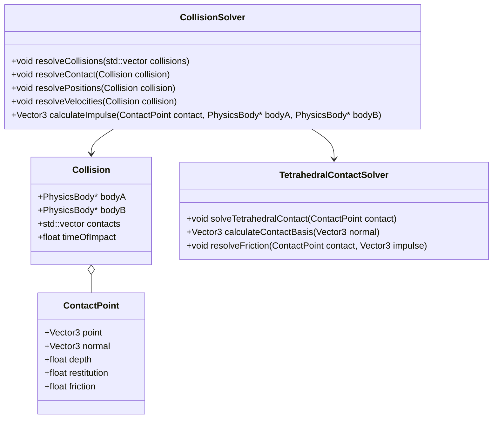

The specialized solver for tetrahedral collisions:

```cpp
// Resolve collision between physics bodies
void resolveCollision(PhysicsBody* bodyA, PhysicsBody* bodyB, 
                      const ContactPoint& contact) {
    
    // Skip if both bodies are static
    if (bodyA->isStatic && bodyB->isStatic) return;
    
    // Calculate relative velocity at the contact point
    Vector3 relVelA = bodyA->linearVelocity + 
                    cross(bodyA->angularVelocity, 
                          contact.point - bodyA->position);
                      
    Vector3 relVelB = bodyB->linearVelocity + 
                    cross(bodyB->angularVelocity, 
                          contact.point - bodyB->position);
                      
    Vector3 relVel = relVelA - relVelB;
    
    // Calculate normal impulse
    float velAlongNormal = dot(relVel, contact.normal);
    
    // Only resolve if objects are moving toward each other
    if (velAlongNormal > 0) return;
    
    // Calculate restitution (bounciness)
    float e = min(bodyA->restitution, bodyB->restitution);
    
    // Calculate impulse scalar
    float j = -(1 + e) * velAlongNormal;
    j /= bodyA->inverseMass + bodyB->inverseMass;
    
    // Apply impulse
    Vector3 impulse = j * contact.normal;
    
    if (!bodyA->isStatic) {
        bodyA->linearVelocity += impulse * bodyA->inverseMass;
        bodyA->angularVelocity += bodyA->inverseInertiaTensor * 
                                cross(contact.point - bodyA->position, impulse);
    }
    
    if (!bodyB->isStatic) {
        bodyB->linearVelocity -= impulse * bodyB->inverseMass;
        bodyB->angularVelocity -= bodyB->inverseInertiaTensor * 
                                cross(contact.point - bodyB->position, impulse);
    }
    
    // Handle friction (simplified)
    // ...
}
```

## Movement in Tetrahedral Space

Movement through tetrahedral space requires specialized handling:

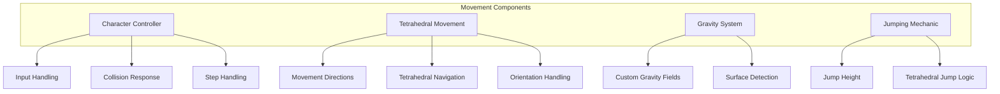

The character controller optimized for tetrahedral space:

```cpp
// Update character movement in tetrahedral space
void TetrahedralCharacterController::update(float deltaTime) {
    // Apply gravity
    if (!isGrounded) {
        velocity += gravity * deltaTime;
    }
    
    // Calculate movement direction in tetrahedral space
    Vector3 moveDir = calculateTetrahedralMoveDirection(inputDirection);
    
    // Apply movement
    Vector3 targetPosition = position + (moveDir * speed * deltaTime) + 
                             (velocity * deltaTime);
    
    // Perform tetrahedral collision detection and response
    TetrahedralCollisionResult collision = checkTetrahedralCollision(
        position, targetPosition, characterRadius);
    
    // Update position based on collision result
    position = collision.adjustedPosition;
    
    // Handle ground detection
    isGrounded = collision.isGrounded;
    if (isGrounded) {
        velocity.y = max(0.0f, velocity.y);
    }
    
    // Check for sliding
    if (collision.isSliding) {
        velocity = calculateSlideVelocity(velocity, collision.slideNormal);
    }
    
    // Check for step-up
    if (collision.canStepUp) {
        position.y += stepHeight;
    }
    
    // Update the physics body
    physicsBody->position = position;
    physicsBody->linearVelocity = velocity;
}
```

### Raycasting in Tetrahedral Space

Raycasting is an essential part of the physics system, used for various purposes including collision detection, line-of-sight checking, and player interaction:

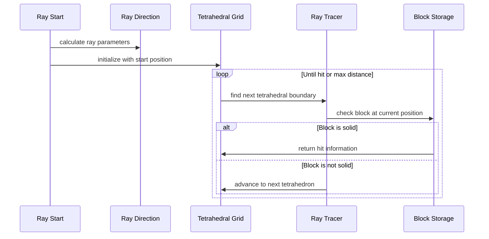

Implementing raycasting through tetrahedral space requires a specialized algorithm:

```cpp
// Raycast through tetrahedral space
RaycastResult raycastTetrahedral(
    const Vector3& origin, 
    const Vector3& direction, 
    float maxDistance) {
    
    RaycastResult result;
    result.hit = false;
    
    // Convert start position to tetrahedral coordinates
    GlobalCoord startCoord = coordinateSystem.worldToGlobal(origin);
    
    // Initialize traversal variables
    Vector3 currentPos = origin;
    Vector3 rayDir = normalize(direction);
    float distanceTraveled = 0.0f;
    
    // Get initial tetrahedron
    TetrahedronInfo currentTetra = getTetrahedronAt(startCoord);
    
    while (distanceTraveled < maxDistance) {
        // Find distance to nearest tetrahedral face
        float tMin = INFINITY;
        int exitFace = -1;
        Vector3 exitNormal;
        
        // Check each face of the current tetrahedron
        for (int i = 0; i < 4; i++) {
            Triangle face = currentTetra.getFace(i);
            float t = rayTriangleIntersection(currentPos, rayDir, face);
            
            if (t > 0 && t < tMin) {
                tMin = t;
                exitFace = i;
                exitNormal = face.normal;
            }
        }
        
        // Check if there's a block in the current tetrahedron
        Block* block = getBlockAt(currentTetra.coord);
        if (block && block->isSolid()) {
            // Hit a solid block
            result.hit = true;
            result.position = currentPos;
            result.normal = exitNormal;
            result.distance = distanceTraveled;
            result.blockCoord = currentTetra.coord;
            return result;
        }
        
        // Move to next tetrahedron
        if (tMin < INFINITY) {
            // Move slightly past the boundary to avoid precision issues
            currentPos = currentPos + rayDir * (tMin + EPSILON);
            distanceTraveled += tMin;
            
            // Get the neighboring tetrahedron
            currentTetra = getNeighborTetrahedron(currentTetra, exitFace);
        } else {
            // Something went wrong with the traversal
            break;
        }
    }
    
    return result;
}
```

## Block Physics Properties

Different block types in the tetrahedral world have various physical properties:

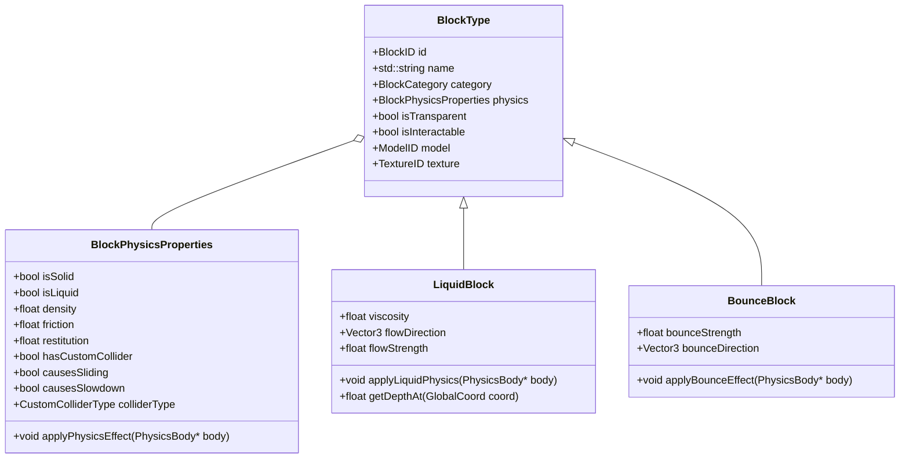

The physics engine handles special block types:

```cpp
// Apply physics effects from blocks to entities
void applyBlockPhysicsEffects(Entity* entity) {
    PhysicsBody* body = entity->getComponent<PhysicsComponent>()->body;
    Vector3 position = body->position;
    
    // Get the blocks the entity is in contact with
    std::vector<BlockContact> contacts = getBlockContacts(body);
    
    for (const auto& contact : contacts) {
        Block* block = contact.block;
        
        switch (block->getPhysicsType()) {
            case BlockPhysics::NORMAL:
                // Standard collision handling is done in collision response
                break;
                
            case BlockPhysics::LIQUID:
                // Apply buoyancy and drag
                float depth = getLiquidDepthAt(contact.position);
                float volume = body->getSubmergedVolume(depth);
                float density = block->getDensity();
                
                // Buoyancy force
                Vector3 buoyancy = Vector3(0, volume * density * 9.8f, 0);
                body->applyForce(buoyancy);
                
                // Liquid drag
                float dragCoeff = block->getDragCoefficient();
                Vector3 dragForce = -body->linearVelocity * dragCoeff * depth;
                body->applyForce(dragForce);
                break;
                
            case BlockPhysics::ICE:
                // Reduce friction
                body->setFriction(0.05f);
                break;
                
            case BlockPhysics::BOUNCY:
                // Increase restitution for bouncy surfaces
                body->setRestitution(0.9f);
                break;
                
            case BlockPhysics::CUSTOM:
                // Call custom physics handler
                block->applyCustomPhysics(body, contact);
                break;
        }
    }
}
```

## Physics Optimizations

The physics system includes several optimizations for tetrahedral space:

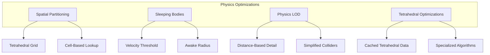

Optimizing tetrahedral physics calculations:

```cpp
// Optimize physics by using distance-based LOD
void updatePhysicsLOD(PhysicsBody* body, Vector3 playerPosition) {
    float distance = length(body->position - playerPosition);
    
    // Adjust physics detail based on distance
    if (distance < PHYSICS_HIGH_DETAIL_DISTANCE) {
        body->setSimulationLevel(PhysicsDetail::HIGH);
    } else if (distance < PHYSICS_MEDIUM_DETAIL_DISTANCE) {
        body->setSimulationLevel(PhysicsDetail::MEDIUM);
    } else {
        body->setSimulationLevel(PhysicsDetail::LOW);
    }
    
    // Adjust time step for distant objects
    if (distance > PHYSICS_REDUCED_RATE_DISTANCE) {
        body->updateFrequency = REDUCED_PHYSICS_RATE;
    } else {
        body->updateFrequency = NORMAL_PHYSICS_RATE;
    }
    
    // Simplify colliders for distant objects
    if (distance > PHYSICS_SIMPLIFIED_COLLIDER_DISTANCE) {
        body->useSimplifiedCollider = true;
    } else {
        body->useSimplifiedCollider = false;
    }
}
```

## Specialized Physics Challenges

The tetrahedral world presents unique physics challenges:

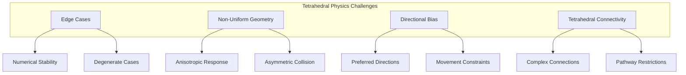

Solutions for these challenges include:

- **Robust Mathematical Methods**: Using numerically stable algorithms for tetrahedral calculations
- **Directional Normalization**: Adjusting physics responses to normalize directional bias
- **Multi-Resolution Techniques**: Using different resolutions for different simulation aspects
- **Specialized Collision Primitives**: Custom collision shapes optimized for tetrahedral space
- **Adaptive Time Stepping**: Varying simulation time steps based on the complexity of interactions

## Physics Integration with Game Systems

The physics system integrates with numerous other game systems:

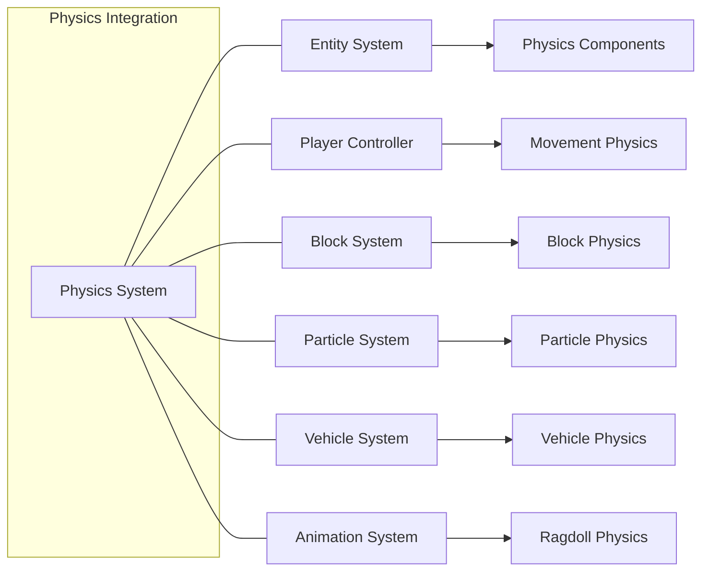

The physics system API allows for this integration:

```cpp
// Physics system API for other systems to use
class PhysicsSystemAPI {
public:
    // Entity system integration
    PhysicsBody* createBodyForEntity(Entity* entity, BodyType type);
    void destroyBodyForEntity(Entity* entity);
    
    // Block system integration
    void updateBlockColliders(GlobalCoord min, GlobalCoord max);
    bool isPositionClear(Vector3 position, float radius);
    
    // Character controller integration
    void moveCharacter(CharacterController* controller, Vector3 wishDir, float deltaTime);
    bool characterGroundCheck(CharacterController* controller);
    
    // General queries
    RaycastResult raycast(Vector3 start, Vector3 direction, float maxDistance);
    std::vector<PhysicsBody*> queryRadius(Vector3 center, float radius);
    
    // Physics settings
    void setGlobalGravity(Vector3 gravity);
    void setPhysicsTimeStep(float timeStep);
    void setNumIterations(int iterations);
    
    // Debug utilities
    void drawDebugShapes(bool enabled);
    void dumpPhysicsStats();
};
```

## Practical Examples

### Character Movement and Collision

```cpp
// Character movement with tetrahedral collision handling
void updateCharacterMovement(
    CharacterController* character,
    Vector3 inputDir,
    bool jumpPressed,
    float deltaTime) {
    
    // Get the character's physics component
    PhysicsBody* body = character->getPhysicsBody();
    
    // Calculate movement direction in world space
    Vector3 forward = character->getForwardVector();
    Vector3 right = character->getRightVector();
    Vector3 moveDir = normalize(forward * inputDir.z + right * inputDir.x);
    
    // Ground check
    bool isGrounded = physicsSystem.characterGroundCheck(character);
    character->setGrounded(isGrounded);
    
    // Apply movement forces
    if (isGrounded) {
        // Ground movement
        Vector3 targetVelocity = moveDir * character->getMoveSpeed();
        Vector3 velocityChange = targetVelocity - body->linearVelocity;
        velocityChange.y = 0; // Don't affect vertical velocity
        
        // Apply as force or directly set horizontal velocity
        body->linearVelocity.x = targetVelocity.x;
        body->linearVelocity.z = targetVelocity.z;
        
        // Handle jumping
        if (jumpPressed) {
            body->linearVelocity.y = character->getJumpStrength();
            character->setGrounded(false);
        }
    } else {
        // Air movement - reduced control
        Vector3 airAccel = moveDir * character->getAirAcceleration() * deltaTime;
        
        // Limit air acceleration
        Vector3 horizVelocity(body->linearVelocity.x, 0, body->linearVelocity.z);
        if (length(horizVelocity) < character->getMaxAirSpeed()) {
            body->linearVelocity.x += airAccel.x;
            body->linearVelocity.z += airAccel.z;
        }
        
        // Apply gravity
        body->linearVelocity.y += character->getGravity() * deltaTime;
    }
    
    // Special tetrahedral movement adjustments
    adjustForTetrahedralGeometry(character, moveDir);
}
```

### Block Placement and Physics Validation

```cpp
// Check if a block can be placed without causing physics overlaps
bool canPlaceBlockAt(GlobalCoord coord, BlockType blockType) {
    // Skip check if block type isn't solid
    if (!blockType.isSolid()) {
        return true;
    }
    
    // Get the tetrahedral shape of the block
    TetrahedralShape tetraShape = getTetrahedralShapeForBlock(coord);
    
    // Check for entity overlaps
    std::vector<PhysicsBody*> bodiesInRange = 
        physicsSystem.queryRadius(tetraShape.getCenter(), tetraShape.getBoundingRadius());
    
    for (PhysicsBody* body : bodiesInRange) {
        // Skip static bodies
        if (body->isStatic) continue;
        
        // Check for overlap with this specific tetrahedron
        if (tetrahedralOverlapTest(tetraShape, body->getCollider())) {
            return false; // Overlap found, can't place block
        }
    }
    
    // No overlapping entities found
    return true;
}
```

## Physics Debugging

The physics system includes debug visualization tools:

```cpp
// Debug visualization of physics objects
void drawPhysicsDebug(RenderContext* context) {
    if (!debugDrawEnabled) return;
    
    // Draw tetrahedral colliders
    for (auto& body : physicsBodies) {
        if (body->getColliderType() == ColliderType::TETRAHEDRAL) {
            TetrahedralCollider* collider = static_cast<TetrahedralCollider*>(body->getCollider());
            
            // Draw wireframe tetrahedron
            for (int i = 0; i < collider->getFaceCount(); i++) {
                Triangle face = collider->getFace(i);
                context->drawTriangle(
                    face.vertices[0], 
                    face.vertices[1], 
                    face.vertices[2], 
                    Color(0, 1, 0, 0.5f)
                );
            }
        }
    }
    
    // Draw contact points
    for (auto& contact : debugContacts) {
        context->drawSphere(contact.point, 0.05f, Color(1, 0, 0, 1));
        context->drawLine(
            contact.point, 
            contact.point + contact.normal * 0.2f, 
            Color(1, 1, 0, 1)
        );
    }
    
    // Draw raycast hits
    for (auto& hit : debugRaycasts) {
        context->drawLine(hit.origin, hit.hitPoint, Color(0, 0, 1, 1));
        context->drawSphere(hit.hitPoint, 0.05f, Color(0, 1, 1, 1));
    }
}
```

## Future Physics Improvements

The physics system has several areas planned for future enhancement:

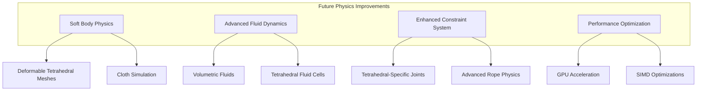

## Conclusion

The QuadCraft physics system provides a robust foundation for physical interactions in tetrahedral space. Through specialized algorithms for collision detection and response, the system enables realistic and consistent physical behavior despite the unique challenges of tetrahedral geometry. The integration with other game systems allows for complex interactions, while optimization techniques ensure good performance even with many dynamic objects.
