# Quaternion Camera System

This document details the advanced quaternion-based camera system implemented in QuadCraft's JavaScript version, providing smooth 3D navigation, gimbal lock prevention, and sophisticated camera controls for tetrahedral space exploration.

## Overview

The quaternion camera system replaces traditional Euler angle-based cameras with quaternion mathematics, providing smooth interpolation, consistent rotation behavior, and freedom from gimbal lock. This system is specifically designed to work with the tetrahedral coordinate system and integrates seamlessly with the cone-plane intersection rendering.

```mermaid
graph TD
    subgraph "Quaternion Camera Architecture"
        CameraState["Camera State"]
        InputProcessing["Input Processing"]
        QuaternionMath["Quaternion Mathematics"]
        MovementSystem["Movement System"]
        RenderingIntegration["Rendering Integration"]
    end

    CameraState --> Position["Position Vector"]
    CameraState --> Orientation["Orientation Quaternion"]
    CameraState --> ViewMatrix["View Matrix"]

    InputProcessing --> MouseInput["Mouse Input"]
    InputProcessing --> GamepadInput["Gamepad Input"]
    InputProcessing --> TouchInput["Touch Input"]

    QuaternionMath --> Rotation["Rotation Operations"]
    QuaternionMath --> Interpolation["Slerp/Lerp"]
    QuaternionMath --> Conversion["Matrix Conversion"]

    MovementSystem --> Translation["Translation"]
    MovementSystem --> Collision["Collision Detection"]
    MovementSystem --> Physics["Physics Integration"]

    RenderingIntegration --> Projection["Projection Matrix"]
    RenderingIntegration --> ConePlane["Cone-Plane Rendering"]
    RenderingIntegration --> Culling["View Frustum Culling"]
```



## Core Quaternion Mathematics

### Quaternion Fundamentals

```javascript
class Quaternion {
    constructor(w = 1, x = 0, y = 0, z = 0) {
        this.w = w;
        this.x = x;
        this.y = y;
        this.z = z;
    }

    // Create quaternion from axis-angle
    static fromAxisAngle(axis, angle) {
        const halfAngle = angle / 2;
        const sinHalf = Math.sin(halfAngle);
        const cosHalf = Math.cos(halfAngle);

        return new Quaternion(
            cosHalf,
            axis[0] * sinHalf,
            axis[1] * sinHalf,
            axis[2] * sinHalf
        );
    }

    // Create quaternion from Euler angles
    static fromEuler(yaw, pitch, roll) {
        const cy = Math.cos(yaw / 2);
        const sy = Math.sin(yaw / 2);
        const cp = Math.cos(pitch / 2);
        const sp = Math.sin(pitch / 2);
        const cr = Math.cos(roll / 2);
        const sr = Math.sin(roll / 2);

        return new Quaternion(
            cr * cp * cy + sr * sp * sy,
            sr * cp * cy - cr * sp * sy,
            cr * sp * cy + sr * cp * sy,
            cr * cp * sy - sr * sp * cy
        );
    }

    // Convert to rotation matrix
    toMatrix() {
        const w = this.w, x = this.x, y = this.y, z = this.z;

        return [
            1 - 2*y*y - 2*z*z,  2*x*y - 2*w*z,      2*x*z + 2*w*y,      0,
            2*x*y + 2*w*z,    1 - 2*x*x - 2*z*z,  2*y*z - 2*w*x,      0,
            2*x*z - 2*w*y,    2*y*z + 2*w*x,      1 - 2*x*x - 2*y*y,  0,
            0,                0,                  0,                  1
        ];
    }

    // Normalize quaternion
    normalize() {
        const length = Math.sqrt(this.w*this.w + this.x*this.x + this.y*this.y + this.z*this.z);
        if (length === 0) return new Quaternion(1, 0, 0, 0);

        return new Quaternion(
            this.w / length,
            this.x / length,
            this.y / length,
            this.z / length
        );
    }

    // Multiply two quaternions
    multiply(q) {
        return new Quaternion(
            this.w * q.w - this.x * q.x - this.y * q.y - this.z * q.z,
            this.w * q.x + this.x * q.w + this.y * q.z - this.z * q.y,
            this.w * q.y - this.x * q.z + this.y * q.w + this.z * q.x,
            this.w * q.z + this.x * q.y - this.y * q.x + this.z * q.w
        );
    }

    // Spherical linear interpolation
    static slerp(q1, q2, t) {
        // Calculate cosine of angle between quaternions
        let cosHalfTheta = q1.w * q2.w + q1.x * q2.x + q1.y * q2.y + q1.z * q2.z;

        // If quaternions are very close, use linear interpolation
        if (Math.abs(cosHalfTheta) >= 1.0) {
            return q1;
        }

        // Calculate half angle
        const halfTheta = Math.acos(cosHalfTheta);
        const sinHalfTheta = Math.sqrt(1.0 - cosHalfTheta * cosHalfTheta);

        // If angle is very small, use linear interpolation
        if (Math.abs(sinHalfTheta) < 0.001) {
            const w = (1 - t) * q1.w + t * q2.w;
            const x = (1 - t) * q1.x + t * q2.x;
            const y = (1 - t) * q1.y + t * q2.y;
            const z = (1 - t) * q1.z + t * q2.z;
            return new Quaternion(w, x, y, z).normalize();
        }

        // Spherical interpolation
        const ratioA = Math.sin((1 - t) * halfTheta) / sinHalfTheta;
        const ratioB = Math.sin(t * halfTheta) / sinHalfTheta;

        return new Quaternion(
            q1.w * ratioA + q2.w * ratioB,
            q1.x * ratioA + q2.x * ratioB,
            q1.y * ratioA + q2.y * ratioB,
            q1.z * ratioA + q2.z * ratioB
        );
    }
}
```

### Camera State Management

```javascript
class Camera {
    constructor() {
        this.position = [0, 0, 0];
        this.orientation = new Quaternion(1, 0, 0, 0); // Identity quaternion
        this.moveSpeed = 10.0;
        this.rotateSpeed = 0.005;
        this.zoomSpeed = 1.0;
        this.smoothFactor = 0.1;
        this.targetPosition = [...this.position];
        this.targetOrientation = new Quaternion(this.orientation.w, this.orientation.x, this.orientation.y, this.orientation.z);
    }

    // Get forward direction vector
    getForwardVector() {
        // Transform world forward vector by camera orientation
        const forward = [0, 0, 1]; // World forward is +Z
        return this.transformVectorByQuaternion(forward, this.orientation);
    }

    // Get right direction vector
    getRightVector() {
        // Transform world right vector by camera orientation
        const right = [1, 0, 0]; // World right is +X
        return this.transformVectorByQuaternion(right, this.orientation);
    }

    // Get up direction vector
    getUpVector() {
        // Transform world up vector by camera orientation
        const up = [0, 1, 0]; // World up is +Y
        return this.transformVectorByQuaternion(up, this.orientation);
    }

    // Transform vector by quaternion
    transformVectorByQuaternion(vector, quaternion) {
        // Convert vector to quaternion
        const vectorQuat = new Quaternion(0, vector[0], vector[1], vector[2]);

        // Apply rotation: result = q * vectorQuat * q^-1
        const qInverse = new Quaternion(quaternion.w, -quaternion.x, -quaternion.y, -quaternion.z);
        const rotated = quaternion.multiply(vectorQuat).multiply(qInverse);

        return [rotated.x, rotated.y, rotated.z];
    }

    // Move camera relative to its orientation
    move(forward, right, up, dt) {
        const forwardVec = this.getForwardVector();
        const rightVec = this.getRightVector();
        const upVec = this.getUpVector();

        // Calculate movement delta
        const moveDelta = [
            forwardVec[0] * forward * this.moveSpeed * dt +
            rightVec[0] * right * this.moveSpeed * dt +
            upVec[0] * up * this.moveSpeed * dt,

            forwardVec[1] * forward * this.moveSpeed * dt +
            rightVec[1] * right * this.moveSpeed * dt +
            upVec[1] * up * this.moveSpeed * dt,

            forwardVec[2] * forward * this.moveSpeed * dt +
            rightVec[2] * right * this.moveSpeed * dt +
            upVec[2] * up * this.moveSpeed * dt
        ];

        // Update target position
        this.targetPosition[0] += moveDelta[0];
        this.targetPosition[1] += moveDelta[1];
        this.targetPosition[2] += moveDelta[2];
    }

    // Rotate camera using mouse input
    rotate(deltaYaw, deltaPitch, dt) {
        const yawQuat = Quaternion.fromAxisAngle([0, 1, 0], deltaYaw * this.rotateSpeed * dt);
        const pitchQuat = Quaternion.fromAxisAngle([1, 0, 0], deltaPitch * this.rotateSpeed * dt);

        // Apply rotations to target orientation
        // Note: Order matters - yaw first, then pitch
        this.targetOrientation = yawQuat.multiply(this.targetOrientation).multiply(pitchQuat);
        this.targetOrientation = this.targetOrientation.normalize();
    }

    // Update camera with smooth interpolation
    update(dt) {
        // Smooth position interpolation
        const smoothFactor = 1.0 - Math.pow(1.0 - this.smoothFactor, dt * 60);
        this.position[0] += (this.targetPosition[0] - this.position[0]) * smoothFactor;
        this.position[1] += (this.targetPosition[1] - this.position[1]) * smoothFactor;
        this.position[2] += (this.targetPosition[2] - this.position[2]) * smoothFactor;

        // Smooth orientation interpolation using SLERP
        this.orientation = Quaternion.slerp(this.orientation, this.targetOrientation, smoothFactor);
        this.orientation = this.orientation.normalize();
    }

    // Get view matrix for rendering
    getViewMatrix() {
        const rotationMatrix = this.orientation.toMatrix();

        // Create translation matrix
        const translationMatrix = [
            1, 0, 0, 0,
            0, 1, 0, 0,
            0, 0, 1, 0,
            -this.position[0], -this.position[1], -this.position[2], 1
        ];

        // Combine rotation and translation
        return this.multiplyMatrices(rotationMatrix, translationMatrix);
    }

    // Matrix multiplication helper
    multiplyMatrices(a, b) {
        const result = [];
        for (let i = 0; i < 4; i++) {
            for (let j = 0; j < 4; j++) {
                result[i * 4 + j] = 0;
                for (let k = 0; k < 4; k++) {
                    result[i * 4 + j] += a[i * 4 + k] * b[k * 4 + j];
                }
            }
        }
        return result;
    }
}
```

## Input Processing

### Mouse Input Handling

```javascript
class MouseInputHandler {
    constructor(camera, canvas) {
        this.camera = camera;
        this.canvas = canvas;
        this.isDragging = false;
        this.lastMouseX = 0;
        this.lastMouseY = 0;
        this.mouseSensitivity = 0.002;
        this.setupEventListeners();
    }

    setupEventListeners() {
        // Mouse down
        this.canvas.addEventListener('mousedown', (e) => {
            this.isDragging = true;
            this.lastMouseX = e.clientX;
            this.lastMouseY = e.clientY;
            this.canvas.requestPointerLock();
        });

        // Mouse move
        document.addEventListener('mousemove', (e) => {
            if (!this.isDragging) return;

            const deltaX = e.movementX || (e.clientX - this.lastMouseX);
            const deltaY = e.movementY || (e.clientY - this.lastMouseY);

            // Apply rotation
            this.camera.rotate(deltaX, deltaY, 1/60);

            this.lastMouseX = e.clientX;
            this.lastMouseY = e.clientY;
        });

        // Mouse up
        document.addEventListener('mouseup', () => {
            this.isDragging = false;
            document.exitPointerLock();
        });

        // Mouse wheel for zoom
        this.canvas.addEventListener('wheel', (e) => {
            e.preventDefault();
            const zoomDelta = e.deltaY > 0 ? 1.1 : 0.9;
            this.camera.moveSpeed *= zoomDelta;
        });
    }

    update(dt) {
        // Handle any continuous mouse-based movement here
    }
}
```

### Gamepad Input Integration

```javascript
class GamepadInputHandler {
    constructor(camera) {
        this.camera = camera;
        this.gamepadIndex = null;
        this.deadZone = 0.1;
        this.setupGamepadEvents();
    }

    setupGamepadEvents() {
        window.addEventListener('gamepadconnected', (e) => {
            console.log('Gamepad connected:', e.gamepad);
            this.gamepadIndex = e.gamepad.index;
        });

        window.addEventListener('gamepaddisconnected', (e) => {
            if (this.gamepadIndex === e.gamepad.index) {
                this.gamepadIndex = null;
            }
        });
    }

    update(dt) {
        if (this.gamepadIndex === null) return;

        const gamepads = navigator.getGamepads();
        const gamepad = gamepads[this.gamepadIndex];
        if (!gamepad) return;

        // Left stick for movement
        const leftX = Math.abs(gamepad.axes[0]) > this.deadZone ? gamepad.axes[0] : 0;
        const leftY = Math.abs(gamepad.axes[1]) > this.deadZone ? gamepad.axes[1] : 0;

        // Right stick for rotation
        const rightX = Math.abs(gamepad.axes[2]) > this.deadZone ? gamepad.axes[2] : 0;
        const rightY = Math.abs(gamepad.axes[3]) > this.deadZone ? gamepad.axes[3] : 0;

        // Triggers for forward/backward
        const leftTrigger = gamepad.buttons[6].value;
        const rightTrigger = gamepad.buttons[7].value;
        const forward = rightTrigger - leftTrigger;

        // Shoulder buttons for up/down
        const leftBumper = gamepad.buttons[4].pressed ? 1 : 0;
        const rightBumper = gamepad.buttons[5].pressed ? 1 : 0;
        const up = rightBumper - leftBumper;

        // Apply movement and rotation
        this.camera.move(forward, leftX, up, dt);
        this.camera.rotate(rightX * 2, rightY * 2, dt);
    }
}
```

### Touch Input Support

```javascript
class TouchInputHandler {
    constructor(camera, canvas) {
        this.camera = camera;
        this.canvas = canvas;
        this.touchStartX = 0;
        this.touchStartY = 0;
        this.touchStartDistance = 0;
        this.setupTouchEvents();
    }

    setupTouchEvents() {
        // Single touch for rotation
        this.canvas.addEventListener('touchstart', (e) => {
            if (e.touches.length === 1) {
                this.touchStartX = e.touches[0].clientX;
                this.touchStartY = e.touches[0].clientY;
            } else if (e.touches.length === 2) {
                // Two finger touch for zoom
                this.touchStartDistance = this.getTouchDistance(e.touches[0], e.touches[1]);
            }
        });

        this.canvas.addEventListener('touchmove', (e) => {
            e.preventDefault();

            if (e.touches.length === 1) {
                const deltaX = e.touches[0].clientX - this.touchStartX;
                const deltaY = e.touches[0].clientY - this.touchStartY;

                this.camera.rotate(deltaX, deltaY, 1/60);

                this.touchStartX = e.touches[0].clientX;
                this.touchStartY = e.touches[0].clientY;
            } else if (e.touches.length === 2) {
                const distance = this.getTouchDistance(e.touches[0], e.touches[1]);
                const zoomFactor = distance / this.touchStartDistance;
                this.camera.moveSpeed *= zoomFactor;
                this.touchStartDistance = distance;
            }
        });

        // Three finger swipe for movement
        this.canvas.addEventListener('touchend', (e) => {
            if (e.changedTouches.length === 3) {
                // Handle three finger gestures
            }
        });
    }

    getTouchDistance(touch1, touch2) {
        const dx = touch1.clientX - touch2.clientX;
        const dy = touch1.clientY - touch2.clientY;
        return Math.sqrt(dx * dx + dy * dy);
    }

    update(dt) {
        // Handle continuous touch-based movement
    }
}
```

## Advanced Camera Features

### Collision Detection and Physics

```javascript
class CameraPhysics {
    constructor(camera) {
        this.camera = camera;
        this.velocity = [0, 0, 0];
        this.gravity = [0, -9.81, 0];
        this.friction = 0.98;
        this.bounceFactor = 0.3;
        this.collisionRadius = 0.5;
    }

    update(dt) {
        // Apply gravity
        this.velocity[0] += this.gravity[0] * dt;
        this.velocity[1] += this.gravity[1] * dt;
        this.velocity[2] += this.gravity[2] * dt;

        // Calculate new position
        const newPosition = [
            this.camera.position[0] + this.velocity[0] * dt,
            this.camera.position[1] + this.velocity[1] * dt,
            this.camera.position[2] + this.velocity[2] * dt
        ];

        // Check for collisions
        const collision = this.checkCollision(this.camera.position, newPosition);

        if (collision) {
            // Handle collision response
            const normal = collision.normal;
            const dot = this.velocity[0] * normal[0] +
                       this.velocity[1] * normal[1] +
                       this.velocity[2] * normal[2];

            // Reflect velocity
            this.velocity[0] -= 2 * dot * normal[0];
            this.velocity[1] -= 2 * dot * normal[1];
            this.velocity[2] -= 2 * dot * normal[2];

            // Apply bounce factor
            this.velocity[0] *= this.bounceFactor;
            this.velocity[1] *= this.bounceFactor;
            this.velocity[2] *= this.bounceFactor;
        } else {
            // Update position
            this.camera.position = newPosition;
        }

        // Apply friction
        this.velocity[0] *= this.friction;
        this.velocity[1] *= this.friction;
        this.velocity[2] *= this.friction;
    }

    checkCollision(from, to) {
        // Cast ray from current position to new position
        const direction = [
            to[0] - from[0],
            to[1] - from[1],
            to[2] - from[2]
        ];

        const length = Math.sqrt(direction[0]*direction[0] +
                                direction[1]*direction[1] +
                                direction[2]*direction[2]);

        if (length === 0) return null;

        // Normalize direction
        direction[0] /= length;
        direction[1] /= length;
        direction[2] /= length;

        // Check for collision with balls in the world
        return this.raycastBalls(from, direction, length);
    }

    raycastBalls(origin, direction, maxDistance) {
        // Iterate through all balls and check for intersection
        for (const ball of getAllBalls()) {
            const ballPos = ball.position;
            const radius = ball.radius;

            // Calculate vector from ray origin to ball center
            const toBall = [
                ballPos[0] - origin[0],
                ballPos[1] - origin[1],
                ballPos[2] - origin[2]
            ];

            // Project onto ray direction
            const projection = toBall[0] * direction[0] +
                             toBall[1] * direction[1] +
                             toBall[2] * direction[2];

            // Check if ball is behind ray or too far
            if (projection < 0 || projection > maxDistance) continue;

            // Calculate perpendicular distance
            const perpendicular = [
                toBall[0] - projection * direction[0],
                toBall[1] - projection * direction[1],
                toBall[2] - projection * direction[2]
            ];

            const distance = Math.sqrt(perpendicular[0]*perpendicular[0] +
                                      perpendicular[1]*perpendicular[1] +
                                      perpendicular[2]*perpendicular[2]);

            if (distance <= this.collisionRadius + radius) {
                // Collision detected
                const normal = perpendicular.map(v => v / distance);
                return {
                    normal: normal,
                    distance: projection - Math.sqrt(radius * radius - distance * distance)
                };
            }
        }

        return null;
    }
}
```

### Camera Path Animation

```javascript
class CameraPathAnimator {
    constructor(camera) {
        this.camera = camera;
        this.paths = new Map();
        this.currentPath = null;
        this.currentTime = 0;
        this.isPlaying = false;
    }

    createPath(name, keyframes) {
        // Keyframe format: { position: [x,y,z], orientation: quaternion, time: seconds }
        this.paths.set(name, {
            keyframes: keyframes.sort((a, b) => a.time - b.time),
            duration: Math.max(...keyframes.map(k => k.time))
        });
    }

    playPath(name, loop = false) {
        const path = this.paths.get(name);
        if (!path) return;

        this.currentPath = path;
        this.currentTime = 0;
        this.isPlaying = true;
        this.loop = loop;
    }

    stopPath() {
        this.isPlaying = false;
        this.currentPath = null;
    }

    update(dt) {
        if (!this.isPlaying || !this.currentPath) return;

        this.currentTime += dt;

        // Handle loop
        if (this.currentTime > this.currentPath.duration) {
            if (this.loop) {
                this.currentTime = this.currentTime % this.currentPath.duration;
            } else {
                this.stopPath();
                return;
            }
        }

        // Find current keyframe
        const keyframes = this.currentPath.keyframes;
        let currentKeyframe = keyframes[0];
        let nextKeyframe = keyframes[1];

        for (let i = 0; i < keyframes.length - 1; i++) {
            if (this.currentTime >= keyframes[i].time && this.currentTime < keyframes[i + 1].time) {
                currentKeyframe = keyframes[i];
                nextKeyframe = keyframes[i + 1];
                break;
            }
        }

        // Interpolate between keyframes
        const t = (this.currentTime - currentKeyframe.time) / (nextKeyframe.time - currentKeyframe.time);

        // Position interpolation
        this.camera.targetPosition = [
            currentKeyframe.position[0] + (nextKeyframe.position[0] - currentKeyframe.position[0]) * t,
            currentKeyframe.position[1] + (nextKeyframe.position[1] - currentKeyframe.position[1]) * t,
            currentKeyframe.position[2] + (nextKeyframe.position[2] - currentKeyframe.position[2]) * t
        ];

        // Orientation interpolation using SLERP
        this.camera.targetOrientation = Quaternion.slerp(
            currentKeyframe.orientation,
            nextKeyframe.orientation,
            t
        );
    }
}
```

## Rendering Integration

### View Frustum Culling

```javascript
class ViewFrustumCuller {
    constructor(camera) {
        this.camera = camera;
        this.frustum = this.calculateFrustum();
    }

    calculateFrustum() {
        const viewMatrix = this.camera.getViewMatrix();
        const projectionMatrix = getProjectionMatrix();

        // Combine view and projection matrices
        const viewProjection = multiplyMatrices(projectionMatrix, viewMatrix);

        // Extract frustum planes from combined matrix
        return {
            left:   this.extractPlane(viewProjection, 3, 0, 1, 2),
            right:  this.extractPlane(viewProjection, 3, 0, -1, -2),
            bottom: this.extractPlane(viewProjection, 3, 1, 0, 2),
            top:    this.extractPlane(viewProjection, 3, 1, 0, -2),
            near:   this.extractPlane(viewProjection, 2, 3, 0, 1),
            far:    this.extractPlane(viewProjection, 2, 3, 0, -1)
        };
    }

    extractPlane(matrix, row, a, b, c) {
        return [
            matrix[row] + matrix[a],
            matrix[row + 4] + matrix[a + 4],
            matrix[row + 8] + matrix[a + 8],
            matrix[row + 12] + matrix[a + 12]
        ];
    }

    isSphereInFrustum(center, radius) {
        // Transform sphere center to camera space
        const camSpaceCenter = this.transformToCameraSpace(center);

        // Check distance to near plane
        if (camSpaceCenter[2] - radius > this.camera.far) return false;
        if (camSpaceCenter[2] + radius < this.camera.near) return false;

        // Check against all frustum planes
        for (const plane of Object.values(this.frustum)) {
            const distance = this.signedDistanceToPlane(camSpaceCenter, plane);
            if (distance < -radius) return false;
        }

        return true;
    }

    transformToCameraSpace(point) {
        const viewMatrix = this.camera.getViewMatrix();
        return transformPoint(viewMatrix, point);
    }

    signedDistanceToPlane(point, plane) {
        return plane[0] * point[0] + plane[1] * point[1] +
               plane[2] * point[2] + plane[3];
    }
}
```

### Cone-Plane Intersection Integration

```javascript
// Enhanced cone-plane rendering with camera integration
function renderBallsWithCameraOptimization() {
    const culler = new ViewFrustumCuller(camera);

    for (const ball of getAllBalls()) {
        // Check if ball is in view frustum
        if (!culler.isSphereInFrustum(ball.position, ball.radius)) {
            continue;
        }

        // Check distance for level of detail
        const distance = vectorDistance(camera.position, ball.position);
        const useConePlane = distance < 100; // Use cone-plane for nearby balls

        // Render with appropriate method
        renderBall(ball, useConePlane);
    }
}
```

## Performance Optimization

### Camera Update Optimization

```javascript
class OptimizedCameraSystem {
    constructor() {
        this.camera = new Camera();
        this.inputHandlers = [];
        this.updateQueue = [];
        this.lastUpdateTime = 0;
        this.targetFrameRate = 60;
    }

    addInputHandler(handler) {
        this.inputHandlers.push(handler);
    }

    queueUpdate(callback) {
        this.updateQueue.push(callback);
    }

    update() {
        const currentTime = performance.now();
        const dt = Math.min((currentTime - this.lastUpdateTime) / 1000, 1/30); // Cap at 30 FPS min
        this.lastUpdateTime = currentTime;

        // Process input handlers
        this.inputHandlers.forEach(handler => {
            handler.update(dt);
        });

        // Update camera
        this.camera.update(dt);

        // Process queued updates
        while (this.updateQueue.length > 0) {
            const callback = this.updateQueue.shift();
            callback(dt);
        }

        // Schedule next update
        const nextUpdateTime = currentTime + (1000 / this.targetFrameRate);
        const delay = Math.max(0, nextUpdateTime - performance.now());

        setTimeout(() => this.update(), delay);
    }

    getPerformanceStats() {
        return {
            frameTime: performance.now() - this.lastUpdateTime,
            inputHandlers: this.inputHandlers.length,
            queuedUpdates: this.updateQueue.length
        };
    }
}
```

## Debugging and Visualization

### Camera Debug Visualization

```javascript
class CameraDebugger {
    constructor(camera, canvas) {
        this.camera = camera;
        this.canvas = canvas;
        this.ctx = canvas.getContext('2d');
        this.showDebug = false;
    }

    toggleDebug() {
        this.showDebug = !this.showDebug;
    }

    renderDebugInfo() {
        if (!this.showDebug) return;

        this.ctx.save();
        this.ctx.fillStyle = 'rgba(0, 0, 0, 0.8)';
        this.ctx.fillRect(10, 10, 200, 120);

        this.ctx.fillStyle = 'white';
        this.ctx.font = '12px monospace';

        let y = 25;
        this.ctx.fillText(`Position: ${this.camera.position.map(v => v.toFixed(2)).join(', ')}`, 15, y);
        y += 15;
        this.ctx.fillText(`Forward: ${this.camera.getForwardVector().map(v => v.toFixed(2)).join(', ')}`, 15, y);
        y += 15;
        this.ctx.fillText(`Up: ${this.camera.getUpVector().map(v => v.toFixed(2)).join(', ')}`, 15, y);
        y += 15;
        this.ctx.fillText(`Right: ${this.camera.getRightVector().map(v => v.toFixed(2)).join(', ')}`, 15, y);
        y += 15;
        this.ctx.fillText(`Quaternion: ${this.camera.orientation.w.toFixed(2)}, ${this.camera.orientation.x.toFixed(2)}, ${this.camera.orientation.y.toFixed(2)}, ${this.camera.orientation.z.toFixed(2)}`, 15, y);

        this.ctx.restore();
    }

    visualizeCameraFrustum() {
        if (!this.showDebug) return;

        // Draw camera frustum visualization
        this.ctx.save();

        // Get camera frustum corners
        const near = 1;
        const far = 100;
        const fov = 60 * Math.PI / 180;
        const aspect = this.canvas.width / this.canvas.height;

        const nearHeight = 2 * Math.tan(fov / 2) * near;
        const nearWidth = nearHeight * aspect;
        const farHeight = 2 * Math.tan(fov / 2) * far;
        const farWidth = farHeight * aspect;

        // Transform corners to screen space
        const corners = [
            [-nearWidth/2, -nearHeight/2, near],
            [ nearWidth/2, -nearHeight/2, near],
            [ nearWidth/2,  nearHeight/2, near],
            [-nearWidth/2,  nearHeight/2, near],
            [-farWidth/2, -farHeight/2, far],
            [ farWidth/2, -farHeight/2, far],
            [ farWidth/2,  farHeight/2, far],
            [-farWidth/2,  farHeight/2, far]
        ];

        // Transform by camera view matrix
        const viewMatrix = this.camera.getViewMatrix();
        const screenCorners = corners.map(corner => {
            const transformed = transformPoint(viewMatrix, corner);
            return this.projectToScreen(transformed);
        });

        // Draw frustum lines
        this.ctx.strokeStyle = 'rgba(255, 0, 0, 0.5)';
        this.ctx.lineWidth = 1;

        // Near plane
        this.drawLine(screenCorners[0], screenCorners[1]);
        this.drawLine(screenCorners[1], screenCorners[2]);
        this.drawLine(screenCorners[2], screenCorners[3]);
        this.drawLine(screenCorners[3], screenCorners[0]);

        // Far plane
        this.drawLine(screenCorners[4], screenCorners[5]);
        this.drawLine(screenCorners[5], screenCorners[6]);
        this.drawLine(screenCorners[6], screenCorners[7]);
        this.drawLine(screenCorners[7], screenCorners[4]);

        // Connecting lines
        for (let i = 0; i < 4; i++) {
            this.drawLine(screenCorners[i], screenCorners[i + 4]);
        }

        this.ctx.restore();
    }

    drawLine(p1, p2) {
        this.ctx.beginPath();
        this.ctx.moveTo(p1[0], p1[1]);
        this.ctx.lineTo(p2[0], p2[1]);
        this.ctx.stroke();
    }

    projectToScreen(point) {
        // Simple perspective projection
        const fov = 60 * Math.PI / 180;
        const aspect = this.canvas.width / this.canvas.height;
        const near = 1;

        const x = (point[0] / point[2]) * (1 / Math.tan(fov / 2)) / aspect;
        const y = (point[1] / point[2]) * (1 / Math.tan(fov / 2));

        return [
            (x + 1) * this.canvas.width / 2,
            (1 - y) * this.canvas.height / 2
        ];
    }
}
```

## Future Enhancements

### Planned Features

1. **VR/AR Integration**: WebXR camera support for virtual and augmented reality
2. **Multi-Camera Systems**: Support for multiple synchronized cameras
3. **Advanced Physics**: Realistic camera physics with momentum and inertia
4. **Camera Effects**: Motion blur, depth of field, and other post-processing effects
5. **Network Synchronized Cameras**: Multiplayer camera synchronization
6. **AI Camera Control**: Automated camera positioning and movement
7. **Camera Path Recording**: Record and playback camera movements
8. **Advanced Collision**: Complex collision shapes and physics responses

### Research Directions

1. **Predictive Camera Control**: Anticipating player movement for smoother camera
2. **Context-Aware Camera**: Camera behavior that adapts to game context
3. **Neural Camera Control**: Machine learning-based camera positioning
4. **Haptic Camera Feedback**: Force feedback based on camera movement
5. **Adaptive Field of View**: Dynamic FOV based on movement speed
6. **Multi-Touch Camera Control**: Advanced multi-finger camera manipulation

## Conclusion

The quaternion camera system represents a sophisticated approach to 3D camera control that overcomes the limitations of traditional Euler angle systems. By leveraging quaternion mathematics, the system provides smooth, predictable camera behavior that integrates seamlessly with the tetrahedral coordinate system and advanced rendering techniques like cone-plane intersection. The combination of smooth interpolation, advanced input handling, and performance optimizations makes this camera system uniquely well-suited for complex 3D voxel environments like QuadCraft.
