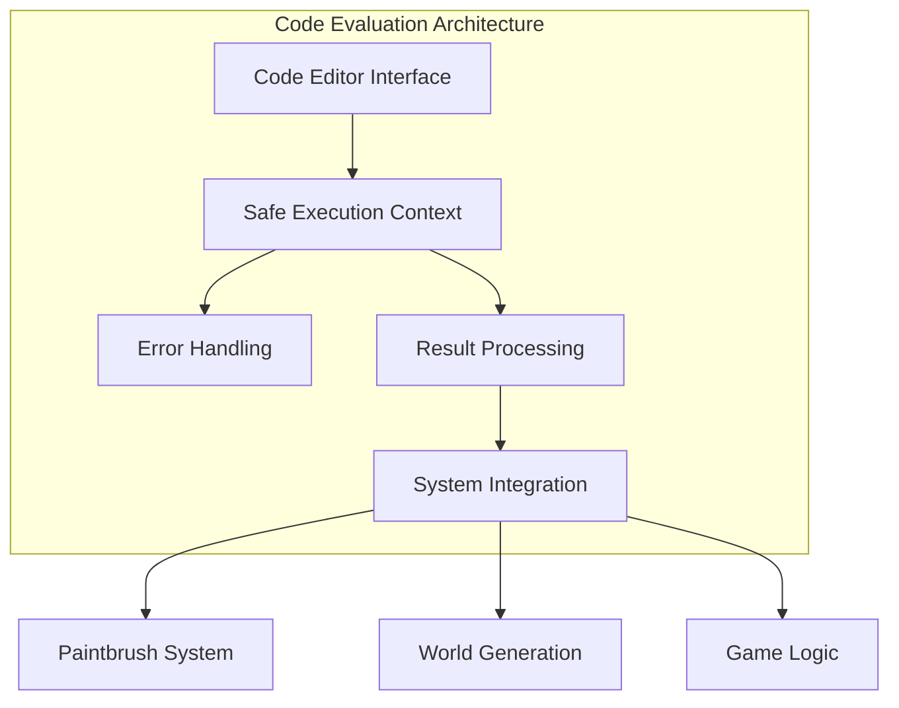

# Real-time Code Evaluation System

This document details the real-time JavaScript code evaluation system implemented in QuadCraft's JavaScript version, providing dynamic code execution capabilities that enable users to create custom patterns, behaviors, and interactions through live coding.

## Overview

The real-time code evaluation system allows users to write, execute, and modify JavaScript code while the application is running. This system transforms QuadCraft from a static voxel editor into a programmable construction platform, enabling complex procedural generation, custom paintbrushes, and interactive behaviors.



## Core Components

### Code Editor Interface

```javascript
class CodeEditor {
    constructor(containerId, options = {}) {
        this.container = document.getElementById(containerId);
        this.options = {
            language: 'javascript',
            theme: 'dark',
            fontSize: 14,
            lineNumbers: true,
            autoComplete: true,
            syntaxHighlighting: true,
            ...options
        };
        this.editor = this.createEditor();
        this.history = new CodeHistory();
        this.setupEventHandlers();
    }

    createEditor() {
        // Create textarea with syntax highlighting
        const textarea = document.createElement('textarea');
        textarea.className = 'code-editor';
        textarea.placeholder = '// Enter JavaScript code here...\n// Example: AddBall(selq);';

        // Add syntax highlighting wrapper
        const wrapper = document.createElement('div');
        wrapper.className = 'code-editor-wrapper';
        wrapper.appendChild(textarea);

        this.container.appendChild(wrapper);
        return textarea;
    }

    getCode() {
        return this.editor.value;
    }

    setCode(code) {
        this.editor.value = code;
        this.history.save(code);
    }

    setupEventHandlers() {
        // Auto-save on changes
        this.editor.addEventListener('input', () => {
            this.history.save(this.getCode());
        });

        // Keyboard shortcuts
        this.editor.addEventListener('keydown', (e) => {
            if (e.ctrlKey || e.metaKey) {
                switch(e.key) {
                    case 'Enter':
                        e.preventDefault();
                        this.executeCode();
                        break;
                    case 'z':
                        if (e.shiftKey) {
                            e.preventDefault();
                            this.redo();
                        } else {
                            e.preventDefault();
                            this.undo();
                        }
                        break;
                }
            }
        });
    }

    executeCode() {
        const code = this.getCode();
        executeUserCode(code);
    }

    undo() {
        const previousCode = this.history.undo();
        if (previousCode !== null) {
            this.setCode(previousCode);
        }
    }

    redo() {
        const nextCode = this.history.redo();
        if (nextCode !== null) {
            this.setCode(nextCode);
        }
    }
}
```

### Safe Execution Context

```javascript
class SafeExecutionContext {
    constructor() {
        this.allowedGlobals = new Set([
            'Math', 'Date', 'console', 'Array', 'Object',
            'Number', 'String', 'Boolean', 'RegExp'
        ]);
        this.allowedAPIs = this.getAllowedAPIs();
        this.executionTimeout = 5000; // 5 seconds
    }

    getAllowedAPIs() {
        return {
            // Core QuadCraft APIs
            Q: (a, b, c, d) => new Quadray(a, b, c, d),
            selq: () => getCurrentSelection(),
            targetQ: () => getTargetQuadray(),

            // Grid manipulation
            AddBall: (q) => addBallSafely(q),
            RemBall: (q) => removeBallSafely(q),
            ToggleBall: (q) => toggleBallSafely(q),

            // Paintbrush functions
            paint: (target, brush, isPaint) => paintSafely(target, brush, isPaint),
            fillGridByFunc: (center, hops, func) => fillGridByFuncSafely(center, hops, func),

            // Utility functions
            gridDotsNear: (center, hops) => getGridDotsNear(center, hops),
            AddColoredDots: (dots, color) => addColoredDotsSafely(dots, color),

            // Math utilities
            Math: Math,
            console: this.createSafeConsole(),

            // Array utilities
            Array: Array,
            Object: Object
        };
    }

    createSafeConsole() {
        return {
            log: (...args) => {
                const message = args.map(arg =>
                    typeof arg === 'object' ? JSON.stringify(arg, null, 2) : String(arg)
                ).join(' ');
                this.logToUI('log', message);
            },
            warn: (...args) => {
                const message = args.join(' ');
                this.logToUI('warn', message);
            },
            error: (...args) => {
                const message = args.join(' ');
                this.logToUI('error', message);
            }
        };
    }

    logToUI(level, message) {
        const logElement = document.getElementById('executionLog');
        if (logElement) {
            const entry = document.createElement('div');
            entry.className = `log-entry log-${level}`;
            entry.textContent = `[${new Date().toLocaleTimeString()}] ${message}`;
            logElement.appendChild(entry);
            logElement.scrollTop = logElement.scrollHeight;
        }
    }

    executeCode(code) {
        return new Promise((resolve, reject) => {
            try {
                // Create execution context
                const context = this.createExecutionContext();

                // Set up timeout
                const timeoutId = setTimeout(() => {
                    reject(new Error('Code execution timed out'));
                }, this.executionTimeout);

                // Execute code
                const result = this.executeInContext(code, context);

                clearTimeout(timeoutId);
                resolve(result);

            } catch (error) {
                reject(error);
            }
        });
    }

    createExecutionContext() {
        const context = { ...this.allowedAPIs };

        // Add current game state
        context.gameState = this.getCurrentGameState();
        context.camera = this.getCurrentCameraState();

        return context;
    }

    executeInContext(code, context) {
        // Create function with context variables
        const paramNames = Object.keys(context);
        const paramValues = Object.values(context);

        const func = new Function(...paramNames, code);
        return func(...paramValues);
    }

    getCurrentGameState() {
        return {
            selectedQuadray: selq,
            targetQuadray: targetQ(),
            ballCount: getBallCount(),
            paintbrushCount: getPaintbrushCount()
        };
    }

    getCurrentCameraState() {
        return {
            position: getCameraPosition(),
            quaternion: getCameraQuaternion(),
            zoom: getCameraZoom()
        };
    }
}
```

## Advanced Features

### Code History and Versioning

```javascript
class CodeHistory {
    constructor(maxHistory = 100) {
        this.history = [];
        this.currentIndex = -1;
        this.maxHistory = maxHistory;
    }

    save(code) {
        // Remove any future history if we're not at the end
        if (this.currentIndex < this.history.length - 1) {
            this.history = this.history.slice(0, this.currentIndex + 1);
        }

        // Add new code to history
        this.history.push({
            code: code,
            timestamp: Date.now()
        });

        this.currentIndex++;

        // Limit history size
        if (this.history.length > this.maxHistory) {
            this.history.shift();
            this.currentIndex--;
        }
    }

    undo() {
        if (this.currentIndex > 0) {
            this.currentIndex--;
            return this.history[this.currentIndex].code;
        }
        return null;
    }

    redo() {
        if (this.currentIndex < this.history.length - 1) {
            this.currentIndex++;
            return this.history[this.currentIndex].code;
        }
        return null;
    }

    getCurrent() {
        if (this.currentIndex >= 0 && this.currentIndex < this.history.length) {
            return this.history[this.currentIndex].code;
        }
        return '';
    }

    getHistory() {
        return this.history.map((item, index) => ({
            index: index,
            code: item.code.substring(0, 50) + (item.code.length > 50 ? '...' : ''),
            timestamp: new Date(item.timestamp).toLocaleString()
        }));
    }

    jumpTo(index) {
        if (index >= 0 && index < this.history.length) {
            this.currentIndex = index;
            return this.history[index].code;
        }
        return null;
    }
}
```

### Live Code Reloading

```javascript
class LiveCodeReloader {
    constructor(editor, executionContext) {
        this.editor = editor;
        this.executionContext = executionContext;
        this.isAutoReloadEnabled = false;
        this.reloadInterval = 1000; // 1 second
        this.lastCodeHash = '';
        this.intervalId = null;
    }

    enableAutoReload() {
        this.isAutoReloadEnabled = true;
        this.startWatching();
    }

    disableAutoReload() {
        this.isAutoReloadEnabled = false;
        this.stopWatching();
    }

    startWatching() {
        this.stopWatching(); // Clear any existing interval
        this.intervalId = setInterval(() => {
            this.checkForChanges();
        }, this.reloadInterval);
    }

    stopWatching() {
        if (this.intervalId) {
            clearInterval(this.intervalId);
            this.intervalId = null;
        }
    }

    checkForChanges() {
        const currentCode = this.editor.getCode();
        const currentHash = this.hashCode(currentCode);

        if (currentHash !== this.lastCodeHash) {
            this.lastCodeHash = currentHash;
            this.reloadCode(currentCode);
        }
    }

    async reloadCode(code) {
        try {
            const result = await this.executionContext.executeCode(code);
            this.showReloadSuccess(result);
        } catch (error) {
            this.showReloadError(error);
        }
    }

    hashCode(str) {
        let hash = 0;
        for (let i = 0; i < str.length; i++) {
            const char = str.charCodeAt(i);
            hash = ((hash << 5) - hash) + char;
            hash = hash & hash; // Convert to 32-bit integer
        }
        return hash;
    }

    showReloadSuccess(result) {
        this.showNotification('Code reloaded successfully', 'success');
        if (result !== undefined) {
            console.log('Reload result:', result);
        }
    }

    showReloadError(error) {
        this.showNotification(`Reload failed: ${error.message}`, 'error');
    }

    showNotification(message, type) {
        const notification = document.createElement('div');
        notification.className = `notification notification-${type}`;
        notification.textContent = message;

        document.body.appendChild(notification);

        setTimeout(() => {
            notification.remove();
        }, 3000);
    }
}
```

### Code Templates and Snippets

```javascript
class CodeSnippetManager {
    constructor() {
        this.snippets = this.getDefaultSnippets();
        this.categories = this.getCategories();
    }

    getDefaultSnippets() {
        return {
            // Basic operations
            addBall: {
                name: 'Add Ball',
                code: 'AddBall(selq);',
                description: 'Add a ball at the current selection',
                category: 'basic'
            },

            removeBall: {
                name: 'Remove Ball',
                code: 'RemBall(selq);',
                description: 'Remove a ball at the current selection',
                category: 'basic'
            },

            // Pattern generation
            sphere: {
                name: 'Create Sphere',
                code: `fillGridByFunc(selq, 5, q => {
    const xyz = q.toCartesian();
    const dist = Math.sqrt(xyz[0]*xyz[0] + xyz[1]*xyz[1] + xyz[2]*xyz[2]);
    return dist <= 3;
});`,
                description: 'Create a spherical pattern',
                category: 'patterns'
            },

            cube: {
                name: 'Create Cube',
                code: `fillGridByFunc(selq, 5, q => {
    const xyz = q.toCartesian();
    return Math.abs(xyz[0]) <= 2.5 &&
           Math.abs(xyz[1]) <= 2.5 &&
           Math.abs(xyz[2]) <= 2.5;
});`,
                description: 'Create a cubic pattern',
                category: 'patterns'
            },

            // Animation
            pulse: {
                name: 'Pulsing Effect',
                code: `const time = Date.now() * 0.001;
const scale = 1 + 0.5 * Math.sin(time * 2);
fillGridByFunc(selq, Math.floor(3 * scale), q => {
    const xyz = q.toCartesian();
    const dist = Math.sqrt(xyz[0]*xyz[0] + xyz[1]*xyz[1] + xyz[2]*xyz[2]);
    return dist <= 2 * scale;
});`,
                description: 'Create a pulsing spherical pattern',
                category: 'animation'
            }
        };
    }

    getCategories() {
        return {
            basic: { name: 'Basic Operations', color: '#4CAF50' },
            patterns: { name: 'Pattern Generation', color: '#2196F3' },
            animation: { name: 'Animation', color: '#FF9800' },
            advanced: { name: 'Advanced', color: '#9C27B0' }
        };
    }

    insertSnippet(snippetId) {
        const snippet = this.snippets[snippetId];
        if (snippet && window.codeEditor) {
            const currentCode = window.codeEditor.getCode();
            const newCode = currentCode + '\n\n' + snippet.code;
            window.codeEditor.setCode(newCode);
        }
    }

    createSnippetUI(container) {
        const snippetContainer = document.createElement('div');
        snippetContainer.className = 'snippet-container';

        // Group snippets by category
        const snippetsByCategory = {};
        Object.entries(this.snippets).forEach(([id, snippet]) => {
            if (!snippetsByCategory[snippet.category]) {
                snippetsByCategory[snippet.category] = [];
            }
            snippetsByCategory[snippet.category].push({ id, ...snippet });
        });

        // Create category sections
        Object.entries(snippetsByCategory).forEach(([category, snippets]) => {
            const categoryDiv = document.createElement('div');
            categoryDiv.className = 'snippet-category';

            const categoryTitle = document.createElement('h4');
            categoryTitle.textContent = this.categories[category].name;
            categoryTitle.style.color = this.categories[category].color;
            categoryDiv.appendChild(categoryTitle);

            snippets.forEach(snippet => {
                const snippetDiv = document.createElement('div');
                snippetDiv.className = 'snippet-item';

                const button = document.createElement('button');
                button.textContent = snippet.name;
                button.title = snippet.description;
                button.onclick = () => this.insertSnippet(snippet.id);

                const description = document.createElement('span');
                description.textContent = snippet.description;
                description.className = 'snippet-description';

                snippetDiv.appendChild(button);
                snippetDiv.appendChild(description);
                categoryDiv.appendChild(snippetDiv);
            });

            snippetContainer.appendChild(categoryDiv);
        });

        container.appendChild(snippetContainer);
    }
}
```

## Integration with QuadCraft Systems

### Paintbrush System Integration

```javascript
// Create custom paintbrush from code
function createCustomPaintbrush(code, name) {
    return {
        name: name,
        execute: async function(targetQ) {
            try {
                const context = {
                    targetQ: targetQ,
                    selq: targetQ,
                    Q: (a, b, c, d) => new Quadray(a, b, c, d),
                    AddBall: AddBall,
                    RemBall: RemBall,
                    fillGridByFunc: fillGridByFunc,
                    Math: Math,
                    Date: Date
                };

                // Execute the custom code
                const func = new Function(...Object.keys(context), code);
                const result = await func(...Object.values(context));

                return result;
            } catch (error) {
                console.error('Custom paintbrush error:', error);
                throw error;
            }
        }
    };
}

// Register custom paintbrush
function registerCustomPaintbrush(name, code) {
    const paintbrush = createCustomPaintbrush(code, name);

    // Add to paintbrush collection
    customPaintbrushes[name] = paintbrush;

    // Update UI
    updatePaintbrushSelector();
}
```

### World Generation Integration

```javascript
// Create procedural world generation from code
function createProceduralGenerator(code) {
    return {
        generate: async function(bounds) {
            const { minX, maxX, minY, maxY, minZ, maxZ } = bounds;

            try {
                const context = {
                    bounds: bounds,
                    minX, maxX, minY, maxY, minZ, maxZ,
                    Q: (a, b, c, d) => new Quadray(a, b, c, d),
                    AddBall: AddBall,
                    RemBall: RemBall,
                    fillGridByFunc: fillGridByFunc,
                    Math: Math,
                    noise: (x, y, z) => simplex3(x, y, z), // Perlin noise
                    random: Math.random
                };

                const func = new Function(...Object.keys(context), code);
                const result = await func(...Object.values(context));

                return result;
            } catch (error) {
                console.error('Procedural generation error:', error);
                throw error;
            }
        }
    };
}

// Generate world from code
async function generateWorldFromCode(code, bounds) {
    const generator = createProceduralGenerator(code);
    const result = await generator.generate(bounds);
    console.log('World generation completed:', result);
    return result;
}
```

## Error Handling and Debugging

### Enhanced Error Reporting

```javascript
class CodeErrorHandler {
    constructor() {
        this.errorHistory = [];
        this.maxErrors = 100;
    }

    handleError(error, code, context) {
        const errorInfo = {
            timestamp: Date.now(),
            error: {
                name: error.name,
                message: error.message,
                stack: error.stack
            },
            code: code,
            context: context,
            lineNumber: this.extractLineNumber(error)
        };

        this.errorHistory.push(errorInfo);

        // Limit history
        if (this.errorHistory.length > this.maxErrors) {
            this.errorHistory.shift();
        }

        // Display error in UI
        this.displayError(errorInfo);

        // Log to console
        console.error('Code execution error:', errorInfo);
    }

    extractLineNumber(error) {
        const stackLines = error.stack.split('\n');
        for (const line of stackLines) {
            const match = line.match(/<anonymous>:(\d+):\d+/);
            if (match) {
                return parseInt(match[1]);
            }
        }
        return null;
    }

    displayError(errorInfo) {
        const errorContainer = document.getElementById('errorContainer');
        if (!errorContainer) return;

        const errorDiv = document.createElement('div');
        errorDiv.className = 'error-item';

        const message = document.createElement('div');
        message.className = 'error-message';
        message.textContent = `${errorInfo.error.name}: ${errorInfo.error.message}`;

        const location = document.createElement('div');
        location.className = 'error-location';
        location.textContent = `Line ${errorInfo.lineNumber || 'unknown'}`;

        const timestamp = document.createElement('div');
        timestamp.className = 'error-timestamp';
        timestamp.textContent = new Date(errorInfo.timestamp).toLocaleTimeString();

        errorDiv.appendChild(message);
        errorDiv.appendChild(location);
        errorDiv.appendChild(timestamp);

        // Add click handler to show code context
        errorDiv.onclick = () => this.showErrorContext(errorInfo);

        errorContainer.appendChild(errorDiv);
        errorContainer.scrollTop = errorContainer.scrollHeight;
    }

    showErrorContext(errorInfo) {
        const modal = document.createElement('div');
        modal.className = 'error-modal';

        const codeDisplay = document.createElement('pre');
        codeDisplay.className = 'error-code';
        codeDisplay.textContent = errorInfo.code;

        const closeBtn = document.createElement('button');
        closeBtn.textContent = 'Close';
        closeBtn.onclick = () => modal.remove();

        modal.appendChild(codeDisplay);
        modal.appendChild(closeBtn);
        document.body.appendChild(modal);
    }

    getErrorStats() {
        const stats = {
            totalErrors: this.errorHistory.length,
            uniqueErrors: new Set(this.errorHistory.map(e => e.error.message)).size,
            mostCommonError: this.getMostCommonError(),
            recentErrors: this.errorHistory.slice(-10)
        };

        return stats;
    }

    getMostCommonError() {
        const errorCounts = {};
        this.errorHistory.forEach(error => {
            const key = error.error.message;
            errorCounts[key] = (errorCounts[key] || 0) + 1;
        });

        const sorted = Object.entries(errorCounts).sort((a, b) => b[1] - a[1]);
        return sorted[0] ? { message: sorted[0][0], count: sorted[0][1] } : null;
    }
}
```

## Performance Considerations

### Execution Limits

```javascript
class ExecutionLimiter {
    constructor() {
        this.maxExecutionTime = 5000; // 5 seconds
        this.maxMemoryUsage = 50 * 1024 * 1024; // 50 MB
        this.maxIterations = 100000;
        this.currentIterations = 0;
    }

    monitorExecution(func) {
        const startTime = performance.now();
        const startMemory = this.getMemoryUsage();

        try {
            const result = func();

            const endTime = performance.now();
            const endMemory = this.getMemoryUsage();

            if (endTime - startTime > this.maxExecutionTime) {
                throw new Error('Execution timeout exceeded');
            }

            if (endMemory - startMemory > this.maxMemoryUsage) {
                throw new Error('Memory usage limit exceeded');
            }

            return result;
        } finally {
            this.currentIterations = 0;
        }
    }

    checkIteration() {
        this.currentIterations++;
        if (this.currentIterations > this.maxIterations) {
            throw new Error('Maximum iterations exceeded');
        }
    }

    getMemoryUsage() {
        if ('memory' in performance) {
            return performance.memory.usedJSHeapSize;
        }
        return 0;
    }
}
```

## Conclusion

The real-time code evaluation system transforms QuadCraft from a simple voxel editor into a powerful programmable construction platform. By enabling users to write and execute JavaScript code dynamically, the system opens up endless possibilities for procedural generation, custom behaviors, and interactive experiences. The combination of safe execution contexts, comprehensive error handling, and seamless integration with existing systems makes this a uniquely powerful feature that distinguishes QuadCraft from traditional voxel editors.
