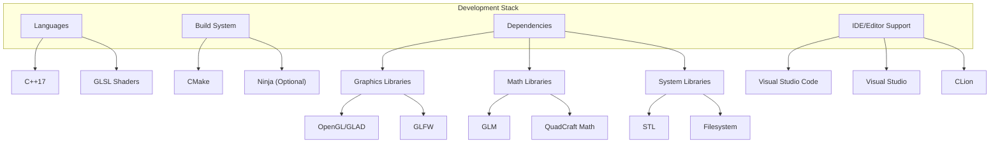
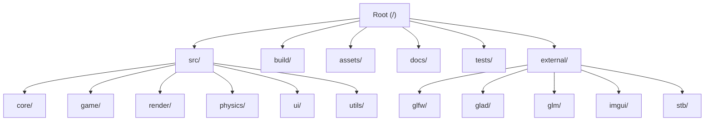

# QuadCraft Development Setup Guide

This guide will help you set up a development environment for the QuadCraft project, covering everything from prerequisites to building and running the game.

## Development Environment Overview

The QuadCraft engine is written in C++ and uses modern graphics APIs, making it compatible with multiple platforms while leveraging the computational efficiency needed for tetrahedral world representation.



## Prerequisites

### Required Software

1. **C++ Compiler**
   - Windows: Visual Studio 2019 or newer with C++ workload
   - Linux: GCC 7.3.0+ or Clang 6.0+
   - macOS: Xcode Command Line Tools (Clang)

2. **CMake (3.15+)**
   - [Download from cmake.org](https://cmake.org/download/)
   - Or install via package manager:
     - Windows: `winget install Kitware.CMake`
     - Linux: `sudo apt install cmake` (Ubuntu/Debian)
     - macOS: `brew install cmake`

3. **Git**
   - [Download from git-scm.com](https://git-scm.com/downloads)
   - Or install via package manager

### Optional Software

1. **Ninja Build System** (faster builds)
   - Windows: Install through Visual Studio Installer
   - Linux: `sudo apt install ninja-build`
   - macOS: `brew install ninja`

2. **IDE/Editor**
   - Visual Studio Code with C++ extension
   - Visual Studio 2019/2022
   - CLion
   - Any editor with C++ support

## Getting the Source Code

Clone the QuadCraft repository:

```bash
git clone https://github.com/your-username/QuadCraft.git
cd QuadCraft
git submodule update --init --recursive
```

The `--recursive` flag is important as QuadCraft uses git submodules for some dependencies.

## Project Structure

The repository is organized into the following main directories:



- **src/**: Main source code
- **build/**: Build artifacts (created during build)
- **assets/**: Game assets (textures, models, shaders, etc.)
- **docs/**: Documentation
- **tests/**: Unit and integration tests
- **external/**: Third-party libraries and dependencies

## Building QuadCraft

### Configuring with CMake

Create a build directory and configure the project:

```bash
# From the root of the repository
mkdir -p build
cd build

# For a basic Debug build
cmake ..

# For Release build
cmake .. -DCMAKE_BUILD_TYPE=Release

# For build with specific compiler (example with Clang)
cmake .. -DCMAKE_CXX_COMPILER=clang++

# Using Ninja (faster builds)
cmake .. -G Ninja
```

### Building the Project

Once configured, build the project:

```bash
# From the build directory
cmake --build . --config Debug  # or Release
```

Alternatively, if you configured with Ninja:

```bash
ninja
```

### Platform-Specific Instructions

#### Windows

For Windows, you can use Visual Studio's CMake integration:

1. Open the QuadCraft folder in Visual Studio
2. Select the CMakeLists.txt file
3. Visual Studio will automatically configure the project
4. Select your preferred configuration (Debug/Release)
5. Build with F7 or the Build menu

#### Linux

Make sure you have the required development packages:

```bash
# Ubuntu/Debian
sudo apt install build-essential libgl1-mesa-dev libx11-dev libxrandr-dev libxinerama-dev libxcursor-dev libxi-dev

# Fedora
sudo dnf install make gcc-c++ mesa-libGL-devel libX11-devel libXrandr-devel libXinerama-devel libXcursor-devel libXi-devel
```

#### macOS

Make sure you have Xcode Command Line Tools installed:

```bash
xcode-select --install
```

### Handling Dependencies

Most dependencies are handled automatically through Git submodules or CMake's FetchContent. However, if you encounter issues, you can manually install dependencies:

```bash
# Ubuntu/Debian example
sudo apt install libglfw3-dev libglm-dev
```

## Running QuadCraft

After building, the executable will be in the build directory (or a subdirectory depending on your build system).

```bash
# From the build directory
./QuadCraft
```

For Windows with Visual Studio, you can run directly from the IDE with F5 or the Debug menu.

## Development Workflow

### Code Style

QuadCraft follows a consistent code style:

- Use 4 spaces for indentation (no tabs)
- Class names use PascalCase
- Methods and functions use camelCase
- Variables use camelCase
- Constants and macros use UPPER_SNAKE_CASE
- Braces on new lines

Example:

```cpp
class TetrahedralBlock
{
public:
    TetrahedralBlock(const Quadray& position);
    void updateState(float deltaTime);
    
private:
    Quadray position;
    static const int MAX_VERTICES = 4;
};
```

### Making Changes

1. Create a feature branch for your changes:
   ```bash
   git checkout -b feature/your-feature-name
   ```

2. Make your changes

3. Run tests to ensure everything works:
   ```bash
   cd build
   ctest
   ```

4. Commit your changes with descriptive messages:
   ```bash
   git commit -m "Add feature: description of your changes"
   ```

5. Push your branch and create a pull request

### Debug Tools

QuadCraft includes several debugging tools:

1. **Debug Overlay** - Press F3 to toggle
2. **Coordinate Display** - Press F4 to toggle
3. **Performance Metrics** - Press F5 to toggle
4. **Wireframe Mode** - Press F6 to toggle

## Building Documentation

The documentation uses Markdown files with Mermaid diagrams. To view the documentation with proper rendering:

1. **Using VS Code**: Install the "Markdown Preview Enhanced" extension
2. **Using a browser**: Use a Markdown viewer that supports Mermaid, or convert to HTML:
   ```bash
   # Install a Markdown to HTML converter
   npm install -g marked
   
   # Convert a file
   marked -i docs/README.md -o docs/readme.html
   ```

## Troubleshooting

### Common Build Issues

1. **CMake can't find dependencies**
   - Make sure you ran `git submodule update --init --recursive`
   - Check that you have the required development packages installed

2. **Compilation errors**
   - Ensure you have a compatible C++ compiler
   - Check that you're using the right build configuration

3. **Linker errors**
   - Verify that all dependencies are properly installed
   - Make sure you're using the correct CMake configuration

### Getting Help

If you encounter issues not covered here:

1. Check the issues on the GitHub repository
2. Join the Discord server for real-time help
3. Post a question in the discussions section of the repository

## Advanced Configuration

### Build Options

QuadCraft's CMake configuration provides several options:

```bash
# Enable detailed logging
cmake .. -DQUADCRAFT_ENABLE_LOGGING=ON

# Build with tests
cmake .. -DQUADCRAFT_BUILD_TESTS=ON

# Enable profiling
cmake .. -DQUADCRAFT_ENABLE_PROFILING=ON

# Build with sanitizers (Debug builds only)
cmake .. -DQUADCRAFT_ENABLE_SANITIZERS=ON
```

### IDE-Specific Setup

#### Visual Studio Code

Recommended extensions:
- C/C++ (ms-vscode.cpptools)
- CMake Tools (ms-vscode.cmake-tools)
- CMake (twxs.cmake)
- Markdown Preview Enhanced

Settings (`.vscode/settings.json`):
```json
{
    "C_Cpp.default.configurationProvider": "ms-vscode.cmake-tools",
    "editor.formatOnSave": true,
    "editor.rulers": [120],
    "files.associations": {
        "*.h": "cpp"
    }
}
```

#### CLion

CLion has built-in support for CMake projects. Simply open the repository folder and CLion will detect the CMake configuration automatically.

## Performance Optimization

When developing for QuadCraft, keep these performance considerations in mind:

1. **Tetrahedral Math Operations**: Use the provided QuadCraft math libraries for tetrahedral operations, as they're optimized for performance.

2. **Chunk Management**: Carefully manage chunk loading and unloading to prevent memory issues.

3. **Rendering Optimization**: Use frustum culling and level of detail techniques for rendering large tetrahedral worlds.

4. **Profiling**: Use the built-in profiling tools (enable with `-DQUADCRAFT_ENABLE_PROFILING=ON`) to identify bottlenecks.

## Next Steps

Now that your development environment is set up, here are some suggestions for getting started:

1. Explore the [Technical Architecture](architecture.md) to understand the system design
2. Learn about the [Quadray Coordinate System](../mathematics/quadray_coordinates.md)
3. Run the examples in the `examples/` directory to see the engine in action
4. Check the issue tracker for beginner-friendly issues to work on

## Contributing

We welcome contributions to QuadCraft! Please see the [CONTRIBUTING.md](../../CONTRIBUTING.md) file for guidelines on how to contribute.

## License

QuadCraft is licensed under [your license here]. See the [LICENSE](../../LICENSE) file for details. 