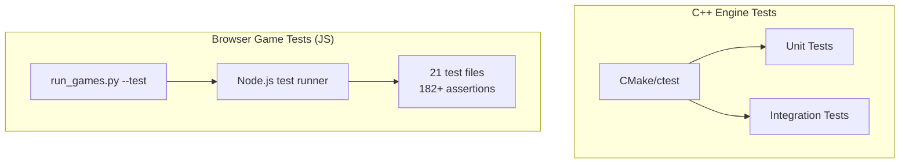

# Testing Guide

This guide covers the testing infrastructure for QuadCraft across both the C++ engine and the 12 standalone browser games.

## Test Architecture Overview



## Browser Game Tests

### Overview

All 12 games include Node.js-runnable test files in their `tests/` directory. These test quadray coordinate math, game logic, and (where applicable) IVM/Synergetics constants.

### Test File Inventory

| Game | Test File | Assertions | Key Coverage |
| ---- | --------- | ---------- | ------------ |
| 4D Chess | `test_quadray.js`, `test_geometry.js`, `test_all.js` | 83 | Coordinate math, piece movement, check/checkmate |
| 4D Checkers | `test_checkers.js` | 11 | Diagonal moves, capture, king promotion |
| 4D Reversi | `test_reversi.js` | 11 | Disc flipping, 80-direction validation |
| 4D Life | `test_life.js` | 8 | Birth/survival rules, neighbor wrapping |
| 4D Asteroids | `test_asteroids.js` | 8 | Motion, collision, asteroid splitting |
| 4D SimAnt | `test_simant.js` | 9 | Pheromone trails, foraging logic |
| 4D Backgammon | `test_backgammon.js` | 8 | Move validation, bearing off |
| 4D Minecraft | `test_minecraft.js`, `test_analysis.js` | 11 | Block placement, terrain generation |
| 4D Catan | `test_catan.js` | 10 | Resource production, settlement placement |
| 4D Tower Defense | `test_td.js` | 9 | Path finding, tower targeting, wave spawning |
| 4D Doom | `test_doom.js` | 7 | Hitscan, enemy AI, Synergetics constants |
| 4D Mahjong | `test_mahjong.js` | 7 | Tile matching, hint system |
| Generic | `test_quadray.js`, `test_synergetics.js` | — | Core math, IVM volume ratio validation |

### Running Tests

```bash
# Run ALL game tests via Python launcher
python3 games/run_games.py --test

# Run tests for specific games
python3 games/run_games.py --test --game chess doom

# Run a single test file directly
node games/4d_chess/tests/test_quadray.js

# Run Synergetics validation suite
node games/4d_generic/tests/test_synergetics.js
```

### Test File Structure

Each test file follows this pattern:

```javascript
// Lightweight test framework (no external dependencies)
let passed = 0, failed = 0;

function assert(condition, message) {
    if (condition) { passed++; }
    else { failed++; console.error(`FAIL: ${message}`); }
}

function assertApprox(actual, expected, tolerance, message) {
    assert(Math.abs(actual - expected) <= tolerance, message);
}

// Tests
assert(someCondition, 'Description of what is tested');

// Summary
console.log(`${passed} passed, ${failed} failed`);
process.exit(failed > 0 ? 1 : 0);
```

### Writing New Tests

1. Create `tests/test_<game>.js` in the game's directory
2. Use the lightweight assert pattern (no npm dependencies)
3. Ensure tests are runnable via `node tests/test_<game>.js`
4. Return exit code 1 on failure, 0 on success
5. Test both coordinate math and game-specific logic

## C++ Engine Tests

### Build Configuration

Enable testing in the CMake build:

```bash
cmake .. -DQUADCRAFT_BUILD_TESTS=ON
cd build
cmake --build . --config Debug
```

### Running C++ Tests

```bash
# From the build directory
ctest                     # Run all tests
ctest -V                  # Verbose output
ctest -R Quadray          # Filter by name pattern
ctest --output-on-failure # Show output only for failures
```

### Test Categories

| Category | Tests | Coverage Area |
| -------- | ----- | ------------- |
| Coordinate | Quadray ↔ Cartesian conversion, normalization | `src/core/coordinate/` |
| World | Chunk generation, block access | `src/core/world/` |
| Entity | Entity lifecycle, component management | `src/core/entity/` |

## Common Test Patterns

### Quadray Round-Trip Verification

Every test suite should verify that conversion is lossless:

```javascript
// Cartesian → Quadray → Cartesian should be identity
const original = { x: 1.0, y: 2.0, z: 3.0 };
const quadray = Quadray.fromCartesian(original);
const restored = quadray.toCartesian();
assertApprox(restored.x, original.x, 1e-6, 'X round-trip');
assertApprox(restored.y, original.y, 1e-6, 'Y round-trip');
assertApprox(restored.z, original.z, 1e-6, 'Z round-trip');
```

### Synergetics Constant Validation

```javascript
// Verify IVM volume ratios
assert(IVM.VOLUME_RATIOS.TETRAHEDRON === 1, 'Tetra = 1');
assert(IVM.VOLUME_RATIOS.CUBE === 3, 'Cube = 3');
assert(IVM.VOLUME_RATIOS.OCTAHEDRON === 4, 'Octa = 4');
assertApprox(IVM.S3, Math.sqrt(9/8), 1e-10, 'S3 constant');
```

## Cross-References

- [Games Overview](../games.md) — game portfolio and launch instructions
- [IVM & Synergetics](../mathematics/ivm_synergetics.md) — volume ratios validated by tests
- [Setup Guide](setup_guide.md) — development environment setup for C++ testing
- [JavaScript Implementation](javascript_implementation.md) — JS codebase architecture
