# QuadCraft Block System

This document describes the tetrahedral block system that forms the foundation of QuadCraft, detailing the properties, behaviors, and interactions of tetrahedral blocks.

## Overview

Unlike traditional voxel games that use cubic blocks, QuadCraft builds its world from tetrahedral blocks. This fundamental difference creates unique gameplay mechanics, building possibilities, and challenges.

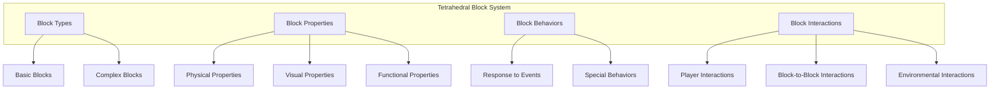

## Tetrahedral Block Fundamentals

### Tetrahedral Geometry

Each block in QuadCraft is a regular tetrahedron, a polyhedron with four triangular faces, six edges, and four vertices:

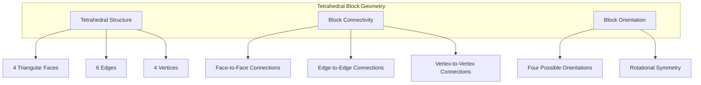

Key geometric properties:
- **Regular Tetrahedron**: All faces are equilateral triangles, all edges have equal length
- **Vertex Coordinates**: Each tetrahedron has four vertices in 3D space
- **Face Normals**: Each face has a normal vector pointing outward
- **Space-Filling**: Tetrahedra can fill 3D space when properly arranged
- **Dihedral Angle**: Approximately 70.53° between faces

### Coordinate System

Tetrahedral blocks use Quadray coordinates for positioning:

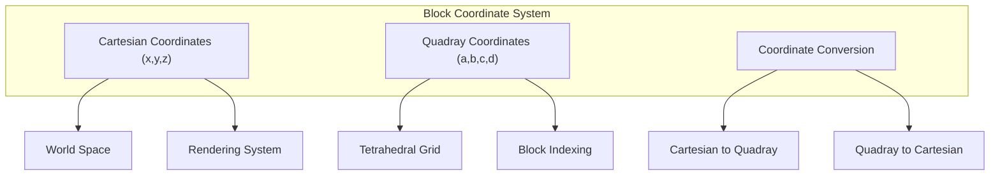

The coordinate system features:
- **Quadray Indexing**: Each block position is defined by four coordinates (a,b,c,d)
- **Unique Addressing**: Every position in the world has a unique tetrahedral address
- **Grid Alignment**: Blocks align perfectly in the tetrahedral grid
- **Efficient Storage**: Optimized storage of block positions in the tetrahedral grid

## Block Types

QuadCraft features a variety of tetrahedral block types with different properties and behaviors:

```mermaid
graph TD
    subgraph "Block Type Hierarchy"
        BasicBlocks["Basic Blocks"]
        TerrainBlocks["Terrain Blocks"]
        FunctionalBlocks["Functional Blocks"]
        DecorativeBlocks["Decorative Blocks"]
        SpecialBlocks["Special Blocks"]
    end
    
    BasicBlocks --> Stone["Stone"]
    BasicBlocks --> Dirt["Dirt"]
    BasicBlocks --> Crystal["Crystal"]
    
    TerrainBlocks --> Mountain["Mountain Blocks"]
    TerrainBlocks --> Forest["Forest Blocks"]
    TerrainBlocks --> Water["Water Blocks"]
    
    FunctionalBlocks --> Light["Light Sources"]
    FunctionalBlocks --> Machinery["Machinery"]
    FunctionalBlocks --> Transportation["Transportation"]
    
    DecorativeBlocks --> Colored["Colored Blocks"]
    DecorativeBlocks --> Patterned["Patterned Blocks"]
    DecorativeBlocks --> Transparent["Transparent Blocks"]
    
    SpecialBlocks --> Portal["Portal Blocks"]
    SpecialBlocks --> Logic["Logic Blocks"]
    SpecialBlocks --> Physics["Physics Blocks"]
```

### Basic Block Types

The fundamental block types include:

- **Crystal**: Clear, solid blocks that form the basis of many structures
- **Stone**: Durable blocks used for structural elements
- **Dirt**: Natural terrain blocks that can support vegetation
- **Wood**: Organic blocks obtained from tetrahedral tree structures
- **Metal**: Durable blocks with metallic properties
- **Glass**: Transparent blocks for windows and decorative structures

### Functional Block Types

Blocks with special functions:

- **Light Sources**: Blocks that emit light in different colors and intensities
- **Conduits**: Blocks that transfer energy, signals, or materials
- **Machinery**: Blocks that perform operations or transformations
- **Storage**: Blocks that can contain items or materials
- **Transportation**: Blocks that assist with player or item movement
- **Liquid**: Blocks with fluid properties that flow and fill spaces

### Special Block Types

Blocks with unique properties:

- **Portal**: Blocks that enable teleportation between locations
- **Gravity-Affected**: Blocks that respond to gravity
- **Redstone-Like**: Blocks that participate in logic circuits
- **Weather-Responsive**: Blocks that change based on environmental conditions
- **Player-Only**: Blocks that only players can interact with
- **Time-Based**: Blocks that change based on game time

## Block Properties

Each tetrahedral block has a set of properties that define its appearance and behavior:

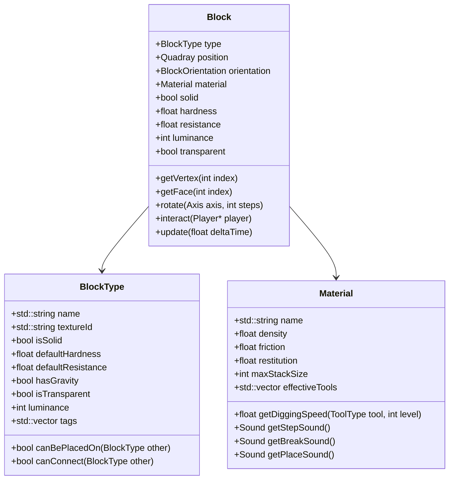

### Physical Properties

- **Hardness**: Determines how quickly a block can be broken
- **Resistance**: Determines resistance to explosions and other damage
- **Solid**: Whether the block is solid or can be passed through
- **Gravity-Affected**: Whether the block is affected by gravity
- **Density**: The mass per unit volume, affecting physics interactions
- **Friction**: How much the block slows movement across its surface
- **Restitution**: How "bouncy" the block is during collisions

### Visual Properties

- **Texture**: The visual appearance of each face
- **Transparency**: Whether light can pass through the block
- **Luminance**: How much light the block emits
- **Render Layer**: Determines rendering order for transparent blocks
- **Visual Effects**: Particle effects or animations associated with the block
- **Color Modifiers**: Tinting applied to the base texture

### Functional Properties

- **Interactable**: Whether players can interact with the block
- **Inventoriable**: Whether the block can be stored in inventory
- **Redstone Conductivity**: How the block interacts with redstone-like signals
- **Tool Requirement**: What tools are effective against the block
- **Flammability**: How the block interacts with fire
- **Growth Properties**: For blocks that can grow or spread

## Block Orientation

Tetrahedral blocks can have different orientations, which affects their appearance and connections:

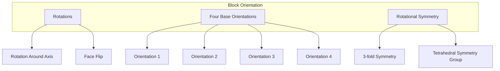

Orientation features:
- **Four Base Orientations**: A tetrahedron can be placed in four fundamentally different ways
- **Rotation System**: A consistent system for specifying and changing block orientations
- **Placement Rules**: How block orientation is determined during placement
- **Orientation-Dependent Textures**: Blocks can have different textures based on orientation
- **Connectivity Rules**: How orientation affects connections between blocks

### Orientation Representation

Block orientation is represented internally using this system:

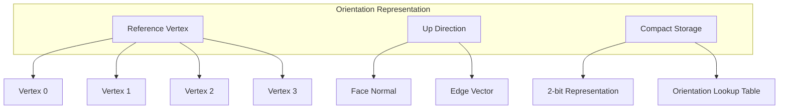

The orientation system allows:
- **Compact Storage**: Efficient representation of orientation in memory
- **Fast Rotation**: Quick calculation of new orientations during rotation
- **Intuitive Placement**: Natural orientation based on player position and target face

## Block Interactions

Tetrahedral blocks can interact with players, other blocks, and the environment:

```mermaid
graph TD
    subgraph "Block Interactions"
        PlayerActions["Player Actions"]
        BlockToBlock["Block-to-Block"]
        Environmental["Environmental"]
        Physics["Physics"]
    end
    
    PlayerActions --> Place["Place"]
    PlayerActions --> Break["Break"]
    PlayerActions --> Interact["Interact"]
    PlayerActions --> Modify["Modify"]
    
    BlockToBlock --> Connect["Connect"]
    BlockToBlock --> Signal["Signal Transfer"]
    BlockToBlock --> Support["Support"]
    BlockToBlock --> Chain["Chain Reactions"]
    
    Environmental --> Weather["Weather Effects"]
    Environmental --> Growth["Growth"]
    Environmental --> Decay["Decay"]
    Environmental --> TimeEffects["Time Effects"]
    
    Physics --> Gravity["Gravity"]
    Physics --> Fluid["Fluid Dynamics"]
    Physics --> Explosion["Explosions"]
    Physics --> Collision["Collisions"]
```

### Player Interactions

Ways players can interact with blocks:

- **Placement**: Adding blocks to the world
- **Breaking**: Removing blocks from the world
- **Right-Click Interaction**: Activating the block's function
- **Tool Use**: Using specific tools on blocks
- **Walking/Jumping**: Moving on or over blocks
- **Sneak-Interactions**: Special interactions while sneaking

### Block-to-Block Interactions

How blocks interact with each other:

- **Connectivity**: How blocks connect to adjacent blocks
- **Support**: How blocks can support other blocks against gravity
- **Signal Transmission**: How blocks can transmit redstone-like signals
- **Fluid Flow**: How fluid blocks interact with other blocks
- **Growth Effects**: How growing blocks affect neighbors
- **Chain Reactions**: Cascading effects between blocks

### Environmental Interactions

How blocks interact with the environment:

- **Weather Effects**: Responses to rain, snow, or lightning
- **Day/Night Cycle**: Changes based on time of day
- **Seasonal Effects**: Changes based on in-game seasons
- **Biome Adaptation**: Different behavior in different biomes
- **Temperature Response**: Effects of hot or cold environments
- **Aging/Decay**: Changes over time or in certain conditions

## Block Placement and Breaking

The process of placing and breaking blocks follows specialized mechanics for tetrahedral geometry:

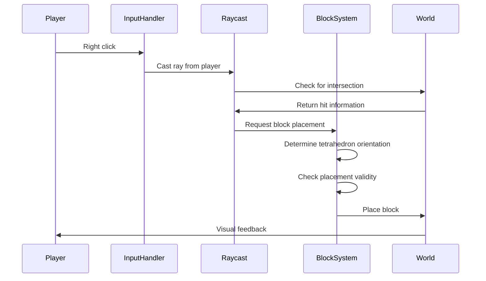

Placement mechanics:
- **Raycasting**: Determining precise placement location with tetrahedral raycasting
- **Face Selection**: Placing blocks against specific faces of existing blocks
- **Orientation Rules**: Determining the orientation of newly placed blocks
- **Validity Checks**: Ensuring placements are valid (not obstructed, supported, etc.)
- **Block-Specific Rules**: Special placement rules for certain block types

Breaking mechanics:
- **Hardness Factor**: Time required to break a block based on hardness
- **Tool Effectiveness**: Effect of different tools on breaking speed
- **Block Drops**: Items produced when a block is broken
- **Break Animation**: Progressive breaking visualization
- **Break Effects**: Particle effects, sounds, and other feedback

## Block Rendering

Rendering tetrahedral blocks requires specialized techniques:

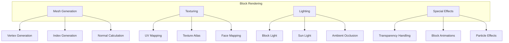

Rendering features:
- **Tetrahedral Mesh**: Generating the geometric mesh for tetrahedra
- **UV Mapping**: Mapping textures onto triangular faces
- **Face Culling**: Skipping rendering of hidden faces for performance
- **Light Propagation**: Calculating light levels for each block face
- **Chunk Batching**: Combining blocks into larger rendering batches
- **Level of Detail**: Rendering blocks differently based on distance

## Block Data Storage

The system for storing block data is optimized for tetrahedral worlds:

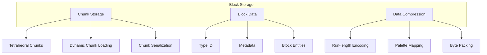

Storage methods:
- **Chunk-Based Storage**: Dividing the world into manageable tetrahedral chunks
- **Palette Encoding**: Using palettes to efficiently store block types
- **Run-Length Encoding**: Compressing runs of identical blocks
- **Sparse Storage**: Only storing non-empty blocks
- **Block Entity System**: Storing additional data for complex blocks
- **Metadata Compression**: Efficiently encoding block metadata

## Block Updates and Ticking

Blocks can update over time through the block ticking system:

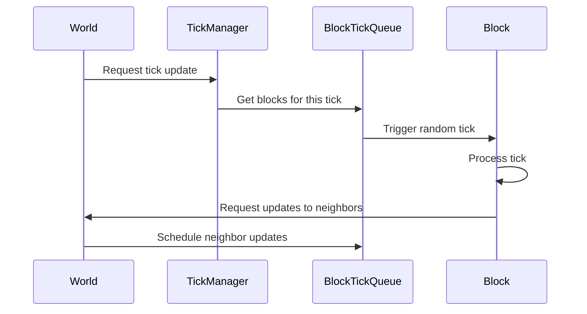

Ticking features:
- **Random Ticks**: Periodic updates to randomly selected blocks
- **Scheduled Ticks**: Updates scheduled for specific blocks at specific times
- **Block Update Propagation**: Triggering updates in neighboring blocks
- **Update Radius**: Different update distances for different events
- **Update Priorities**: Different priorities for different types of updates
- **Rate Limiting**: Preventing excessive updates for performance

## Special Block Types

### Fluid Blocks

Tetrahedral fluid blocks require specialized handling:

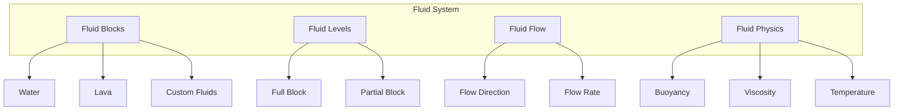

Fluid features:
- **Level System**: Representing different fluid levels within a tetrahedral block
- **Flow Mechanics**: How fluids move between adjacent blocks
- **Fluid Sources**: Blocks that generate fluid
- **Fluid Mixing**: Interactions between different fluid types
- **Effects on Entities**: How fluids affect players and other entities
- **Rendering**: Special rendering techniques for fluid blocks

### Redstone-Like Logic Blocks

Blocks that participate in logic circuits:

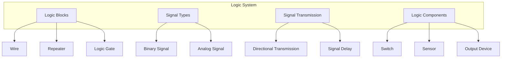

Logic features:
- **Signal Strength**: Different levels of signal power
- **Transmission Rules**: How signals travel through tetrahedral blocks
- **Directional Logic**: Direction-sensitive signal transmission
- **Complex Gates**: Creating complex logic operations
- **Timing Circuits**: Creating timed signals and pulses
- **Tetrahedral-Specific Logic**: Unique logic possibilities in tetrahedral space

### Growing Blocks

Blocks that change over time:

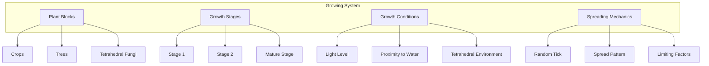

Growing block features:
- **Growth Stages**: Different visual stages of growth
- **Growth Requirements**: Conditions needed for growth
- **Harvesting Mechanics**: How mature plants can be harvested
- **Spreading Behavior**: How plants spread to nearby blocks
- **Seasonal Effects**: How in-game seasons affect growth
- **Cultivation**: Player actions to encourage growth

## Block Crafting and Processing

How blocks can be crafted, processed, and transformed:

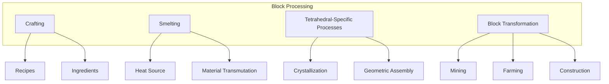

Processing features:
- **Crafting Recipes**: Combining materials to create new blocks
- **Tool Processing**: Using tools to transform blocks
- **Cooking/Smelting**: Using heat to transform blocks
- **Washing/Filtering**: Using water to process certain blocks
- **Grinding/Crushing**: Breaking down blocks into component materials
- **Tetrahedral Assembly**: Building complex structures from simple blocks

## Block Economy

The resource economy centered around blocks:

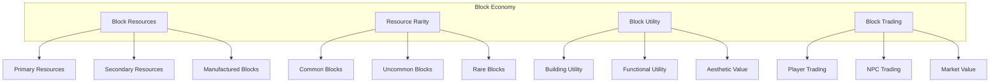

Economic features:
- **Resource Distribution**: How block resources are distributed in the world
- **Rarity Tiers**: Different levels of block rarity
- **Utility Value**: How useful different blocks are for different purposes
- **Trading System**: Trading blocks with other players or NPCs
- **Block Currency**: Using certain blocks as currency
- **Collection Incentives**: Encouraging collecting different block types

## Block API and Modding

The system for extending and modifying blocks:

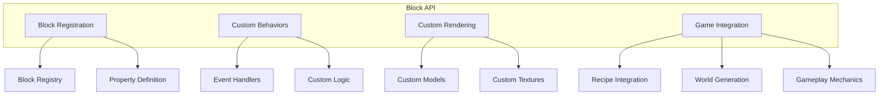

API features:
- **Block Registration**: API for registering new block types
- **Property System**: Defining custom block properties
- **Event Handling**: Hooking into block-related events
- **Custom Rendering**: Defining custom rendering for blocks
- **World Generation Integration**: Adding blocks to world generation
- **Gameplay Integration**: Integrating blocks with gameplay systems

## Comparison with Cubic Blocks

How tetrahedral blocks differ from traditional cubic blocks:

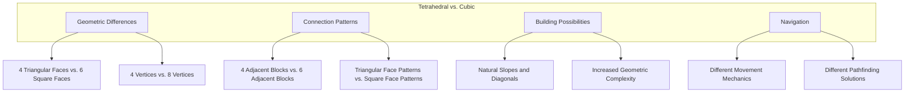

Key differences:
- **Geometric Structure**: Tetrahedra vs. cubes as the basic building block
- **Connection Patterns**: Four connections vs. six connections
- **Building Possibilities**: Different structures possible with tetrahedra
- **Navigation Challenges**: Different approaches to moving through tetrahedral space
- **Visual Appearance**: Different aesthetic possibilities
- **Technical Implementation**: Different optimization strategies

## Future Block System Expansion

Planned future expansions to the block system:

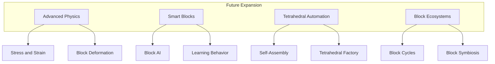

Planned features:
- **Advanced Physics**: More realistic physics interactions for blocks
- **Smart Blocks**: Blocks with advanced AI and learning capabilities
- **Block Automation**: Systems for automating block placement and harvesting
- **Block Ecosystems**: Interrelated systems of blocks that interact over time
- **Procedural Block Generation**: Algorithmically generated block types
- **Player-Defined Blocks**: Tools for players to create custom blocks

## Conclusion

The tetrahedral block system in QuadCraft represents a fundamental reimagining of voxel-based gameplay. By embracing tetrahedral geometry, the game creates new possibilities for building, exploration, and interaction while challenging players to think beyond the limitations of traditional cubic building blocks. 