# Controls and Navigation in QuadCraft

This document details the control scheme and navigation mechanics in QuadCraft, explaining how players interact with and move through tetrahedral space.

> **Scope note (verified against the live tree):** the "Basic Movement
> Controls" and "Function Keys" sections below described the legacy
> first-person `src/game` C++/GLFW engine (WASD + mouse-look camera,
> jump/fly/sprint, F1-F8 debug toggles — see `src/game/Input.h`), which is
> a separate, unmaintained implementation approach (`src/README.md`) and
> does not correspond to any of the 30 real games under `games/`. They have
> been corrected below to describe the actual `games/` control scheme.
> Sections further down this document (Vehicle Controls, Gamepad Support,
> Mobile Controls, wall-climbing/gliding, etc.) describe additional
> features that were not found in any `games/*/js/*.js` file at time of
> writing and should be treated as aspirational/unimplemented design
> ideas, not current behavior.

## Control Philosophy

QuadCraft's control system is designed to make navigation in tetrahedral space feel intuitive despite the unfamiliar geometry. The controls follow familiar first-person conventions while adding specialized functionality for tetrahedral navigation.

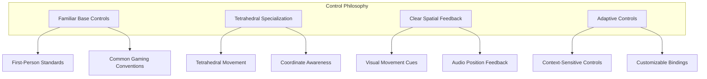
```mermaid
graph TD
    subgraph "Control Philosophy"
        Familiarity["Familiar Base Controls"]
        Specialization["Tetrahedral Specialization"]
        Feedback["Clear Spatial Feedback"]
        Adaptability["Adaptive Controls"]
    end
    
    Familiarity --> FPS["First-Person Standards"]
    Familiarity --> Gaming["Common Gaming Conventions"]
    
    Specialization --> TetraMovement["Tetrahedral Movement"]
    Specialization --> CoordAwareness["Coordinate Awareness"]
    
    Feedback --> VisualCues["Visual Movement Cues"]
    Feedback --> AudioCues["Audio Position Feedback"]
    
    Adaptability --> ContextSensitive["Context-Sensitive Controls"]
    Adaptability --> CustomizableBindings["Customizable Bindings"]
```

## Basic Movement Controls (real `games/` scheme)

### Shared camera and zoom

Most of the 30 games under `games/` share two `4d_generic/` input modules
rather than a first-person WASD/mouse-look camera:

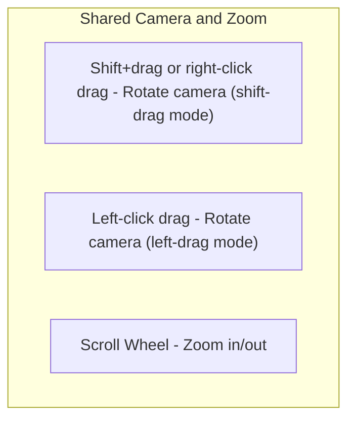
```mermaid
graph TD
    subgraph "Shared Camera and Zoom"
        ShiftDrag["Shift+drag or right-click drag - Rotate camera (shift-drag mode)"]
        LeftDrag["Left-click drag - Rotate camera (left-drag mode)"]
        Scroll["Scroll Wheel - Zoom in/out"]
    end
```

| Control | Action | Source |
|---------|--------|--------|
| Shift+drag (or right-click drag) | Rotate camera — `shift-drag` mode, the default (e.g. Reversi, Minecraft pattern) | `games/4d_generic/camera.js` |
| Left-click drag | Rotate camera — `left-drag` mode (e.g. Chess/Checkers pattern) | `games/4d_generic/camera.js` |
| Scroll Wheel | Zoom (scales `renderer.scale` by ~1.08 in / ~0.92 out) | `games/4d_generic/zoom.js` |

### Per-game action input

There is no single movement/action scheme across all 30 games; each game's
`Input` column in [`games/GAMES_INDEX.md`](../../games/GAMES_INDEX.md) is
either `Click`-based (board/building games) or `Keyboard`-based (arcade
games). Two concrete, verified examples:

| Game | Control | Action | Source |
|------|---------|--------|--------|
| 4D Minecraft | Click | Place block above the hovered block (`+C` axis) | `games/4d_minecraft/js/minecraft_game.js` `_bindMouse()` |
| 4D Minecraft | Alt+Click | Remove the hovered block | `games/4d_minecraft/js/minecraft_game.js` `_bindMouse()` |
| 4D Minecraft | 1-8 | Select block type | `games/4d_minecraft/js/minecraft_game.js` module docstring |
| 4D Doom | WASD (`KeyW` etc.) + mouse-move | First-person movement + look — the one FPS exception in the portfolio | `games/4d_doom/js/doom_main.js` |

## Function Keys

No F-key (F1-F8) bindings exist anywhere in `games/` — confirmed by
grepping every `games/*/js/*.js` file for F-key handlers. Per-game hotkeys
(where they exist) are documented per game in `games/GAMES_INDEX.md`; there
is no universal debug/screenshot/overlay toggle across the portfolio.

## Movement Mechanics

### Basic Navigation

Navigation in tetrahedral space follows these mechanics:

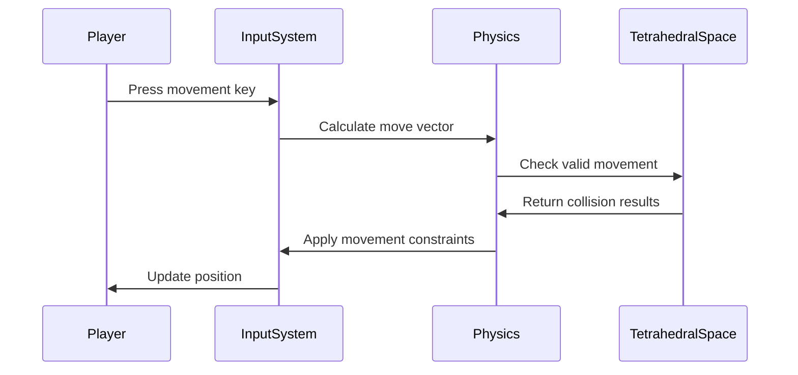
```mermaid
sequenceDiagram
    participant Player
    participant InputSystem
    participant Physics
    participant TetrahedralSpace
    
    Player->>InputSystem: Press movement key
    InputSystem->>Physics: Calculate move vector
    Physics->>TetrahedralSpace: Check valid movement
    TetrahedralSpace->>Physics: Return collision results
    Physics->>InputSystem: Apply movement constraints
    InputSystem->>Player: Update position
```

The movement system converts player inputs into movement through tetrahedral space:

1. **Movement Vector Calculation**: Inputs are converted to a direction vector in Cartesian space
2. **Tetrahedral Translation**: The Cartesian vector is mapped to tetrahedral space movement
3. **Collision Detection**: The movement is checked against tetrahedral boundaries
4. **Position Update**: The player position is updated in both coordinate systems

### Gravity and Jumping

Gravity and jumping follow these rules:

- **Gravity**: Pulls the player downward in Cartesian space (negative y-axis)
- **Jumping**: Applies an upward impulse in Cartesian space
- **Terminal Velocity**: Maximum falling speed is capped
- **Tetrahedral Landing**: Detects landing on tetrahedral faces

### Flight Mode

Flight mode allows full 3D movement without gravity:

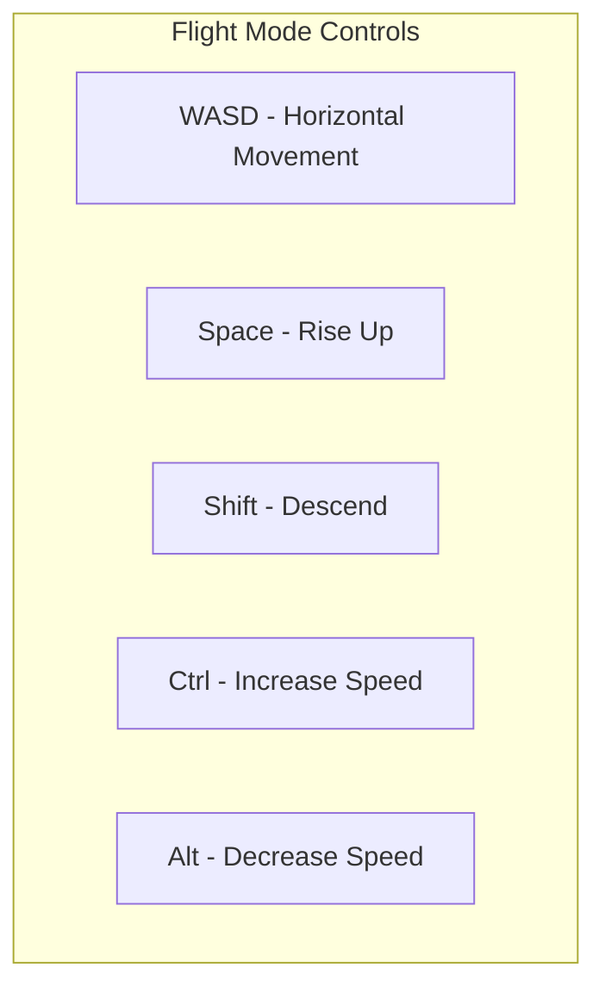
```mermaid
graph TD
    subgraph "Flight Mode Controls"
        WASD["WASD - Horizontal Movement"]
        Space["Space - Rise Up"]
        Shift["Shift - Descend"]
        Ctrl["Ctrl - Increase Speed"]
        Alt["Alt - Decrease Speed"]
    end
```

Flight mode features:
- Toggle with double-tap of the space key or through a dedicated key (default: F)
- No collision with blocks (optional setting)
- Speed adjustment using Ctrl/Alt
- Smooth transitions between normal and flight mode

## Tetrahedral Coordinate Navigation

QuadCraft provides tools for understanding and navigating by tetrahedral coordinates:

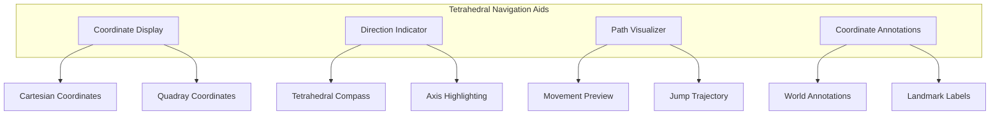
```mermaid
graph TD
    subgraph "Tetrahedral Navigation Aids"
        CoordinateDisplay["Coordinate Display"]
        DirectionIndicator["Direction Indicator"]
        PathVisualizer["Path Visualizer"]
        CoordAnnotations["Coordinate Annotations"]
    end
    
    CoordinateDisplay --> CartesianCoords["Cartesian Coordinates"]
    CoordinateDisplay --> QuadrayCoords["Quadray Coordinates"]
    
    DirectionIndicator --> TetrahedralCompass["Tetrahedral Compass"]
    DirectionIndicator --> AxisHighlighting["Axis Highlighting"]
    
    PathVisualizer --> MovementPreview["Movement Preview"]
    PathVisualizer --> JumpTrajectory["Jump Trajectory"]
    
    CoordAnnotations --> WorldAnnotations["World Annotations"]
    CoordAnnotations --> LandmarkLabels["Landmark Labels"]
```

### Coordinate Display

The coordinate display shows current position in both Cartesian (x,y,z) and Quadray (a,b,c,d) formats:

- Toggle with F4 key
- Color-coded values for easier reading
- Distance traveled in both coordinate systems
- Current tetrahedron ID

### Tetrahedral Compass

The tetrahedral compass helps with orientation:

- Shows direction relative to the tetrahedral axes
- Color-coded to match the four primary tetrahedron vertices
- Optional 3D visualization mode
- Can be toggled on/off

## Block Interaction

### Block Placement and Removal (verified: `games/4d_minecraft`)

4D Minecraft — the one `games/` title with Minecraft-style block
placement — uses plain-click and Alt+click, not a left/right mouse-button
distinction:

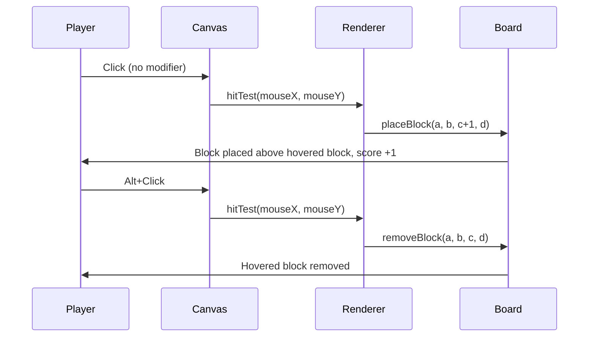
```mermaid
sequenceDiagram
    participant Player
    participant Canvas
    participant Renderer
    participant Board

    Player->>Canvas: Click (no modifier)
    Canvas->>Renderer: hitTest(mouseX, mouseY)
    Renderer->>Board: placeBlock(a, b, c+1, d)
    Board->>Player: Block placed above hovered block, score +1

    Player->>Canvas: Alt+Click
    Canvas->>Renderer: hitTest(mouseX, mouseY)
    Renderer->>Board: removeBlock(a, b, c, d)
    Board->>Player: Hovered block removed
```

Block placement/removal mechanics (`games/4d_minecraft/js/minecraft_game.js` `_bindMouse()`):
- Plain click places the selected block directly above the hovered block (fixed `+C`-axis offset), not against an arbitrary selected face
- Alt+click removes the hovered block
- There is no left/right mouse-button distinction, no raycast/break-time/hardness model, and no block-orientation-by-face logic in the shipped code

## Advanced Movement Techniques

### Wall Climbing

Wall climbing allows vertical movement on suitable surfaces:

- Certain block types support climbing (ladders, vines, etc.)
- Hold the forward key (W) while against a climbable surface
- Can look and move side-to-side while climbing
- Releasing the forward key will cause the player to descend

### Gliding

Gliding enables controlled descent:

- Requires special equipment (glider item)
- Activated by jumping and holding jump key
- Direction controlled by look direction
- Gradually descends while moving forward
- Can be canceled by pressing crouch

### Tetrahedron-Based Movement

Special movement mechanics tied to tetrahedral geometry:

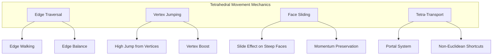
```mermaid
graph TD
    subgraph "Tetrahedral Movement Mechanics"
        EdgeTraversal["Edge Traversal"]
        VertexJumping["Vertex Jumping"]
        FaceSliding["Face Sliding"]
        TetraTransport["Tetra-Transport"]
    end
    
    EdgeTraversal --> EdgeWalking["Edge Walking"]
    EdgeTraversal --> EdgeBalance["Edge Balance"]
    
    VertexJumping --> HighJump["High Jump from Vertices"]
    VertexJumping --> VertexBoost["Vertex Boost"]
    
    FaceSliding --> SlideEffect["Slide Effect on Steep Faces"]
    FaceSliding --> Momentum["Momentum Preservation"]
    
    TetraTransport --> PortalSystem["Portal System"]
    TetraTransport --> NonEuclidean["Non-Euclidean Shortcuts"]
```

These special movement mechanics include:
- Edge traversal allowing movement along tetrahedral edges
- Vertex jumping for higher jumps from tetrahedral vertices
- Face sliding on steep tetrahedral faces
- Special transport between connected tetrahedra

## Vehicle Controls

QuadCraft supports various vehicles for faster travel through tetrahedral space:

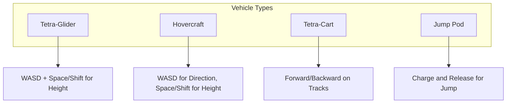
```mermaid
graph TD
    subgraph "Vehicle Types"
        TetraGlider["Tetra-Glider"]
        Hovercraft["Hovercraft"]
        TetraCart["Tetra-Cart"]
        JumpPod["Jump Pod"]
    end
    
    TetraGlider --> GliderControls["WASD + Space/Shift for Height"]
    
    Hovercraft --> HovercraftControls["WASD for Direction, Space/Shift for Height"]
    
    TetraCart --> CartControls["Forward/Backward on Tracks"]
    
    JumpPod --> PodControls["Charge and Release for Jump"]
```

Vehicle control mechanics:
- Enter/exit vehicles with the E key
- Each vehicle has unique control characteristics
- Most vehicles preserve momentum in tetrahedral space
- Special vehicles can traverse otherwise inaccessible areas

## Control Customization

Players can customize controls to match their preferences:

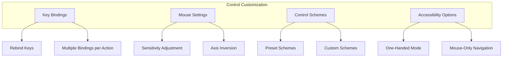
```mermaid
graph TD
    subgraph "Control Customization"
        KeyBindings["Key Bindings"]
        MouseSettings["Mouse Settings"]
        ControlSchemes["Control Schemes"]
        Accessibility["Accessibility Options"]
    end
    
    KeyBindings --> RebindKeys["Rebind Keys"]
    KeyBindings --> MultipleBindings["Multiple Bindings per Action"]
    
    MouseSettings --> Sensitivity["Sensitivity Adjustment"]
    MouseSettings --> Inversion["Axis Inversion"]
    
    ControlSchemes --> Presets["Preset Schemes"]
    ControlSchemes --> CustomSchemes["Custom Schemes"]
    
    Accessibility --> OneHanded["One-Handed Mode"]
    Accessibility --> MouseOnly["Mouse-Only Navigation"]
```

Customization options include:
- Full rebinding of all controls
- Mouse sensitivity and inversion settings
- Multiple control scheme presets
- Accessibility options for different needs
- Import/export of control configurations

## Navigation UI Elements

Several UI elements assist with navigation in tetrahedral space:

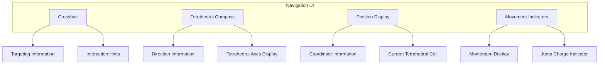
```mermaid
graph TD
    subgraph "Navigation UI"
        Crosshair["Crosshair"]
        Compass["Tetrahedral Compass"]
        PositionDisplay["Position Display"]
        MovementIndicators["Movement Indicators"]
    end
    
    Crosshair --> TargetingInfo["Targeting Information"]
    Crosshair --> InteractionHint["Interaction Hints"]
    
    Compass --> DirectionInfo["Direction Information"]
    Compass --> TetrahedralAxes["Tetrahedral Axes Display"]
    
    PositionDisplay --> CoordinateInfo["Coordinate Information"]
    PositionDisplay --> TetrahedralCell["Current Tetrahedral Cell"]
    
    MovementIndicators --> MomentumDisplay["Momentum Display"]
    MovementIndicators --> JumpCharge["Jump Charge Indicator"]
```

These UI elements provide:
- Visual feedback for navigation actions
- Orientation cues in tetrahedral space
- Position information in both coordinate systems
- Context-sensitive interaction hints

## Game Mode-Specific Controls

Different game modes have specialized control aspects:

### Creative Mode Controls

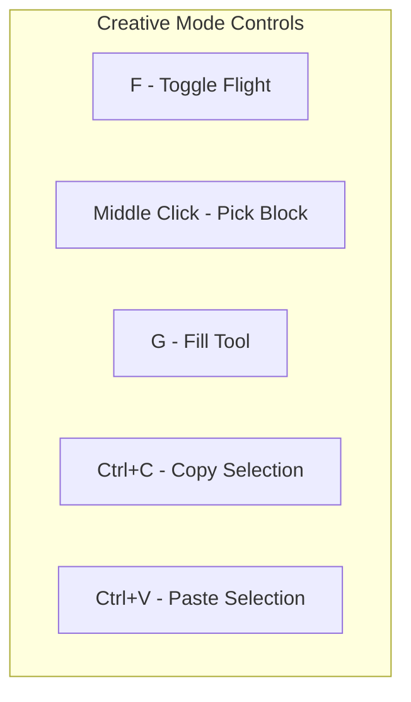
```mermaid
graph TD
    subgraph "Creative Mode Controls"
        FlightToggle["F - Toggle Flight"]
        PickBlock["Middle Click - Pick Block"]
        Fill["G - Fill Tool"]
        Copy["Ctrl+C - Copy Selection"]
        Paste["Ctrl+V - Paste Selection"]
    end
```

Creative mode additions:
- Instant block breaking
- Unlimited block placement
- Flight mode enabled by default
- Copy/paste functionality
- Advanced building tools

### Exploration Mode Controls

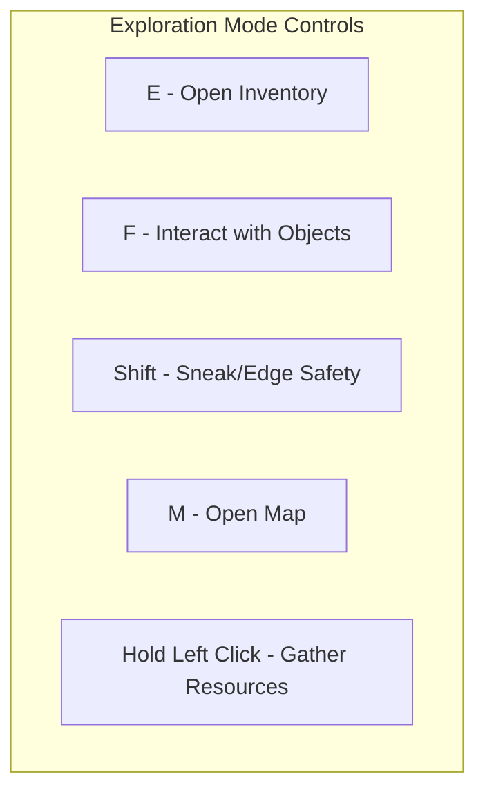
```mermaid
graph TD
    subgraph "Exploration Mode Controls"
        Inventory["E - Open Inventory"]
        Interact["F - Interact with Objects"]
        Sneak["Shift - Sneak/Edge Safety"]
        Map["M - Open Map"]
        Gather["Hold Left Click - Gather Resources"]
    end
```

Exploration mode additions:
- Stamina management for running and jumping
- Survival mechanics (hunger, health)
- Equipment management
- Environmental interaction controls

## Debug Controls

Debug controls are available for testing and development:

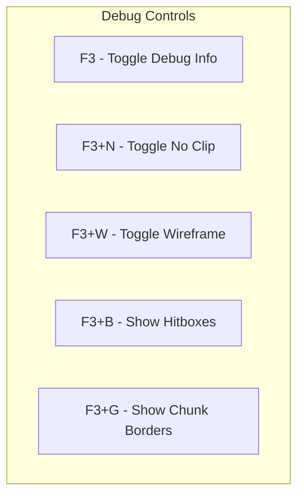
```mermaid
graph TD
    subgraph "Debug Controls"
        DebugToggle["F3 - Toggle Debug Info"]
        NoClip["F3+N - Toggle No Clip"]
        Wireframe["F3+W - Toggle Wireframe"]
        Hitboxes["F3+B - Show Hitboxes"]
        ChunkBorders["F3+G - Show Chunk Borders"]
    end
```

Debug features include:
- Comprehensive debug information display
- No-clip mode for moving through blocks
- Wireframe rendering mode
- Hitbox visualization
- Chunk border display

## Controller Support

QuadCraft supports gamepad/controller input:

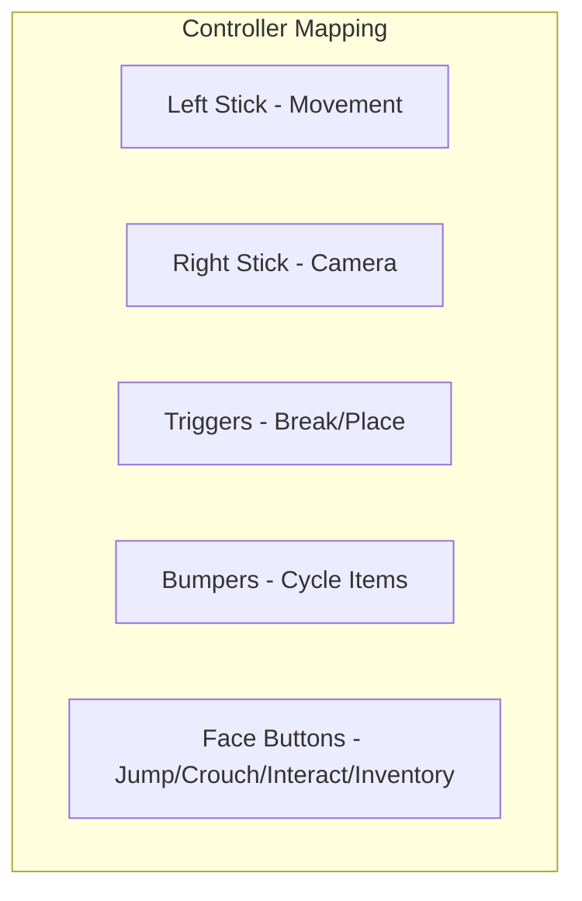
```mermaid
graph TD
    subgraph "Controller Mapping"
        LeftStick["Left Stick - Movement"]
        RightStick["Right Stick - Camera"]
        Triggers["Triggers - Break/Place"]
        Bumpers["Bumpers - Cycle Items"]
        FaceButtons["Face Buttons - Jump/Crouch/Interact/Inventory"]
    end
```

Controller features:
- Full gamepad support with customizable mapping
- Adaptive controller settings
- Haptic feedback
- Aim assist option
- UI navigation optimized for controllers

## Mobile Controls

Mobile versions of QuadCraft use touch controls:

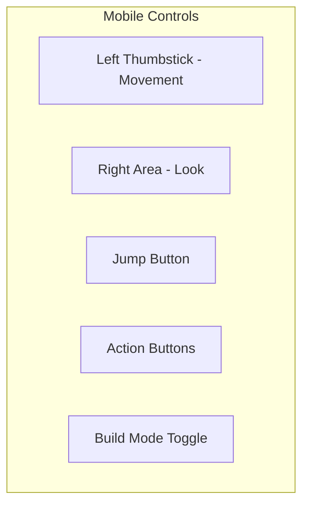
```mermaid
graph TD
    subgraph "Mobile Controls"
        LeftThumb["Left Thumbstick - Movement"]
        RightThumb["Right Area - Look"]
        JumpButton["Jump Button"]
        ActionButtons["Action Buttons"]
        BuildMode["Build Mode Toggle"]
    end
```

Mobile control features:
- Virtual joysticks for movement and camera
- Tap to break/place blocks
- Multi-touch support
- Customizable button layout
- Auto-jump option
- Motion control options

## Advanced Input Features

The JavaScript implementation includes sophisticated input handling systems:

```mermaid
graph TD
    subgraph "Advanced Input Features"
        GamepadIntegration["Gamepad Integration"]
        MouseControls["Mouse Controls"]
        TouchSupport["Touch Support"]
        InputDebugging["Input Debugging"]
        DeviceSupport["Multi-Device Support"]
    end

    GamepadIntegration --> AnalogControls["Analog Controls"]
    GamepadIntegration --> ButtonMapping["Button Mapping"]
    GamepadIntegration --> DeadZoneHandling["Dead Zone Handling"]

    MouseControls --> DragRotation["Drag Rotation"]
    MouseControls --> MultiButton["Multi-Button Support"]
    MouseControls --> Sensitivity["Sensitivity Adjustment"]

    TouchSupport --> VirtualJoysticks["Virtual Joysticks"]
    TouchSupport --> GestureRecognition["Gesture Recognition"]

    InputDebugging --> VisualFeedback["Visual Feedback"]
    InputDebugging --> RealTimeMonitoring["Real-time Monitoring"]

    DeviceSupport --> SimultaneousInput["Simultaneous Input"]
    DeviceSupport --> DevicePrioritization["Device Prioritization"]
```

### Gamepad Integration Features

- **Analog Controls**: Full support for analog sticks and triggers with dead zone handling
- **Button Mapping**: Comprehensive button mapping for all gamepad buttons
- **Haptic Feedback**: Vibration feedback for actions and events
- **Dual Camera Control**: Separate sticks for movement and camera rotation
- **Trigger Sensitivity**: Configurable sensitivity for analog triggers
- **Adaptive Dead Zones**: Dynamic dead zone adjustment based on controller type

### Mouse Control Enhancements

- **Three-Button Support**: Left, right, and middle mouse button support
- **Drag and Rotation**: Advanced mouse dragging for camera control
- **Multi-Button Combinations**: Support for multiple button combinations
- **Sensitivity Calibration**: Real-time sensitivity adjustment
- **Cursor State Management**: Proper cursor state management for different modes

### Touch and Mobile Features

- **Virtual Joystick System**: On-screen virtual joysticks for movement and camera
- **Gesture Recognition**: Touch gesture support for camera control
- **Multi-Touch Support**: Support for multiple simultaneous touch points
- **Responsive Layout**: Adaptive UI layout for different screen sizes
- **Touch Feedback**: Visual and haptic feedback for touch interactions

### Input Debugging and Monitoring

- **Real-time Input Display**: Visual feedback showing current input states
- **Button State Monitoring**: Real-time monitoring of all input device states
- **Input Event Logging**: Detailed logging of input events for debugging
- **Performance Metrics**: Input processing performance monitoring
- **Device Detection**: Automatic detection and configuration of input devices

### Multi-Device Input Support

- **Simultaneous Device Usage**: Support for using multiple input devices simultaneously
- **Device Prioritization**: Configurable priority system for conflicting inputs
- **Seamless Switching**: Smooth transitions between different input devices
- **Profile Management**: Input profiles for different device combinations
- **Accessibility Options**: Enhanced support for accessibility devices

## Navigation Challenges in Tetrahedral Space

Tetrahedral space presents unique navigation challenges:

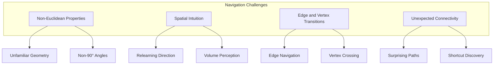
```mermaid
graph TD
    subgraph "Navigation Challenges"
        NonEuclidean["Non-Euclidean Properties"]
        SpatialIntuition["Spatial Intuition"]
        EdgeTransitions["Edge and Vertex Transitions"]
        UnexpectedConnectivity["Unexpected Connectivity"]
    end
    
    NonEuclidean --> UnfamiliarGeometry["Unfamiliar Geometry"]
    NonEuclidean --> AngleChanges["Non-90° Angles"]
    
    SpatialIntuition --> RelearningDirection["Relearning Direction"]
    SpatialIntuition --> VolumePerception["Volume Perception"]
    
    EdgeTransitions --> EdgeNavigation["Edge Navigation"]
    EdgeTransitions --> VertexCrossing["Vertex Crossing"]
    
    UnexpectedConnectivity --> SurprisingPaths["Surprising Paths"]
    UnexpectedConnectivity --> ShortcutDiscovery["Shortcut Discovery"]
```

To address these challenges, QuadCraft provides:
- Gradual introduction to tetrahedral movement
- Visual cues for orientation and navigation
- Tutorial levels focused on spatial understanding
- Practice challenges for developing tetrahedral intuition

## Coordinate System Learning Tools

QuadCraft includes tools specifically designed to help players understand tetrahedral coordinates:

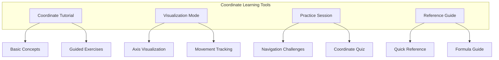
```mermaid
graph TD
    subgraph "Coordinate Learning Tools"
        CoordinateTutorial["Coordinate Tutorial"]
        VisualizationMode["Visualization Mode"]
        PracticeSession["Practice Session"]
        ReferenceGuide["Reference Guide"]
    end
    
    CoordinateTutorial --> BasicConcepts["Basic Concepts"]
    CoordinateTutorial --> GuidedExercises["Guided Exercises"]
    
    VisualizationMode --> AxisVisualization["Axis Visualization"]
    VisualizationMode --> MovementTracking["Movement Tracking"]
    
    PracticeSession --> NavigationChallenges["Navigation Challenges"]
    PracticeSession --> CoordinateQuiz["Coordinate Quiz"]
    
    ReferenceGuide --> QuickReference["Quick Reference"]
    ReferenceGuide --> FormulaGuide["Formula Guide"]
```

These tools help players by:
- Providing interactive tutorials for tetrahedral navigation
- Visualizing coordinate changes during movement
- Offering practice challenges with increasing difficulty
- Including a reference guide for coordinate system understanding

## Conclusion

The control and navigation system in QuadCraft balances familiarity with innovation, providing players with intuitive tools to explore and interact with a tetrahedral world. Through carefully designed controls, visual aids, and learning tools, players can develop an understanding of movement in tetrahedral space that feels as natural as navigation in traditional cubic voxel games. 