# Controls and Navigation in QuadCraft

This document details the control scheme and navigation mechanics in QuadCraft, explaining how players interact with and move through tetrahedral space.

## Control Philosophy

QuadCraft's control system is designed to make navigation in tetrahedral space feel intuitive despite the unfamiliar geometry. The controls follow familiar first-person conventions while adding specialized functionality for tetrahedral navigation.

## Basic Movement Controls

### Keyboard Movement

The primary movement controls use the standard WASD layout:

| Key | Action | Description |
|-----|--------|-------------|
| W | Move Forward | Move in the direction you're facing |
| A | Strafe Left | Move left relative to the direction you're facing |
| S | Move Backward | Move opposite to the direction you're facing |
| D | Strafe Right | Move right relative to the direction you're facing |
| Space | Jump/Fly Up | Jump when on ground, move upward when flying |
| Shift | Crouch/Fly Down | Crouch when on ground, move downward when flying |
| Ctrl | Sprint | Move faster while held |

### Mouse Controls

The mouse controls the camera view and interaction:

| Control | Action | Description |
|---------|--------|-------------|
| Mouse Movement | Look Around | Control the camera direction |
| Left Click | Break Block | Remove the targeted block |
| Right Click | Place Block/Use Item | Place block or use held item |
| Middle Click | Pick Block | Select the type of block you're looking at |
| Scroll Wheel | Change Selected Item | Cycle through hotbar items |

## Function Keys

Function keys provide access to special features and toggles:

| Key | Action | Description |
|-----|--------|-------------|
| F1 | Hide UI | Toggle visibility of the interface |
| F2 | Take Screenshot | Capture and save a screenshot |
| F3 | Debug Information | Show detailed game information |
| F4 | Coordinate Display | Toggle coordinate system display |
| F5 | Refresh Resources | Reload textures and resources |
| F6 | Wireframe Mode | Toggle wireframe rendering |
| F7 | Grid Overlay | Toggle tetrahedral grid visualization |
| F8 | Quadray Visualizer | Toggle 3D quadray coordinate visualizer |

## Movement Mechanics

### Basic Navigation

Navigation in tetrahedral space follows these mechanics:

The movement system converts player inputs into movement through tetrahedral space:

1. **Movement Vector Calculation**: Inputs are converted to a direction vector in Cartesian space
2. **Tetrahedral Translation**: The Cartesian vector is mapped to tetrahedral space movement
3. **Collision Detection**: The movement is checked against tetrahedral boundaries
4. **Position Update**: The player position is updated in both coordinate systems

### Gravity and Jumping

Gravity and jumping follow these rules:

- **Gravity**: Pulls the player downward in Cartesian space (negative y-axis)
- **Jumping**: Applies an upward impulse in Cartesian space
- **Terminal Velocity**: Maximum falling speed is capped
- **Tetrahedral Landing**: Detects landing on tetrahedral faces

### Flight Mode

Flight mode allows full 3D movement without gravity:

Flight mode features:
- Toggle with double-tap of the space key or through a dedicated key (default: F)
- No collision with blocks (optional setting)
- Speed adjustment using Ctrl/Alt
- Smooth transitions between normal and flight mode

## Tetrahedral Coordinate Navigation

QuadCraft provides tools for understanding and navigating by tetrahedral coordinates:

### Coordinate Display

The coordinate display shows current position in both Cartesian (x,y,z) and Quadray (a,b,c,d) formats:

- Toggle with F4 key
- Color-coded values for easier reading
- Distance traveled in both coordinate systems
- Current tetrahedron ID

### Tetrahedral Compass

The tetrahedral compass helps with orientation:

- Shows direction relative to the tetrahedral axes
- Color-coded to match the four primary tetrahedron vertices
- Optional 3D visualization mode
- Can be toggled on/off

## Block Interaction

### Block Placement

Placing blocks follows these rules:

Block placement mechanics:
- Blocks can only be placed on existing block faces
- Block orientation is determined by the face being placed against
- Cannot place blocks where the player is standing
- Distance limit for block placement (configurable)

### Block Breaking

Breaking blocks follows these rules:

Block breaking mechanics:
- Block hardness determines break time
- Breaking animation shows progress
- Distance limit for block breaking (configurable)
- Broken blocks may drop items based on their type

## Advanced Movement Techniques

### Wall Climbing

Wall climbing allows vertical movement on suitable surfaces:

- Certain block types support climbing (ladders, vines, etc.)
- Hold the forward key (W) while against a climbable surface
- Can look and move side-to-side while climbing
- Releasing the forward key will cause the player to descend

### Gliding

Gliding enables controlled descent:

- Requires special equipment (glider item)
- Activated by jumping and holding jump key
- Direction controlled by look direction
- Gradually descends while moving forward
- Can be canceled by pressing crouch

### Tetrahedron-Based Movement

Special movement mechanics tied to tetrahedral geometry:

These special movement mechanics include:
- Edge traversal allowing movement along tetrahedral edges
- Vertex jumping for higher jumps from tetrahedral vertices
- Face sliding on steep tetrahedral faces
- Special transport between connected tetrahedra

## Vehicle Controls

QuadCraft supports various vehicles for faster travel through tetrahedral space:

Vehicle control mechanics:
- Enter/exit vehicles with the E key
- Each vehicle has unique control characteristics
- Most vehicles preserve momentum in tetrahedral space
- Special vehicles can traverse otherwise inaccessible areas

## Control Customization

Players can customize controls to match their preferences:

Customization options include:
- Full rebinding of all controls
- Mouse sensitivity and inversion settings
- Multiple control scheme presets
- Accessibility options for different needs
- Import/export of control configurations

## Navigation UI Elements

Several UI elements assist with navigation in tetrahedral space:

These UI elements provide:
- Visual feedback for navigation actions
- Orientation cues in tetrahedral space
- Position information in both coordinate systems
- Context-sensitive interaction hints

## Game Mode-Specific Controls

Different game modes have specialized control aspects:

### Creative Mode Controls

Creative mode additions:
- Instant block breaking
- Unlimited block placement
- Flight mode enabled by default
- Copy/paste functionality
- Advanced building tools

### Exploration Mode Controls

Exploration mode additions:
- Stamina management for running and jumping
- Survival mechanics (hunger, health)
- Equipment management
- Environmental interaction controls

## Debug Controls

Debug controls are available for testing and development:

Debug features include:
- Comprehensive debug information display
- No-clip mode for moving through blocks
- Wireframe rendering mode
- Hitbox visualization
- Chunk border display

## Controller Support

QuadCraft supports gamepad/controller input:

Controller features:
- Full gamepad support with customizable mapping
- Adaptive controller settings
- Haptic feedback
- Aim assist option
- UI navigation optimized for controllers

## Mobile Controls

Mobile versions of QuadCraft use touch controls:

Mobile control features:
- Virtual joysticks for movement and camera
- Tap to break/place blocks
- Multi-touch support
- Customizable button layout
- Auto-jump option
- Motion control options

## Navigation Challenges in Tetrahedral Space

Tetrahedral space presents unique navigation challenges:

```mermaid
graph TD
    subgraph "Navigation Challenges"
        NonEuclidean["Non-Euclidean Properties"]
        SpatialIntuition["Spatial Intuition"]
        EdgeTransitions["Edge and Vertex Transitions"]
        UnexpectedConnectivity["Unexpected Connectivity"]
    end
    
    NonEuclidean --> UnfamiliarGeometry["Unfamiliar Geometry"]
    NonEuclidean --> AngleChanges["Non-90° Angles"]
    
    SpatialIntuition --> RelearningDirection["Relearning Direction"]
    SpatialIntuition --> VolumePerception["Volume Perception"]
    
    EdgeTransitions --> EdgeNavigation["Edge Navigation"]
    EdgeTransitions --> VertexCrossing["Vertex Crossing"]
    
    UnexpectedConnectivity --> SurprisingPaths["Surprising Paths"]
    UnexpectedConnectivity --> ShortcutDiscovery["Shortcut Discovery"]
```

To address these challenges, QuadCraft provides:
- Gradual introduction to tetrahedral movement
- Visual cues for orientation and navigation
- Tutorial levels focused on spatial understanding
- Practice challenges for developing tetrahedral intuition

## Coordinate System Learning Tools

QuadCraft includes tools specifically designed to help players understand tetrahedral coordinates:

These tools help players by:
- Providing interactive tutorials for tetrahedral navigation
- Visualizing coordinate changes during movement
- Offering practice challenges with increasing difficulty
- Including a reference guide for coordinate system understanding

## Conclusion

The control and navigation system in QuadCraft balances familiarity with innovation, providing players with intuitive tools to explore and interact with a tetrahedral world. Through carefully designed controls, visual aids, and learning tools, players can develop an understanding of movement in tetrahedral space that feels as natural as navigation in traditional cubic voxel games. 