# QuadCraft Gameplay Overview

## Core Concept

QuadCraft is a voxel-based game that reimagines the traditional cubic voxel paradigm by using tetrahedral elements as its fundamental building blocks. This unique approach creates distinct gameplay experiences centered around exploration, building, and navigation in a tetrahedral world.

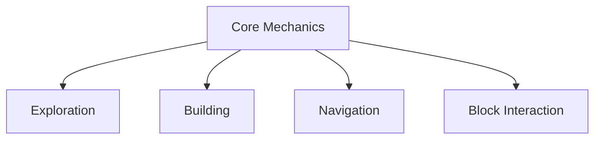

## Design Philosophy

QuadCraft's design philosophy revolves around several key principles:

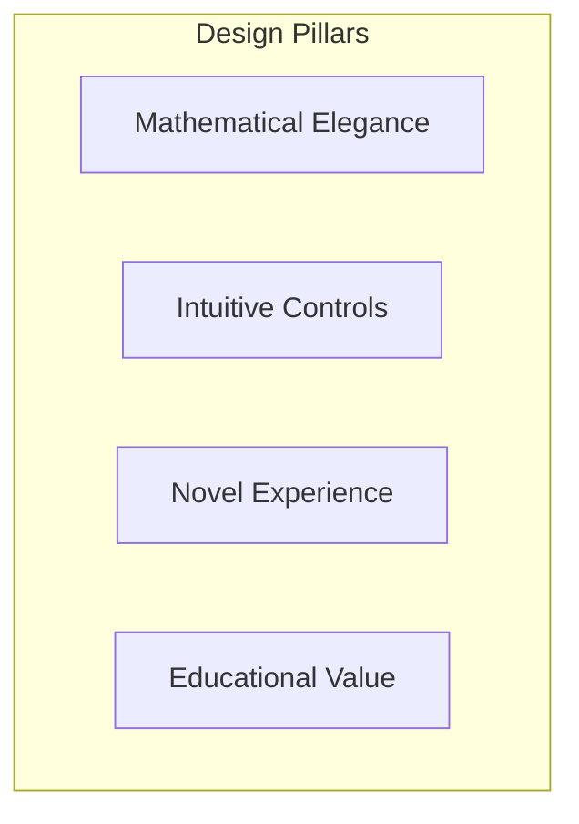

1. **Mathematical Elegance**: Showcase the beauty of tetrahedral geometry and coordinate systems
2. **Intuitive Controls**: Despite the complexity of tetrahedral space, maintain intuitive player controls
3. **Novel Experience**: Provide a genuinely different experience from cubic voxel games
4. **Educational Value**: Help players understand non-Cartesian coordinate systems and tetrahedral geometry

## Game Modes

QuadCraft offers different game modes to accommodate various player interests:

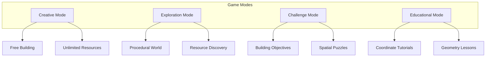

### Creative Mode

Creative mode focuses on free building and experimentation with tetrahedral structures. Players have:
- Unlimited resources
- Flight capabilities
- No environmental hazards
- Access to all block types
- Ability to save and share creations

### Exploration Mode

Exploration mode emphasizes discovery in procedurally generated tetrahedral worlds:
- Procedurally generated terrain with tetrahedral features
- Resource gathering
- Day/night cycle
- Weather effects
- Unique biomes with distinctive tetrahedral formations

### Challenge Mode

Challenge mode presents players with specific building and navigation challenges:
- Timed construction tasks
- Spatial reasoning puzzles
- Structure replication challenges
- Navigation obstacle courses

### Educational Mode

Educational mode provides structured tutorials on tetrahedral geometry and coordinates:
- Interactive tutorials on quadray coordinates
- Geometry visualization tools
- Step-by-step construction guides
- Mathematical demonstrations and explanations

## Player Experience Flow

The typical player experience follows this progression:

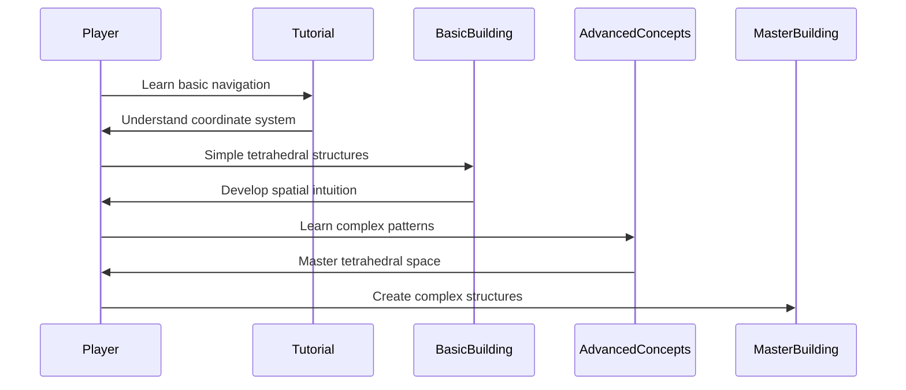

## Core Gameplay Mechanics

### Navigation

Navigation in QuadCraft occurs in both Cartesian and tetrahedral coordinate systems:

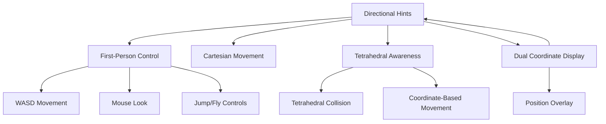

Key navigation features:
- First-person movement using WASD keys
- Mouse look controls
- Arrow key alternative movement
- Jump and fly capabilities
- Drone mode with advanced movement options
- Coordinate system toggle (Cartesian/Quadray)
- Speed adjustment controls

### Block Interaction

The block interaction system allows players to manipulate the tetrahedral world:

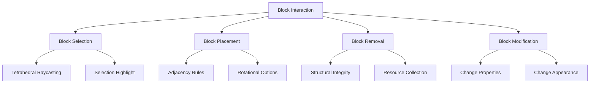

Key interaction features:
- Left-click to remove blocks
- Right-click to place blocks
- Block selection highlighting
- Block type selection UI
- Block rotation options
- Block property modification

### Building System

The building system expands on block interaction with additional features:

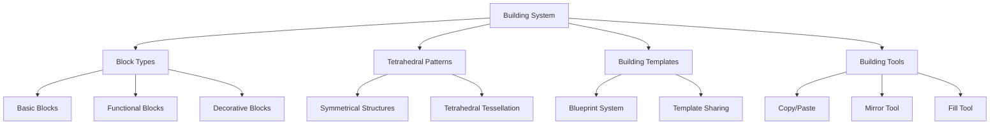

Key building features:
- Multiple block types with different properties
- Blueprint system for saving and loading structures
- Advanced building tools (copy/paste, fill, mirror)
- Pattern recognition and auto-completion
- Structural integrity system

## World System

The world in QuadCraft is built from tetrahedral chunks:

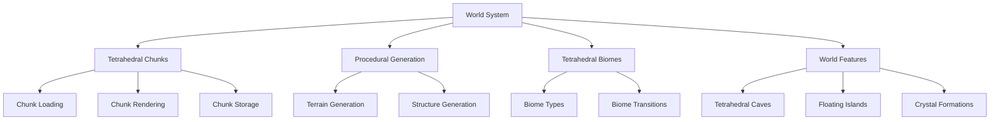

Key world features:
- Procedurally generated tetrahedral terrain
- Unique biomes with tetrahedral characteristics
- Special tetrahedral formations (crystals, caves)
- Day/night cycle with lighting effects
- Weather system influencing world appearance

## Progression System

QuadCraft features a progression system based on mastery of tetrahedral concepts:

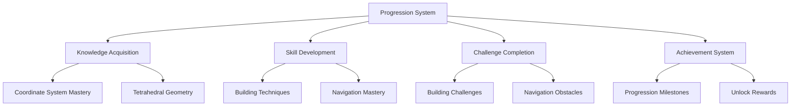

Key progression features:
- Tutorial completion tracking
- Skill-based achievements
- Challenge completion rewards
- Building technique mastery tracking
- Special unlocks for advanced players

## Visual and Audio Design

QuadCraft's presentation reinforces its tetrahedral nature:

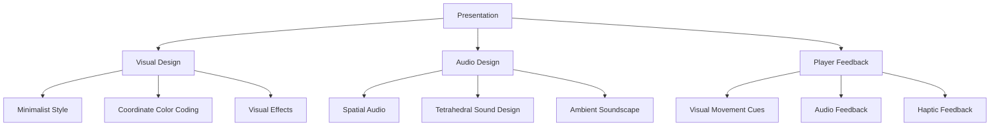

Key presentation features:
- Clean, minimalist visual style
- Color-coded coordinate system visuals
- Spatial audio reflecting tetrahedral space
- Clear visual feedback for player actions
- Ambient soundscape evolving with player location

## Educational Elements

QuadCraft emphasizes educational content about tetrahedral geometry:

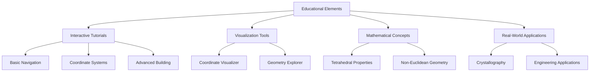

Key educational features:
- Step-by-step tutorials on tetrahedral concepts
- Interactive visualizations of coordinate systems
- Explanations of mathematical properties
- Real-world applications of tetrahedral geometry

## Future Gameplay Expansions

Planned features for future QuadCraft versions:

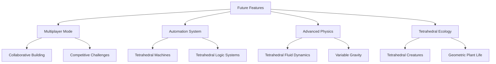

## Conclusion

QuadCraft offers a unique gameplay experience centered around tetrahedral geometry and non-Cartesian coordinate systems. By balancing mathematical complexity with intuitive controls, the game creates an engaging environment for both creative expression and educational exploration. 