# QuadCraft World Generation

This document describes the procedural world generation system used in QuadCraft, focusing on the creation of tetrahedral landscapes and structures.

## Overview

QuadCraft's world generation system creates diverse tetrahedral environments using procedural generation techniques adapted for tetrahedral space. The generation process follows a multi-layered approach to create coherent, interesting, and playable worlds.

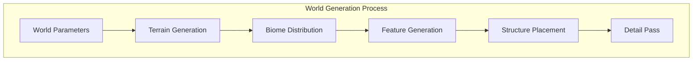

## World Parameters

Each QuadCraft world is initialized with a set of parameters that control the generation process:

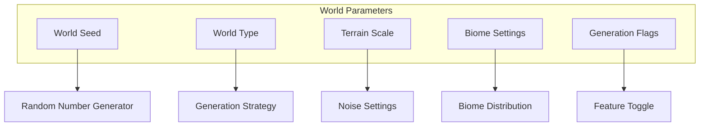

Key world parameters include:
- **World Seed**: A numerical value that initializes the random number generator
- **World Type**: Determines the overall terrain type (e.g., floating islands, continuous terrain, caves)
- **Terrain Scale**: Controls the scale of terrain features
- **Biome Settings**: Configures the distribution and characteristics of biomes
- **Generation Flags**: Toggles specific generation features on or off

## Tetrahedral Space Representation

Unlike traditional voxel games that use cubic grids, QuadCraft uses a tetrahedral grid system for world representation:

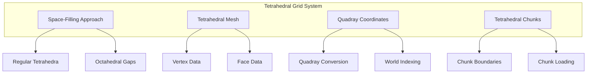

The tetrahedral grid uses:
- Regular tetrahedra arranged in a space-filling pattern
- Quadray coordinates to index positions in tetrahedral space
- Custom chunk system designed for tetrahedral elements
- Specialized mesh generation for rendering tetrahedral blocks

## Noise Generation for Tetrahedral Space

Procedural noise functions are adapted for tetrahedral space to generate coherent terrain:

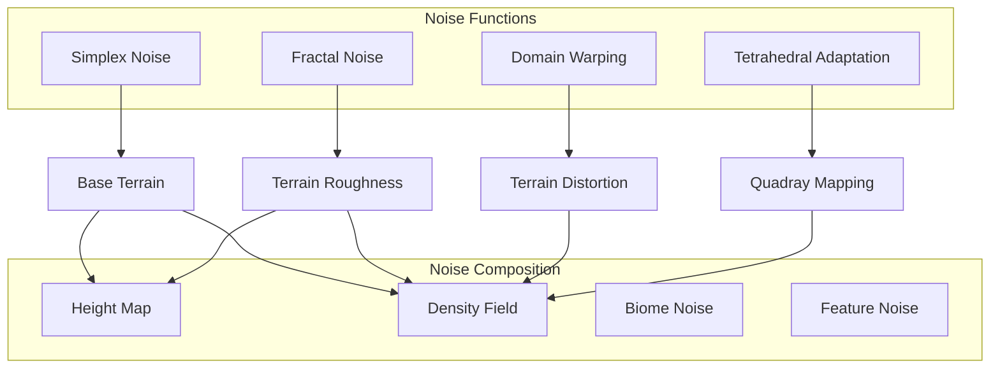

Key noise generation features:
- **Adapted Simplex Noise**: Modified for tetrahedral space
- **Fractal Brownian Motion**: Creates natural-looking terrain variations
- **Domain Warping**: Adds natural distortions to avoid regular patterns
- **Tetrahedral-Specific Noise**: Custom noise functions that work well in quadray coordinate space
- **Multi-layered Noise**: Combination of multiple noise functions for complex terrain

## Terrain Generation Algorithm

The terrain generation algorithm creates the base landscape structure:

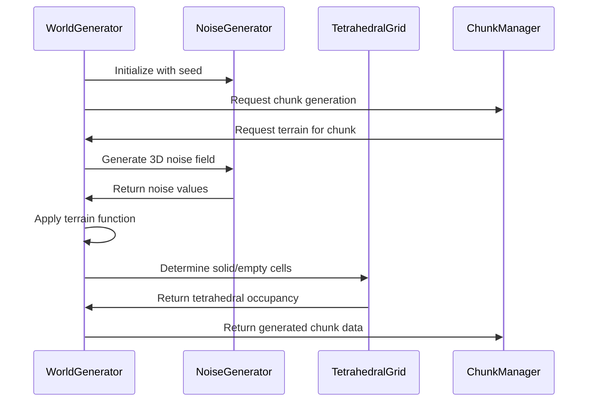

The terrain generation process:
1. **Initialization**: Set up noise generators with the world seed
2. **Chunk Request**: Generate terrain chunk by chunk
3. **Noise Field**: Create a 3D noise field for the chunk
4. **Terrain Function**: Apply mathematical functions to the noise to determine terrain shape
5. **Tetrahedral Mapping**: Map the terrain function to tetrahedral grid cells
6. **Block Assignment**: Determine which tetrahedral cells are solid and which are empty
7. **Block Type Selection**: Assign appropriate block types based on position and biome

## Special Considerations for Tetrahedral Terrain

Generating terrain in tetrahedral space requires special considerations:

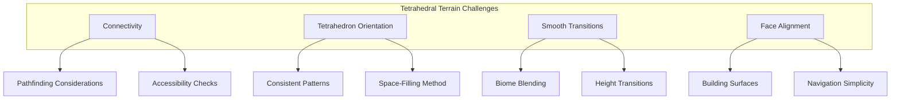

Key tetrahedral terrain considerations:
- **Connectivity**: Ensuring that terrain is appropriately connected for player navigation
- **Tetrahedron Orientation**: Maintaining consistent orientation patterns for predictable building
- **Smooth Transitions**: Creating natural transitions between different terrain heights and types
- **Face Alignment**: Aligning tetrahedral faces to create flat surfaces where appropriate
- **Special Structures**: Generating tetrahedral-specific structures that showcase the geometry

## Biome System

The biome system determines the distribution of different environments:

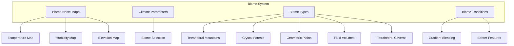

The biome generation process:
1. **Climate Parameter Generation**: Create temperature, humidity, and other climate maps
2. **Biome Mapping**: Map climate parameters to biome types
3. **Biome Detailing**: Add biome-specific features and block types
4. **Transition Zones**: Create smooth transitions between different biomes
5. **Special Features**: Add biome-specific landmarks and structures

### Tetrahedral Biome Types

QuadCraft features several unique biome types designed for tetrahedral space:

```mermaid
graph TD
    subgraph "Tetrahedral Biome Types"
        Mountains["Tetrahedral Peaks"]
        Plains["Geometric Plains"]
        Forests["Crystal Forests"]
        Caves["Fractal Caverns"]
        Islands["Floating Tetrahedra"]
        Oceans["Fluid Volumes"]
    end
    
    Mountains --> SharpPeaks["Sharp Peaks"]
    Mountains --> RidgeLines["Ridge Lines"]
    
    Plains --> RegularPatterns["Regular Patterns"]
    Plains --> FlatAreas["Building-Friendly Areas"]
    
    Forests --> CrystalTrees["Crystal Tree Formations"]
    Forests --> GeometricVegetation["Geometric Vegetation"]
    
    Caves --> NestedTetrahedra["Nested Tetrahedra"]
    Caves --> VoidSpaces["Void Spaces"]
    
    Islands --> DisconnectedTerrain["Disconnected Terrain"]
    Islands --> FloatingFormations["Floating Formations"]
    
    Oceans --> LiquidSimulation["Liquid Simulation"]
    Oceans --> GeometricShores["Geometric Shores"]
```

Each biome has unique characteristics:
- **Tetrahedral Peaks**: Mountain ranges with sharp edges and defined faces
- **Geometric Plains**: Flat areas with subtle tetrahedral patterns ideal for building
- **Crystal Forests**: Forests of crystal-like tetrahedral formations resembling trees
- **Fractal Caverns**: Underground networks of tetrahedral caves with varying sizes
- **Floating Tetrahedra**: Disconnected islands of tetrahedral terrain floating in space
- **Fluid Volumes**: Areas filled with liquid contained within tetrahedral boundaries

## Feature Generation

After the base terrain and biomes are established, various features are added to the world:

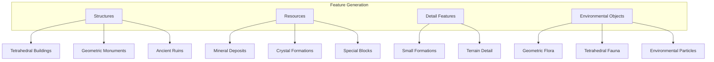

The feature generation process:
1. **Structure Placement**: Determine locations for large structures
2. **Resource Distribution**: Place resources based on biome type and depth
3. **Detail Features**: Add small features to increase visual interest
4. **Environmental Objects**: Place flora, fauna, and other environmental objects

### Structure Generation

Structures in QuadCraft are generated using template-based and procedural approaches:

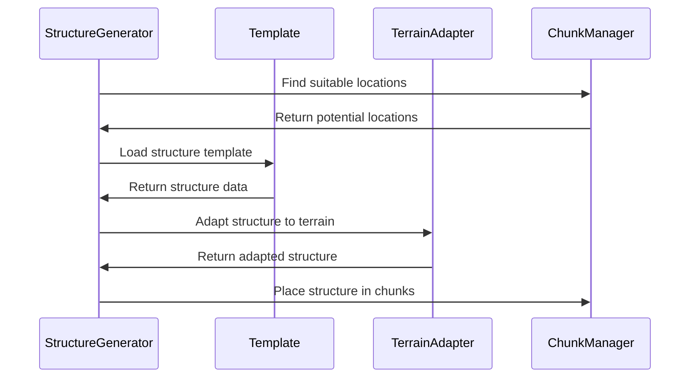

Structure generation features:
- **Template System**: Pre-designed structure templates that can be placed in the world
- **Procedural Generation**: Algorithmic generation of unique structures
- **Terrain Adaptation**: Modification of structures to fit the local terrain
- **Style Variation**: Different architectural styles based on biome and location
- **Functional Structures**: Structures with specific gameplay functions

## Chunk Management

The world is divided into tetrahedral chunks for efficient memory management and generation:

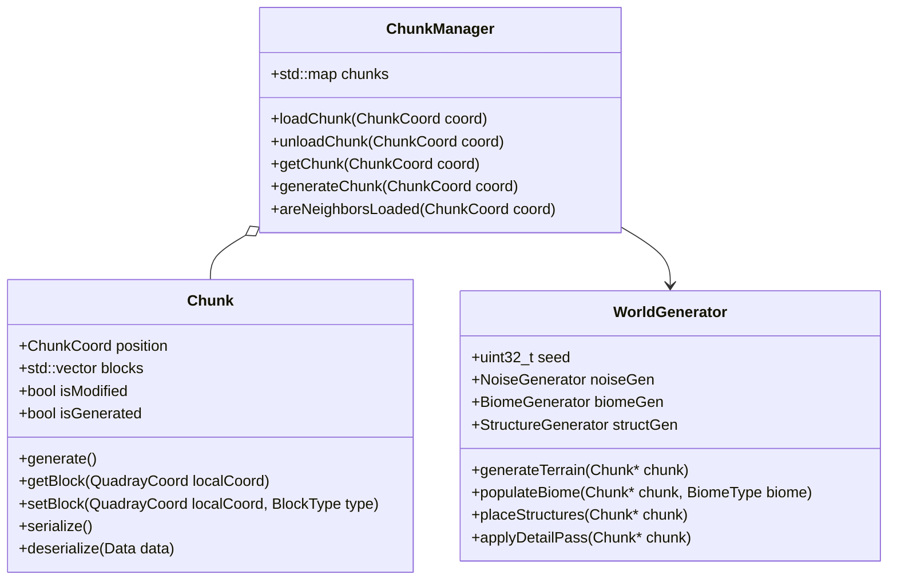

Chunk management features:
- **Tetrahedral Chunking**: Division of the world into tetrahedral chunks
- **Dynamic Loading**: Loading and unloading chunks based on player position
- **Generation Priority**: Prioritizing generation of visible chunks
- **Chunk Serialization**: Saving and loading chunks to/from disk
- **Chunk Boundaries**: Special handling of block connections at chunk boundaries

### Chunk Coordinate System

Chunks use a specialized coordinate system to efficiently index tetrahedral space:

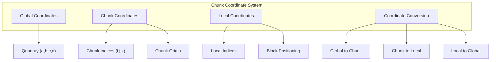

The coordinate system allows for:
- **Efficient Indexing**: Quick lookup of blocks within the world
- **Spatial Partitioning**: Dividing the world into manageable chunks
- **Level of Detail**: Potential for multi-resolution chunk representation
- **Infinite Worlds**: Support for theoretically infinite world sizes

## World Generation Implementation

The world generation system uses the following classes and algorithms:

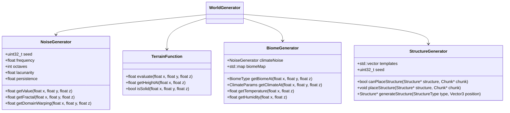

## Advanced Generation Techniques

QuadCraft employs several advanced techniques for world generation:

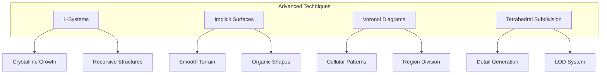

Advanced generation techniques include:
- **L-Systems**: For generating crystal-like structures and fractals
- **Implicit Surfaces**: Creating smooth, continuous terrain surfaces
- **Voronoi Diagrams**: Generating cellular patterns and region division
- **Tetrahedral Subdivision**: Adding detail through recursive subdivision
- **Procedural Patterns**: Creating repeating motifs specific to tetrahedral geometry

## Cave and Tunnel Generation

Underground features are generated using specialized algorithms:

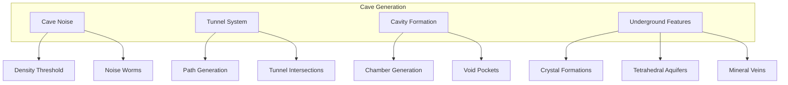

Cave generation features:
- **3D Noise**: Using 3D noise functions to carve out cave systems
- **Tunnel Algorithms**: Generating connecting tunnel networks
- **Chamber Generation**: Creating large underground chambers
- **Feature Placement**: Adding special features like crystal formations
- **Fluid Pockets**: Underground lakes and lava pools

## World Generation Parameters

The world generation system offers various parameters for customization:

```mermaid
graph TD
    subgraph "Generation Parameters"
        TerrainParams["Terrain Parameters"]
        BiomeParams["Biome Parameters"]
        StructureParams["Structure Parameters"]
        FeatureParams["Feature Parameters"]
    end
    
    TerrainParams --> TerrainScale["Terrain Scale"]
    TerrainParams --> TerrainRoughness["Terrain Roughness"]
    TerrainParams --> TerrainHeight["Maximum Height"]
    
    BiomeParams --> BiomeScale["Biome Scale"]
    BiomeParams --> BiomeFrequency["Biome Frequency"]
    BiomeParams --> BiomeVariety["Biome Variety"]
    
    StructureParams --> StructureDensity["Structure Density"]
    StructureParams --> StructureScale["Structure Scale"]
    StructureParams --> StructureVariety["Structure Variety"]
    
    FeatureParams --> FeatureDensity["Feature Density"]
    FeatureParams --> ResourceAbundance["Resource Abundance"]
    FeatureParams --> DetailLevel["Detail Level"]
```

These parameters allow for:
- **Custom Worlds**: Creation of worlds with specific characteristics
- **Varied Gameplay**: Different world types for different gameplay experiences
- **Performance Tuning**: Adjusting generation complexity based on hardware capabilities
- **Creative Expression**: Enabling players to create worlds that match their vision

## World Types

QuadCraft supports different world types with unique generation characteristics:

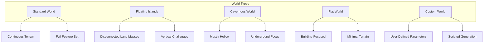

Each world type has specific generation rules:
- **Standard World**: Balanced terrain with mountains, plains, and varied biomes
- **Floating Islands**: Disconnected tetrahedral islands floating in space
- **Cavernous World**: Minimal surface with extensive underground cave systems
- **Flat World**: Flat terrain ideal for creative building
- **Custom World**: User-defined world with customizable parameters

## World Generation Events

The generation system fires events at different stages for modifying the generation process:

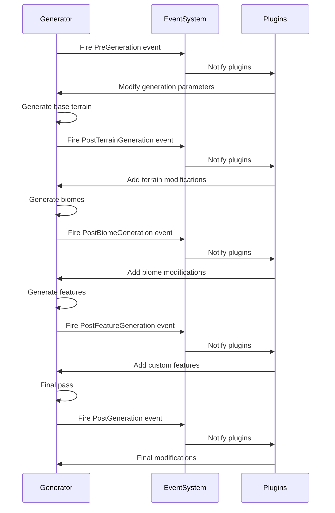

This event-based approach allows for:
- **Extensibility**: Easy addition of new generation features
- **Modding Support**: Enabling mods to modify world generation
- **Custom Generation**: Support for custom generation plugins
- **Generation Hooks**: Providing entry points for generation modifications

## Conclusion

The QuadCraft world generation system creates unique tetrahedral worlds that challenge traditional voxel game conventions. By adapting procedural generation techniques to tetrahedral space, QuadCraft offers players diverse, interesting, and mathematically elegant environments to explore and build in. 