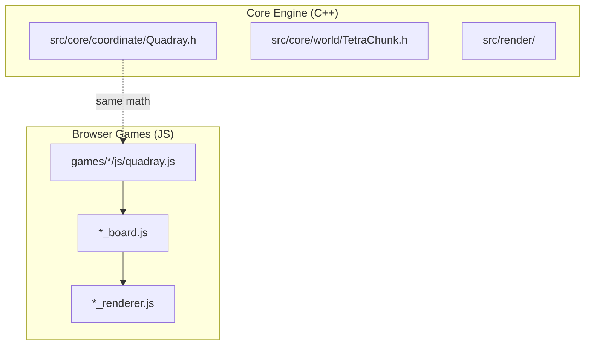

# Games Portfolio

Overview documentation for the 12 standalone 4D browser games built on the QuadCraft Quadray coordinate system.

> [!TIP]
> For launch scripts, per-game file structure, and the Python launcher, see [games/README.md](../games/README.md). For the canonical game index with metadata, see [games/GAMES_INDEX.md](../games/GAMES_INDEX.md).

## Portfolio Summary

All 12 games are **standalone browser applications** — zero build step, zero server requirement. Each game runs from a single `index.html` file in `games/<name>/`.

| # | Game | Key Mechanic | Quadray Usage | Tests |
|---|------|-------------|--------------|-------|
| 1 | ♟️ **4D Chess** | Turn-based strategy, check/checkmate | Board positions as quadray coordinates | 83 |
| 2 | 🏁 **4D Checkers** | Diagonal capture + promotion | 4D diagonal movement vectors | 11 |
| 3 | ⚫ **4D Reversi** | Disc flipping across 80 directions | 80 capture directions from IVM geometry | 11 |
| 4 | 🧬 **4D Life** | Cellular automata, birth/survival | 4D wrapping neighbor lookup | 8 |
| 5 | 🚀 **4D Asteroids** | Continuous motion, wrap-around | Quadray velocity vectors | 8 |
| 6 | 🐜 **4D SimAnt** | Pheromone trails, foraging AI | Quadray-based ant navigation | 9 |
| 7 | 🎲 **4D Backgammon** | 24-point spiral, dice + bearing-off | 4D spiral track layout | 8 |
| 8 | ⛏️ **4D Minecraft** | Terrain gen, trees, block inventory | Tetrahedral voxels, IVM grid | 11 |
| 9 | 🏝️ **4D Catan** | Resource production, settlements | Hex tile placement in 4D | 10 |
| 10 | 🏰 **4D Tower Defense** | Path waves, auto-targeting towers | IVM pathfinding, cell parity | 9 |
| 11 | 👹 **4D Doom** | Hitscan FPS, enemy AI pursuit | IVM cell parity, Synergetics constants | 7 |
| 12 | 🀄 **4D Mahjong** | 144-tile 4-layer matching | 4D tile stacking | 7 |

**Total: 12 games, 182+ unit tests, all passing ✅**

## Quick Start

```bash
# Open any game directly (no server needed for basic play)
open games/4d_chess/index.html

# Or use shell scripts with HTTP server
cd games
./run_chess.sh          # Opens on port 8100

# Or use the Python launcher for multiple games
python3 games/run_games.py --game chess doom life
python3 games/run_games.py --all                  # All 12 simultaneously
python3 games/run_games.py --test                 # Run all unit tests
```

## Standalone Architecture

Each game follows an identical self-contained structure:

```text
games/<game_name>/
├── index.html              # Entry point — open in browser
├── js/
│   ├── quadray.js          # Own copy of 4D coordinate math
│   ├── <game>_board.js     # Board / world state
│   ├── <game>_renderer.js  # Canvas rendering
│   └── <game>_game.js      # Controller + UI logic
└── tests/
    └── test_<game>.js      # Node.js unit tests
```

### Why Standalone?

- **Zero build step** — open `index.html` and play
- **Independent versioning** — each game can be tagged/released separately
- **Easy forking** — copy one folder to start a new game
- **No coupling** — updating Chess never breaks Checkers
- **Portable** — deploy to any static host (GitHub Pages, S3, Netlify)

### Shared Math Foundation

All games carry their own `quadray.js` implementing:

- Quadray coordinate class with `(a, b, c, d)` components
- Cartesian ↔ Quadray conversion (same formulas as `src/core/coordinate/Quadray.h`)
- Zero-minimum normalization
- Distance calculations
- IVM volume ratios and Synergetics constants (in enhanced versions)

To synchronize `quadray.js` after updating the math:

```bash
for dir in games/4d_*/js/; do cp games/4d_chess/js/quadray.js "$dir"; done
```

## Testing

All games include Node.js-runnable unit tests:

```bash
# Run all tests via Python launcher
python3 games/run_games.py --test

# Run tests for specific games
python3 games/run_games.py --test --game chess doom

# Run individual test file directly
node games/4d_chess/tests/test_quadray.js
```

Test coverage includes:

- Quadray coordinate math (conversion, normalization, distance)
- Game-specific logic (legal moves, win conditions, scoring)
- IVM/Synergetics constants (volume ratios, basis vector lengths)

## Relationship to Core QuadCraft

The browser games share the **mathematical foundation** with the C++ engine but are otherwise independent:



## Adding a New Game

1. Create `games/<name>/` following the standalone structure
2. Copy `quadray.js` from an existing game
3. Implement `<name>_board.js`, `<name>_renderer.js`, `<name>_game.js`
4. Add tests in `tests/`
5. Add entry to `GAMES` registry in `run_games.py`
6. Create `run_<name>.sh` script
7. Update this doc and [docs/README.md](README.md) with the new game

## Cross-References

- [Quadray Coordinates (Implementation)](quadray_coordinates.md) — coordinate math used by all games
- [Quadray Coordinates (Mathematics)](mathematics/quadray_coordinates.md) — detailed mathematical treatment
- [IVM & Synergetics](mathematics/ivm_synergetics.md) — volume ratios used by Doom, Tower Defense, and others
- [Testing Guide](development/testing_guide.md) — full testing infrastructure
- [games/README.md](../games/README.md) — launch scripts and port assignments
- [games/GAMES_INDEX.md](../games/GAMES_INDEX.md) — canonical portfolio index
