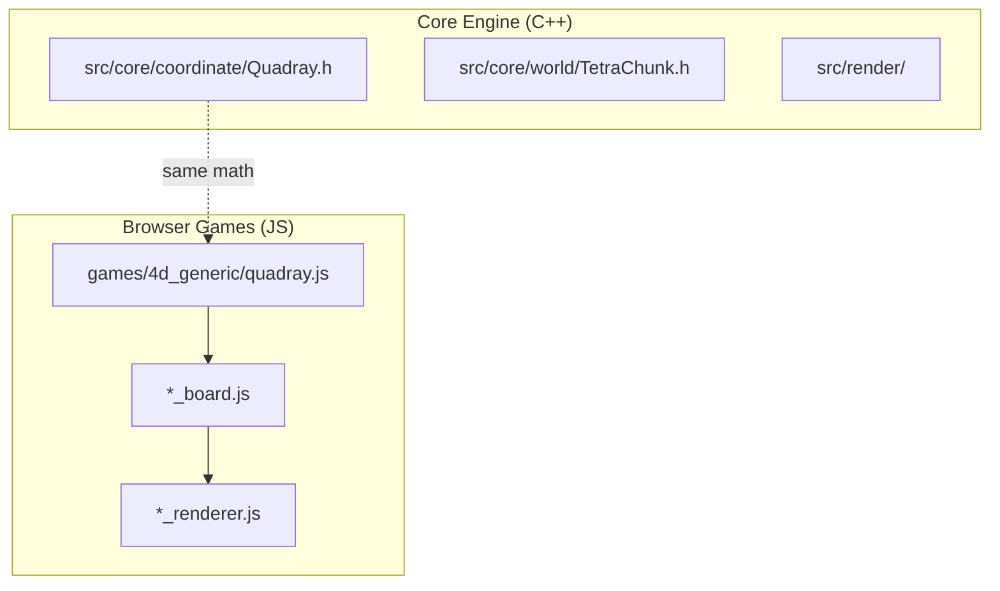

# Games Portfolio

Overview documentation for the 30 standalone 4D browser games built on the QuadCraft Quadray coordinate system.

> [!TIP]
> For launch scripts, per-game file structure, and the Python launcher, see [games/README.md](../games/README.md). For the canonical game index with metadata, see [games/GAMES_INDEX.md](../games/GAMES_INDEX.md).

## Portfolio Summary

All 30 games are **standalone browser applications** — zero build step, zero server requirement. Each game runs from a single `index.html` file in `games/<name>/`.

**Total: 30 games** — see [games/GAMES_INDEX.md](../games/GAMES_INDEX.md) for the full genre-grouped list of all 30 games with per-game test counts, completion percentages, and key mechanics.

## Quick Start

```bash
# Open any game directly (no server needed for basic play)
open games/4d_chess/index.html

# Or use shell scripts with HTTP server
cd games
./run_chess.sh          # Opens on port 8100

# Or use the Python launcher for multiple games
python3 games/run_games.py --game chess doom life
python3 games/run_games.py --all                  # All 30 simultaneously
python3 games/run_games.py --test                 # Run all unit tests
```

## Standalone Architecture

Each game follows an identical self-contained structure:

```text
games/<game_name>/
├── index.html              # Entry point — open in browser; loads ../4d_generic/quadray.js
├── js/
│   ├── <game>_board.js     # Board / world state
│   ├── <game>_renderer.js  # Canvas rendering
│   └── <game>_game.js      # Controller + UI logic
└── tests/
    └── test_<game>.js      # Node.js unit tests
```

### Why Standalone?

- **Zero build step** — open `index.html` and play
- **Independent versioning** — each game can be tagged/released separately
- **Easy forking** — copy one folder to start a new game
- **No coupling** — updating Chess never breaks Checkers
- **Portable** — deploy to any static host (GitHub Pages, S3, Netlify)

### Shared Math Foundation

All 30 games import the single canonical **`games/4d_generic/quadray.js`** module (loaded via `<script src="../4d_generic/quadray.js">` in each game's `index.html`) implementing:

- Quadray coordinate class with `(a, b, c, d)` components
- Cartesian ↔ Quadray conversion (same formulas as `src/core/coordinate/Quadray.h`)
- Zero-minimum normalization
- Distance calculations
- IVM volume ratios and Synergetics constants

There is a single source of truth — updating `games/4d_generic/quadray.js` updates the math for every game with no per-game copies to keep in sync. (4D Doom uses ES Modules and imports through a thin `js/quadray.js` bridge file that re-exports from the shared module — see `games/4d_doom/js/quadray.js`.)

## Testing

All games include Node.js-runnable unit tests:

```bash
# Run all tests via Python launcher
python3 games/run_games.py --test

# Run tests for specific games
python3 games/run_games.py --test --game chess doom

# Run a single game's suite directly (test_all.js is the runnable entry
# point per game; lib_*.js files are shared helper modules, not standalone tests)
node games/4d_chess/tests/test_all.js
```

Test coverage includes:

- Quadray coordinate math (conversion, normalization, distance)
- Game-specific logic (legal moves, win conditions, scoring)
- IVM/Synergetics constants (volume ratios, basis vector lengths)

## Relationship to Core QuadCraft

The browser games share the **mathematical foundation** with the C++ engine but are otherwise independent:


```mermaid
flowchart TD
    subgraph "Core Engine (C++)"
        Quadray_h["src/core/coordinate/Quadray.h"]
        TetraChunk["src/core/world/TetraChunk.h"]
        Renderer["src/render/"]
    end

    subgraph "Browser Games (JS)"
        quadray_js["games/4d_generic/quadray.js"]
        game_board["*_board.js"]
        game_renderer["*_renderer.js"]
    end

    Quadray_h -.->|"same math"| quadray_js
    quadray_js --> game_board
    game_board --> game_renderer
```

## Adding a New Game

1. Create `games/<name>/` following the standalone structure
2. Load `../4d_generic/quadray.js` via `<script>` tag in `index.html` (do not copy it)
3. Implement `<name>_board.js`, `<name>_renderer.js`, `<name>_game.js`
4. Add tests in `tests/`
5. Add entry to `GAMES` registry in `run_games.py`
6. Create `run_<name>.sh` script
7. Update this doc and [docs/README.md](README.md) with the new game

## Cross-References

- [Quadray Coordinates (Implementation)](quadray_coordinates.md) — coordinate math used by all games
- [Quadray Coordinates (Mathematics)](mathematics/quadray_coordinates.md) — detailed mathematical treatment
- [IVM & Synergetics](mathematics/ivm_synergetics.md) — volume ratios used by Doom, Tower Defense, and others
- [Testing Guide](development/testing_guide.md) — full testing infrastructure
- [games/README.md](../games/README.md) — launch scripts and port assignments
- [games/GAMES_INDEX.md](../games/GAMES_INDEX.md) — canonical portfolio index
