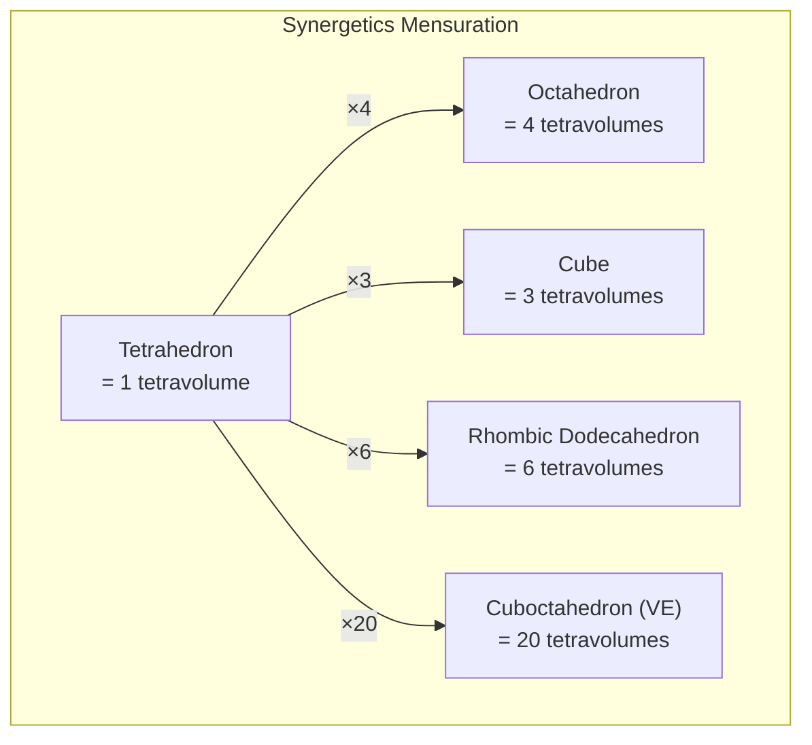
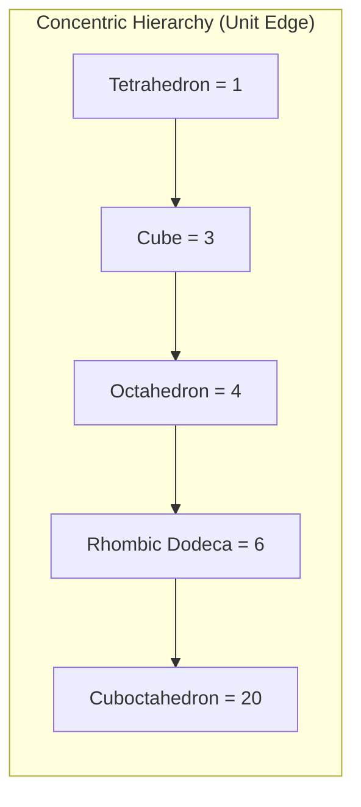

# IVM & Synergetics

The Isotropic Vector Matrix (IVM) and R. Buckminster Fuller's Synergetics provide the geometric and volumetric foundation for QuadCraft's tetrahedral coordinate system.

## Overview



## Isotropic Vector Matrix (IVM)

The IVM is a space-filling framework of alternating tetrahedra and octahedra, formed by closest-packing equal spheres (CCP/FCC arrangement). Every sphere is tangent to 12 neighbors, and the centers of those 12 neighbors define a **cuboctahedron** (which Fuller called the "Vector Equilibrium" or VE).

### Key Properties

| Property | Value |
| -------- | ----- |
| Coordination number | 12 |
| Space-filling shapes | Tetrahedra + Octahedra |
| Volume ratio (Octa:Tetra) | 4:1 |
| Edge length | All edges equal (isotropic) |
| Dual of the Octet Truss | The IVM itself |

### Connection to QuadCraft

- The QuadCraft engine's tetrahedral grid is the IVM
- Each cell in the grid is either a tetrahedron or an octahedron
- The 4 basis vectors of the Quadray coordinate system point from the center of a tetrahedron to its 4 vertices — these are IVM edge vectors
- The 12 navigation directions in-game correspond to the 12 IVM edge vectors from any node

## Synergetics Volume Ratios

Fuller's Synergetics uses the **regular tetrahedron** (not the cube) as the unit of volume. This produces elegant whole-number ratios for the concentric hierarchy of polyhedra:

### Concentric Hierarchy



| Polyhedron | Tetravolumes | XYZ Volume | Ratio (Synergetics/XYZ) |
| ---------- | ------------ | ---------- | ----------------------- |
| Tetrahedron | 1 | √2/12 ≈ 0.1178 | S3 |
| Cube | 3 | 1 (by definition for edge = √2) | S3 |
| Octahedron | 4 | √2/3 ≈ 0.4714 | S3 |
| Rhombic Dodecahedron | 6 | √2 ≈ 1.4142 | S3 |
| Cuboctahedron (VE) | 20 | 5√2/3 ≈ 2.357 | S3 |

### The S3 Constant

The constant **S3** converts between XYZ cubic volumes and Synergetics tetravolumes:

$$S_3 = \sqrt{\frac{9}{8}} \approx 1.06066$$

**Derivation**: A regular tetrahedron with edge length 1 has:

- XYZ volume = √2/12
- Synergetics tetravolume = 1 (by definition)
- The ratio between the Synergetics unit volume and XYZ unit volume for a unit-edge tetrahedron yields S3

In code:

```cpp
constexpr float S3 = 1.0606601717798212f; // sqrt(9/8)
```

```javascript
// games/4d_generic/js/quadray.js
const IVM = {
    VOLUME_RATIOS: {
        TETRAHEDRON: 1,
        CUBE: 3,
        OCTAHEDRON: 4,
        RHOMBIC_DODECAHEDRON: 6,
        CUBOCTAHEDRON: 20
    },
    S3: Math.sqrt(9/8)
};
```

## Cell Parity

In the IVM grid, every cell is either a tetrahedron or an octahedron. This **parity** property is used by several QuadCraft games:

### Determining Parity

Given a quadray coordinate `(a, b, c, d)` (normalized), the cell parity can be determined from the coordinate sum:

```javascript
function cellParity(a, b, c, d) {
    const sum = a + b + c + d;
    // Integer sum → tetrahedron; half-integer sum → octahedron
    return Math.round(sum) % 2 === 0 ? 'tetra' : 'octa';
}
```

### Game Usage

| Game | Parity Usage |
| ---- | ------------ |
| 4D Doom | Enemy spawning based on cell type |
| 4D Tower Defense | Path routing through tetra/octa cells |
| 4D Minecraft | Block orientation determined by parity |
| 4D Chess | Board cell coloring |

## Jitterbug Transformation

The **Jitterbug** is a dynamic transformation where a cuboctahedron (20 tetravolumes) contracts through an icosahedral phase to an octahedron (4 tetravolumes). This demonstrates:

- The relationship between 5-fold and 6-fold symmetry
- How the VE (cuboctahedron) is the "zero-phase" of the IVM
- Volume contraction from 20 → ~18.51 → 4 tetravolumes

While not directly used in gameplay, the Jitterbug illustrates the deep geometric relationships that the IVM encodes.

## Octet Truss

The **Octet Truss** (Alexander Graham Bell's term) is the structural framework corresponding to the IVM:

- Composed of alternating tetrahedra and octahedra
- Each node connects to 12 nearest neighbors via equal-length struts
- Maximum structural efficiency (strength-to-weight ratio)
- Used in architecture (space frames) and crystallography (FCC lattice)

In QuadCraft, the Octet Truss is the physical interpretation of the game grid — every edge in the truss is a potential navigation path.

## References

- **Fuller, R. Buckminster.** *Synergetics: Explorations in the Geometry of Thinking.* (1975, 1979)
- **Urner, Kirby.** Quadray coordinates and IVM-related Python implementations. [grunch.net](http://www.grunch.net/synergetics/)
- **Coxeter, H.S.M.** *Regular Polytopes.* — Mathematical foundations for polyhedral geometry
- **QuadCraft Games**: `games/4d_generic/tests/test_synergetics.js` — Synergetics constant validation suite

## Cross-References

- [Quadray Coordinates (Implementation)](../quadray_coordinates.md) — coordinate conversions and the S3 constant
- [Quadray Coordinates (Mathematics)](quadray_coordinates.md) — basis vectors, hashing, and distance formulas
- [Tetrahedral Geometry](tetrahedral_geometry.md) — tetrahedron properties, mesh generation, barycentrics
- [Games Overview](../games.md) — how individual games use IVM concepts
- [Glossary](../reference/glossary.md) — definitions for IVM, Synergetics, S3, CCP, and related terms
