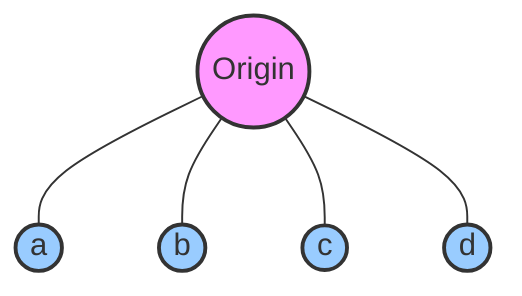
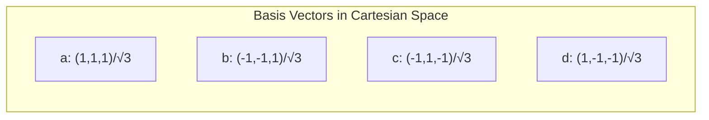
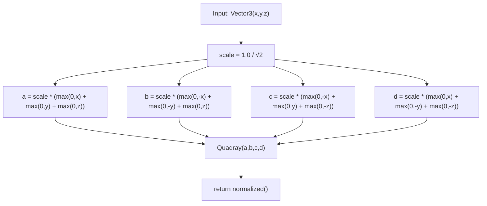
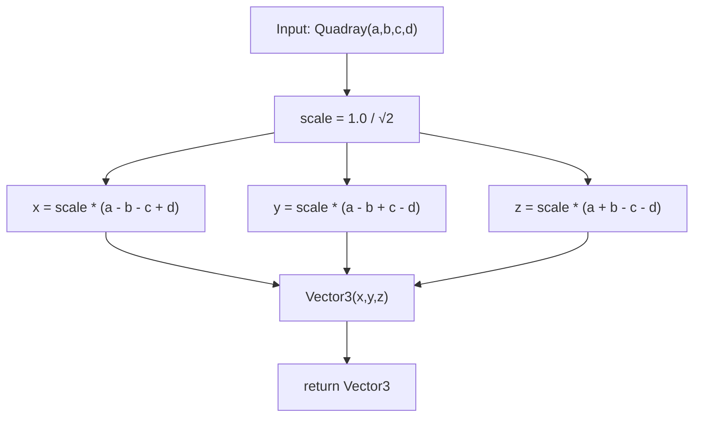
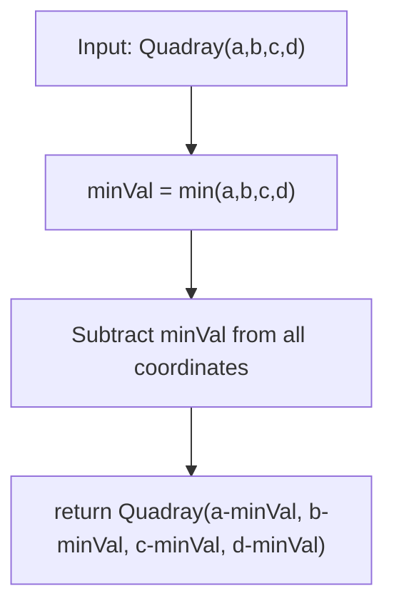
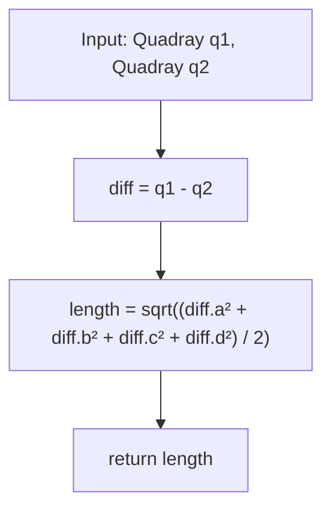
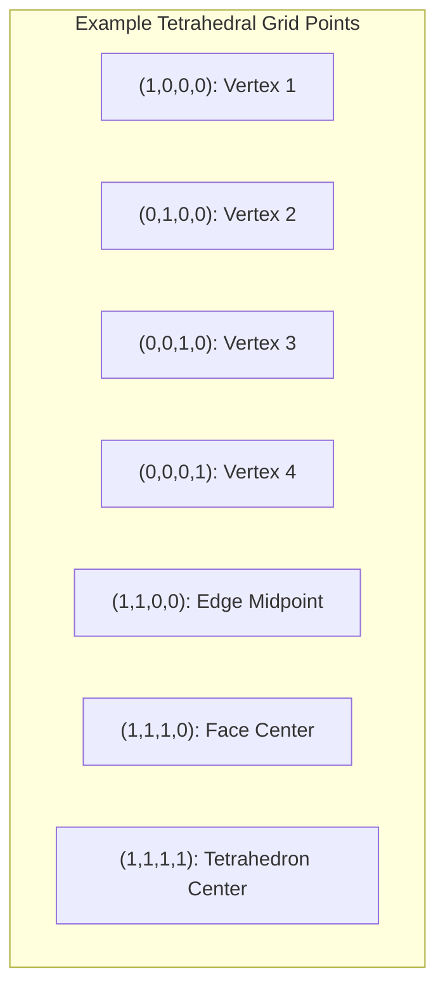
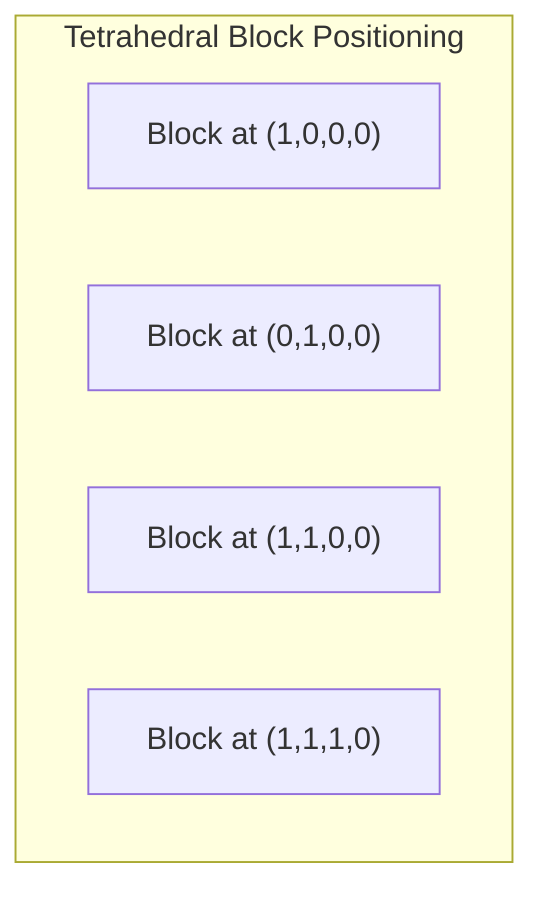
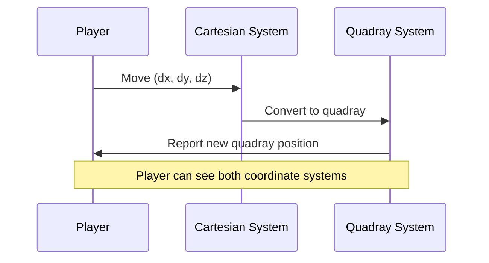
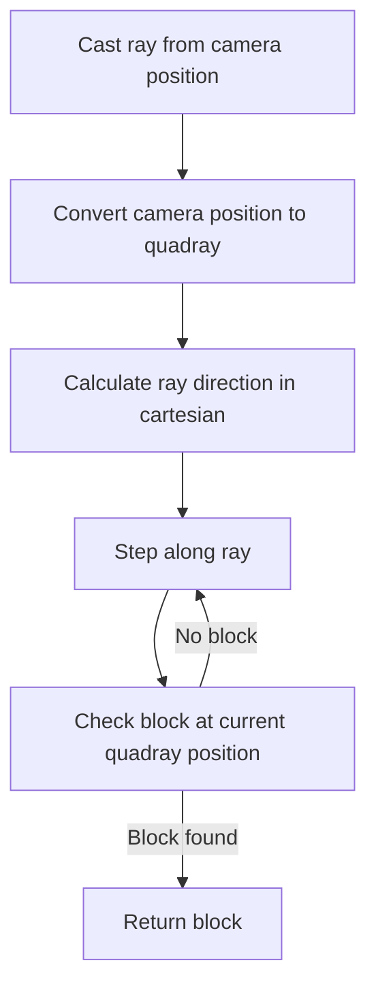

# Quadray Coordinate System

## Overview

The Quadray coordinate system is a four-dimensional coordinate system specifically designed for representing positions in tetrahedral space. Unlike the traditional Cartesian coordinate system with its three perpendicular axes, Quadray uses four non-orthogonal vectors emanating from the center of a regular tetrahedron to its vertices.



## Mathematical Foundation

### Basis Vectors

The four basis vectors of the Quadray system can be represented in Cartesian coordinates as follows:

1. **a-axis**: (1, 1, 1) / √3
2. **b-axis**: (-1, -1, 1) / √3
3. **c-axis**: (-1, 1, -1) / √3
4. **d-axis**: (1, -1, -1) / √3

These four vectors point from the center of a regular tetrahedron to its four vertices.



### Properties of Quadray Coordinates

1. **Redundancy**: A point in 3D space can be represented by multiple equivalent quadray coordinates.
2. **Normalization**: To address this redundancy, we use zero-minimum normalization, ensuring at least one coordinate is zero.
3. **Tetrahedral Symmetry**: The system naturally represents tetrahedral structures and symmetries.

## Conversion Between Coordinate Systems

### Cartesian to Quadray

The conversion from Cartesian coordinates (x, y, z) to Quadray coordinates (a, b, c, d) is implemented as:



In code:

```cpp
static Quadray fromCartesian(const Vector3& v) {
    const float scale = 1.0f / ROOT2;
    
    float a = scale * (std::max(0.0f, v.x) + std::max(0.0f, v.y) + std::max(0.0f, v.z));
    float b = scale * (std::max(0.0f, -v.x) + std::max(0.0f, -v.y) + std::max(0.0f, v.z));
    float c = scale * (std::max(0.0f, -v.x) + std::max(0.0f, v.y) + std::max(0.0f, -v.z));
    float d = scale * (std::max(0.0f, v.x) + std::max(0.0f, -v.y) + std::max(0.0f, -v.z));
    
    Quadray result(a, b, c, d);
    return result.normalized();
}
```

### Quadray to Cartesian

The conversion from Quadray coordinates (a, b, c, d) to Cartesian coordinates (x, y, z) is implemented as:



In code:

```cpp
Vector3 toCartesian() const {
    const float scale = 1.0f / ROOT2;
    float x = scale * (a - b - c + d);
    float y = scale * (a - b + c - d);
    float z = scale * (a + b - c - d);
    return Vector3(x, y, z);
}
```

## Normalization

To address the redundancy in Quadray coordinates, we use zero-minimum normalization, which ensures that at least one of the four coordinates is zero:



In code:

```cpp
Quadray normalized() const {
    float minVal = std::min({a, b, c, d});
    return Quadray(a - minVal, b - minVal, c - minVal, d - minVal);
}
```

## Distance Calculation

The distance between two points in Quadray space is calculated as:



In code:

```cpp
static float distance(const Quadray& q1, const Quadray& q2) {
    // Subtract and find the length
    Quadray diff(q1.a - q2.a, q1.b - q2.b, q1.c - q2.c, q1.d - q2.d);
    return diff.length();
}
```

## Tetrahedral Grid System

The Quadray coordinate system naturally defines a tetrahedral grid, where integer coordinates represent vertices of tetrahedra.



## Applications in QuadCraft

### 1. Block Positioning

Each tetrahedral block in QuadCraft is positioned using Quadray coordinates. This makes the representation of the tetrahedral grid much more natural than using Cartesian coordinates.



### 2. Navigation and Movement

Player movement in QuadCraft is tracked in both Cartesian and Quadray coordinates:



### 3. Raycasting in Tetrahedral Space

Raycasting for block selection uses both coordinate systems:



## The S3 Constant

The S3 constant (approximately 1.06066 or precisely √(9/8)) is used for volumetric conversions between coordinate systems:

```cpp
constexpr float S3 = 1.0606601717798212f; // sqrt(9/8)
```

This constant represents the ratio between the volumes of equivalent shapes in Cartesian and Quadray systems.

## Advantages of Quadray Coordinates

1. **Natural Representation of Tetrahedral Space**: The four basis vectors align perfectly with tetrahedral geometry.
2. **Elegant Coordinate Values**: Many important geometric points have simple integer coordinates.
3. **Simplified Distance Calculations**: For normalized coordinates, distance calculations are straightforward.
4. **Direct Mapping to Tetrahedral Elements**: Each tetrahedral element maps cleanly to quadray coordinates.

## Conclusion

The Quadray coordinate system provides an elegant mathematical foundation for the tetrahedral voxel system in QuadCraft. By using this system, the game can represent tetrahedral structures more naturally than would be possible with traditional Cartesian coordinates. 