# Tetrahedral Geometry in QuadCraft

## Introduction

Tetrahedral geometry forms the foundation of QuadCraft's world. Unlike traditional voxel games that use cubic elements, QuadCraft builds its world from tetrahedra - three-dimensional shapes with four triangular faces. This document explains the mathematical properties of tetrahedra and their implementation in QuadCraft.

## Basic Properties of a Tetrahedron

A tetrahedron is a polyhedron with four triangular faces, six edges, and four vertices.

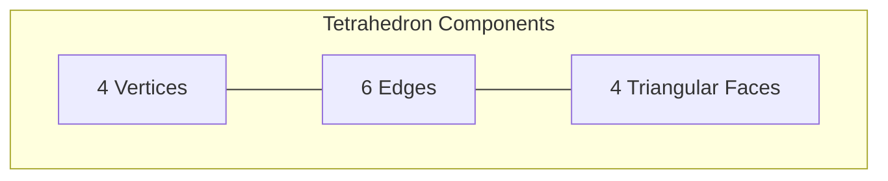

### Regular Tetrahedron

A regular tetrahedron has equilateral triangular faces and equal dihedral angles.

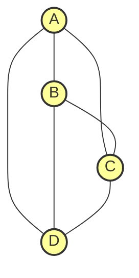

### Mathematical Properties

- **Volume**: For a regular tetrahedron with edge length a, the volume is:
  V = (a³)/(6√2) ≈ 0.1179a³

- **Surface Area**: For a regular tetrahedron with edge length a, the surface area is:
  A = √3 × a² ≈ 1.732a²

- **Dihedral Angle**: The angle between any two faces is approximately 70.53°

## Tetrahedral Grid System

QuadCraft uses a tetrahedral grid system to position blocks. This grid is based on a space-filling arrangement of tetrahedra.

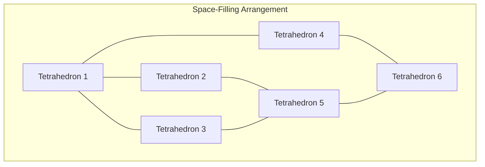

### Space-Filling Properties

The regular tetrahedral grid is not space-filling on its own. To fill space completely, QuadCraft uses a combination of tetrahedra in a repeating pattern:

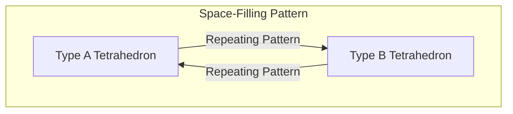

## Implementation in QuadCraft

### Tetrahedral Element Class

The `TetrahedralElement` class represents a single tetrahedral building block:

```cpp
class TetrahedralElement {
public:
    // Constants
    static const float sqrt2 = 1.414213562f; // √2
    
    // Position in quadray coordinates
    Quadray position;
    
    // Block type
    uint8_t blockType;
    
    // Orientation (0-23)
    uint8_t orientation;
    
    // Constructor
    TetrahedralElement(const Quadray& pos, uint8_t type, uint8_t orient = 0);
    
    // Get vertices in Cartesian coordinates
    std::array<Vector3, 4> getVertices() const;
    
    // Check if point is inside this tetrahedron
    bool containsPoint(const Vector3& point) const;
};
```

### Tetrahedral Mesh Generation

Converting tetrahedral elements into renderable meshes involves triangulating their surfaces:

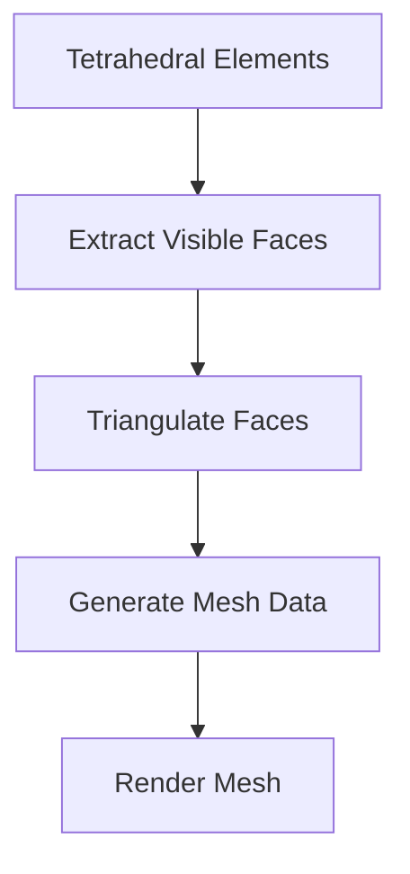

### Vertex Positions

For a regular tetrahedron centered at origin with edge length 2, the vertices in Cartesian coordinates are:

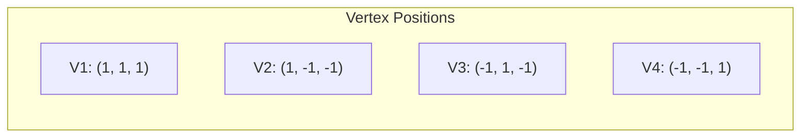

## Navigation in Tetrahedral Space

### Adjacency and Connectivity

Tetrahedra connect to each other through their triangular faces:

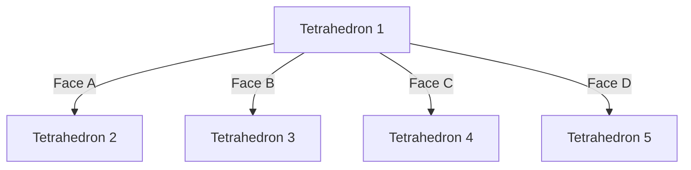

### Raycasting

Raycasting in tetrahedral space involves checking for ray-triangle intersections:

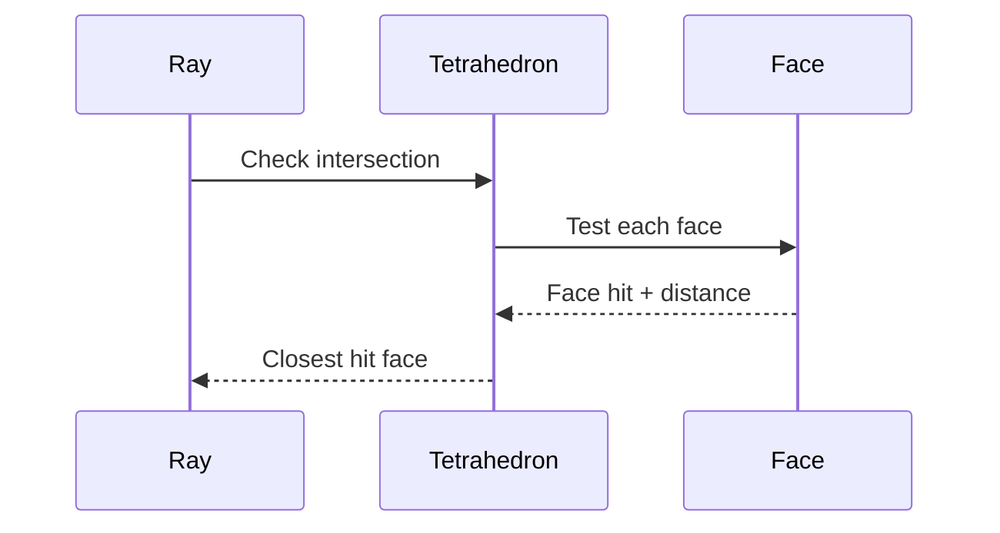

## Tetrahedral Coordinates vs. Cubic Voxels

The tetrahedral approach offers several advantages and challenges compared to cubic voxels:

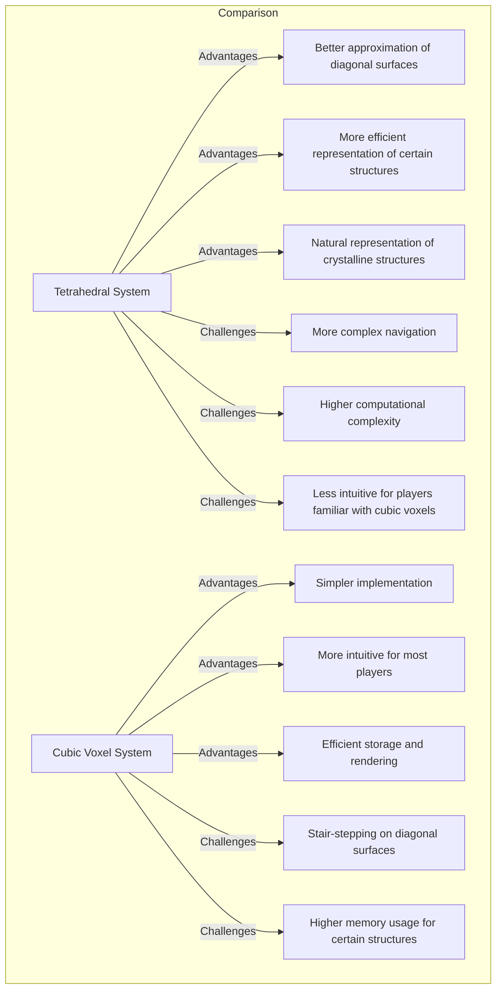

## Special Geometric Structures

### Tetrahedral-Octahedral Honeycomb

A recurring structure in tetrahedral space is the tetrahedral-octahedral honeycomb:

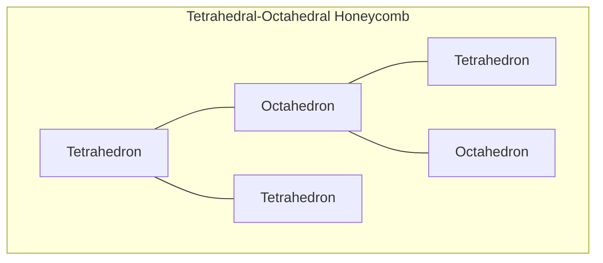

This arrangement fills space efficiently and forms naturally in the tetrahedral grid system.

### Compound Structures

Complex structures can be built from tetrahedral elements:

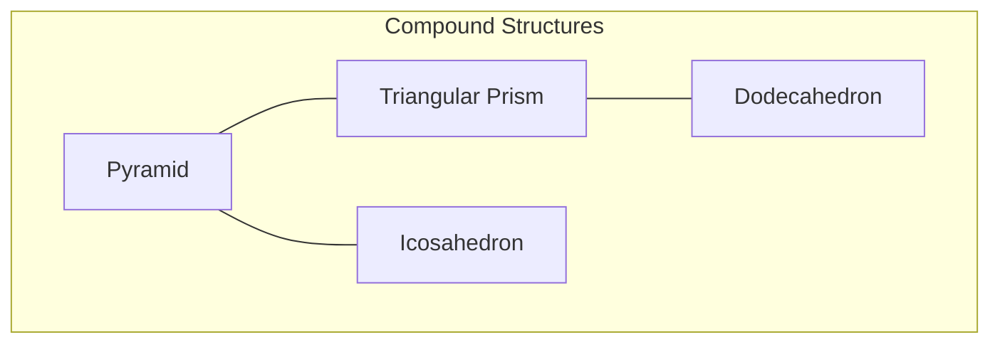

## Collision Detection

Collision detection in tetrahedral space requires specialized algorithms:

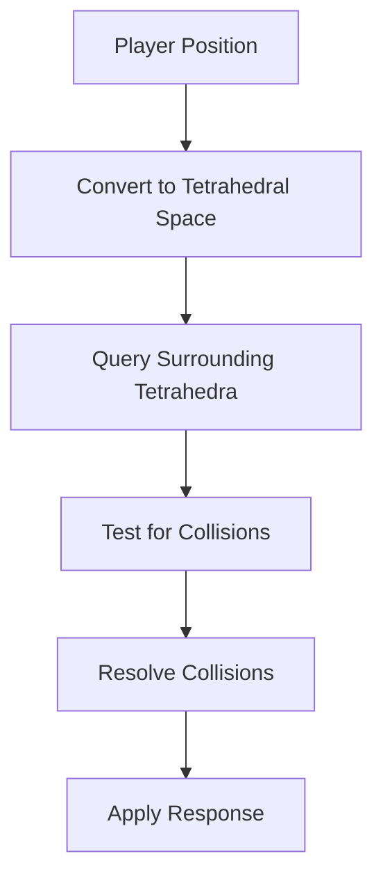

### Barycentric Coordinates

Barycentric coordinates are used for determining if a point is inside a tetrahedron:

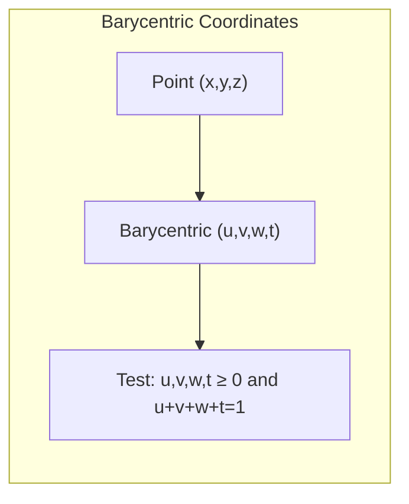

## Conclusion

The tetrahedral geometry in QuadCraft provides a unique foundation for a voxel game. While more complex than traditional cubic voxels, tetrahedra offer interesting geometric properties and allow for more natural representation of certain structures.

The mathematical foundation of the tetrahedral system, combined with the Quadray coordinate system, creates a coherent and elegant framework for the game's world. 