# QuadCraft UI Design

This document details the user interface design of QuadCraft, covering both the visual aesthetics and technical implementation of the UI system.

## Design Philosophy

The QuadCraft UI system follows these core design principles:

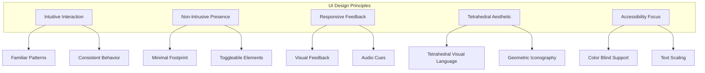

1. **Intuitive Interaction**: UI elements should be immediately understandable, using familiar patterns while extending them for the tetrahedral context.

2. **Non-Intrusive Presence**: The interface should not obstruct the player's view of the tetrahedral world, with most elements being toggleable.

3. **Responsive Feedback**: Every interaction should provide clear visual and audio feedback to confirm actions.

4. **Tetrahedral Aesthetic**: The UI incorporates tetrahedral visual language, using angled elements and tetrahedron-inspired iconography.

5. **Accessibility Focus**: The UI is designed to be accessible to all players, with options for color blindness, text scaling, and alternative control schemes.

## UI Component Hierarchy

The QuadCraft UI is organized into the following component hierarchy:

```mermaid
graph TD
    subgraph "UI Component Hierarchy"
        RootUI["Root UI Layer"]
        HUD["HUD"]
        Menus["Menus"]
        Overlays["Overlays"]
        DebugUI["Debug UI"]
    end
    
    RootUI --> HUD
    RootUI --> Menus
    RootUI --> Overlays
    RootUI --> DebugUI
    
    HUD --> Hotbar["Hotbar"]
    HUD --> PlayerInfo["Player Info"]
    HUD --> Crosshair["Crosshair"]
    HUD --> Compass["Tetrahedral Compass"]
    HUD --> CoordinateDisplay["Coordinate Display"]
    
    Menus --> MainMenu["Main Menu"]
    Menus --> PauseMenu["Pause Menu"]
    Menus --> InventoryMenu["Inventory"]
    Menus --> CraftingMenu["Crafting"]
    Menus --> SettingsMenu["Settings"]
    
    Overlays --> Notifications["Notifications"]
    Overlays --> Tooltips["Tooltips"]
    Overlays --> BlockSelection["Block Selection"]
    
    DebugUI --> FPS["FPS Counter"]
    DebugUI --> MemoryUsage["Memory Usage"]
    DebugUI --> ChunkInfo["Chunk Information"]
    DebugUI --> CoordinateDebug["Coordinate Debug"]
```

## HUD Elements

The Heads-Up Display (HUD) contains persistent UI elements that provide essential information during gameplay.

### Hotbar

The Hotbar displays the player's currently accessible inventory items:

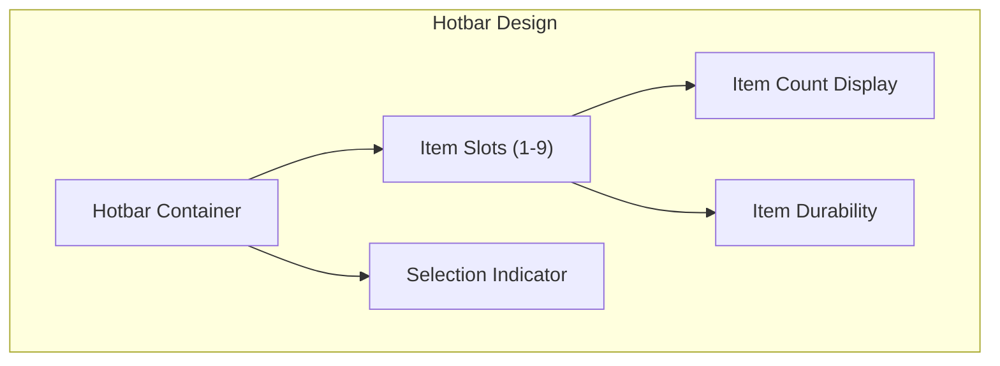

- **Position**: Bottom-center of the screen
- **Appearance**: Angled tetrahedral-inspired slots with item icons
- **Behavior**: Numbers 1-9 select slots, scroll wheel cycles through slots
- **Features**: Shows item count and durability where applicable

### Player Information

Displays crucial player status information:

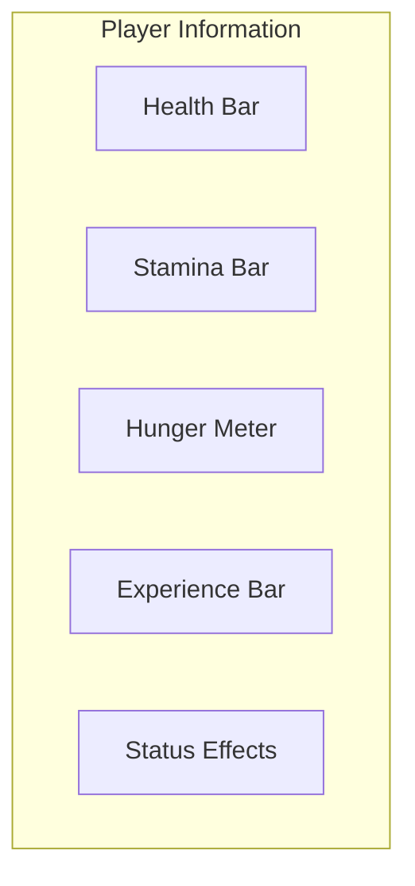

- **Position**: Top-left of the screen
- **Appearance**: Tetrahedral bar designs with color-coding
- **Behavior**: Animated changes for gaining/losing resources
- **Features**: Icon indicators for status effects with hover tooltips

### Crosshair

The targeting reticle in the center of the screen:

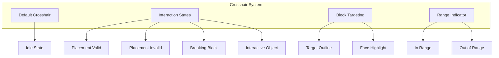

- **Design**: Four-point tetrahedral crosshair (more triangular than traditional crosshair)
- **Behavior**: Changes appearance based on interaction context
- **Features**: 
  - Color change for valid/invalid placement
  - Animation during block breaking
  - Pulse effect for interactive objects
  - Shows target block outline

### Tetrahedral Compass

A specialized compass for navigation in tetrahedral space:

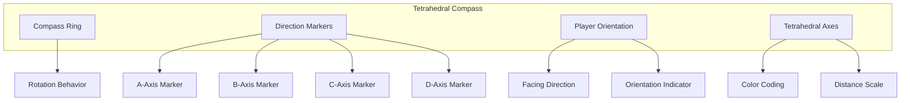

- **Position**: Top-right corner (or toggleable center-top)
- **Appearance**: Tetrahedral ring with color-coded directional markers
- **Behavior**: Rotates based on player orientation
- **Features**: 
  - Highlights nearest tetrahedral axis
  - Shows relative position to world origin
  - Optional 3D mode for detailed navigation

### Coordinate Display

Shows the player's position in both coordinate systems:

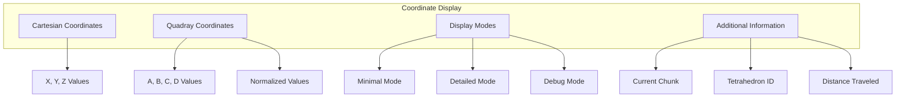

- **Position**: Bottom-right when toggled on (F4)
- **Appearance**: Color-coded coordinate display
- **Behavior**: Updates in real-time, toggle between different levels of detail
- **Features**:
  - Cartesian coordinates (X, Y, Z)
  - Quadray coordinates (A, B, C, D)
  - Current chunk and tetrahedron ID
  - Distance traveled in tetrahedral space

## Menu System

The menu system provides access to game functions outside of direct gameplay.

### Main Menu

The entry point to the game:

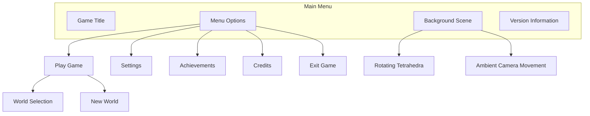

- **Design**: Bold tetrahedral visual theme with rotating 3D elements
- **Layout**: Centered menu options with tetrahedral buttons
- **Background**: Slowly rotating tetrahedral landscape with ambient effects
- **Music**: Ambient soundtrack with tetrahedral-inspired tones

### Pause Menu

Accessible during gameplay:

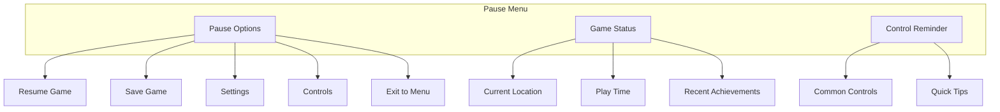

- **Design**: Semi-transparent overlay with focus on the paused game world
- **Behavior**: Instantly accessible with Escape key
- **Features**: Quick access to settings and game status information

### Inventory Menu

Manages the player's collected items:

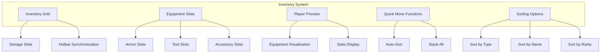

- **Design**: Tetrahedral inventory grid with triangular design elements
- **Interaction**: Drag and drop items, right-click for quick actions
- **Features**:
  - Color-coded item rarity
  - Item tooltips with detailed information
  - Tetrahedral equipment slots
  - Quick-sort functionality
  - Crafting tab integration

### Crafting Interface

For creating items from collected resources:

```mermaid
graph TD
    subgraph "Crafting System"
        RecipeList["Recipe List"]
        TetrahedralGrid["Tetrahedral Crafting Grid"]
        PreviewPane["Result Preview"]
        MaterialRequirements["Material Requirements"]
        CraftingCategories["Crafting Categories"]
    end
    
    RecipeList --> KnownRecipes["Known Recipes"]
    RecipeList --> DiscoverableRecipes["Discoverable Recipes"]
    
    TetrahedralGrid --> PlacementPoints["Tetrahedral Placement"]
    TetrahedralGrid --> MaterialAlignment["Material Alignment"]
    
    PreviewPane --> ResultItem["Result Item"]
    PreviewPane --> CraftButton["Craft Button"]
    
    MaterialRequirements --> RequiredItems["Required Items"]
    MaterialRequirements --> InventoryStatus["Inventory Status"]
    
    CraftingCategories --> Tools["Tools Category"]
    CraftingCategories --> Blocks["Blocks Category"]
    CraftingCategories --> Materials["Materials Category"]
    CraftingCategories --> Special["Special Items"]
```

- **Design**: Three-dimensional tetrahedral crafting grid
- **Interaction**: Place materials in tetrahedral pattern to create items
- **Features**:
  - Recipe discovery system
  - Material requirement display
  - Craft multiple items at once
  - Favorites system for common recipes
  - 3D rotation of crafting preview

### Settings Menu

Configures game options:

```mermaid
graph TD
    subgraph "Settings Menu"
        SettingsCategories["Settings Categories"]
        OptionControls["Option Controls"]
        DefaultButtons["Default Buttons"]
        PreviewPane["Preview Pane"]
    end
    
    SettingsCategories --> Graphics["Graphics"]
    SettingsCategories --> Audio["Audio"]
    SettingsCategories --> Controls["Controls"]
    SettingsCategories --> Gameplay["Gameplay"]
    SettingsCategories --> Accessibility["Accessibility"]
    
    OptionControls --> Sliders["Sliders"]
    OptionControls --> Toggles["Toggle Switches"]
    OptionControls --> Dropdowns["Dropdown Menus"]
    OptionControls --> InputBindings["Input Bindings"]
    
    DefaultButtons --> ResetAll["Reset All"]
    DefaultButtons --> ResetCategory["Reset Category"]
    
    PreviewPane --> VisualPreview["Visual Preview"]
    PreviewPane --> ControlPreview["Control Scheme Preview"]
```

- **Design**: Organized tabbed interface with tetrahedral-inspired controls
- **Categories**: Graphics, Audio, Controls, Gameplay, and Accessibility
- **Features**:
  - Real-time preview of settings changes
  - Preset configurations for different hardware capabilities
  - Detailed tooltips explaining each setting
  - Control rebinding interface

## Overlay Elements

Temporary UI elements that appear contextually.

### Notifications

System for informing the player of events:

```mermaid
graph TD
    subgraph "Notification System"
        NotificationTypes["Notification Types"]
        VisualStyles["Visual Styles"]
        QueueSystem["Queue System"]
        InteractionOptions["Interaction Options"]
    end
    
    NotificationTypes --> Achievement["Achievement"]
    NotificationTypes --> SystemAlert["System Alert"]
    NotificationTypes --> ItemAcquisition["Item Acquisition"]
    NotificationTypes --> EnvironmentalAlert["Environmental Alert"]
    
    VisualStyles --> Standard["Standard Notification"]
    VisualStyles --> Important["Important Notification"]
    VisualStyles --> Critical["Critical Notification"]
    
    QueueSystem --> PriorityQueue["Priority Queue"]
    QueueSystem --> GroupSimilar["Group Similar"]
    
    InteractionOptions --> Dismissible["Dismissible"]
    InteractionOptions --> AutoDismiss["Auto-Dismiss"]
    InteractionOptions --> ExpandDetails["Expand Details"]
```

- **Position**: Upper right corner, stacked vertically
- **Appearance**: Tetrahedral-framed notifications with color-coding
- **Behavior**: Slide in, display for a few seconds, slide out
- **Features**:
  - Priority system for important notifications
  - Interactive elements for more information
  - Grouping of similar notifications

### Tooltips

Contextual information displays:

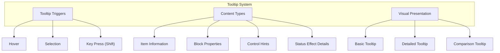

- **Appearance**: Tetrahedral-framed boxes with triangular accents
- **Behavior**: Appear on hover, positioned to avoid screen edges
- **Features**:
  - Multi-level tooltips (brief vs. detailed)
  - Comparison of item stats when relevant
  - Formatted text with icons
  - Interactive elements for extended information

### Block Selection

The highlighting and information display when targeting blocks:

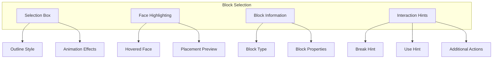

- **Appearance**: Tetrahedral wireframe outline around selected block
- **Behavior**: Highlights block face being targeted
- **Features**:
  - Block type identification
  - Breaking progress visualization
  - Placement preview for new blocks
  - Custom interaction hints for special blocks

## Debug UI

Elements available in debug mode (F3).

### Performance Metrics

Displays technical information:

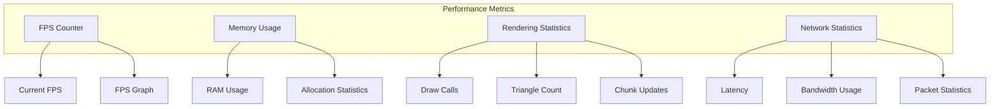

- **Position**: Top-left when toggled (F3)
- **Appearance**: Compact, monospaced text with minimal background
- **Features**:
  - Color-coded performance indicators
  - Toggleable detail levels
  - Historical performance graphs
  - Memory usage breakdown

### Coordinate Debug

Expanded coordinate information:

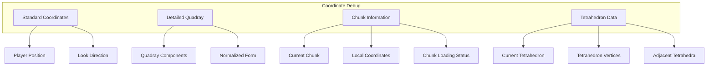

- **Position**: Bottom-right when in debug mode
- **Appearance**: Dense text information with hierarchical organization
- **Features**:
  - Full precision coordinate display
  - Conversion between coordinate systems
  - Current chunk and tetrahedron information
  - Raycast target data

### Entity Information

Debug information about entities:

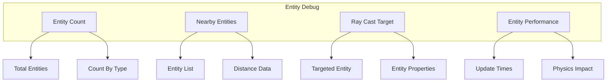

- **Position**: Right side when in debug mode
- **Appearance**: Collapsible sections of entity data
- **Features**:
  - Entity counts by type
  - Performance impact of entities
  - Detailed information about targeted entity
  - Hitbox visualization toggle

## UI Technical Implementation

### Component Architecture

The UI system is built using a flexible component architecture:

```mermaid
classDiagram
    class UIElement {
        +Vector2 position
        +Vector2 size
        +bool visible
        +float opacity
        +std::vector<UIElement*> children
        +draw()
        +update(float deltaTime)
        +handleInput(InputEvent event)
        +addChild(UIElement* child)
        +removeChild(UIElement* child)
    }
    
    class UIContainer {
        +LayoutType layout
        +float padding
        +Vector2 contentSize
        +arrangeChildren()
        +updateLayout()
        +getContentBounds()
    }
    
    class UIText {
        +std::string text
        +Font* font
        +float fontSize
        +Color color
        +TextAlignment alignment
        +setText(std::string text)
        +getFontMetrics()
    }
    
    class UIImage {
        +Texture* texture
        +Color tint
        +bool preserveAspect
        +setTexture(Texture* texture)
        +setTint(Color color)
    }
    
    class UIButton {
        +std::string label
        +ButtonState state
        +std::function<void()> onClick
        +setLabel(std::string label)
        +setState(ButtonState state)
        +handleClick()
    }
    
    class UIProgressBar {
        +float value
        +float maxValue
        +Orientation orientation
        +Color fillColor
        +Color backgroundColor
        +setValue(float value)
        +setMaxValue(float value)
        +getPercentage()
    }
    
    UIElement <|-- UIContainer
    UIElement <|-- UIText
    UIElement <|-- UIImage
    UIElement <|-- UIButton
    UIElement <|-- UIProgressBar
```

### Layout System

The UI uses a flexible layout system:

```mermaid
graph TD
    subgraph "Layout System"
        LayoutTypes["Layout Types"]
        Constraints["Constraints"]
        Anchoring["Anchoring System"]
        Adaptation["Screen Adaptation"]
    end
    
    LayoutTypes --> Vertical["Vertical Layout"]
    LayoutTypes --> Horizontal["Horizontal Layout"]
    LayoutTypes --> Grid["Grid Layout"]
    LayoutTypes --> Freeform["Freeform Layout"]
    LayoutTypes --> Radial["Radial Layout"]
    
    Constraints --> SizeConstraints["Size Constraints"]
    Constraints --> PositionConstraints["Position Constraints"]
    Constraints --> AspectConstraints["Aspect Ratio Constraints"]
    
    Anchoring --> AnchorPoints["Anchor Points"]
    Anchoring --> OffsetAdjustment["Offset Adjustment"]
    
    Adaptation --> ResponsiveScaling["Responsive Scaling"]
    Adaptation --> SafeAreaAdjustment["Safe Area Adjustment"]
```

- **Layouts**: Vertical, horizontal, grid, freeform, and radial arrangements
- **Anchoring**: Nine-point anchoring system for positioning elements
- **Constraints**: Min/max size constraints and aspect ratio preservation
- **Adaptation**: Automatically adjust to different screen sizes and aspect ratios

### Animation System

UI elements are animated using a dedicated animation system:

```mermaid
classDiagram
    class UIAnimation {
        +float duration
        +float elapsed
        +AnimationCurve curve
        +bool looping
        +bool completed
        +update(float deltaTime)
        +reset()
        +complete()
    }
    
    class PositionAnimation {
        +Vector2 startPosition
        +Vector2 endPosition
        +Vector2 getCurrentPosition()
    }
    
    class SizeAnimation {
        +Vector2 startSize
        +Vector2 endSize
        +Vector2 getCurrentSize()
    }
    
    class ColorAnimation {
        +Color startColor
        +Color endColor
        +Color getCurrentColor()
    }
    
    class RotationAnimation {
        +float startRotation
        +float endRotation
        +float getCurrentRotation()
    }
    
    class AnimationSequence {
        +std::vector<UIAnimation*> animations
        +bool sequential
        +addAnimation(UIAnimation* animation)
        +update(float deltaTime)
    }
    
    UIAnimation <|-- PositionAnimation
    UIAnimation <|-- SizeAnimation
    UIAnimation <|-- ColorAnimation
    UIAnimation <|-- RotationAnimation
    AnimationSequence --> UIAnimation
```

- **Animation Types**: Position, size, color, opacity, and rotation animations
- **Timing Functions**: Linear, ease-in, ease-out, ease-in-out, elastic, bounce
- **Sequences**: Chain animations together for complex effects
- **Events**: Trigger events at animation completion

### Theming System

UI appearance is controlled through a theming system:

```mermaid
classDiagram
    class UITheme {
        +std::string name
        +std::map<std::string, ThemeProperty> properties
        +ThemeProperty getProperty(std::string name)
        +setProperty(std::string name, ThemeProperty property)
        +deriveFocusState(ThemeProperty base)
        +deriveHoverState(ThemeProperty base)
    }
    
    class ThemeProperty {
        +PropertyType type
        +union { Color colorValue; float floatValue; int intValue; }
        +std::string stringValue
        +ThemeProperty(Color value)
        +ThemeProperty(float value)
        +ThemeProperty(int value)
        +ThemeProperty(std::string value)
    }
    
    class ThemeManager {
        +std::map<std::string, UITheme*> themes
        +UITheme* currentTheme
        +loadTheme(std::string path)
        +setCurrentTheme(std::string name)
        +getTheme(std::string name)
        +getProperty(std::string name)
    }
    
    ThemeManager --> UITheme
    UITheme --> ThemeProperty
```

- **Theme Properties**: Colors, fonts, sizes, margins, padding, borders
- **State Variations**: Normal, hover, pressed, disabled, focused states
- **Custom Themes**: User-definable themes with configuration files
- **Dynamic Theming**: Runtime theme switching

### Input Handling

The UI system processes input through a specialized handler:

```mermaid
classDiagram
    class UIInputHandler {
        +UIElement* focusedElement
        +UIElement* hoveredElement
        +processMouseMove(float x, float y)
        +processMouseButton(int button, int action)
        +processKey(int key, int action)
        +processTextInput(std::string text)
        +setFocus(UIElement* element)
        +clearFocus()
    }
    
    class InputEvent {
        +InputType type
        +int keyCode
        +int mouseButton
        +float mouseX
        +float mouseY
        +std::string text
        +bool handled
        +markHandled()
        +isHandled()
    }
    
    class FocusManager {
        +UIElement* currentFocus
        +std::stack<UIElement*> focusHistory
        +setFocus(UIElement* element)
        +clearFocus()
        +navigateNext()
        +navigatePrevious()
        +pushFocusState()
        +popFocusState()
    }
    
    UIInputHandler --> InputEvent
    UIInputHandler --> FocusManager
```

- **Event Propagation**: Events bubble up through the UI hierarchy
- **Focus Management**: Keyboard navigation between focusable elements
- **Input Mapping**: Map different input types to UI actions
- **Gesture Recognition**: Support for swipe, pinch, and other gestures

## Accessibility Features

The UI includes accessibility features:

```mermaid
graph TD
    subgraph "Accessibility Features"
        TextOptions["Text Options"]
        ColorOptions["Color Options"]
        InputOptions["Input Options"]
        AuditoryOptions["Auditory Options"]
    end
    
    TextOptions --> FontScaling["Font Scaling"]
    TextOptions --> HighContrastText["High Contrast Text"]
    TextOptions --> ScreenReader["Screen Reader Support"]
    
    ColorOptions --> ColorBlindModes["Color Blind Modes"]
    ColorOptions --> ContrastSettings["Contrast Settings"]
    ColorOptions --> CustomPalettes["Custom Color Palettes"]
    
    InputOptions --> InputRemap["Input Remapping"]
    InputOptions --> AlternativeControls["Alternative Control Schemes"]
    InputOptions --> AssistiveOptions["Assistive Options"]
    
    AuditoryOptions --> VisualCues["Visual Audio Cues"]
    AuditoryOptions --> SubtitleOptions["Subtitle Options"]
    AuditoryOptions --> SoundBalance["Sound Balance"]
```

- **Text Options**: Scalable text size, screen reader support, dyslexia-friendly font
- **Color Options**: Color blind modes, high contrast mode, custom color schemes
- **Input Assistance**: Key rebinding, toggle controls, reduced motion option
- **Audio Features**: Visual representations of audio cues, configurable audio balance

## Localization Support

The UI supports multiple languages:

```mermaid
classDiagram
    class LocalizationManager {
        +std::map<std::string, std::map<std::string, std::string>> translations
        +std::string currentLanguage
        +loadLanguageFile(std::string language, std::string path)
        +setLanguage(std::string language)
        +getTranslation(std::string key)
        +formatTranslation(std::string key, std::map<std::string, std::string> parameters)
    }
    
    class FormattedText {
        +std::string rawText
        +std::vector<TextFormatTag> formatTags
        +loadFromTranslation(std::string key)
        +applyFormatting(std::map<std::string, std::string> parameters)
        +getFormattedText()
    }
    
    class TextFormatTag {
        +int startPos
        +int endPos
        +FormatType type
        +std::string parameter
    }
    
    class FontManager {
        +std::map<std::string, Font*> fonts
        +loadFont(std::string name, std::string path)
        +getFont(std::string name)
        +getLanguageFont(std::string language)
    }
    
    LocalizationManager --> FormattedText
    FormattedText --> TextFormatTag
    LocalizationManager --> FontManager
```

- **Translation System**: Support for multiple languages with string tables
- **Text Formatting**: Variable substitution and formatting tags
- **Font Support**: Language-specific fonts and character sets
- **Right-to-left Support**: Proper handling of RTL languages
- **Pluralization Rules**: Language-specific pluralization handling

## Mobile UI Adaptations

Special considerations for mobile platforms:

```mermaid
graph TD
    subgraph "Mobile UI Adaptations"
        TouchControls["Touch Controls"]
        ScreenLayout["Screen Layout"]
        ElementScaling["Element Scaling"]
        InputMethods["Input Methods"]
    end
    
    TouchControls --> TouchButtons["Touch Buttons"]
    TouchControls --> VirtualJoysticks["Virtual Joysticks"]
    TouchControls --> GestureControls["Gesture Controls"]
    
    ScreenLayout --> PortraitLayout["Portrait Layout"]
    ScreenLayout --> LandscapeLayout["Landscape Layout"]
    ScreenLayout --> SafeAreaHandling["Safe Area Handling"]
    
    ElementScaling --> TouchTargetSizes["Touch Target Sizes"]
    ElementScaling --> DynamicScaling["Dynamic Scaling"]
    ElementScaling --> DensityAdaptation["Density Adaptation"]
    
    InputMethods --> SoftKeyboard["Soft Keyboard Integration"]
    InputMethods --> ExternalControllers["External Controller Support"]
    InputMethods --> VoiceInput["Voice Input"]
```

- **Touch Controls**: Larger touch targets, virtual joysticks, swipe navigation
- **Layout Adaptation**: Different layouts for portrait and landscape orientations
- **Scaling**: Automatic UI scaling based on screen size and density
- **Input Methods**: Support for on-screen keyboard, voice input, and external controllers

## HUD Customization

Players can customize their HUD:

```mermaid
graph TD
    subgraph "HUD Customization"
        ElementToggle["Element Toggle"]
        PositionAdjustment["Position Adjustment"]
        ScaleSettings["Scale Settings"]
        OpacitySettings["Opacity Settings"]
        Presets["Customization Presets"]
    end
    
    ElementToggle --> ToggleHotbar["Toggle Hotbar"]
    ElementToggle --> ToggleCoordinates["Toggle Coordinates"]
    ElementToggle --> ToggleCompass["Toggle Compass"]
    ElementToggle --> TogglePlayerInfo["Toggle Player Info"]
    
    PositionAdjustment --> DragAndDrop["Drag and Drop Positioning"]
    PositionAdjustment --> SnapToGrid["Snap to Grid"]
    PositionAdjustment --> ResetPositions["Reset to Default"]
    
    ScaleSettings --> GlobalScale["Global UI Scale"]
    ScaleSettings --> ElementScale["Per-Element Scaling"]
    
    OpacitySettings --> GlobalOpacity["Global UI Opacity"]
    OpacitySettings --> ElementOpacity["Per-Element Opacity"]
    
    Presets --> SavedPresets["Save Custom Presets"]
    Presets --> LoadPresets["Load Presets"]
    Presets --> SharePresets["Share Presets"]
```

- **Toggle Elements**: Enable/disable individual HUD elements
- **Position Adjustment**: Drag and drop elements to preferred positions
- **Scaling**: Adjust the size of UI elements individually or globally
- **Opacity**: Control the transparency of UI elements
- **Presets**: Save and load custom HUD configurations

## Conclusion

The QuadCraft user interface is designed to balance usability with the unique visual language of the tetrahedral world. Through careful attention to both aesthetic and functional requirements, the UI enhances the player's ability to navigate and interact with the game while maintaining immersion in the tetrahedral experience.

The technical implementation provides flexibility for future expansion and customization, ensuring that the UI can evolve alongside the game. By following established design patterns and maintaining a component-based architecture, the system remains maintainable and adaptable to different platforms and user needs. 