# QuadCraft User Interface

This document describes the user interface (UI) elements and design philosophy of QuadCraft, focusing on how the unique tetrahedral world is made accessible and intuitive for players.

## Design Philosophy

The QuadCraft UI is designed with these core principles:

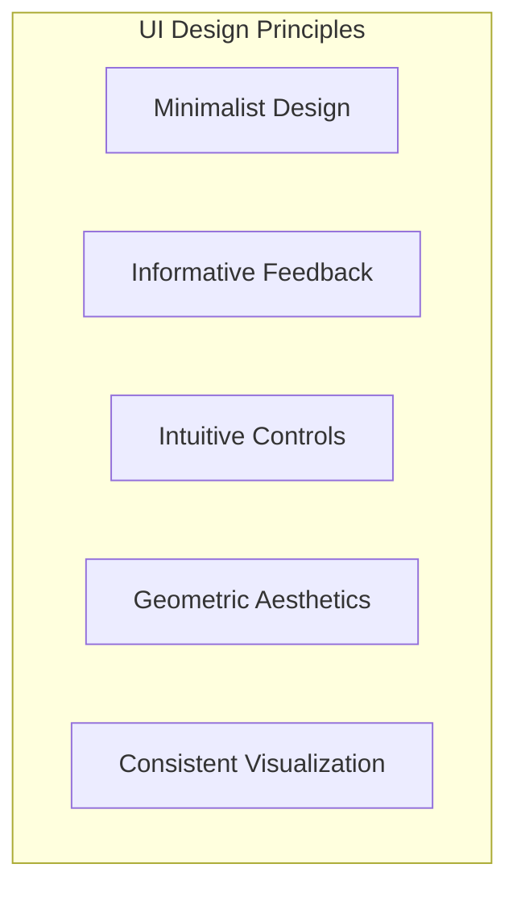

1. **Minimalist Design**: Reduce clutter to keep focus on the tetrahedral world
2. **Informative Feedback**: Provide clear visual cues for position and orientation in tetrahedral space
3. **Intuitive Controls**: Ensure controls follow expected conventions despite the unusual space
4. **Geometric Aesthetics**: Use design elements that complement the tetrahedral theme
5. **Consistent Visualization**: Maintain consistent color schemes and representation of coordinates

## UI Components Overview

QuadCraft's UI is composed of several key components:

```mermaid
graph TD
    subgraph "UI Components"
        HUD["Heads-Up Display"]
        Menus["Game Menus"]
        Overlays["Information Overlays"]
        Controls["Control Indicators"]
        BlockSelection["Block Selection Interface"]
    end
    
    HUD --> Crosshair["Crosshair"]
    HUD --> CoordinateDisplay["Coordinate Display"]
    HUD --> StatusIndicators["Status Indicators"]
    
    Menus --> MainMenu["Main Menu"]
    Menus --> PauseMenu["Pause Menu"]
    Menus --> Settings["Settings Menu"]
    
    Overlays --> DebugInfo["Debug Information"]
    Overlays --> QuadrayVisualizer["Quadray Visualizer"]
    Overlays --> TetrahedralGrid["Tetrahedral Grid Overlay"]
    
    Controls --> KeyBindings["Key Binding Indicators"]
    Controls --> MouseControls["Mouse Control Hints"]
    
    BlockSelection --> Palette["Block Palette"]
    BlockSelection --> Properties["Block Properties"]
```

## Heads-Up Display (HUD)

The HUD provides essential real-time information without obscuring gameplay.

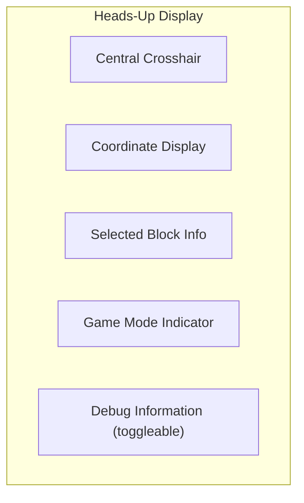

### Crosshair

The crosshair is a minimalist geometric design that indicates the center of the screen and target for block interactions:

- Small tetrahedron shape that changes color when pointing at a block
- Expands slightly when hovering over interactable blocks
- Color changes indicate different interaction modes (place, remove, select)

### Coordinate Display

The coordinate display shows the player's current position in both coordinate systems:

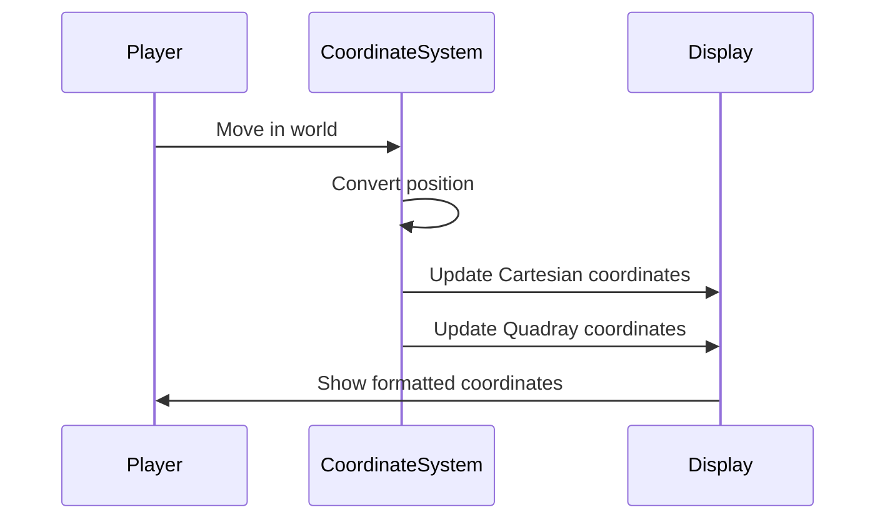

The coordinate display features:
- Toggle between Cartesian (x,y,z) and Quadray (a,b,c,d) formats
- Color-coded values corresponding to tetrahedral axes
- Small indicator showing orientation in tetrahedral space
- Animated transitions when crossing between tetrahedral cells

## Menus

The menu system provides access to game settings and options.

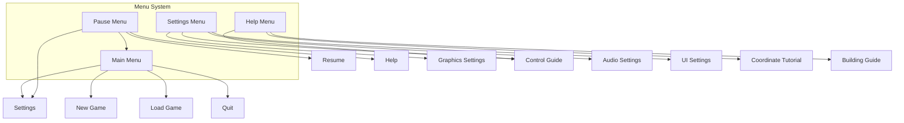

### Main Menu

The main menu features:
- A 3D background showing rotating tetrahedral structures
- Geometric, minimalist button design
- Color scheme based on the four tetrahedral axes
- Quick access to settings and game modes

### Pause Menu

The pause menu maintains the game world in the background with a subtle blur effect and features:
- Transparent overlay with clear options
- Quick resume button
- Access to settings and help
- Option to save and exit

### Settings Menu

The settings menu is organized into categories with visual indicators for each setting:
- Graphics: Resolution, quality, render distance, FOV
- Controls: Mouse sensitivity, key bindings, movement speed
- Audio: Volume levels, sound effects, music
- UI: HUD opacity, size, coordinate display format, colorblind modes

## Block Selection Interface

The block selection interface allows players to choose and manipulate tetrahedral blocks.

```mermaid
graph TD
    subgraph "Block Selection UI"
        Palette["Block Palette"]
        Categories["Block Categories"]
        Preview["3D Block Preview"]
        Properties["Block Properties"]
    end
    
    Palette --> BlockGrid["Grid of Available Blocks"]
    Palette --> Search["Search Function"]
    Palette --> Favorites["Favorites Section"]
    
    Categories --> Basic["Basic Blocks"]
    Categories --> Functional["Functional Blocks"]
    Categories --> Decorative["Decorative Blocks"]
    Categories --> Special["Special Blocks"]
    
    Preview --> Rotation["Rotation Controls"]
    Preview --> Variants["Variant Selection"]
    
    Properties --> Material["Material Properties"]
    Properties --> Behavior["Behavior Settings"]
    Properties --> Appearance["Appearance Options"]
```

Key features of the block selection interface:
- Radial quick-select menu accessible with a hotkey
- Scrollable grid of block types organized by category
- 3D preview of selected block that can be rotated
- Search function for quickly finding specific blocks
- Favorite blocks section for frequently used items

## Information Overlays

QuadCraft includes several toggleable information overlays to help players understand tetrahedral space.

```mermaid
graph TD
    subgraph "Information Overlays"
        QuadrayVisualizer["Quadray Coordinate Visualizer"]
        DebugInfo["Debug Information"]
        TetrahedralGrid["Tetrahedral Grid Overlay"]
        BlockHighlight["Block Highlight System"]
        MiniMap["Minimap"]
    end
    
    QuadrayVisualizer --> AxisDisplay["Colored Axis Display"]
    QuadrayVisualizer --> PositionMarker["Current Position Marker"]
    
    DebugInfo --> Performance["Performance Stats"]
    DebugInfo --> TetraInfo["Tetrahedron Data"]
    DebugInfo --> RaycastInfo["Raycast Information"]
    
    TetrahedralGrid --> CellOutlines["Cell Outlines"]
    TetrahedralGrid --> PlaneIndicators["Plane Indicators"]
    TetrahedralGrid --> AxisMarkers["Axis Markers"]
    
    BlockHighlight --> SelectionOutline["Selection Outline"]
    BlockHighlight --> PlacementPreview["Placement Preview"]
    
    MiniMap --> LocalMap["Local Tetrahedral Map"]
    MiniMap --> PlayerIndicator["Player Position and Orientation"]
```

### Quadray Coordinate Visualizer

This overlay helps players understand the quadray coordinate system:

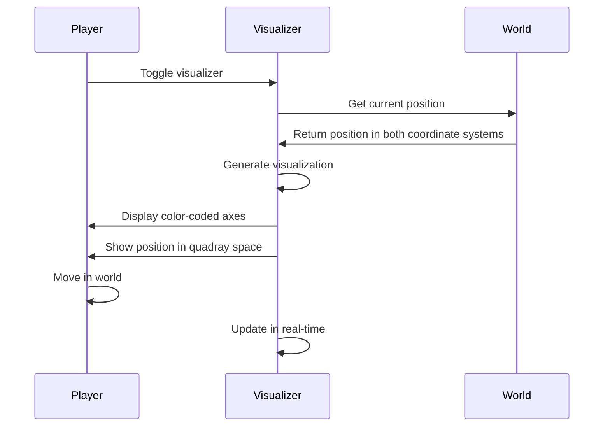

Features of the quadray visualizer:
- Four color-coded axes representing the a, b, c, and d directions
- Current position displayed as a point in the tetrahedral space
- Animated transitions when moving between tetrahedra
- Reference grid showing the tetrahedral cell structure
- Toggle between different visualization modes

### Debug Information Overlay

The debug overlay provides technical information for development and advanced users:

- FPS counter and performance metrics
- Current chunk information
- Memory usage statistics
- Raycast hit information
- Detailed position and orientation data
- Tetrahedral cell ID and properties

### Tetrahedral Grid Overlay

This overlay visualizes the underlying tetrahedral grid structure:

- Wireframe outline of tetrahedral cells
- Highlighting of the current cell containing the player
- Color-coded faces indicating adjacency
- Distance markers for scale reference
- Coordinate system annotations

## Control Indicators

QuadCraft provides visual indications of available controls contextually:

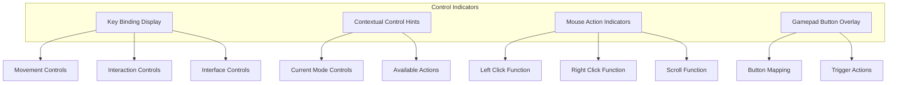

Features of the control indicators:
- Subtle key hints that appear when new actions become available
- Transparent overlay showing current control scheme
- Context-sensitive prompts based on what the player is looking at
- Animated tutorials for complex interactions
- Ability to toggle different control visualizations on/off

## Accessibility Features

QuadCraft includes several UI features to improve accessibility:

```mermaid
graph TD
    subgraph "Accessibility Features"
        ColorblindModes["Colorblind Modes"]
        TextScaling["Text Scaling Options"]
        HighContrast["High Contrast Mode"]
        CustomControls["Control Customization"]
        AudioCues["Audio Cues"]
    end
    
    ColorblindModes --> Protanopia["Protanopia Mode"]
    ColorblindModes --> Deuteranopia["Deuteranopia Mode"]
    ColorblindModes --> Tritanopia["Tritanopia Mode"]
    
    TextScaling --> FontSize["Font Size Options"]
    TextScaling --> UIScaling["UI Element Scaling"]
    
    HighContrast --> BlockOutlines["Enhanced Block Outlines"]
    HighContrast --> TextContrast["Improved Text Contrast"]
    
    CustomControls --> KeyRemapping["Key Remapping"]
    CustomControls --> MouseSensitivity["Mouse Sensitivity"]
    
    AudioCues --> DirectionalAudio["Directional Audio Cues"]
    AudioCues --> InteractionSounds["Interaction Sound Feedback"]
```

Key accessibility features:
- Multiple colorblind modes with adjusted color schemes
- Scalable UI elements and text
- High contrast mode for improved visibility
- Customizable controls and sensitivity settings
- Audio cues for important events and directional information
- Screen reader support for menus and important notifications

## Tutorial UI

QuadCraft features a comprehensive tutorial system to help players understand tetrahedral space:

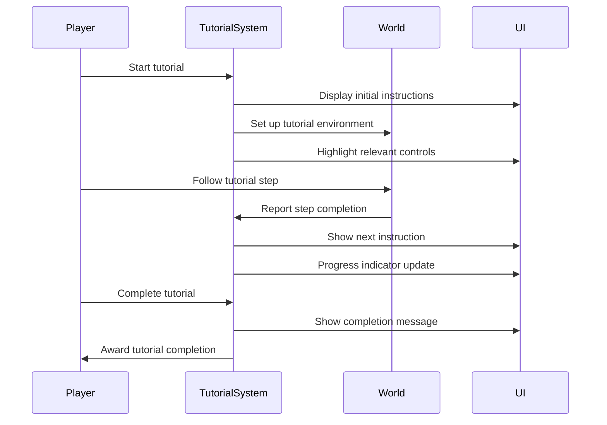

Tutorial UI elements include:
- Step-by-step instruction panels
- Interactive 3D demonstrations
- Highlighted control indicators
- Progress tracker
- Visual guides for movement and building
- Skippable sections for experienced players
- Quick reference guide accessible from the pause menu

## Coordinate System UI

A special UI system is dedicated to helping players understand and navigate using the quadray coordinate system:

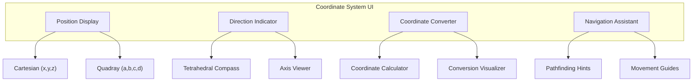

Key features of the coordinate system UI:
- Toggle between Cartesian and Quadray coordinate display
- Color-coded coordinate values for easy reference
- 3D compass showing orientation in tetrahedral space
- Interactive coordinate converter for learning
- Visual indicators showing how movement affects coordinates
- Pathfinding assistance for navigating in tetrahedral space

## Building Interface

The building interface helps players construct and manipulate tetrahedral structures:

```mermaid
graph TD
    subgraph "Building Interface"
        BuildControls["Building Controls"]
        SelectionTools["Selection Tools"]
        BlockManipulation["Block Manipulation"]
        Templates["Templates System"]
    end
    
    BuildControls --> PlacementMode["Placement Mode"]
    BuildControls --> RemovalMode["Removal Mode"]
    BuildControls --> EditMode["Edit Mode"]
    
    SelectionTools --> SingleSelect["Single Block Selection"]
    SelectionTools --> AreaSelect["Area Selection"]
    SelectionTools --> PatternSelect["Pattern Selection"]
    
    BlockManipulation --> Rotate["Rotation Controls"]
    BlockManipulation --> Scale["Scaling Controls"]
    BlockManipulation --> Copy["Copy/Paste"]
    
    Templates --> SaveTemplate["Save Template"]
    Templates --> LoadTemplate["Load Template"]
    Templates --> ShareTemplate["Share Template"]
```

Building interface features:
- Mode selector for different building operations
- Grid snap controls and alignment guides
- Block rotation and orientation tools
- Selection tools for manipulating multiple blocks
- Template system for saving and loading structures
- Undo/redo functionality
- Mirror and symmetry tools

## UI Customization

QuadCraft allows players to customize their UI experience:

```mermaid
graph TD
    subgraph "UI Customization"
        Layout["Layout Options"]
        Appearance["Appearance Settings"]
        Information["Information Display"]
        Performance["Performance Options"]
    end
    
    Layout --> ElementPositioning["Element Positioning"]
    Layout --> HUDConfiguration["HUD Configuration"]
    Layout --> ScreenRegions["Screen Region Assignment"]
    
    Appearance --> ColorThemes["Color Themes"]
    Appearance --> Opacity["Element Opacity"]
    Appearance --> Scale["UI Scaling"]
    
    Information --> DetailLevel["Information Detail Level"]
    Information --> UpdateFrequency["Update Frequency"]
    Information --> PriorityInfo["Priority Information"]
    
    Performance --> MinimalistMode["Minimalist Mode"]
    Performance --> AnimationToggle["UI Animation Toggle"]
    Performance --> LowImpactMode["Low Impact Mode"]
```

UI customization options:
- Repositionable HUD elements
- Multiple color themes with custom color options
- Opacity and scale controls for all UI elements
- Information detail level settings
- Performance-focused minimalist modes
- Saved UI profiles for different play styles

## Technical Implementation

The UI system in QuadCraft is implemented using a modular architecture:

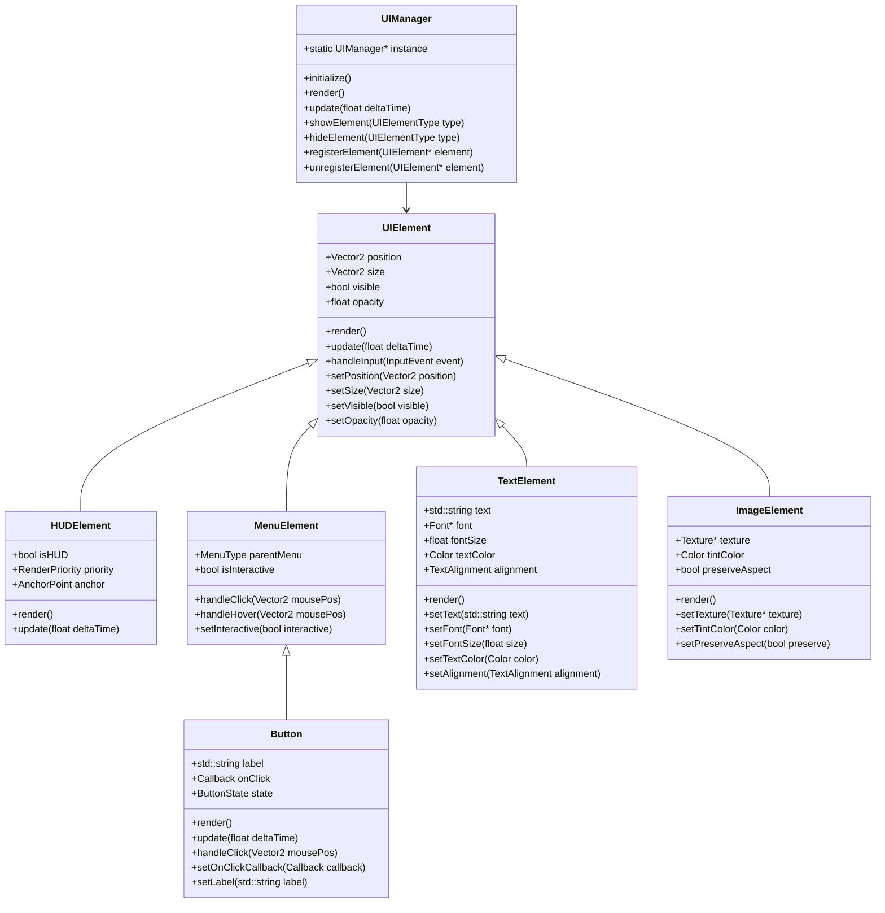

## Conclusion

The QuadCraft user interface is designed to bridge the gap between intuitive controls and the complex tetrahedral environment. Through careful design choices, informative visualizations, and customizable elements, the UI helps players navigate, build, and understand the unique spatial properties of the tetrahedral world while maintaining an immersive gameplay experience. 