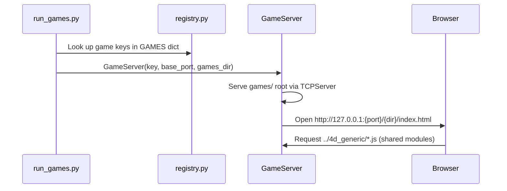
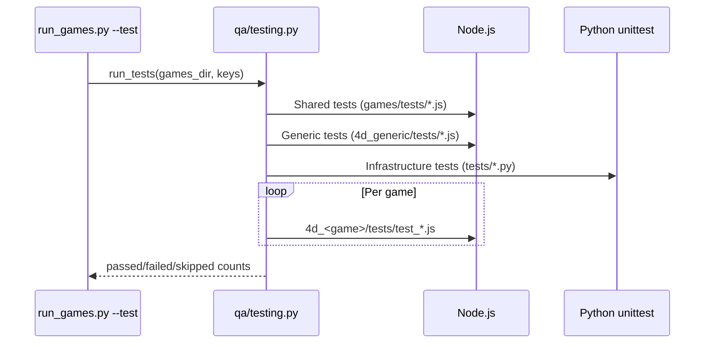
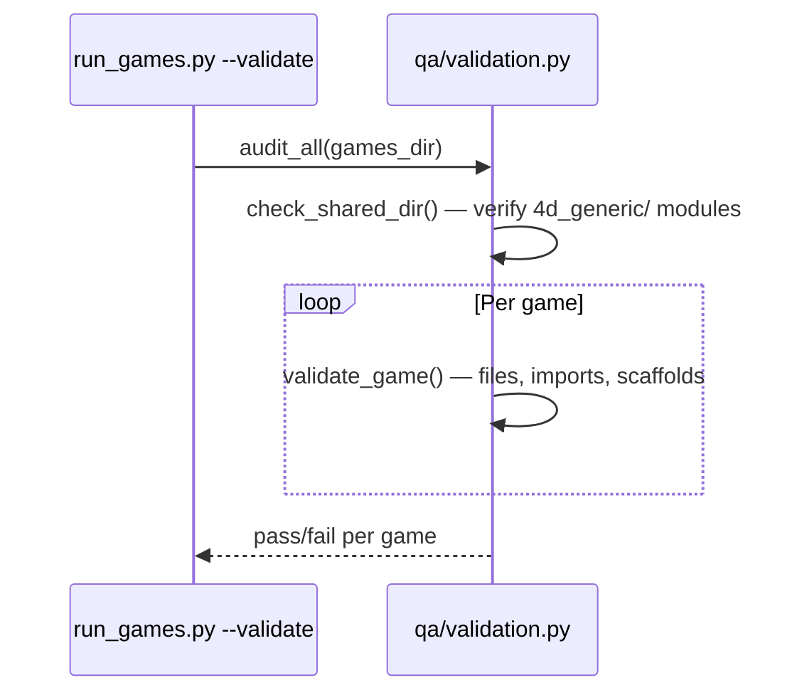

# Games Architecture

> System architecture for the QuadCraft 22-game portfolio built on Quadray tetrahedral coordinates.

---

## Three-Layer Model

```mermaid
graph TD
    subgraph "Layer 3 — Per-Game"
        G1["4d_chess/"]
        G2["4d_doom/"]
        G3["4d_snake/"]
        GN["4d_*/  (22 games)"]
    end

    subgraph "Layer 2 — Python Infrastructure"
        CFG["core/config.py"]
        REG["core/registry.py"]
        LAUNCH["server/launcher.py"]
        TEST["qa/testing.py"]
        VAL["qa/validation.py"]
        SCAFF["scaffold/"]
        ANA["analytics/"]
        SHARED["shared/"]
        SPACE["space/"]
    end

    subgraph "Layer 1 — Shared JS Foundation"
        QR["quadray.js"]
        CAM["camera.js"]
        PROJ["projection.js"]
        ZOOM["zoom.js"]
        SYN["synergetics.js"]
        BG["base_game.js"]
        BR["base_renderer.js"]
        GL["game_loop.js"]
        IC["input_controller.js"]
        GU["grid_utils.js"]
        HUD["hud.js"]
        SM["score_manager.js"]
        CSS["hud-style.css"]
    end

    G1 & G2 & G3 & GN -->|"<script src='../4d_generic/...'>"|  QR & CAM & PROJ & BG
    REG --> LAUNCH & TEST & VAL
    CFG --> REG & VAL & ANA & SHARED
    SCAFF -->|generates| GN
    ANA -->|scans| GN
    SPACE -.->|"Python port of"| QR & SYN & GU
```

| Layer | Location | Language | Purpose |
|-------|----------|----------|---------|
| **1 — Shared Foundation** | `4d_generic/` | JavaScript | Quadray math, rendering, input, game engine base classes |
| **2 — Infrastructure** | `src/` | Python | Registry, launch, test, validate, scaffold, analytics, math |
| **3 — Per-Game** | `4d_*/` | HTML + JS | Standalone game directories with game-specific logic |

---

## Directory Map

```text
games/
├── run_games.py                 # Master CLI entry point
├── run.sh                       # Shell wrapper → delegates to run_games.py
├── games_config.json            # JSON config for batch launches
├── README.md / AGENTS.md        # Human + agent documentation
├── GAMES_INDEX.md               # Canonical game portfolio index
│
├── src/                         # Layer 2 — Python infrastructure
│   ├── __init__.py              # Unified public API (35 exports)
│   ├── core/                    # Core configuration and registry
│   │   ├── config.py            # Shared constants (ports, paths, lists)
│   │   └── registry.py          # GAMES dict + load_config()
│   ├── server/                  # HTTP serving
│   │   └── launcher.py          # GameServer (HTTP + browser open)
│   ├── qa/                      # Quality Assurance tools
│   │   ├── testing.py           # Node.js + Python test runner
│   │   └── validation.py        # Structural audit engine
│   ├── scaffold/                # GameScaffold (new game generator)
│   ├── analytics/               # GameAnalytics + health scoring
│   ├── shared/                  # ModuleRegistry + JSModule metadata
│   └── space/                   # Quadray / IVM / XYZ / geometry
│
├── 4d_generic/                  # Layer 1 — Shared JS modules (13 files)
│   ├── quadray.js               # Quadray coordinate class
│   ├── camera.js                # CameraController (drag rotation)
│   ├── projection.js            # projectQuadray() + drawQuadrayAxes()
│   ├── zoom.js                  # setupZoom() mouse wheel
│   ├── synergetics.js           # IVM constants + verification
│   ├── base_game.js             # BaseGame lifecycle controller
│   ├── base_renderer.js         # BaseRenderer with projection
│   ├── game_loop.js             # GameLoop (rAF + delta)
│   ├── input_controller.js      # InputController (keyboard/mouse)
│   ├── grid_utils.js            # GridUtils (IVM grid operations)
│   ├── hud.js                   # HUD overlay manager
│   ├── score_manager.js         # ScoreManager (localStorage)
│   └── hud-style.css            # Shared HUD stylesheet
│
├── 4d_<game>/                   # Layer 3 — Per-game (×22)
│   ├── index.html               # Entry point (imports generic modules)
│   ├── AGENTS.md                # Game-specific agent instructions
│   ├── run.sh                   # Standalone launcher
│   ├── js/                      # Game-specific JS modules
│   │   ├── <game>_board.js      # Board / world state
│   │   ├── <game>_renderer.js   # Rendering logic
│   │   └── <game>_game.js       # Controller + UI
│   └── tests/                   # Per-game unit tests
│       └── test_<game>.js       # Node.js test file
│
├── scripts/                     # Maintenance automation
├── tests/                       # Shared module tests (12 files)
└── doc/                         # ← This documentation hub
```

---

## Data Flow Pipelines

### Launch Pipeline



### Test Pipeline



### Validate Pipeline



---

## JS ↔ Python Parity

| Domain | JavaScript (`4d_generic/`) | Python (`src/space/`) |
|--------|---------------------------|----------------------|
| Coordinates | `quadray.js` → `Quadray` class | `space/quadrays.py` → `Quadray` class |
| Constants | `synergetics.js` → IVM volumes | `space/ivm.py` → `IVM`, `SYNERGETICS` |
| Projection | `projection.js` → `projectQuadray()` | `space/xyz.py` → `project_quadray()` |
| Grid ops | `grid_utils.js` → `GridUtils` | `space/geometry.py` → `generate_grid()`, `neighbors_8()` |
| Verification | `synergetics.js` → `verifyGeometricIdentities()` | `space/geometry.py` → `verify_geometric_identities()` |

---

## Key Design Principles

| Principle | Implementation |
|-----------|---------------|
| **Standalone games** | Each `4d_<game>/` folder is self-contained; copy one folder to fork |
| **Zero build step** | Open `index.html` directly; no bundler, no transpiler |
| **Shared foundation** | Common math/rendering via `<script src="../4d_generic/">` tags |
| **Single source of truth** | `quadray.js` is THE Quadray implementation; games don't copy it |
| **Registry-driven** | `GAMES` dict in `registry.py` drives launch, test, validate, analytics |
| **ES-module exception** | Doom uses `import/export` syntax; exempted from shared-import validation |

---

*See also: [shared_modules_reference.md](shared_modules_reference.md) · [python_infrastructure.md](python_infrastructure.md) · [game_template.md](game_template.md)*
