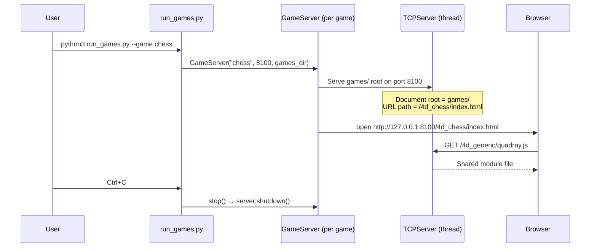

# Launch Operations Manual

> **Note on 4D Geometry & Nomenclature**: Throughout QuadCraft, whenever we refer to **"4D"**, we strictly mean **Synergetics** geometry. This entails **Quadray 4D tetrahedral coordinates** deployed on an **Isotropic Vector Matrix (IVM)** of close-packed spheres, where the Quadray coordinates of the 12 neighboring balls are strictly defined by all permutations of `(0, 1, 1, 2)`.

> How to launch, configure, and troubleshoot QuadCraft game servers.

---

## Quick Reference

```bash
# Launch all 30 games
python3 run_games.py --all

# Launch specific game(s)
python3 run_games.py --game chess
python3 run_games.py --game chess doom snake

# Launch from config file
python3 run_games.py --config games_config.json

# List all games with ports
python3 run_games.py --list

# Run all tests
python3 run_games.py --test

# Structural validation
python3 run_games.py --validate

# Shell wrapper equivalents
./run.sh                           # Launch all games
./run.sh chess doom                 # Launch specific games
./run.sh --list                    # List all
./run.sh --test                    # Run tests
```

---

## `run_games.py` CLI Reference

| Flag | Short | Argument | Description |
|------|-------|----------|-------------|
| `--game` | `-g` | `NAME [NAME ...]` | Launch specific game(s) by registry key |
| `--all` | `-a` | — | Launch all 30 games |
| `--list` | `-l` | — | List all games with ports |
| `--test` | `-t` | — | Run unit tests (combine with `--game` to filter) |
| `--validate` | `-v` | — | Structural validation audit |
| `--base-port` | `-p` | `N` (default: 8100) | Starting port number |
| `--no-browser` | — | — | Start servers without opening browser |
| `--config` | `-c` | `FILE` | Load selections from JSON config |

### Mode Combinations

| Command | Effect |
|---------|--------|
| `--game chess --test` | Run tests for chess only |
| `--all --no-browser` | Serve all games, don't open windows |
| `--all --base-port 9000` | All games on ports 9000–9021 |
| `--config custom.json` | Load games + port + browser from JSON |

---

## `run.sh` Shell Wrapper

The master `run.sh` delegates to `run_games.py` for most operations:

| Input | Behavior |
|-------|----------|
| No args | Launches all games via `run_games.py --all` |
| `chess doom` | Delegates to `run_games.py --game chess doom` |
| `--list` | Lists all games |
| `--test` / `--validate` / `--all` / `--config` | Delegates to `run_games.py` |

### Centralized Launching

All game launching is handled through `run_games.py`, which serves the
`games/` root directory to correctly resolve `../4d_generic/` imports:

```bash
python3 run_games.py --game chess          # Default port
python3 run_games.py --game chess --base-port 9000  # Custom port
```

---

## Server Architecture



**Key detail:** The server serves the **parent `games/` directory** as the document root. This ensures that `../4d_generic/` relative paths in `index.html` resolve to `/4d_generic/` on the server.

---

## Port Mapping Table

| Key | Game | Port (base=8100) |
|-----|------|-------------------|
| chess | 4D Chess | 8100 |
| checkers | 4D Checkers | 8101 |
| reversi | 4D Reversi | 8102 |
| life | 4D Life | 8103 |
| asteroids | 4D Asteroids | 8104 |
| simant | 4D SimAnt | 8105 |
| backgammon | 4D Backgammon | 8106 |
| minecraft | 4D Minecraft | 8107 |
| catan | 4D Catan | 8108 |
| tower_defense | 4D Tower Defense | 8109 |
| doom | 4D Doom | 8110 |
| mahjong | 4D Mahjong | 8111 |
| tetris | 4D Tetris | 8112 |
| snake | 4D Snake | 8113 |
| pong | 4D Pong | 8114 |
| breakout | 4D Breakout | 8115 |
| pacman | 4D Pac-Man | 8116 |
| space_invaders | 4D Space Invaders | 8117 |
| frogger | 4D Frogger | 8118 |
| bomberman | 4D Bomberman | 8119 |
| connect_four | 4D Connect Four | 8120 |
| minesweeper | 4D Minesweeper | 8121 |

---

## Troubleshooting

| Symptom | Cause | Fix |
|---------|-------|-----|
| `port N unavailable` | Port already in use | Kill process on that port: `lsof -ti:8100 \| xargs kill` |
| `404 Not Found` for `../4d_generic/` | Server root is too deep | Use `run_games.py` (serves `games/` root), not a manual HTTP server |
| `Uncaught ReferenceError: Quadray is not defined` | Script load order wrong | Ensure `quadray.js` loads before game scripts in `index.html` |
| `Class extends value undefined` | Missing shared module import | Check all `<script>` tags are present and correctly ordered |
| Canvas is black | Renderer/Camera error | Check browser console for errors; verify `projectQuadray` calls |
| Browser doesn't open | `--no-browser` or browser not found | Manually navigate to the URL printed by the launcher |
| `❌ Unknown game: xyz` | Game key not in registry | Check `python3 run_games.py --list` for valid keys |
| All servers start but no games load | Port conflict range | Use `--base-port` with a different range (e.g., 9000) |

### Checking for Port Conflicts

```bash
# Check if a port is in use
lsof -i :8100

# Kill process on a specific port
lsof -ti:8100 | xargs kill -9

# Check all game ports (8100-8121)
for p in $(seq 8100 8121); do lsof -i :$p 2>/dev/null && echo "Port $p in use"; done
```

---

*See also: [configuration.md](configuration.md) · [python_infrastructure.md](python_infrastructure.md) · [architecture.md](architecture.md)*
