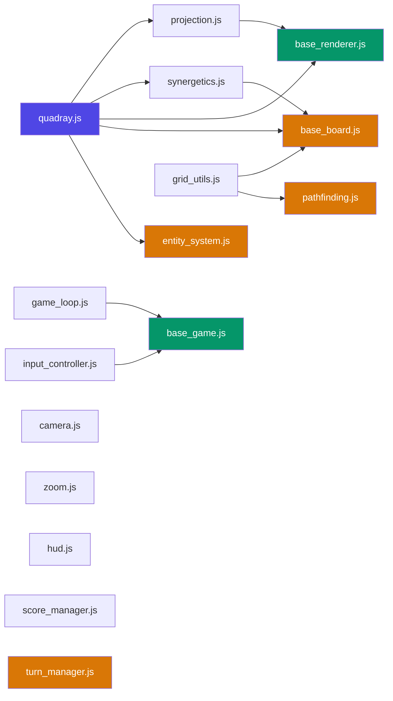

# Shared Modules Reference — `4d_generic/`

> **Note on 4D Geometry & Nomenclature**: Throughout QuadCraft, whenever we refer to **"4D"**, we strictly mean **Synergetics** geometry. This entails **Quadray 4D tetrahedral coordinates** deployed on an **Isotropic Vector Matrix (IVM)** of close-packed spheres, where the Quadray coordinates of the 12 neighboring balls are strictly defined by all permutations of `(0, 1, 1, 2)`.


> Canonical documentation for all 17 shared JavaScript modules that form the foundation layer of every QuadCraft game.

---

## Module Index

| # | Module | Category | Dependencies | Description |
|---|--------|----------|--------------|-------------|
| 1 | `quadray.js` | math | — | Quadray 4D coordinate class with arithmetic, normalization, conversions |
| 2 | `camera.js` | rendering | — | `CameraController` — shift-drag rotation for 3D/4D scenes |
| 3 | `projection.js` | rendering | `quadray.js` | `projectQuadray()` → screen-space; `drawQuadrayAxes()` |
| 4 | `zoom.js` | rendering | — | `setupZoom()` — mouse wheel zoom with min/max clamping |
| 5 | `synergetics.js` | math | `quadray.js` | IVM constants, volume ratios (Tetra/Octa/Icosa), Jitterbug, D/R conversion |
| 6 | `input_controller.js` | input | — | `InputController` — event-driven keyboard bindings + polled `isDown()` state |
| 7 | `game_loop.js` | engine | — | `GameLoop` — fixed-timestep rAF loop with pause/stop/start lifecycle |
| 8 | `hud.js` | ui | — | `HUD` — color-coded state manager for status overlays |
| 9 | `score_manager.js` | engine | — | `ScoreManager` — score/level/lives tracker with localStorage persistence |
| 10 | `grid_utils.js` | math | — | `GridUtils` — IVM grid generation, neighbors, bounds, distance, depth sort |
| 11 | `base_renderer.js` | rendering | `quadray.js`, `projection.js` | `BaseRenderer` — canvas setup, Quadray projection, axis drawing, primitives |
| 12 | `base_game.js` | engine | `game_loop.js`, `input_controller.js` | `BaseGame` — lifecycle controller with auto-setup for loop, input, camera |
| 13 | `base_board.js` | board | `quadray.js`, `grid_utils.js`, `synergetics.js` | `BaseBoard` — common grid ops, distances, integrity, metadata |
| 14 | `entity_system.js` | engine | `quadray.js` | `QuadrayEntity` + `EntityManager` — position/velocity, collision, wrapping |
| 15 | `turn_manager.js` | engine | — | `TurnManager` — player rotation, move history, undo/redo |
| 16 | `pathfinding.js` | board | `grid_utils.js` | `QuadrayPathfinder` — BFS, A*, flood fill, line-of-sight |
| 17 | `hud-style.css` | ui | — | Shared CSS for HUD panels, overlays, and status bars |

---

## Load Order

Modules **must** be loaded in dependency-safe order in `index.html`. The canonical order:

```html
<!-- 1. Core Math (no dependencies) -->
<script src="../4d_generic/quadray.js"></script>

<!-- 2. Rendering (some depend on quadray.js) -->
<script src="../4d_generic/camera.js"></script>
<script src="../4d_generic/projection.js"></script>
<script src="../4d_generic/zoom.js"></script>

<!-- 3. Math Extensions -->
<script src="../4d_generic/synergetics.js"></script>
<script src="../4d_generic/grid_utils.js"></script>

<!-- 4. Engine (no math dependencies) -->
<script src="../4d_generic/game_loop.js"></script>
<script src="../4d_generic/input_controller.js"></script>
<script src="../4d_generic/score_manager.js"></script>

<!-- 5. UI -->
<script src="../4d_generic/hud.js"></script>

<!-- 6. Base Classes (depend on above) -->
<script src="../4d_generic/base_renderer.js"></script>
<script src="../4d_generic/base_game.js"></script>
<script src="../4d_generic/base_board.js"></script>

<!-- 7. Optional: Game-Pattern Modules -->
<!-- <script src="../4d_generic/entity_system.js"></script> -->
<!-- <script src="../4d_generic/turn_manager.js"></script> -->
<!-- <script src="../4d_generic/pathfinding.js"></script> -->
```

> **Programmatic access:** `ModuleRegistry().load_order()` in `src/shared/` performs topological sort automatically.

---

## Dependency Graph



---

## Module Details

### `quadray.js` — Quadray Coordinate Class

**Category:** math · **Dependencies:** none

The single source of truth for Quadray 4D coordinates `(a, b, c, d)`.

| Method/Property | Description |
|----------------|-------------|
| `new Quadray(a, b, c, d)` | Construct from 4 components |
| `.normalized()` | Zero-minimum normalization |
| `.toXYZ()` | Convert to Cartesian `{x, y, z}` |
| `Quadray.fromXYZ(x, y, z)` | Static: Cartesian → Quadray |
| `.add(q)` / `.sub(q)` / `.scale(s)` | Arithmetic operations |
| `.length()` | Vector magnitude `√((a²+b²+c²+d²)/2)` |
| `.distanceTo(q)` | Native Quadray 4D distance |
| `.equals(q, ε)` | Tolerance-based equality |
| `.toKey()` | Integer-rounded string key for Maps/Sets |

---

### `camera.js` — CameraController

**Category:** rendering · **Dependencies:** none

Provides shift-drag rotation for 3D/4D scene navigation.

| Method/Property | Description |
|----------------|-------------|
| `new CameraController(canvas)` | Attach to canvas element |
| `.rotX`, `.rotY` | Current rotation angles |
| `.getRotation()` | Get `{rotX, rotY}` state |

---

### `projection.js` — Quadray Projection

**Category:** rendering · **Dependencies:** `quadray.js`

| Method/Property | Description |
|----------------|-------------|
| `projectQuadray(a, b, c, d, camera, zoom)` | Quadray → `{x, y, scale}` screen coords |
| `drawQuadrayAxes(ctx, camera, zoom)` | Draw labeled ABCD axes on canvas |

---

### `zoom.js` — Mouse Wheel Zoom

**Category:** rendering · **Dependencies:** none

| Method/Property | Description |
|----------------|-------------|
| `setupZoom(canvas, options)` | Attach wheel listener; returns `{getZoom()}` |

---

### `synergetics.js` — IVM Constants & Verification

**Category:** math · **Dependencies:** `quadray.js`

| Constant / Method | Description |
|-------------------|-------------|
| `SYNERGETICS.TETRA_VOL` | Tetrahedron volume = 1 |
| `SYNERGETICS.OCTA_VOL` | Octahedron volume = 4 |
| `SYNERGETICS.ICOSA_VOL` | Icosahedron volume ≈ 18.51 |
| `SYNERGETICS.PHI` | Golden ratio (1+√5)/2 |
| `SYNERGETICS.S3` | √(9/8) ≈ 1.0607 |
| `verifyGeometricIdentities()` | 8-check Synergetics verification suite |

---

### `grid_utils.js` — GridUtils

**Category:** math · **Dependencies:** none

| Method | Description |
|--------|-------------|
| `GridUtils.generateGrid(size)` | All cells in a `size⁴` Quadray grid |
| `GridUtils.getNeighbors(a,b,c,d)` | 8 face-touching IVM neighbours |
| `GridUtils.getBoundedNeighbors(a,b,c,d,size)` | In-bounds neighbours only |
| `GridUtils.inBounds(a,b,c,d,size)` | Bounds check |
| `GridUtils.distance(q1,q2)` | Native Quadray 4D distance |
| `GridUtils.depthSort(cells, projectFn)` | Painter's algorithm sort |
| `GridUtils.shuffle(arr)` | Fisher-Yates shuffle |

---

### `game_loop.js` — GameLoop

**Category:** engine · **Dependencies:** none

| Method | Description |
|--------|-------------|
| `new GameLoop(updateFn, tickRate)` | Create with update callback and tick rate |
| `.start()` / `.stop()` / `.pause()` | Lifecycle control |
| `.isRunning` | Current state |

---

### `input_controller.js` — InputController

**Category:** input · **Dependencies:** none

| Method | Description |
|--------|-------------|
| `new InputController()` | Create and attach keyboard listeners |
| `.bind(key, callback)` | Event-driven: fire on key press |
| `.isDown(key)` | Polled: check if key is currently held |
| `.reset()` | Clear all bindings |

---

### `score_manager.js` — ScoreManager

**Category:** engine · **Dependencies:** none

| Method | Description |
|--------|-------------|
| `new ScoreManager(gameKey)` | Create with localStorage key prefix |
| `.addScore(points)` / `.getScore()` | Score management |
| `.setLevel(n)` / `.getLevel()` | Level tracking |
| `.loseLife()` / `.getLives()` | Lives tracking |
| `.isGameOver()` | Check lives ≤ 0 |
| `.getHighScore()` / `.saveHighScore()` | Persistent high score |
| `.reset()` | Reset session |

---

### `hud.js` — HUD Manager

**Category:** ui · **Dependencies:** none

| Method | Description |
|--------|-------------|
| `new HUD(elementId)` | Attach to DOM element |
| `.update(state)` | Update display with game state object |
| `.setStatus(text, color)` | Set status line with color coding |

---

### `base_renderer.js` — BaseRenderer

**Category:** rendering · **Dependencies:** `quadray.js`, `projection.js`

| Method | Description |
|--------|-------------|
| `new BaseRenderer(canvas)` | Set up 2D context with auto-resize |
| `.clear()` | Clear canvas |
| `.drawAxes(camera, zoom)` | Draw Quadray ABCD axes |
| `.projectQuadray(a,b,c,d,camera,zoom)` | Delegate to `projectQuadray()` |
| `.drawCell(x, y, size, color)` | Draw a single cell shape |
| `.drawLine(x1,y1,x2,y2,color)` | Draw a line segment |

---

### `base_game.js` — BaseGame

**Category:** engine · **Dependencies:** `game_loop.js`, `input_controller.js`

| Method | Description |
|--------|-------------|
| `new BaseGame(canvas, options)` | Auto-creates GameLoop, InputController, Camera |
| `.init()` | Override: setup board, bind keys |
| `.update(dt)` | Override: game logic per tick |
| `.render()` | Override: draw frame |
| `.start()` / `.pause()` / `.reset()` | Lifecycle control |
| `.gameLoop` | Access to underlying GameLoop |
| `.input` | Access to underlying InputController |

---

### `hud-style.css` — Shared HUD Styles

Provides consistent styling for all game HUD overlays, panels, and status bars.

---

### `base_board.js` — BaseBoard

**Category:** board · **Dependencies:** `quadray.js`, `grid_utils.js`, `synergetics.js`

Common board logic extracted from 20 game board files. Provides grid operations, geometric verification, distance calculations, and base metadata.

| Method | Description |
|--------|-------------|
| `new BaseBoard(size, options)` | Create grid with size and game-specific options |
| `.getCell(q)` | Get cell value by Quadray position |
| `.setCell(q, value)` | Set cell value by Quadray position |
| `.key(q)` | Convert Quadray to string key via `GridUtils.key()` |
| `.parseKey(key)` | Parse string key back to `{a,b,c,d}` |
| `.getNeighbors(q)` | In-bounds IVM neighbors via `GridUtils.boundedNeighbors()` |
| `.manhattanDistance(q1, q2)` | Manhattan distance via `GridUtils.manhattan()` |
| `.euclideanDistance(q1, q2)` | Raw 4-component distance via `GridUtils.euclidean()` |
| `.quadrayDistance(q1, q2)` | IVM distance via `Quadray.distance()` |
| `.angleBetween(from, to1, to2)` | Angle via `angleBetweenQuadrays()` |
| `._verifyIntegrity()` | Geometric round-trip verification on corners |
| `.getMetadata()` | Base game state (size, cellCount, gameOver, score) |
| `BaseBoard.DIRECTIONS` | Static: 8 IVM face-touching direction vectors |

---

### `entity_system.js` — QuadrayEntity + EntityManager

**Category:** engine · **Dependencies:** `quadray.js`

Entity management for real-time games (Asteroids, Frogger, Pong, etc.). Handles position, velocity, collision, and world wrapping.

| Class / Method | Description |
|----------------|-------------|
| `new QuadrayEntity(options)` | Create entity with position, velocity, radius, type |
| `.update(dt)` | Advance position by velocity × dt |
| `.distanceTo(other)` | Distance between two entities |
| `.collidesWith(other)` | Radius-based collision detection |
| `.wrapToGrid(size)` | Wrap entity position to grid bounds |
| `new EntityManager()` | Create empty entity manager |
| `.add(entity)` | Register an entity |
| `.remove(entity)` | Remove an entity |
| `.getByType(type)` | Filter entities by type string |
| `.updateAll(dt)` | Batch-update all entities |
| `.detectCollisions(typeA, typeB)` | Find all colliding pairs between two types |
| `.wrapAll(size)` | Wrap all entity positions |

---

### `turn_manager.js` — TurnManager

**Category:** engine · **Dependencies:** none

Turn management for turn-based games (Chess, Checkers, Reversi, etc.). Handles player rotation, move history, and undo/redo.

| Method | Description |
|--------|-------------|
| `new TurnManager(players, options)` | Create with player list + optional config |
| `.getCurrentPlayer()` | Get current player |
| `.nextTurn()` | Advance to next player |
| `.recordMove(move)` | Push move onto history stack |
| `.undo()` | Pop last move and return it |
| `.redo()` | Reapply last undone move |
| `.getMoveHistory()` | Full move history array |
| `.getTurnNumber()` | Current turn count |
| `.reset()` | Reset turn state |
| `.getState()` | Serializable snapshot for save/load |
| `.loadState(state)` | Restore from snapshot |

---

### `pathfinding.js` — QuadrayPathfinder

**Category:** board · **Dependencies:** `grid_utils.js`

Pathfinding algorithms for IVM grids. Used by games with AI movement, route planning, or range queries.

| Method | Description |
|--------|-------------|
| `new QuadrayPathfinder(options)` | Create pathfinder with size, isBlocked callback |
| `.bfs(start, goal)` | Breadth-first search → shortest path |
| `.aStar(start, goal, heuristic)` | A* search with custom heuristic |
| `.floodFill(start, maxDist)` | All reachable cells within maxDist |
| `.lineOfSight(from, to)` | Check unobstructed line between positions |
| `.getRange(center, radius)` | All cells within radius (Manhattan) |

---

## Categories Summary

| Category | Modules | Purpose |
|----------|---------|---------|
| **math** | `quadray.js`, `synergetics.js`, `grid_utils.js` | 4D coordinate math, constants, grid operations |
| **rendering** | `camera.js`, `projection.js`, `zoom.js`, `base_renderer.js` | 3D/4D visualization pipeline |
| **engine** | `game_loop.js`, `score_manager.js`, `base_game.js`, `entity_system.js`, `turn_manager.js` | Game lifecycle, scoring, entity management, turn logic |
| **board** | `base_board.js`, `pathfinding.js` | Grid board logic, pathfinding algorithms |
| **input** | `input_controller.js` | Keyboard/mouse event handling |
| **ui** | `hud.js`, `hud-style.css` | Heads-up display overlays |

---

*See also: [architecture.md](architecture.md) · [space_math_reference.md](space_math_reference.md) · [game_template.md](game_template.md)*
