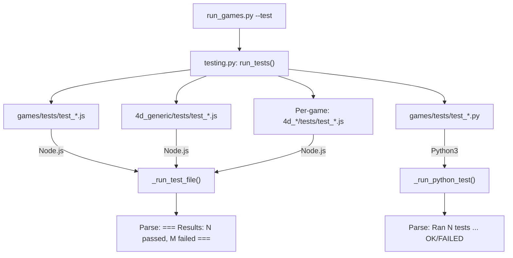

# Testing Guide

> **Note on 4D Geometry & Nomenclature**: Throughout QuadCraft, whenever we refer to **"4D"**, we strictly mean **Synergetics** geometry. This entails **Quadray 4D tetrahedral coordinates** deployed on an **Isotropic Vector Matrix (IVM)** of close-packed spheres, where the Quadray coordinates of the 12 neighboring balls are strictly defined by all permutations of `(0, 1, 1, 2)`.


> How to run, write, and extend tests for QuadCraft games and shared modules.

---

## Running Tests

### All Tests

```bash
# Via Python launcher (recommended)
python3 run_games.py --test

# Via shell wrapper
./run.sh --test
```

### Specific Game(s)

```bash
python3 run_games.py --test --game chess
python3 run_games.py --test --game chess doom snake
```

### Single Test File (Direct)

```bash
node games/4d_chess/tests/test_chess.js
node games/tests/test_projection.js
```

---

## Test Architecture



### Test Locations

| Location | Scope | Language | Runner |
|----------|-------|----------|--------|
| `games/tests/test_*.js` | Shared JS modules | JavaScript | Node.js via `_run_test_file()` |
| `games/tests/test_*.py` | Python infrastructure | Python | `python3` via `_run_python_test()` |
| `4d_generic/tests/test_*.js` | Generic module internal | JavaScript | Node.js via `_run_test_file()` |
| `4d_<game>/tests/test_*.js` | Per-game logic | JavaScript | Node.js via `_run_test_file()` |

### Current Test Inventory

**Shared Module Tests** (`games/tests/`):

| File | Tests | Subject |
|------|-------|---------|
| `test_projection.js` | `projectQuadray()`, `drawQuadrayAxes()` |
| `test_camera.js` | `CameraController` |
| `test_zoom.js` | `setupZoom()` |
| `test_grid_utils.js` | `GridUtils` (grid, neighbors, distance) |
| `test_base_game.js` | `BaseGame` lifecycle |
| `test_base_renderer.js` | `BaseRenderer` canvas operations |
| `test_hud.js` | `HUD` state display |
| `test_score_manager.js` | `ScoreManager` persistence |
| `test_all_shared.js` | Integration runner (skipped by test harness) |
| `test_infrastructure.py` | Python `src/` module imports |

---

## Writing Tests

### JavaScript Test Template

```javascript
// test_<game>.js — Unit tests for <Game>
// ─────────────────────────────────────────────────

const path = require('path');

// Load shared modules (order matters)
const quadrayPath = path.join(__dirname, '..', '..', '4d_generic', 'quadray.js');
// ... load dependencies as needed

// Load game-specific module
const boardPath = path.join(__dirname, '..', 'js', '<game>_board.js');

let passed = 0;
let failed = 0;

function assert(condition, msg) {
    if (condition) {
        console.log(`  ✅ ${msg}`);
        passed++;
    } else {
        console.log(`  ❌ ${msg}`);
        failed++;
    }
}

// ── Tests ──────────────────────────────────────

console.log('\n🧪 <Game> Tests\n');

// Test: Board initialization
assert(typeof Board === 'function', 'Board class exists');

const board = new Board(8);
assert(board.size === 8, 'Board size is 8');

// Test: Cell operations
board.setCell(0, 0, 0, 0, 'X');
assert(board.getCell(0, 0, 0, 0) === 'X', 'setCell/getCell roundtrip');

// ── Results ────────────────────────────────────
console.log(`\n=== Results: ${passed} passed, ${failed} failed ===`);
process.exit(failed > 0 ? 1 : 0);
```

### Standardized Output Format

The test runner parses this **exact** results line:

```text
=== Results: N passed, M failed ===
```

> **Fallback:** If this line is missing, the runner counts `✅` and `❌` emoji lines instead.

### Python Test Template

```python
"""test_infrastructure.py — Python infrastructure tests."""
import unittest
import sys
import os

sys.path.insert(0, os.path.dirname(os.path.dirname(os.path.dirname(__file__))))

class TestRegistry(unittest.TestCase):
    def test_games_dict_has_entries(self):
        from games.src.registry import GAMES
        self.assertGreater(len(GAMES), 0)

    def test_load_config(self):
        from games.src.registry import load_config
        config = load_config('games/games_config.json')
        self.assertIn('games', config)

if __name__ == '__main__':
    unittest.main()
```

---

## Test Runner Internals

### `_run_test_file(tf, cwd, label) → (passed, failed)`

1. Runs `node <test_file>` with 30s timeout
2. Parses `Results:` line via regex `Results:\s*(\d+)\s*passed,\s*(\d+)\s*failed`
3. Falls back to emoji counting if no match
4. Returns `(passed_count, failed_count)`

### `_run_python_test(tf, cwd, label) → (passed, failed)`

1. Runs `python3 <test_file>` with 10s timeout
2. Parses `Ran N tests` and `FAILED (failures=M)` from stderr
3. Returns `(pass_count, fail_count)`

### Shared vs Per-Game Execution

- **Shared tests** run only when no specific `--game` filter is applied, OR when running the full suite
- **Per-game tests** run for all requested games
- `test_all_shared.js` is always **skipped** (it's a meta-runner)

---

## Test Coverage by Game

| Game | Tests | Key Areas Covered |
|------|-------|-------------------|
| Chess | 91 | Piece movement, check/checkmate, legal moves |
| Tower Defense | 98 | Wave spawning, tower targeting, pathfinding |
| Doom | 116 | Raycasting, enemy AI, collision, weapons |
| Minecraft | 74 | Terrain gen, block placement, inventory |
| Connect Four | 70 | Gravity drop, 4-in-a-row detection |
| Frogger | 23 | Lane mechanics, collision |
| Minesweeper | 23 | Mine placement, neighbor counting |
| Space Invaders | 22 | Formation movement, shooting |
| Bomberman | 22 | Bomb blast, wall destruction |
| Breakout | 20 | Ball physics, brick breaking |
| Pac-Man | 19 | Ghost AI, maze navigation |
| Pong | 19 | Paddle/ball physics |
| Tetris | 18 | Piece rotation, line clearing |
| Snake | 15 | Growth, self-collision |
| Asteroids | 12 | Wrap-around, splitting |
| Checkers | 11 | Capture, king promotion |
| Reversi | 11 | Disc flipping, 80-direction check |
| Catan | 10 | Resource production, settlements |
| SimAnt | 10 | Pheromone trails, foraging |
| Life | 8 | Neighbor counting, wrapping |
| Backgammon | 8 | Dice, bearing off |
| Mahjong | 7 | Tile matching, layers |

**Total: 1,147 tests across 30 games**

---

*See also: [python_infrastructure.md](python_infrastructure.md) · [game_template.md](game_template.md) · [scripts_reference.md](scripts_reference.md)*
