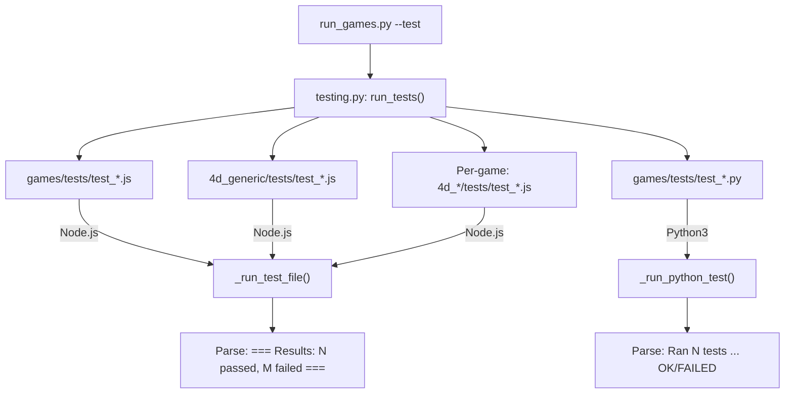

# Testing Guide

> **Note on 4D Geometry & Nomenclature**: Throughout QuadCraft, whenever we refer to **"4D"**, we strictly mean **Synergetics** geometry. This entails **Quadray 4D tetrahedral coordinates** deployed on an **Isotropic Vector Matrix (IVM)** of close-packed spheres, where the Quadray coordinates of the 12 neighboring balls are strictly defined by all permutations of `(0, 1, 1, 2)`.


> How to run, write, and extend tests for QuadCraft games and shared modules.

---

## Running Tests

### All Tests

```bash
# Via Python launcher (recommended)
python3 run_games.py --test

# Via shell wrapper
./run.sh --test
```

### Specific Game(s)

```bash
python3 run_games.py --test --game chess
python3 run_games.py --test --game chess doom snake
```

### Single Test File (Direct)

```bash
node games/4d_chess/tests/test_all.js
node games/tests/shared/test_projection.js
```

---

## Test Architecture


```mermaid
graph TD
    CLI["run_games.py --test"] --> TR["testing.py: run_tests()"]

    TR --> S1["games/tests/test_*.js"]
    TR --> S2["4d_generic/tests/test_*.js"]
    TR --> S3["games/tests/test_*.py"]

    TR --> PG["Per-game: 4d_*/tests/test_*.js"]

    S1 & S2 -->|Node.js| NR["_run_test_file()"]
    S3 -->|Python3| PR["_run_python_test()"]
    PG -->|Node.js| NR

    NR --> PARSE["Parse: === Results: N passed, M failed ==="]
    PR --> PYPARSE["Parse: Ran N tests ... OK/FAILED"]
```

### Test Locations

| Location | Scope | Language | Runner |
|----------|-------|----------|--------|
| `games/tests/test_*.py` | Python infrastructure | Python | `python3` via `_run_python_test()` |
| `games/tests/shared/test_*.js` | Shared JS modules | JavaScript | **Not executed** — `run_tests()` globs `games/tests/test_*.js` non-recursively and never descends into `tests/shared/` |
| `4d_generic/tests/test_*.js` | Generic module internal | JavaScript | Node.js via `_run_test_file()` |
| `4d_<game>/tests/test_*.js` | Per-game logic | JavaScript | Node.js via `_run_test_file()` |

### Current Test Inventory

**Python infrastructure tests** (`games/tests/`, actually executed):

| File | Subject |
|------|---------|
| `test_config.py` | `core/config.py` constants |
| `test_registry.py` | `core/registry.py` (`GAMES`, `load_config`, `get_port`) |
| `test_validation.py` | `qa/validation.py` structural checks |

**Shared JS module tests** (`games/tests/shared/`) — **dead code, not run by `run_tests()`** because it only globs `games/tests/test_*.js` directly, not the `shared/` subdirectory:

| File | Subject |
|------|---------|
| `test_projection.js` | `projectQuadray()`, `drawQuadrayAxes()` |
| `test_camera.js` | `CameraController` |
| `test_zoom.js` | `setupZoom()` |
| `test_grid_utils.js` | `GridUtils` (grid, neighbors, distance) |
| `test_base_game.js` | `BaseGame` lifecycle |
| `test_base_renderer.js` | `BaseRenderer` canvas operations |
| `test_base_board.js` | `BaseBoard` (optional shared module) |
| `test_entity_system.js` | Entity system (optional shared module) |
| `test_turn_manager.js` | Turn manager (optional shared module) |
| `test_pathfinding.js` | Pathfinding helpers (optional shared module) |
| `test_hud.js` | `HUD` state display |
| `test_score_manager.js` | `ScoreManager` persistence |
| `test_all_shared.js` | Integration runner (also skipped by name even where the harness does scan a directory) |

**`4d_generic/tests/`** (actually executed — 2 files, e.g. `test_quadray.js`, `test_synergetics.js`):

| File | Subject |
|------|---------|
| `test_quadray.js` | `Quadray` coordinate class |
| `test_synergetics.js` | IVM constants + geometric identity verification |

---

## Writing Tests

### JavaScript Test Template

```javascript
// test_<game>.js — Unit tests for <Game>
// ─────────────────────────────────────────────────

const path = require('path');

// Load shared modules (order matters)
const quadrayPath = path.join(__dirname, '..', '..', '4d_generic', 'quadray.js');
// ... load dependencies as needed

// Load game-specific module
const boardPath = path.join(__dirname, '..', 'js', '<game>_board.js');

let passed = 0;
let failed = 0;

function assert(condition, msg) {
    if (condition) {
        console.log(`  ✅ ${msg}`);
        passed++;
    } else {
        console.log(`  ❌ ${msg}`);
        failed++;
    }
}

// ── Tests ──────────────────────────────────────

console.log('\n🧪 <Game> Tests\n');

// Test: Board initialization
assert(typeof Board === 'function', 'Board class exists');

const board = new Board(8);
assert(board.size === 8, 'Board size is 8');

// Test: Cell operations
board.setCell(0, 0, 0, 0, 'X');
assert(board.getCell(0, 0, 0, 0) === 'X', 'setCell/getCell roundtrip');

// ── Results ────────────────────────────────────
console.log(`\n=== Results: ${passed} passed, ${failed} failed ===`);
process.exit(failed > 0 ? 1 : 0);
```

### Standardized Output Format

The test runner parses this **exact** results line:

```text
=== Results: N passed, M failed ===
```

> **Fallback:** If this line is missing, the runner counts `✅` and `❌` emoji lines instead.

### Python Test Template

```python
"""test_infrastructure.py — Python infrastructure tests."""
import unittest
import sys
import os

sys.path.insert(0, os.path.dirname(os.path.dirname(os.path.dirname(__file__))))

class TestRegistry(unittest.TestCase):
    def test_games_dict_has_entries(self):
        from games.src.registry import GAMES
        self.assertGreater(len(GAMES), 0)

    def test_load_config(self):
        from games.src.registry import load_config
        config = load_config('games/games_config.json')
        self.assertIn('games', config)

if __name__ == '__main__':
    unittest.main()
```

---

## Test Runner Internals

### `_run_test_file(tf, cwd, label) → (passed, failed)`

1. Runs `node <test_file>` with 30s timeout
2. Parses `Results:` line via regex `Results:\s*(\d+)\s*passed,\s*(\d+)\s*failed`
3. Falls back to emoji counting if no match
4. Returns `(passed_count, failed_count)`

### `_run_python_test(tf, cwd, label) → (passed, failed)`

1. Runs `python3 <test_file>` with 10s timeout
2. Parses `Ran N tests` and `FAILED (failures=M)` from stderr
3. Returns `(pass_count, fail_count)`

### Shared vs Per-Game Execution

- **Shared tests** run only when no specific `--game` filter is applied, OR when running the full suite
- **Per-game tests** run for all requested games
- `test_all_shared.js` is always **skipped** (it's a meta-runner)

---

## Test Coverage by Game

> **Note:** these per-game counts are a snapshot from live `python3 run_games.py --test` runs (2026-07-07, 35+ consecutive runs sampled across this session). **Rogue and Tower Defense were fixed this session** (both now seed their internal RNG for test construction and are fully deterministic — 120 and 217 respectively, confirmed stable across 10+ direct runs each). **Still genuinely non-deterministic, unfixed:** Sokoban intermittently fails 2 assertions (32 vs. 34 passed — no reachability/deadlock check on generated levels), 2048 varies by 2 (26 vs. 28), and SimAnt has been observed to drop 1 assertion roughly once per ~10–15 full-suite runs (137/138 vs. 138/138) despite never failing in 15+ isolated `--game simant` runs — the trigger appears tied to running the full 30-game sequence, not SimAnt's own logic in isolation, and was not root-caused this session. Treat this table as directional and re-run the command above for the authoritative current count rather than trusting a hardcoded number.

| Game | Tests | Key Areas Covered |
|------|-------|-------------------|
| Tower Defense | 217 (deterministic, seeded — see note above) | Wave spawning, tower targeting, pathfinding |
| Rogue | 120 (deterministic, seeded — see note above) | Procedural dungeon, combat |
| Doom | 116 | Raycasting, enemy AI, collision, weapons |
| SimAnt | ~137–148 (2 files, rare unresolved flake — see note above) | Pheromone trails, foraging |
| Connect Four | 124 | Gravity drop, 4-in-a-row detection |
| Minecraft | ~124 (2 files) | Terrain gen, block placement, inventory |
| Chess | 91 | Piece movement, check/checkmate, legal moves |
| Pac-Man | 74 | Ghost AI, maze navigation |
| Asteroids | 67 | Wrap-around, splitting |
| Pong | 52 | Paddle/ball physics |
| Lights Out | 45 | Cell toggling, solvability |
| Life | 43 | Neighbor counting, wrapping |
| Space Invaders | 43 | Formation movement, shooting |
| Reversi | 34 | Disc flipping, 8-direction check |
| Sokoban | ~32–34 | Box pushing, goal detection |
| Mahjong | 33 | Tile matching, layers |
| Go | 31 | Stone placement, capture, territory |
| Backgammon | 30 | Dice, bearing off |
| Sudoku | 31 | Cell validity, solve check |
| Frogger | 27 | Lane mechanics, collision |
| Memory | 27 | Card matching, pairs |
| 2048 | ~26–28 | Tile merging, spawn logic |
| Hex | 29 | Connection detection |
| Minesweeper | 23 | Mine placement, neighbor counting |
| Bomberman | 22 | Bomb blast, wall destruction |
| Breakout | 20 | Ball physics, brick breaking |
| Tetris | 18 | Piece rotation, line clearing |
| Snake | 15 | Growth, self-collision |
| Checkers | 11 | Capture, king promotion |
| Catan | 56 | Resource production, settlements |

**Total (live snapshot, 20+ consecutive `python3 run_games.py --test` runs): ~1,752–1,787**, printed by the runner's own `Total:` line — this figure already *includes* the 48 shared-module tests below (5 from the 3 `games/tests/*.py` files + 43 from the 2 `4d_generic/tests/*.js` files), it is not additive on top of them. Do not treat an all-green total as current fact — confirm with a live run.

---

*See also: [python_infrastructure.md](python_infrastructure.md) · [game_template.md](game_template.md) · [scripts_reference.md](scripts_reference.md)*
